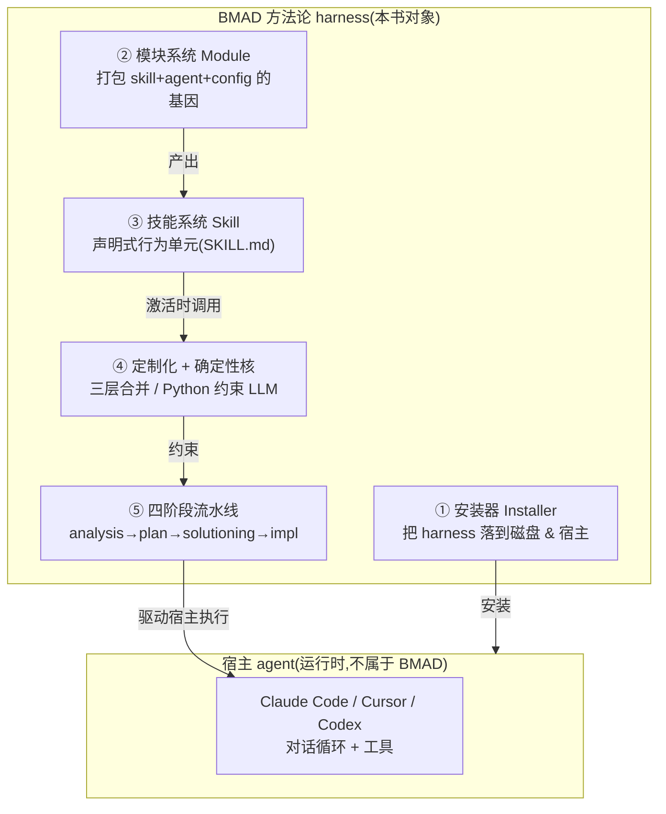

# 00. 前言与范式总论:BMAD 是一种"方法论 harness"

> 本书是一份**循序渐进的源码版教程**,讲解 [BMAD-METHOD](https://github.com/bmad-code-org/BMAD-METHOD) 仓库所体现的 **harness agent 范式**。参考了 `lintsinghua/claude-code-book` 的体例(四部分 + 附录、架构释义而非 API 手册、Mermaid 图、设计决策分析),但大纲与内容全部围绕 BMAD 的真实源码重写——每一章都带 `文件:行号` 的源码摘录。
>
> claude-code-book 解析的是 Claude Code 这个**运行时 harness**(自带对话循环、工具系统、权限管线);而本书解析的 BMAD 是另一种 harness——**它没有自己的运行时**。理解这一差异,是读懂全书的钥匙。

## 0.1 为什么写这本书

市面上对"agent harness"的讨论,大多围绕一个具体运行时:它如何跑 `while(true)` 循环、如何调度工具、如何管上下文。BMAD-METHOD 提供了一个**同样值得剖析、却常被忽略**的范式:**不自己跑 agent,而是把一套方法论"安装"进宿主 agent,从外部约束它**。

这个范式回答了一个现实问题:当你已经有了 Claude Code / Cursor / Codex 这样的宿主 agent,如何让它在真实软件交付中**可控、可复现、可审计、可团队对齐**?BMAD 的答案是——

- 用**声明式技能(SKILL.md)**把行为固化成可读、可 lint 的产物;
- 用**确定性 Python 脚本**把不该交给 LLM 自由发挥的逻辑下沉;
- 用**三层定制化合并**让团队/个人在不改核心的前提下演化行为;
- 用**四阶段流水线**把"分析→规划→架构→实现"织成一张技能路由图;
- 用**渠道与模块系统**让这一切可分发、可版本化。

本书的目标,是把上述每一条都落到源码上看清楚,并提炼出**可迁移到任何"方法论型 agent 框架"的心智模型**。

## 0.2 一句话定义

> **BMAD-METHOD 是一种"方法论 harness":它不运行 agent 循环,而是把声明式的 skill / agent / customization 层安装进宿主 agent,并通过确定性解析核与四阶段工作流约束宿主 LLM 的行为。**

## 0.3 harness 的五大组件(全书地图)

| 组件 | 角色 | 对应 Claude Code harness 的类比 | 本书画像 |
|---|---|---|---|
| ① Installer | 部署管线:把模块/技能装进目标项目与 IDE | CLI 启动 + 安装 | 第 02、04、09 章 |
| ② Module | 声明式打包:变量、提示、目录、agent 名册、技能目录 | Settings/Config 基因 | 第 03、10 章 |
| ③ Skill | 行为单元:激活流程、步骤、引用、资产、脚本 | Tool 系统 + Skill 系统 | 第 06、11、12 章 |
| ④ 定制化 + 确定性核 | 三层合并 + Python 脚本约束 LLM | Hooks + 权限管线(约束机制) | 第 07、08 章 |
| ⑤ 四阶段流水线 | 方法论路由图(phase/preceded-by/followed-by) | Plan 模式 + 结构化工作流 | 第 13、14、15 章 |
| — 渠道/版本 | stable/next/pinned 分发策略 | Feature flags / 版本 | 第 05 章 |

## 0.4 两种 harness 的本质对照

| 维度 | Claude Code(运行时 harness) | BMAD-METHOD(方法论 harness) |
|---|---|---|
| 谁跑 agent loop | 自己跑(`while(true)` 异步生成器) | **不跑**——宿主 agent 跑 |
| 约束 LLM 的手段 | 工具协议、权限管线、hooks、上下文压缩 | 声明式 SKILL.md + 确定性 Python 脚本 + 三层定制合并 |
| 行为定义在哪 | 编译进二进制的 Tool/Hook 实现 | 仓库里的 `SKILL.md` + `customize.toml`(纯文本、可 lint) |
| 可分发性 | npm 包(一个二进制) | npm 包 + 模块注册表 + 渠道(stable/next/pinned) |
| 扩展点 | hooks、MCP、subagents、skills | customize.toml 三层覆盖、自定义模块、自定义 agent |
| 核心张力 | 性能 vs 安全 vs 能力 | **确定性 vs 灵活性**(把多少逻辑下沉为脚本) |

最关键的一行:**Claude Code 的 harness 在二进制里,BMAD 的 harness 在 Markdown + TOML + Python 里。** 前者约束"agent 如何运行",后者约束"agent 做什么、按什么流程做"。

## 0.5 怎么读本书

- **按顺序读**:第一部分建心智模型,第二部分拆核心系统,第三部分讲编排扩展,第四部分串成全生命周期流水线。
- **带着源码读**:每章的摘录都标了 `文件:行号`,鼓励你打开仓库对照看。
- **只想速查**:直接跳附录 A(源码导航地图)、B(技能清单)、C(模块/渠道速查)、D(术语表)。
- **想自己造一个**:第 16 章给出可迁移的路线图。

## 0.6 约定

- 本书基于本仓库 `main` 分支的源码(版本号见 `package.json` 的 `version`)。源码会演进,行号可能漂移——以你本地 `git checkout` 后的实际行为为准。
- 本书是架构释义,**不做缺陷审查**,不提"应该怎么改"的改进建议(除非作为设计权衡的一部分顺带提及)。
- 源码引用一律指向仓库相对路径,如 `tools/installer/core/installer.js:37`。

---

下一章 → [01. 范式转移与心智模型](第一部分-基础篇/01-范式转移与心智模型.md)
