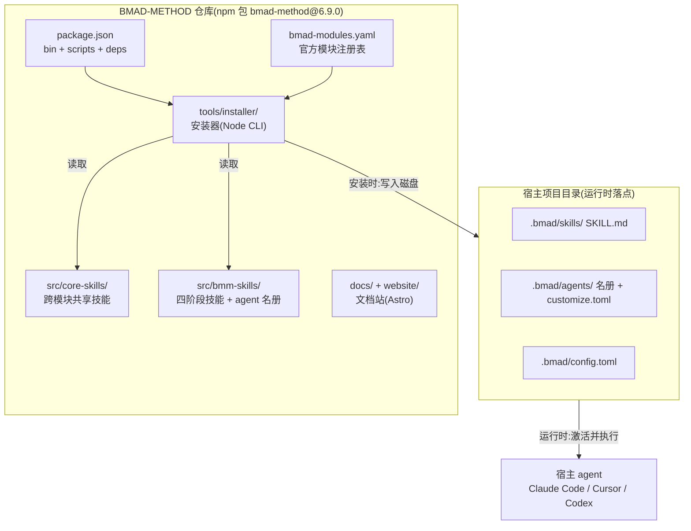
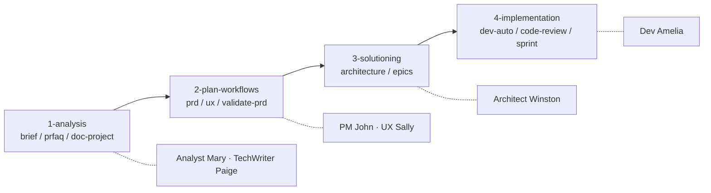

# 01. 范式转移与心智模型

## 一句话定位

本章把 BMAD-METHOD 从"一份提示词集合"立成一个可分发、可版本化的**方法论 harness**:用 `package.json` 的 `bin`/`scripts`/`dependencies` 证明它的入口是 installer 而非 agent 运行时,用仓库整体布局建立全书心智模型——什么被安装、谁来安装、安装完交给谁跑。

## 心智模型

理解 BMAD 的第一把钥匙是一个反直觉事实:**一个名为 "Breakthrough Method of Agile AI-driven Development" 的包,跑起来不启动任何 agent**。它的可执行入口 `bmad` 指向一个安装器 CLI,安装器把声明式的技能、agent 名册、配置写进宿主项目目录,然后退场;真正的 agent 循环由宿主(Claude Code / Cursor / Codex)接手。

可以用一个类比立起这个模型:Claude Code 是一台**发动机**(自带对话循环、工具系统、权限管线);BMAD 不是另一台发动机,而是一套**行车规则 + 仪表盘 + 可更换零件目录**,由 installer 一次性焊装到宿主车里,之后由宿主车的发动机驱动,车怎么开由规则约束。



图中虚线把世界切成两半:左半是**仓库侧**(可分发的 npm 包 + installer + 被安装的内容),右半是**宿主侧**(运行时)。installer 是唯一的桥,且是单向、一次性的——`npx bmad-method install` 跑完即退,运行时不再需要仓库本身。这正是"方法论 harness"与"运行时 harness"的分界。

## 源码走读

### 3.1 一个 npm 包,入口指向 installer

`package.json` 的元信息把范式的第一层证据摆在台面上:名字、版本、入口。

> `package.json:3`
>
> ```json
>   "name": "bmad-method",
>   "version": "6.9.0",
>   "description": "Breakthrough Method of Agile AI-driven Development",
> ```

> `package.json:21`
>
> ```json
>   "main": "tools/installer/bmad-cli.js",
>   "bin": {
>     "bmad": "tools/installer/bmad-cli.js",
>     "bmad-method": "tools/installer/bmad-cli.js"
>   },
> ```

一个"AI 驱动敏捷开发方法"的包,其 `main` 与两个 `bin`(`bmad`、`bmad-method`)全部指向 installer 入口,而非任何"跑 agent loop"的模块。`npx bmad-method install` 的真实语义因此是"运行安装器把方法论装进项目",不是"启动一个 agent"。这单行配置就是范式转移最直接的物证。

### 3.2 bin 入口是命令分发器,自己不跑 agent

顺着 `bin` 进入入口文件,可以看到它是一个标准的 commander 命令分发器。

> `tools/installer/bmad-cli.js:73`
>
> ```js
> const commandsPath = path.join(__dirname, 'commands');
> const commandFiles = fs.readdirSync(commandsPath).filter((file) => file.endsWith('.js'));
>
> const commands = {};
> for (const file of commandFiles) {
>   const command = require(path.join(commandsPath, file));
>   commands[command.command] = command;
> }
> ```

入口扫描 `commands/` 目录(实际只含 `install.js` / `status.js` / `uninstall.js` 三个文件),动态注册子命令。CLI 把"能做什么"收敛成**安装、卸载、查状态**三件事,完全没有对话循环、工具调度、上下文管理——这些运行时职责全部留给宿主。入口文件里唯一的"运行时味道"是启动时的版本自检,而它恰恰印证了"可分发包"而非"常驻进程"的本质:

> `tools/installer/bmad-cli.js:24`
>
> ```js
> async function checkForUpdate() {
>   try {
>     // Prereleases (e.g. 6.5.1-next.0) live on the `next` dist-tag; stable
>     // releases live on `latest`. semver.prerelease() returns null for stable,
>     // so this correctly routes pre-1.0-next/rc/etc. without string matching.
>     const tag = semver.prerelease(packageJson.version) ? 'next' : 'latest';
>     const result = execSync(`npm view ${packageName}@${tag} version`, {
> ```

启动时异步 `npm view` 比对版本,按 `semver.prerelease()` 把预发布路由到 `next` dist-tag、稳定版路由到 `latest`。这把"渠道分发"(stable / next)具象成 npm dist-tag 的选择——一个常驻 agent 运行时不需要这种逻辑,只有可分发包才需要。

### 3.3 质量门在仓库侧:确定性校验前移

既然运行时只是文本被宿主读取,BMAD 无法在运行时插桩,它就把质量约束**前移到仓库的 CI**。

> `package.json:43`
>
> ```json
>     "quality": "npm run format:check && npm run lint && npm run lint:md && npm run docs:build && npm run test:install && npm run test:urls && npm run validate:refs && npm run validate:skills && npm run docs:validate-sidebar",
> ```

`quality` 把格式化、lint、markdown lint、文档构建、安装测试、引用校验、**技能校验**串成一条门禁。注意整条链里全是"对仓库产物的静态校验",没有任何"启动 agent 跑一遍"的步骤。`AGENTS.md` 给贡献者的规矩也只有三条,核心就是这条门禁:

> `AGENTS.md:5`
>
> ```md
> - Use Conventional Commits for every commit.
> - Before pushing, run `npm ci && npm run quality` on `HEAD` in the exact checkout you are about to push.
>   `quality` mirrors the checks in `.github/workflows/quality.yaml`.
>
> - Skill validation rules are in `tools/skill-validator.md`.
> - Deterministic skill checks run via `npm run validate:skills` (included in `quality`).
> ```

这里明确出现 **"Deterministic skill checks"**——确定性技能校验。技能(声明式文本)的合法性由确定性脚本在仓库侧保证,而不是寄望于运行时 LLM 自纠。这正是全书脊梁里"把不该交给 LLM 的逻辑下沉为脚本"的第一个落点;后续章节会把这个思路推到配置合并、名册解析、记忆追加。

### 3.4 仓库布局:被安装的内容与安装器分离

仓库根的目录划分,直接对应心智模型里"被安装的内容"与"安装器"两组角色。`src/` 下是被安装的声明式层,`tools/installer/` 是安装器,`docs/` 与 `website/` 是文档站:

| 目录 | 角色 | 关键产物 |
|---|---|---|
| `src/core-skills/` | 跨模块共享技能 | `bmad-help`、`bmad-party-mode`、`bmad-customize`、`bmad-spec` 等 13 个技能 + `module.yaml` |
| `src/bmm-skills/` | BMM 模块:四阶段技能 + agent 名册 | `1-analysis` / `2-plan-workflows` / `3-solutioning` / `4-implementation` 四目录 + `module.yaml` |
| `tools/installer/` | 安装器(Node CLI) | `bmad-cli.js` 入口、`commands/`、`core/`、`modules/`、`ide/` |
| `docs/` + `website/` | 文档站 | Astro 站点(`docs.bmad-method.org`) |

`src/bmm-skills/` 自身就是 BMM 模块,`module.yaml` 是它的"基因":

> `src/bmm-skills/module.yaml:1`
>
> ```yaml
> code: bmm
> name: "BMad Method"
> description: "Full-lifecycle AI agile development: analysis, planning, architecture, implementation"
> default_selected: true # This module will be selected by default for new installations
> ```

一个 `code: bmm` 标识、一句全生命周期描述、一个 `default_selected: true`(安装时默认勾选)。模块不是代码,而是一份"安装时供 installer 读取的声明"——这与 `src/core-skills/module.yaml` 的 `code: core` 共享工具模块形同双生:

> `src/core-skills/module.yaml:1`
>
> ```yaml
> code: core
> name: "BMad Core Module"
> description: "Shared utilities across modules"
> ```

两个模块(`core` 与 `bmm`)用同一种 `module.yaml` 骨架(code/name/description),差异只在 `core` 装的是跨模块共享技能、`bmm` 装的是四阶段方法论。installer 对二者一视同仁地读取、合并、落盘。agent 名册也以同样纯数据的方式存放:

> `src/bmm-skills/module.yaml:54`
>
> ```yaml
> # Agent roster — essence only. External skills (party-mode, retrospective,
> # advanced-elicitation, help catalog) read these descriptors to route, display,
> # and embody agents. Full persona and behavior live in each agent's
> # customize.toml.
> agents:
>   - code: bmad-agent-analyst
>     name: Mary
>     title: Business Analyst
>     icon: "📊"
>     team: software-development
>     description: "Channels Porter's strategic rigor and Minto's Pyramid Principle..."
> ```

注释说得很直白:名册只存"essence"(code / name / title / icon / team / description),完整人设与行为留在每个 agent 自己的 `customize.toml`;外部技能(party-mode、retrospective、advanced-elicitation、help catalog)读这份名册来路由、展示、扮演 agent。这是"**名册=数据,扮演=技能**"的解耦——同一份名册可被多个技能复用。名册里的六位 agent 又各自归属一个阶段目录(Analyst/TechWriter 在 `1-analysis`,PM/UX 在 `2-plan-workflows`,Architect 在 `3-solutioning`,Dev 在 `4-implementation`),构成方法论主干:



实线箭头是阶段的先后(`analysis → plan → solutioning → implementation`),虚线是 agent 对阶段的归属。注意这套阶段顺序在仓库里体现为**目录命名 `1-` / `2-` / `3-` / `4-`**,而非运行时状态机——阶段路由的真正机制(`phase` / `preceded-by` / `followed-by`)留待[第 13 章](../第四部分-工程实践篇/13-四阶段交付流水线.md)展开,本章只确认布局。

### 3.5 模块注册表:把"可分发"做成数据

`bmad-modules.yaml` 是分发维度的 single source of truth:

> `bmad-modules.yaml:1`
>
> ```yaml
> # Official module registry — the single source of truth for which modules
> # the BMad installer offers and how they are displayed.
> #
> # Order here determines display order in the installer picker (after the
> # built-in core and bmm entries, which are loaded from local module.yaml).
> #
> # default_channel (optional) — the install channel when the user does not
> # override with --channel/--pin/--next. Valid values: stable | next.
> ```

注释直接点明三件事:这是 installer 可用模块的唯一真相源;条目顺序决定 picker 显示顺序;`default_channel` 决定不覆盖时的渠道(stable / next)。把分发清单从代码里抽出来成纯数据 YAML,意味着新增一个官方模块只需改这份文件,不动 installer 逻辑。每个条目还携带成熟度与渠道两个旋钮:

> `bmad-modules.yaml:34`
>
> ```yaml
>   bmad-automator:
>     url: https://github.com/bmad-code-org/bmad-automator
>     module-definition: skills/module.yaml
>     code: automator
>     name: "BMad Automator Epic Builder Experimental"
>     description: "EXPERIMENTAL: only supports claude and codex currently"
>     defaultSelected: false
>     type: experimental
>     npmPackage: bmad-story-automator
>     default_channel: next
> ```

`type: experimental` 标注成熟度,`default_channel: next` 让实验模块默认走 next 渠道,`npmPackage` 指向 npm 上的实际包名。一条记录同时声明了"装什么(模块定义)、从哪装(url/npmPackage)、装哪个版本渠道(default_channel)、稳不稳(type)"——分发所需的全部维度,都在数据里。

### 3.6 README:范式转移的对外叙事

README 把上述内部结构翻译成对外叙事,开篇即把 BMAD 与"替你思考的传统 AI"对立:

> `README.md:14`
>
> ```md
> Traditional AI tools do the thinking for you, producing average results. BMad agents and facilitated workflows act as expert collaborators who guide you through a structured process to bring out your best thinking in partnership with the AI.
> ```

BMAD 的自我定位不是"替你跑的 agent",而是"引导你走结构化流程的协作者"——这正对应范式核心:约束 LLM 按流程做,而非让 LLM 自由发挥。Quick Start 两步则是范式转移的句号:

> `README.md:41`
>
> ```md
> ```bash
> npx bmad-method install
> ```
> ...
> Follow the installer prompts, then open your AI IDE (Claude Code, Cursor, etc.) in your project folder.
> ```

先 `npx bmad-method install`(运行 installer 把方法论装进项目),再"在你的项目目录里打开 AI IDE"。第二句是关键:BMAD 跑完 install 就退场,运行时交还给宿主 IDE。这两步合起来,就是"安装器落盘 → 宿主接管"的完整范式动作。

## 设计决策与权衡

1. **入口即安装器,而非运行时**。把"框架"收敛成"安装器 + 文本产物",牺牲了自带运行时的强可控性(无法在运行时插桩工具调用、无法直接管理上下文窗口),换取对**任意宿主 agent 的中立性**——只要宿主能读 SKILL.md、能跑 Python 脚本,就能被 BMAD 约束。这是"方法论 harness"与"运行时 harness"的根本取舍:可控性换可移植性。

2. **确定性校验前移到仓库 CI**。`quality` / `validate:skills` 全在仓库侧,因为运行时只是文本被宿主读取,无从插桩。代价是只能校验**静态属性**(引用完整性、技能结构、文档链接),无法保证宿主真按 SKILL.md 执行——后者只能靠声明式约束 + 宿主遵守,本书后续章节会反复回到"声明与执行之间的这道缝"。

3. **模块 = 数据注册表**。分发清单是 YAML 数据而非代码,扩展性高(新模块零代码改动),代价是 installer 必须为未知字段做容错、为外部模块的 `module.yaml` 做模式校验——这正是定制化与三层合并(见[第 07 章](../第二部分-核心系统篇/07-定制化与三层合并.md))要解决的问题。

4. **名册与扮演解耦**。agent 名册只存本质,扮演逻辑分散在各技能里。好处是 party-mode 等技能可复用同一份名册、一份 agent 描述多处生效;代价是 agent 行为散落多处,需 `validate:skills` 这类确定性校验兜底一致性。

## 与 Claude Code harness 的对照

Claude Code 是**运行时 harness**:它自己跑 `while(true)` 对话循环,通过编译进二进制的工具协议、权限管线、hooks 在运行时约束 LLM;它的"安装"是 `npm` 装一个二进制,运行时即本体,启动后常驻。

BMAD 的入口 `bmad-cli.js` 却是个 commander 分发器,跑完 `install` 就退出;它没有对话循环,约束 LLM 的不是运行时工具协议,而是**写到磁盘上的 `SKILL.md` / `customize.toml` / Python 脚本**,由宿主在激活技能时读取并服从。一句话:Claude Code 的 harness 在二进制里、在运行时生效;BMAD 的 harness 在 Markdown + TOML + YAML 里、在安装时落盘、在宿主运行时被遵守。`package.json` 是这一对照的最佳物证——一个"agent 框架"的 `bin` 指向 installer,而非指向任何 agent loop。

## 小结

本章把 BMAD 立成了"方法论 harness":一个版本号 `6.9.0` 的 npm 包,入口是 installer,产物是声明式 skill / agent / config,运行时交还宿主。仓库布局上,`src/core-skills` 与 `src/bmm-skills`(四阶段)是被安装的内容,`tools/installer` 是安装器,`docs/` + `website/` 是文档站,`bmad-modules.yaml` 是分发注册表;质量门由仓库侧的确定性脚本兜底。范式转移的内核至此清晰:从"提示词集合"到"可分发、可版本化、可校验的方法论层"。

下一章走进 installer 本身——看 `bmad-cli.js` 这条入口如何起搏、如何把声明式层解析合并后落到磁盘 → [02. 安装器入口 — 心跳起搏](02-安装器入口-心跳起搏.md)。
