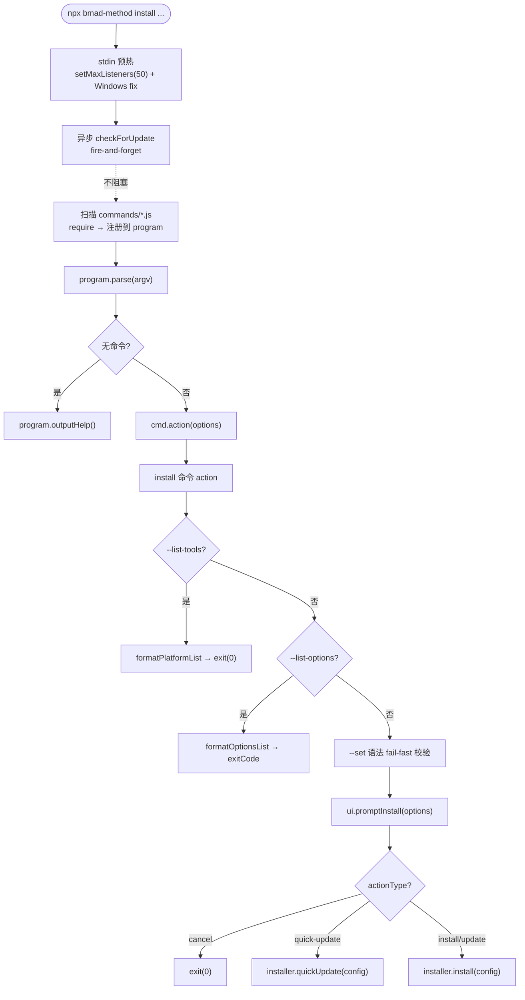

# 02. 安装器入口 — 心跳起搏

## 2.1 一句话定位

`bmad-cli.js` 是 BMAD 这套"方法论 harness"的心脏起搏器:它自身不承载任何业务逻辑,只在 Node 进程启动时做四件事——预热 stdin、异步巡检版本、扫描 `commands/` 目录自动注册命令、把参数交给对应命令的 `action`。入口极薄,只做装配;真正的"把模块/技能/定制化层落到磁盘"发生在 `installer.install` 里(→ [第 4 章](04-安装引擎-落到磁盘.md))。

## 2.2 心智模型

把 `bmad-cli.js` 想成医院的总台分诊护士:病人(用户敲下 `npx bmad-method install`)进门后,护士不亲自治病,而是先量体温(stdin 预检)、瞄一眼病历是否过期(版本巡检)、再对照科室名册(`commands/` 目录)把人引到正确的诊室(命令 `action`)。治疗本身发生在诊室——即 install 命令里对 `ui.promptInstall` 与 `installer.install` 的调用。

这个比喻的关键在于"分诊"与"治疗"的分离:入口文件全篇不过百行,没有任何一条分支会去碰 LLM、碰技能、碰配置合并。这与 [第 0 章](../00-前言与范式总论.md) 所说的"BMAD 不自己跑 agent loop"在入口处就落了地——起搏器只负责让心跳开始,不负责心跳之后血液循环的具体路径。



## 2.3 源码走读

### 2.3.1 stdin 预热:监听器上限与 Windows 修复

入口文件的第一段可执行代码不是命令注册,而是对 `process.stdin` 的两处"打补丁"。第一处抬高 EventEmitter 监听器上限:

> `tools/installer/bmad-cli.js:10`
>
> ```js
> // The installer flow uses many sequential @clack/prompts, each adding keypress
> // listeners to stdin. Raise the limit to avoid spurious EventEmitter warnings.
> if (process.stdin?.setMaxListeners) {
>   const currentLimit = process.stdin.getMaxListeners();
>   process.stdin.setMaxListeners(Math.max(currentLimit, 50));
> }
> ```
>
> 安装流程会串行触发大量 `@clack/prompts` 交互,每个 prompt 都往 stdin 上挂 keypress 监听器,Node 默认 10 个监听器就会抛 `MaxListenersExceededWarning`。这里用 `Math.max` 取当前值与 50 的较大值——只升不降,避免覆盖别处已设的更高上限。这是"防御性环境适配"的典型:不假设流程长度,直接把天花板抬到一个安全水位。

第二处是 Windows 专用的 stdin 初始化:

> `tools/installer/bmad-cli.js:55`
>
> ```js
> // Fix for stdin issues when running through npm on Windows
> // Ensures keyboard interaction works properly with CLI prompts
> if (process.stdin.isTTY) {
>   try {
>     process.stdin.resume();
>     process.stdin.setEncoding('utf8');
>
>     // On Windows, explicitly reference the stdin stream to ensure it's properly initialized
>     if (process.platform === 'win32') {
>       process.stdin.on('error', () => {
>         // Ignore stdin errors - they can occur when the terminal is closing
>       });
>     }
>   } catch {
>     // Silently ignore - some environments may not support these operations
>   }
> }
> ```
>
> `resume()` + `setEncoding('utf8')` 让 stdin 进入可交互态;Windows 分支额外挂一个空 error handler,吞掉终端关闭时可能冒出的 stdin 错误。整个块用 `try/catch` 包住,是为了在那些"不支持这些操作"的环境里静默继续——入口的容错哲学是:环境适配失败不应阻断命令分发。

### 2.3.2 版本巡检:semver.prerelease 路由 dist-tag

版本巡检被设计成"心跳之外的旁路":它异步触发、不阻塞启动,失败则静默吞掉。

> `tools/installer/bmad-cli.js:17`
>
> ```js
> // Check for updates - do this asynchronously so it doesn't block startup
> const packageJson = require('../../package.json');
> const packageName = 'bmad-method';
> checkForUpdate().catch(() => {
>   // Silently ignore errors - version check is best-effort
> });
> ```
>
> `checkForUpdate()` 返回的 Promise 不被 `await`,而是挂一个 `.catch` 吞掉所有异常。这意味着即便 npm 不可达、`npm view` 超时,用户也不会被一条红色报错挡在门外——版本巡检是 best-effort 的锦上添花,不是启动的前提条件。

巡检内部用一个精巧的判断决定去查哪个 npm dist-tag:

> `tools/installer/bmad-cli.js:24`
>
> ```js
> async function checkForUpdate() {
>   try {
>     // Prereleases (e.g. 6.5.1-next.0) live on the `next` dist-tag; stable
>     // releases live on `latest`. semver.prerelease() returns null for stable,
>     // so this correctly routes pre-1.0-next/rc/etc. without string matching.
>     const tag = semver.prerelease(packageJson.version) ? 'next' : 'latest';
>
>     const result = execSync(`npm view ${packageName}@${tag} version`, {
>       encoding: 'utf8',
>       stdio: 'pipe',
>       timeout: 5000,
>     }).trim();
> ```
>
> `semver.prerelease()` 对稳定版返回 `null`、对预发布版(如 `6.5.1-next.0`)返回非空数组,据此把当前包路由到 `next` 或 `latest` dist-tag。这避免了脆弱的字符串匹配(`includes('next')` 之类),也顺带正确处理了 1.0 之前的 rc/beta。`execSync` 配 `stdio: 'pipe'` 与 5 秒 timeout,把一次网络往返的副作用封死在 try 块里——超时即抛,被外层 `.catch` 吞掉。

发现新版本时,用 `prompts.box` 渲染一个提示框(而非直接 `console.log`),保持与后续交互一致的视觉语言。

### 2.3.3 命令自动发现与注册

入口最核心的"装配"动作,是对 `commands/` 目录的扫描与注册。这是 commander 入口的典型约定大于配置:

> `tools/installer/bmad-cli.js:73`
>
> ```js
> // Load all command modules
> const commandsPath = path.join(__dirname, 'commands');
> const commandFiles = fs.readdirSync(commandsPath).filter((file) => file.endsWith('.js'));
>
> const commands = {};
> for (const file of commandFiles) {
>   const command = require(path.join(commandsPath, file));
>   commands[command.command] = command;
> }
> ```
>
> 入口不维护一张写死的命令清单,而是 `readdirSync` 扫描 `commands/` 下所有 `.js` 文件并逐个 `require`。每个命令模块导出一个带 `command` / `description` / `options` / `action` 字段的对象(见 install.js),入口只负责"发现"与"索引"。新增命令只需往目录里丢一个文件,零接线工作——代价是任何误入该目录的 `.js` 都会被当成命令加载,这是"约定优先"换取可扩展性的固有取舍。

发现之后是统一的注册循环:

> `tools/installer/bmad-cli.js:86`
>
> ```js
> // Register all commands
> for (const [name, cmd] of Object.entries(commands)) {
>   const command = program.command(name).description(cmd.description);
>
>   // Add options
>   for (const option of cmd.options || []) {
>     command.option(...option);
>   }
>
>   // Set action
>   command.action(cmd.action);
> }
> ```
>
> 注册逻辑对每个命令做三件事:声明命令名与描述、把 `cmd.options` 数组里的每一项用展开(`...option`)喂给 `command.option()`、最后挂上 `cmd.action`。这里 `options` 被设计成"数组之数组"——每个元素本身就是一次 `command.option(...)` 的完整参数列表,所以入口不需要理解选项语义,只做透传。入口由此与具体命令的选项集合彻底解耦。

注册完成后是收尾的解析与兜底:

> `tools/installer/bmad-cli.js:99`
>
> ```js
> // Parse arguments
> program.parse(process.argv);
>
> // Show help if no command provided
> if (process.argv.slice(2).length === 0) {
>   program.outputHelp();
> }
> ```
>
> `program.parse` 触发 commander 的分发;若无任何参数,补一次 `outputHelp()`。注意 `parse` 之后才判断"无参数",是因为 commander 在无匹配命令时自身也会输出帮助——这里补的是"完全空白"的纯净场景。

### 2.3.4 install action:分支化装配

入口把控制权交给 `install` 命令的 `action` 后,后者同样遵循"先分流、再装配"的薄壳风格。action 顶部是两个"查询即退出"的旁路分支。第一个是 `--list-tools`:

> `tools/installer/commands/install.js:54`
>
> ```js
> if (options.listTools) {
>   const { formatPlatformList } = require('../ide/platform-codes');
>   process.stdout.write((await formatPlatformList()) + '\n');
>   process.exit(0);
> }
> ```
>
> 这类 `--list-*` 旗标把 CLI 当作可编程查询接口:`formatPlatformList` 同步渲染所有支持的 IDE/工具 ID 后直接 `exit(0)`。`require` 写在分支内部而非文件顶部——延迟加载让"只查询不安装"的调用连安装引擎的代码都不会被解析,启动更快、内存更省。

第二个旁路 `--list-options` 展现了一个更细腻的退出处理:

> `tools/installer/commands/install.js:60`
>
> ```js
> if (options.listOptions !== undefined) {
>   const { formatOptionsList } = require('../list-options');
>   const moduleArg = options.listOptions === true ? null : options.listOptions;
>   const { text, ok } = await formatOptionsList(moduleArg);
>   const stream = ok ? process.stdout : process.stderr;
>   // process.exit() forces immediate termination and can truncate the
>   // buffered write when stdout/stderr is piped or captured by CI. Wait
>   // for the write to flush, then set process.exitCode and return so the
>   // event loop drains naturally. Non-zero exit when a single-module
>   // lookup misses so a CI typo like `--list-options bmn` doesn't look
>   // successful in scripts.
>   await new Promise((resolve, reject) => {
>     stream.write(text + '\n', (error) => (error ? reject(error) : resolve()));
>   });
>   process.exitCode = ok ? 0 : 1;
>   return;
> }
> ```
>
> 这里没有用 `process.exit()`,而是把输出包进一个等待 `stream.write` 回调的 Promise,再设 `process.exitCode` 后 `return`。原因是 `process.exit()` 会立即终止进程,在 stdout/stderr 被管道或 CI 捕获时会截断尚未冲刷的缓冲。`exitCode` 让事件循环自然排空。同时,查不到指定模块时 `ok` 为假,走 stderr 并以非零码退出——让 CI 里一个拼写错误(如 `--list-options bmn`)不会被脚本误判为成功。这是一段把"可编程性"做到位的细节:CLI 既是给人看的,也是给脚本读的。

旁路之后,action 进入真正要"动手"的主流程。第一步是对 `--set` 做前置校验:

> `tools/installer/commands/install.js:90`
>
> ```js
> // Validate --set syntax up-front so malformed entries fail fast,
> // before we touch the network or filesystem. Parsed entries are
> // re-derived inside ui.js where overrides are seeded.
> if (options.set && options.set.length > 0) {
>   const { parseSetEntries } = require('../set-overrides');
>   try {
>     parseSetEntries(options.set);
>   } catch (error) {
>     await prompts.log.error(error.message);
>     process.exit(1);
>   }
> }
> ```
>
> `--set <module>.<key>=<value>` 的语法校验被刻意提前到触碰网络与文件系统之前,目的是 fail fast:一个格式错误的覆盖项不应等到安装中途才崩。注释点出"解析结果会在 ui.js 里重新派生"——这里校验过一次,真正消费时再解析一次,用重复解析换取校验与装配的解耦。

校验通过后,action 把"问问题"与"做安装"分成清晰的两段:

> `tools/installer/commands/install.js:100`
>
> ```js
> const config = await ui.promptInstall(options);
>
> // Handle cancel
> if (config.actionType === 'cancel') {
>   await prompts.log.warn('Installation cancelled.');
>   process.exit(0);
> }
>
> // Handle quick update separately. --set is a post-install TOML patch so
> // it works the same way for quick-update as for a regular install — the
> // installer runs, then `applySetOverrides` patches the central config
> // files. Pass the parsed overrides through.
> if (config.actionType === 'quick-update') {
>   const { parseSetEntries } = require('../set-overrides');
>   config.setOverrides = parseSetEntries(options.set || []);
>   const result = await installer.quickUpdate(config);
>   await prompts.log.success('Quick update complete!');
>   await prompts.log.info(`Updated ${result.moduleCount} modules with preserved settings (${result.modules.join(', ')})`);
>   process.exit(0);
> }
>
> // Regular install/update flow
> const result = await installer.install(config);
> ```
>
> `ui.promptInstall` 把所有交互式问答收敛成一个 `config` 对象;此后 action 只按 `config.actionType` 分派到 `installer.quickUpdate` 或 `installer.install`。注意 install.js 文件顶部就已 `new Installer()` / `new UI()` 实例化好,这里只是调用——action 自身不构造任何业务对象,只做"收集 config → 调用一个方法"的胶水。注释还透露一个设计:`--set` 在两种流程里都是"安装完成后的 TOML 补丁",所以 quick-update 与 regular install 共用同一套覆盖逻辑。

### 2.3.5 prompts 适配层:lazy-load ESM

`bmad-cli.js` 与 install action 大量使用的 `prompts.log` / `prompts.box` 等,来自 `prompts.js` 这个适配层。它的存在本身就是一个设计决策:用 `@clack/prompts` 替换 Inquirer.js,以修掉 Windows 方向键导航问题。

> `tools/installer/prompts.js:1`
>
> ```js
> /**
>  * @clack/prompts wrapper for BMAD CLI
>  *
>  * This module provides a unified interface for CLI prompts using @clack/prompts.
>  * It replaces Inquirer.js to fix Windows arrow key navigation issues (libuv #852).
>  *
>  * @module prompts
>  */
> ```

`@clack/*` 是 ESM 包,而入口是 CommonJS。适配层用懒加载桥接这一鸿沟:

> `tools/installer/prompts.js:10`
>
> ```js
> let _clack = null;
> let _clackCore = null;
> let _picocolors = null;
> const fs = require('node:fs');
> const os = require('node:os');
> const path = require('node:path');
>
> /**
>  * Lazy-load @clack/prompts (ESM module)
>  * @returns {Promise<Object>} The clack prompts module
>  */
> async function getClack() {
>   if (!_clack) {
>     _clack = await import('@clack/prompts');
>   }
>   return _clack;
> }
> ```
>
> 三个 ESM 依赖(`@clack/prompts`、`@clack/core`、`picocolors`)各用一个模块级缓存变量 + `await import()` 懒加载。这带来两个好处:一是 CommonJS 入口不需要顶层 `await`、不受 ESM/CJS 互操作限制;二是 `--list-tools` 这类不触发任何交互的旁路永远不会付出加载 clack 的代价——`getClack()` 只在真正需要弹 prompt 时才被首次调用。代价是所有封装函数都得是 `async`,调用方随之传染异步签名。

适配层还统一了"取消"的语义,让上层无需各自处理:

> `tools/installer/prompts.js:56`
>
> ```js
> async function handleCancel(value, message = 'Operation cancelled') {
>   const clack = await getClack();
>   if (clack.isCancel(value)) {
>     clack.cancel(message);
>     process.exit(0);
>   }
>   return false;
> }
> ```
>
> `@clack/prompts` 用一个特殊返回值表示用户按了取消键(Ctrl+C 之外的取消)。`handleCancel` 把"检测取消 → 打印取消信息 → 干净退出"收敛成一处,被 `select` / `text` / `confirm` 等所有封装在返回前统一调用。于是上层 install action 只需关心正常返回值,"用户中途取消"这件事在适配层就被终结掉,不会污染业务分支。

## 2.4 设计决策与权衡

**1. 版本巡检 fire-and-forget,而非阻塞前置条件。** `checkForUpdate()` 不被 `await`,异常被 `.catch` 静默吞掉。代价是一个离线/防火墙后的用户永远看不到更新提示;收益是启动延迟恒定,网络抖动无法阻断命令分发。版本巡检被定位为"锦上添花",与"必须成功的装配"严格分层。

**2. 命令自动发现,而非显式注册表。** 扫描 `commands/*.js` 让新增命令零接线,但任何误入目录的 `.js` 都会被当作命令加载。这是一笔用"目录卫生"换"可扩展性"的交易——对一个命令数量有限、且目录由开发者掌控的 CLI 来说,代价可接受。

**3. `exitCode` + `return`,而非 `process.exit()`,用于管道化输出。** `--list-options` 分支等待 `stream.write` 回冲后再设 `exitCode` 并 return,让事件循环自然排空。代价是代码更啰嗦;收益是被 CI/管道捕获时输出不会被截断,且单模块查不到时能以非零码退出而不触发强制中断。

**4. ESM 依赖懒加载,适配 CommonJS 入口。** 把 `@clack/*` 包在 async 的 `getX()` 里,既绕开 CJS 顶层 `await` 限制,又让无交互的旁路零加载成本。代价是异步签名沿调用链传染(几乎所有 prompts 函数都是 `async`);收益是启动路径保持同步、快速,且模块边界清晰。

## 2.5 与 Claude Code harness 的对照

Claude Code 的入口是一个编译好的二进制:它启动时会拉起自己的 `while(true)` 对话循环、装载工具协议、初始化权限管线与上下文压缩——入口即运行时,约束机制("agent 如何运行")被编译进了可执行文件本身。

BMAD 的 `bmad-cli.js` 是另一种极端:它是一份约百行的 Node 脚本,没有循环、没有 LLM 调用、没有工具协议、没有权限管线。它只做 commander 装配与环境预热,然后把控制权交给一个命令 `action`,而 `action` 又把真正的活儿转交给 `installer.install` 去写文件。换言之,入口对宿主 LLM 的行为"零约束"——约束发生在安装完成之后:SKILL.md、`customize.toml`、确定性 Python 脚本被落到磁盘上,由宿主 agent 在后续会话中读取并服从。这是"方法论 harness"与"运行时 harness"在入口处的最鲜明对照:一个把约束编译进二进制,一个把约束安装成纯文本。

## 2.6 小结

`bmad-cli.js` 与 `install` 命令的 `action` 共同构成了一个"极薄入口":前者做 stdin 预热、版本巡检与命令自动发现,后者做 `--list-*` 旁路、`--set` 前置校验与 `promptInstall → installer.install` 的分派。两层都不碰 LLM、不碰技能语义,只做装配与胶水。这正应了本章的定位——起搏器只让心跳开始,血液循环的具体路径交给下游。

入口装配的"产物",是被安装进宿主的那套声明式层。下一章我们先看这套层的基本单元:[第 3 章 · 模块系统 — 基因](03-模块系统-基因.md) 拆解一个 module 如何打包变量、提示、目录与技能目录;而把模块真正写到磁盘的安装引擎本身,留到 [第 4 章 · 安装引擎 — 落到磁盘](04-安装引擎-落到磁盘.md)。
