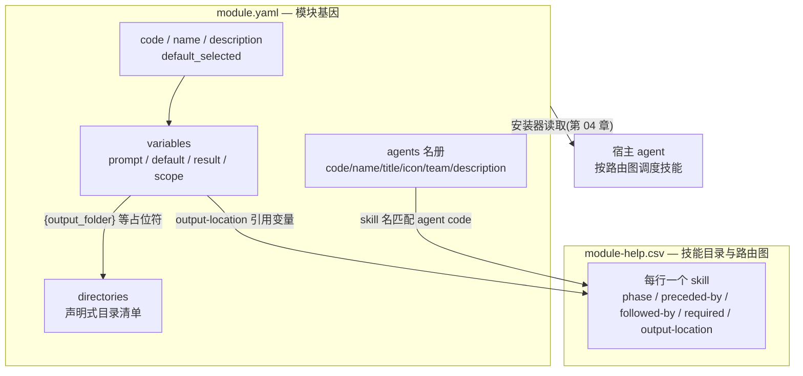
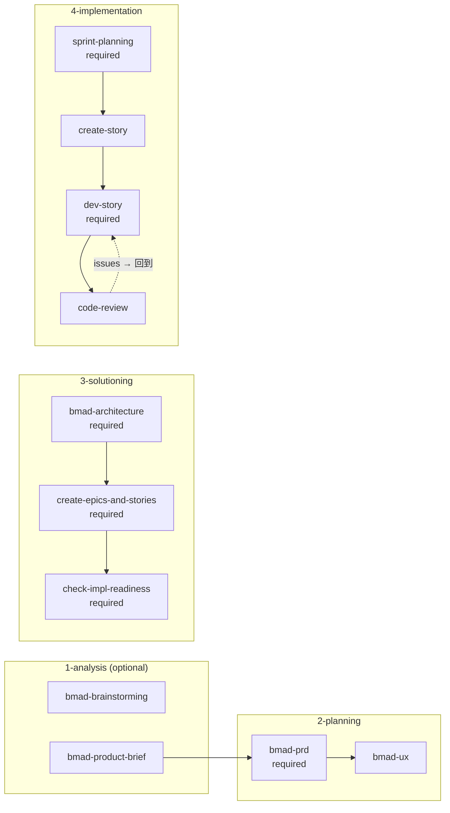

# 03. 模块系统 — 基因

## 3.1 一句话定位

`module.yaml` 是模块的"基因"——它用一份声明式 YAML 写清模块的身份、配置变量、要创建的目录、agent 名册;`module-help.csv` 则是这份基因产出的"技能目录与路由图"。两者合起来,把"一个方法论该长什么样、按什么顺序走"固化成可 lint 的纯文本,任何宿主 agent 都能读取并服从。这是 BMAD"声明式打包"范式的核心。

## 3.2 心智模型

把模块想象成一个生物体的基因组:

- `module.yaml` 是 DNA——编码身份(`code`/`name`)、表型变量(`prompt`/`default`/`result`)、器官发育指令(`directories`)、细胞名册(`agents`)。
- `module-help.csv` 是基因表达出的神经连接图——每个技能是一个节点,`phase` 给它定位,`preceded-by`/`followed-by` 给它连线,`required` 标记哪些是必经突触。

基因本身不"运行",它只描述"该长成什么样"。真正把基因读出来、落成目录、注册进宿主的是安装器(第 04 章);而按路由图调度技能的,是宿主 agent 自身。BMAD 在这里彻底贯彻了 harness 范式:声明在上,执行在下,中间不留 LLM 自由发挥的缝隙。



## 3.3 源码走读

### 3.3.1 身份与默认选择

> `src/bmm-skills/module.yaml:1`
>
> ```yaml
> code: bmm
> name: "BMad Method"
> description: "Full-lifecycle AI agile development: analysis, planning, architecture, implementation"
> default_selected: true # This module will be selected by default for new installations
> ```
>
> `code: bmm` 是模块在整个路由系统中的主键——它出现在 `module-help.csv` 的 `module` 列,也是 agent 在省略 `team` 时的默认归属。`default_selected: true` 把"安装时是否默认勾选本模块"也下沉为声明:选择逻辑不必写在代码里,安装器读这个布尔值即可。

对照 core 模块的身份声明,能看见"基础设施模块"与"生命周期模块"在基因层的分工:

> `src/core-skills/module.yaml:1`
>
> ```yaml
> code: core
> name: "BMad Core Module"
> description: "Shared utilities across modules"
>
> header: "BMad Core Configuration"
> subheader: "Configure the core settings for your BMad installation.\nThese settings will be used across all installed bmad skills, workflows, and agents."
> ```
>
> core 没有 `default_selected`,却多了 `header`/`subheader`——给安装器配置向导用的 UI 文案。模块基因不仅描述"是什么",还描述"配置时怎么向用户呈现"。core 作为被所有模块依赖的基础设施,连自己的配置界面标题都自带。

### 3.3.2 变量三段式:prompt / default / result

基因里最值得细看的是"变量"结构。每个变量是一个三段式声明:

> `src/bmm-skills/module.yaml:13`
>
> ```yaml
> user_skill_level:
>   prompt:
>     - "What is your development experience level?"
>     - "This affects how agents explain concepts in chat."
>   scope: user
>   default: "intermediate"
>   result: "{value}"
>   single-select:
>     - value: "beginner"
>       label: "Beginner - Explain things clearly"
>     - value: "intermediate"
>       label: "Intermediate - Balance detail with speed"
>     - value: "expert"
>       label: "Expert - Be direct and technical"
> ```
>
> `prompt`(问什么)、`default`(缺省值)、`result`(最终落盘值)三段,把一次配置交互的全部契约写死在 YAML 里。`scope: user` 把该变量标记为跨项目持久(用户级)——同一个开发者在不同项目里都该被叫同一个名字、用同一档解释粒度。`single-select` 进一步把"枚举校验"固化进声明:选项是封闭集合,安装器据此渲染单选,杜绝越界填写。

### 3.3.3 模板组合:变量之间的链式引用

变量的 `default` 和 `result` 都不是字面量,而是带占位符的模板:

> `src/bmm-skills/module.yaml:28`
>
> ```yaml
> planning_artifacts: # Phase 1-3 artifacts
>   prompt: "Where should planning artifacts be stored? (Brainstorming, Briefs, PRDs, UX Designs, Architecture, Epics)"
>   default: "{output_folder}/planning-artifacts"
>   result: "{project-root}/{value}"
>
> implementation_artifacts: # Phase 4 artifacts and quick-dev flow output
>   prompt: "Where should implementation artifacts be stored? (Sprint status, stories, reviews, retrospectives, Quick Flow output)"
>   default: "{output_folder}/implementation-artifacts"
>   result: "{project-root}/{value}"
> ```
>
> `default` 引用 `{output_folder}`(一个由 core 定义的变量),`result` 再用 `{project-root}/{value}` 把用户选的相对路径拼成绝对路径。这是一种刻意受限的模板引擎:表达力刚好够拼路径,却不至于演变成脚本语言——只能字符串替换、不能条件分支,因此可被确定性解析器静态求值、可 lint、无副作用。

### 3.3.4 core → bmm 的变量注入

bmm 不重复定义那些跨模块共享的变量,而是用注释声明"它们来自 Core Config":

> `src/bmm-skills/module.yaml:6`
>
> ```yaml
> # Variables from Core Config inserted:
> ## user_name
> ## project_name
> ## communication_language
> ## document_output_language
> ## output_folder
> ```
>
> 这构成 core → bmm 的隐式继承。core 提供基础设施变量,bmm 在其上叠加生命周期专属变量(产物目录)。注释而非字段——注入关系靠约定维系,解析器在合并时把 core 的变量插入 bmm 的作用域。

看 core 实际声明的这批变量:

> `src/core-skills/module.yaml:8`
>
> ```yaml
> user_name:
>   prompt: "What should agents call you? (Use your name or a team name)"
>   scope: user
>   default: "BMad"
>   result: "{value}"
>
> project_name:
>   prompt: "What is your project called?"
>   default: "{directory_name}"
>   result: "{value}"
>
> output_folder:
>   prompt: "Where should output files be saved?"
>   default: "_bmad-output"
>   result: "{project-root}/{value}"
> ```
>
> 注意 `project_name` 的 `default` 是 `{directory_name}`——一个安装器在运行时才能求值的环境探针(当前目录名)。模板词表里既有"其他变量"(`{output_folder}`),也有"环境量"(`{directory_name}`、`{project-root}`),词表封闭但跨越了配置态与运行态。bmm 的 `planning_artifacts` 能引用 `{output_folder}`,正是这条注入链在起作用。

### 3.3.5 声明式目录:把副作用下沉

> `src/bmm-skills/module.yaml:43`
>
> ```yaml
> # Directories to create during installation (declarative, no code execution)
> directories:
>   - "{planning_artifacts}"
>   - "{implementation_artifacts}"
>   - "{project_knowledge}"
> ```
>
> 注释直白点明意图——"declarative, no code execution"。模块作者只声明"要有哪些目录",具体的 `mkdir` 由安装器在解析完所有变量后确定性执行。三个目录引用的恰恰是上文定义的变量,形成闭环:变量声明 → 目录声明 → 安装器求值并创建。作者永远不写 shell,副作用被压缩进一条 YAML 列表。这是 harness 范式的缩影:把不该让 LLM 自由发挥的逻辑下沉为确定性步骤。

### 3.3.6 agents 名册:essence 与行为的解耦

> `src/bmm-skills/module.yaml:49`
>
> ```yaml
> # Agent roster — essence only. External skills (party-mode, retrospective,
> # advanced-elicitation, help catalog) read these descriptors to route, display,
> # and embody agents. Full persona and behavior live in each agent's
> # customize.toml. `team` defaults to the module code when omitted; users can
> # add their own agents (real or fictional) via _bmad/custom/config.toml or _bmad/custom/config.user.toml.
> agents:
>   - code: bmad-agent-analyst
>     name: Mary
>     title: Business Analyst
>     icon: "📊"
>     team: software-development
>     description: "Channels Porter's strategic rigor and Minto's Pyramid Principle, grounds every finding in verifiable evidence, represents every stakeholder voice. Speaks like a treasure hunter narrating the find: thrilled by every clue, precise once the pattern emerges."
> ```
>
> 注释把分工说得极清楚:module.yaml 只存 agent 的"本质"(essence)——`code`/`name`/`title`/`icon`/`team`/`description` 六字段,供 party-mode、retrospective 等外部技能做路由与展示;完整人格与行为留在各自的 `customize.toml`(详见[第 07 章](../第二部分-核心系统篇/07-定制化与三层合并.md))。这是"名册 vs 行为"的解耦:读名册很廉价,宿主不必为显示一个 agent 列表而加载全部人格提示。注释还点出两个扩展点——`team` 省略时默认回退到模块 `code`;用户可在 `_bmad/custom/config.toml` 追加自己的 agent。

### 3.3.7 module-help.csv:路由图的 schema

如果说 `module.yaml` 是基因,`module-help.csv` 就是基因表达出的技能目录与路由图。第一行就是整张图的 schema:

> `src/bmm-skills/module-help.csv:1`
>
> ```csv
> module,skill,display-name,menu-code,description,action,args,phase,preceded-by,followed-by,required,output-location,outputs
> BMad Method,_meta,,,,,,,,,false,https://docs.bmad-method.org/llms.txt,
> ```
>
> 13 列里,`phase` 给技能定阶段,`preceded-by`/`followed-by` 连边,`required` 标必经,`output-location`/`outputs` 声明产物落点。`_meta` 行是模块自身的元入口——`required=false`、`output-location` 指向 `llms.txt` 文档,它不是工作流步骤,而是"关于本模块"的跳板。`menu-code`(DP/GPC/QQ/BP……)是给交互菜单用的短码,让用户用两三个字母触发技能。

### 3.3.8 anytime 与四阶段:phase 列的两种语义

`phase` 列把技能分成两类:随时可入的点(`anytime`)与钉在流水线上的节点(数字阶段):

> `src/bmm-skills/module-help.csv:3`
>
> ```csv
> BMad Method,bmad-document-project,Document Project,DP,Analyze an existing project to produce useful documentation.,,,anytime,,,false,project-knowledge,*
> BMad Method,bmad-prd,Create Edit and Review PRD,PRD,"Facilitated PRD workflow — create a new PRD via coached discovery, update an existing one against a change signal, or validate a finished PRD ...",,,2-planning,bmad-product-brief,,true,planning_artifacts,prd
> ```
>
> `bmad-document-project` 的 `phase=anytime`、`required=false`——随时可独立触发的工具型技能,产物落在 `project-knowledge` 变量指向的目录。而 `bmad-prd` 的 `phase=2-planning`、`preceded-by=bmad-product-brief`、`required=true`——被钉在规划阶段,且是必经节点。同一张表里,工具型技能与方法论步骤靠 `phase` 与 `required` 两列自然分区,无需两套机制。

### 3.3.9 四阶段主干:required 串成的必经链

把 `required=true` 且带 `preceded-by` 的行连起来,就看到方法论的主干:

> `src/bmm-skills/module-help.csv:20`
>
> ```csv
> BMad Method,bmad-architecture,Architecture,CA,Offer once requirements exist ...,,,3-solutioning,,,true,planning_artifacts,architecture
> BMad Method,bmad-create-epics-and-stories,Create Epics and Stories,CE,,,,3-solutioning,bmad-architecture,,true,planning_artifacts,epics and stories
> BMad Method,bmad-check-implementation-readiness,Check Implementation Readiness,IR,Ensure PRD UX Architecture and Epics Stories are aligned.,,,3-solutioning,bmad-create-epics-and-stories,,true,planning_artifacts,readiness report
> ```
>
> 3-solutioning 阶段是一条不可跳过的三连:architecture → epics-and-stories → readiness,三者全部 `required=true`,后者以前者为 `preceded-by`。`required` 标"必经",`preceded-by` 标"顺序"——两个正交的列(布尔 + 引用)就把一张 DAG 编码进了 CSV。语义是:动手实现前,架构、史诗故事、就绪检查缺一不可。分析阶段(1-analysis)的技能则全部 `required=false`,因为分析是可选入口,不强制。

### 3.3.10 故事环:preceded-by/followed-by 的细粒度记法

实现阶段最有意思的是"故事环",它用 `skill:action` 的记法把同一个技能的不同动作拆成不同边:

> `src/bmm-skills/module-help.csv:25`
>
> ```csv
> BMad Method,bmad-create-story,Create Story,CS,Story cycle start: Prepare first found story in the sprint plan ...,create,,4-implementation,bmad-sprint-planning,bmad-create-story:validate,true,implementation_artifacts,story
> BMad Method,bmad-create-story,Validate Story,VS,Validates story readiness and completeness before development work begins.,validate,,4-implementation,bmad-create-story:create,bmad-dev-story,false,implementation_artifacts,story validation report
> BMad Method,bmad-dev-story,Dev Story,DS,Story cycle: Execute story implementation tasks and tests then CR then back to DS if fixes needed.,,,4-implementation,bmad-create-story:validate,,true,,
> BMad Method,bmad-code-review,Code Review,CR,Story cycle: If issues back to DS if approved then next CS or ER if epic complete.,,,4-implementation,bmad-dev-story,,false,,
> ```
>
> `bmad-create-story` 一个技能被拆成 `create` 与 `validate` 两个 action,各占一行、各连一条边:`CS:create` 的 `followed-by` 是 `bmad-create-story:validate`,`VS:validate` 的 `followed-by` 是 `bmad-dev-story`。于是 CSV 描述的不止是技能清单,而是一张带动作标签的有向图:CS:create → VS:validate → DS → CR。CR 的 description 写明"if issues back to DS"——环的回边靠描述文本提示,正边靠 `followed-by` 列硬编码。`DS`(dev-story)是整环里唯一的 `required=true`,意味着"实现这一步不可省略",而创建/校验/审查可按情境跳过。

### 3.3.11 CSV 与 YAML 的变量互通

`module-help.csv` 的 `output-location` 不是写死路径,而是引用 `module.yaml` 里的变量:

> `src/core-skills/module-help.csv:3`
>
> ```csv
> Core,bmad-brainstorming,Brainstorming,BSP,Use early in ideation or when stuck generating ideas.,,,anytime,,,false,{output_folder}/brainstorming,brainstorming session
> Core,bmad-spec,Spec,SP,"Use to distill any intent input (brief, PRD, transcript, brain dump, design folder, mixed multi-source) into a succinct, no-fluff SPEC.md contract ...",,[path],anytime,,,false,{output_folder}/specs/spec-{slug},SPEC.md + companion files
> ```
>
> `{output_folder}` 直接来自 core 基因里声明的变量,`{slug}` 则是技能运行时才求得的占位符。CSV 与 YAML 共享同一套模板词表:路由表知道"产物该落哪",而落点由基因里的变量决定。这让两个文件天然耦合却不冗余——改 `output_folder` 的默认值,所有技能的产物路径随之而动。

### 3.3.12 core 与 bmm 的目录对照

把两个模块的 CSV 并排放,能看清"共享工具 vs 生命周期"的分层:

- core 的技能几乎全是 `anytime` 工具:`bmad-party-mode`(多智能体编排)、`bmad-spec`(意图蒸馏)、`bmad-customize`(改行为)、`bmad-review-adversarial-general` / `bmad-review-edge-case-hunter`(审查)、`bmad-forge-idea`(压力测试想法)。它们不带 `phase`,谁都能在任何阶段调用。
- bmm 的技能则严格挂在 1-analysis → 2-planning → 3-solutioning → 4-implementation 四阶段上,并用 `required`/`preceded-by` 编织成方法论主干。

core 提供横切关注点(审查、编排、定制、契约),bmm 提供纵向生命周期。一个项目可以只装 core(只要工具不要流程),也可以 core+bmm(完整方法论)——模块的组合性由此而来(详见[第 10 章](../第三部分-高级模式篇/10-模块管理-官方外部自定义.md))。

## 3.4 设计决策与权衡



**YAML 存基因,CSV 存路由——两种格式各司其职。** `module.yaml` 需要嵌套结构(变量有 `prompt`/`default`/`result`/`single-select` 多层,`agents` 是对象数组),YAML 天然胜任;`module-help.csv` 是一张扁平路由表,每行一个技能、每列一个路由属性,CSV 更易被确定性解析器逐行读入、渲染成菜单、做图论分析。把"身份/变量/名册"与"技能路由"拆成两个文件,换来各自的单一职责;代价是两文件必须通过变量词表(`{output_folder}` 等)隐式耦合,改一处要记得另一处。

**变量是受限模板引擎,不是脚本。** `default`/`result` 只支持 `{var}` 占位替换,不支持条件与循环。这刻意牺牲表达力,换回可静态求值、可 lint、无副作用的确定性。需要条件逻辑的地方(如"若 brownfield 则 ratify 既有架构")没有塞进变量,而是下沉到技能的 `SKILL.md` 与 Python 脚本([第 08 章](../第二部分-核心系统篇/08-确定性解析核-Python约束LLM.md))。

**agents 的 essence 与 persona 分离。** 名册只放六个字段,完整人格在 `customize.toml`。好处是路由与展示极廉价——宿主读一个 YAML 列表就能渲染 agent 菜单,不必加载全部提示词;代价是理解一个 agent 的完整行为要跨两个文件。这种分离让"加一个 agent"变得极轻:在 `_bmad/custom/config.toml` 追加一条 essence 即可获得路由,人格可后补。

**required + preceded-by 把 DAG 编码进表格。** 没有引入单独的工作流引擎或 DSL,而是用 CSV 两列(布尔 + 引用)表达"必经"与"顺序"。这是把方法论约束数据化的极致:流水线不是代码,是一张表。代价是环的回边(如 CR → DS)只能靠 `description` 文本提示,无法在列里干净表达——设计者接受了这个边界,把环留给技能自身描述去说明。

## 3.5 与 Claude Code harness 的对照

Claude Code 的"基因"是 `settings.json` + 编译进二进制的 Tool/Hook 系统:配置是运行时读的 JSON,工具协议是代码。BMAD 的基因是 `module.yaml` + `module-help.csv`——纯文本、可版本控制、可 lint、可被任何宿主(Claude Code / Cursor / Codex)读取。前者把约束编进运行时,后者把约束写成可分发的声明。

更本质的差异在"路由"。Claude Code 的技能调度与工具派发逻辑在二进制里,是 harness 的私有实现;BMAD 的路由图是一张 CSV,任何宿主都能解析并渲染成菜单——`phase`/`preceded-by`/`followed-by`/`required` 是公开的、跨宿主的契约。BMAD 不定义工具,它只定义"按什么顺序、在什么阶段、调用哪些 `SKILL.md`"。变量的 `prompt`/`default`/`result` 三段式,则是 BMAD 对"如何跨宿主配置 agent"的回答:把配置问卷固化进模块基因,安装时由确定性脚本求值,而非依赖某个运行时的配置 API。

一句话:Claude Code 的基因在二进制与 JSON 里,约束"agent 如何运行";BMAD 的基因在 YAML 与 CSV 里,约束"agent 做什么、按什么流程做"。

## 3.6 小结

`module.yaml` 与 `module-help.csv` 共同构成模块的基因:前者声明身份、变量、目录、agent 名册,后者把技能编目成一张带阶段与顺序的路由图。基因不运行,只描述;变量是受限模板、目录是声明式清单、名册与人格分离、流水线是表格里的 DAG——每一处都把"该让 LLM 自由发挥的"上提为声明,把"不该自由发挥的"下沉为确定性步骤。core 与 bmm 两个内置模块示范了"共享工具 + 生命周期"的分层组合。

基因写好了,接下来谁来读它、把它落成磁盘上的目录与宿主里的配置?下一章 → [04. 安装引擎 — 落到磁盘](04-安装引擎-落到磁盘.md)。
