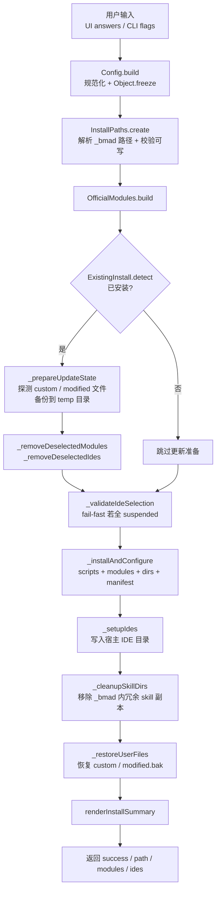

# 04. 安装引擎 — 落到磁盘

> BMAD 没有 agent 运行时,它的"harness"是磁盘上的一棵文本目录树。本章拆解这棵树是如何被 `installer.install()` 一步步浇筑出来的。

## 一句话定位

`installer.install()` 是 BMAD harness 的**部署管线**:它把声明式的 skill / agent / customization 层从仓库源码安装进目标项目的 `_bmad/` 目录与宿主 IDE 配置,并通过三层 manifest 记录"装了什么、版本几何、哪些是用户改动",从而让一次性的"安装"演化为可增量更新、可备份恢复的确定性流程。这是"方法论 harness 如何落地"的实现核心——它不跑 agent,只把约束 agent 的物料铺到磁盘上。

## 心智模型

把 installer 想象成一台**地基浇筑机**。宿主 agent(Claude Code / Cursor)是将来要住进来的"住户",但它现在对 BMAD 一无所知。installer 的工作,是在住户入住前把整栋方法论的"地基"打好:

- 先**勘测**(校验源码根、目标目录可写、是否有旧地基);
- 再**清场**(若有旧安装,移除被取消选中的模块/IDE,把用户的私改文物先搬进临时仓库);
- 然后**浇筑**(装共享脚本、装模块、建模块目录、生成配置与三层 manifest);
- 接着**接线**(把技能写进各宿主 IDE 的目录,让住户能"看见"它们);
- 最后**回填**(把用户私改文物按规则放回原处或存为 `.bak`)。

关键在于:浇筑机自身**不入住、不运行**。它产出的全是纯文本(SKILL.md、TOML、CSV、YAML),由宿主 agent 在之后的日子里读取并服从。这与 Claude Code 自带的运行时 harness 形成根本对照——后者是一段持续运行的二进制,前者是一次性落盘的物料铺设。



上图是 `install()` 的真实编排序列,本章源码走读即按此顺序展开。

## 源码走读

### 4.1 Config.build:把原始输入冻结成可信配置

`install()` 的第一件事不是装文件,而是把来自 UI 或 CLI 的"原始输入"净化成一个不可变配置对象。`Config.build` 是唯一入口,构造函数最后 `Object.freeze(this)`。

> `tools/installer/core/config.js:43`
>
> ```js
>   static build(userInput) {
>     const modules = [...(userInput.modules || [])];
>     if (userInput.installCore && !modules.includes('core')) {
>       modules.unshift('core');
>     }
>
>     return new Config({
>       directory: userInput.directory,
>       modules,
>       ides: userInput.skipIde ? [] : [...(userInput.ides || [])],
>       skipPrompts: userInput.skipPrompts || false,
>       verbose: userInput.verbose || false,
>       actionType: userInput.actionType,
>       coreConfig: userInput.coreConfig || {},
>       moduleConfigs: userInput.moduleConfigs || null,
>       quickUpdate: userInput._quickUpdate || false,
>       channelOptions: userInput.channelOptions || null,
>       setOverrides: userInput.setOverrides || {},
>     });
>   }
> ```

`core` 永远被 `unshift` 到模块列表最前——它是 harness 的脊柱(承载 bmad-help、共享脚本、核心 agent 名册),没有 core 就没有方法论的骨架。注意 `skipIde ? [] : [...]`:用户可以纯 `_bmad`-only 安装(只铺地基、不接线),这对 CI 或纯命令行场景很有用。`channelOptions` 注释里特意标明"don't deep-freeze",因为它内部携带 `Map`/`Set`(渠道解析的状态对象),深冻结会破坏其语义——这是一个"不可变边界画在哪"的精细权衡。

构造函数把所有字段冻结后,后续代码拿到的 `config` 就是一个**只读契约**,任何模块都改不动它,只能在调用链上传递。

### 4.2 InstallPaths.create:解析并校验落点路径

配置就绪后,`InstallPaths.create(config)` 负责把"目标目录"解析成一棵具体的路径树,并在写任何东西之前**先校验可写性**。

> `tools/installer/core/install-paths.js:15`
>
> ```js
>     const projectRoot = path.resolve(config.directory);
>     await ensureWritableDir(projectRoot, 'project root');
>
>     const bmadDir = path.join(projectRoot, BMAD_FOLDER_NAME);
>     const isUpdate = await fs.pathExists(bmadDir);
>
>     const configDir = path.join(bmadDir, '_config');
>     const coreDir = path.join(bmadDir, 'core');
>     const scriptsDir = path.join(bmadDir, 'scripts');
>     const customDir = path.join(bmadDir, 'custom');
>
>     for (const [dir, label] of [
>       [bmadDir, 'bmad directory'],
>       [configDir, 'config directory'],
>       [coreDir, 'core module directory'],
>       [scriptsDir, 'shared scripts directory'],
>       [customDir, 'customizations directory'],
>     ]) {
>       await ensureWritableDir(dir, label);
>     }
> ```

`_bmad/` 目录的骨架在此刻定型:`_config`(放三层 manifest)、`core`(核心模块)、`scripts`(共享 Python 脚本)、`custom`(用户覆盖层)。`isUpdate` 通过"目录是否已存在"这一个探测点就判定了安装性质——首次安装还是更新,后续整个流程的分叉都依赖这个布尔值。`ensureWritableDir` 不只是 `mkdir`,它还区分 `EACCES`(权限)与 `ENOSPC`(磁盘满)抛出可读错误,避免用户看到一层晦涩的 `errno`。

`InstallPaths` 同样是冻结对象,但它不存死路径字符串,而是**暴露访问器方法**,让"路径约定"集中在一处:

> `tools/installer/core/install-paths.js:54`
>
> ```js
>   manifestFile() {
>     return path.join(this.configDir, 'manifest.yaml');
>   }
>   centralConfig() {
>     return path.join(this.bmadDir, 'config.toml');
>   }
>   centralUserConfig() {
>     return path.join(this.bmadDir, 'config.user.toml');
>   }
>   filesManifest() {
>     return path.join(this.configDir, 'files-manifest.csv');
>   }
>   helpCatalog() {
>     return path.join(this.configDir, 'bmad-help.csv');
>   }
>   moduleDir(name) {
>     return path.join(this.bmadDir, name);
>   }
>   moduleConfig(name) {
>     return path.join(this.bmadDir, name, 'config.yaml');
>   }
> ```

调用方写 `paths.manifestFile()` 而非硬编码字符串,意味着将来若要改 `_bmad` 的内部布局(例如 `manifest.yaml` 换目录),只需改这一处。这是把"路径约定"从散落的字符串提升为**类型化 API** 的标准手法。

### 4.3 ExistingInstall.detect:对既有安装做不可变快照

路径解析完,installer 立刻探测"这里以前装过吗"。`ExistingInstall.detect` 是一个**纯查询对象**——构造完成后不再碰文件系统,返回一份冻结的安装快照。

> `tools/installer/core/existing-install.js:45`
>
> ```js
>   static async detect(bmadDir) {
>     if (!(await fs.pathExists(bmadDir))) {
>       return ExistingInstall.empty();
>     }
>
>     let version = null;
>     let hasCore = false;
>     const modules = [];
>     let ides = [];
>
>     const manifest = new Manifest();
>     const manifestData = await manifest.read(bmadDir);
>     if (manifestData) {
>       version = manifestData.version;
>       if (manifestData.ides) {
>         ides = manifestData.ides.filter((ide) => ide && typeof ide === 'string');
>       }
>     }
>
>     const corePath = path.join(bmadDir, 'core');
>     if (await fs.pathExists(corePath)) {
>       hasCore = true;
>       // ... 若 manifest 无版本,回退读 core/config.yaml
>     }
> ```

探测策略是**双源交叉验证**:先读 `manifest.yaml` 拿版本与 IDE 名单,再独立检查 `core/` 目录是否存在。`installed` 的最终判定是 `hasCore || modules.length > 0 || !!manifestData`——三者满足其一即认为"有安装"。这种"或"逻辑是为了容忍历史遗留:哪怕 manifest 损坏或缺失,只要 core 目录在,就还是一次更新而非首装。

快照的不可变性由构造函数保证:

> `tools/installer/core/existing-install.js:13`
>
> ```js
>   constructor({ installed, version, hasCore, modules, ides }) {
>     this.installed = installed;
>     this.#version = version;
>     this.hasCore = hasCore;
>     this.modules = Object.freeze(modules.map((m) => Object.freeze({ ...m })));
>     this.moduleIds = Object.freeze(this.modules.map((m) => m.id));
>     this.ides = Object.freeze([...ides]);
>     Object.freeze(this);
>   }
> ```

`version` 用私有字段 `#version` 封装,并通过 getter 在 `installed === false` 时抛错——"没装就别问版本"。`moduleIds` 是从 `modules` 派生的冻结数组,供后续 `_removeDeselectedModules` 做集合差集。整张快照在 `install()` 后续流程中只读不写,确保"探测时刻"与"操作时刻"之间不会因为并发改动而漂移。

### 4.4 install() 主编排:探测后的四段式分叉

回到 `install()` 主体。探测之后,若发现既有安装,就走一条"清场—备份"支线;否则跳过。这条支线是增量更新的命脉。

> `tools/installer/core/installer.js:56`
>
> ```js
>       if (existingInstall.installed) {
>         await this._removeDeselectedModules(existingInstall, config, paths, originalConfig._preserveModules || []);
>         updateState = await this._prepareUpdateState(paths, config, existingInstall, officialModules);
>         await this._removeDeselectedIdes(existingInstall, config, paths);
>       }
>
>       await this._validateIdeSelection(config);
> ```

三步顺序有讲究:先删**模块**(腾出空间),再**备份用户文件**(在改写之前抢救),最后删 **IDE**(此时 `_bmad/` 已稳定)。`_preserveModules` 是 quick-update 传进来的"无源模块"白名单——某些已装模块此刻找不到源码,不能动它们,只能保留(详见 4.7)。

`_validateIdeSelection` 是一道 fail-fast 闸门:若用户选的 IDE 全部处于 `suspended` 状态(平台不支持或已弃用),直接抛错中止。注释点明动机——"防止在没有任何可用 IDE 配置时升级 `_bmad/`",即宁可不动也不要把地基刷新成无法接线的状态。

清场完毕后进入浇筑主流程:

> `tools/installer/core/installer.js:86`
>
> ```js
>       await this._installAndConfigure(
>         config, originalConfig, paths, allModules, allModules,
>         addResult, officialModules, previousSkillManifestRows,
>       );
>
>       await this._setupIdes(config, allModules, paths, addResult, previousSkillIds);
>
>       // Skills are now in IDE directories — remove redundant copies from _bmad/.
>       // Also cleans up skill dirs left by older installer versions.
>       await this._cleanupSkillDirs(paths.bmadDir);
>
>       const restoreResult = await this._restoreUserFiles(paths, updateState);
> ```

四步形成一条单向数据流:`_installAndConfigure` 把模块铺进 `_bmad/` 并生成 manifest → `_setupIdes` 把技能分发到各 IDE 目录 → `_cleanupSkillDirs` 删掉 `_bmad/` 里已被 IDE 收纳的冗余 skill 副本(技能自包含在 IDE 目录,`_bmad/` 只保留模块级文件)→ `_restoreUserFiles` 回填用户文物。注释里"Also cleans up skill dirs left by older installer versions"透露出这步还兼任历史兼容清理——新装法与旧装法的目录约定不同,需要一次性抹平。

### 4.5 _installOfficialModules 与三层 manifest

`_installAndConfigure` 内部把任务拆成若干 `prompts.tasks` 条目依次执行:装共享脚本、装模块、建模块目录、生成配置与 manifest。其中模块安装会跳过已处理的同名模块,保证幂等:

> `tools/installer/core/installer.js:721`
>
> ```js
>     for (const moduleName of officialModuleIds) {
>       if (installedModuleNames.has(moduleName)) continue;
>       installedModuleNames.add(moduleName);
>
>       message(`${isQuickUpdate ? 'Updating' : 'Installing'} ${moduleName}...`);
>
>       const moduleConfig = officialModules.moduleConfigs[moduleName] || {};
>       const installResult = await officialModules.install(
>         moduleName, paths.bmadDir,
>         (filePath) => { this.installedFiles.add(filePath); },
>         { skipModuleInstaller: true, moduleConfig, installer: this, silent: true, channelOptions: config.channelOptions },
>       );
> ```

`installedModuleNames` 是一个 `Set`,充当本次运行的去重闸——即便上游传入重复 ID,也只装一次。注意那个 `(filePath) => this.installedFiles.add(filePath)` 回调:每装一个文件就登记进 `installedFiles` 集合,这个集合是 `files-manifest.csv` 的数据源。换句话说,**文件清单不是事后扫描目录得到的,而是安装过程中实时累积的**——这保证了 manifest 只记录"installer 真正写过的文件",不会被目录里的杂散文件污染。

manifest 的生成集中在 `ManifestGenerator.generateManifests`,它会写出**五个产物**:

> `tools/installer/core/manifest-generator.js:84`
>
> ```js
>     const [teamConfigPath, userConfigPath] = await this.writeCentralConfig(bmadDir, options.moduleConfigs || {});
>     const manifestFiles = [
>       await this.writeMainManifest(cfgDir),
>       await this.writeSkillManifest(cfgDir),
>       teamConfigPath,
>       userConfigPath,
>       await this.writeFilesManifest(cfgDir),
>     ];
> ```

其中构成"三层记录"的核心是三个文件,各有分工:

**第一层:`manifest.yaml`** —— 安装级元数据(版本、日期、模块明细、IDE 名单)。

> `tools/installer/core/manifest.js:54`
>
> ```js
>     const manifestData = {
>       installation: {
>         version: bmadVersion,
>         installDate: data.installDate || new Date().toISOString(),
>         lastUpdated: data.lastUpdated || new Date().toISOString(),
>       },
>       modules: moduleDetails,
>       ides: data.ides || [],
>     };
> ```

`modules` 在新版里是对象数组,每个模块携带 `version` / `channel` / `sha` / `source` / `repoUrl` 等明细(`Manifest.read` 会同时返回扁平的 `modules`(名字数组)和 `modulesDetailed`(对象数组),以兼容老调用方)。`installDate` 在更新时会被 `writeMainManifest` 从旧 manifest 里读回并保留——首次安装的日期不会因更新而丢失。

**第二层:`files-manifest.csv`** —— 逐文件清单,带 SHA-256 哈希,是"用户改动检测"的基石。

> `tools/installer/core/manifest-generator.js:681`
>
> ```js
>   async writeFilesManifest(cfgDir) {
>     const csvPath = path.join(cfgDir, 'files-manifest.csv');
>
>     // Create CSV header with hash column
>     let csv = 'type,name,module,path,hash\n';
> ```

哈希列是增量更新的关键:更新时,installer 会重新算每个文件的哈希,与 manifest 里记录的旧哈希比对——不一致即"用户改过"。

> `tools/installer/core/manifest-generator.js:700`
>
> ```js
>         // Calculate hash
>         const hash = await this.calculateFileHash(filePath);
>
>         allFiles.push({
>           type: ext.slice(1) || 'file',
>           name: fileName,
>           module: module,
>           path: relativePath,
>           hash: hash,
>         });
> ```

**第三层:`skill-manifest.csv`** —— 技能注册表,字段为 `canonicalId,name,description,module,path`。它由 `collectSkills` 递归扫描每个模块目录、以"目录里存在合法 `SKILL.md` frontmatter"为发现门闸生成(`canonicalId` 直接取目录名)。这张表既是 IDE 分发技能的依据,也是 quick-update 时清理过期 skill 的参照。

此外 `writeCentralConfig` 还会产出两个**安装托管**的 TOML:`config.toml`(团队级答案)与 `config.user.toml`(个人级答案),两者每次安装都重新生成、视作只读;真正持久化的用户覆盖则放在 `_bmad/custom/config.toml` 与 `_bmad/custom/config.user.toml`,installer 只在首装时建空桩、此后永不触碰。这一"托管 vs 自治"的切分,是 BMAD 三层定制化的落点(详见[第 7 章](../第二部分-核心系统篇/07-定制化与三层合并.md))。

### 4.6 增量更新:备份—改写—恢复

更新的核心难题是:**如何在覆盖式重装的同时,不丢失用户对已装文件的私改**。BMAD 的解法是"先探测、再备份、后恢复"三段式,全部状态收敛进 `updateState`。

> `tools/installer/core/installer.js:585`
>
> ```js
>   async _prepareUpdateState(paths, config, existingInstall, officialModules) {
>     // Detect custom and modified files BEFORE updating (compare current files vs files-manifest.csv)
>     const existingFilesManifest = await this.readFilesManifest(paths.bmadDir);
>     const { customFiles, modifiedFiles } = await this.detectCustomFiles(paths.bmadDir, existingFilesManifest);
>
>     // Preserve existing core configuration during updates
>     const coreConfigPath = paths.moduleConfig('core');
>     if ((await fs.pathExists(coreConfigPath)) && (!config.coreConfig || Object.keys(config.coreConfig).length === 0)) {
>       // ... 读回 core/config.yaml,塞回 config.coreConfig
>     }
>
>     const backupDirs = await this._backupUserFiles(paths, customFiles, modifiedFiles);
>
>     return { customFiles, modifiedFiles, tempBackupDir: backupDirs.tempBackupDir, tempModifiedBackupDir: backupDirs.tempModifiedBackupDir };
>   }
> ```

`detectCustomFiles` 把磁盘文件分成三类,判定逻辑浓缩在一段核心比较里:

> `tools/installer/core/installer.js:915`
>
> ```js
>             if (!fileInfo) {
>               // File not in manifest = custom file
>               ...
>               customFiles.push(fullPath);
>             } else if (manifestHasHashes && fileInfo.hash) {
>               // File in manifest with hash - check if it was modified
>               const currentHash = await this.manifest.calculateFileHash(fullPath);
>               if (currentHash && currentHash !== fileInfo.hash) {
>                 // Hash changed = file was modified
>                 modifiedFiles.push({ path: fullPath, relativePath: fileInfo.relativePath });
>               }
>             }
> ```

- **不在 manifest 里** → `customFiles`(用户自加的文件,installer 不认识);
- **在 manifest 里且哈希变了** → `modifiedFiles`(用户改了 installer 装的文件);
- **在 manifest 里且哈希一致** → installer 自己的文件,可放心覆盖。

这套分类的精度依赖 `files-manifest.csv` 的哈希列——老版 manifest 没哈希时(`manifestHasHashes === false`),modified 检测会降级为"只识别 custom",这是一个向后兼容的安全降级。值得一提的是,`_memory` / `memory` 子树(runtime 侧车数据)和 `config.yaml`(每次重生成)被显式排除在扫描之外,避免把 agent 运行态误判成用户改动。

备份后,installer 走完覆盖式重装,最后由 `_restoreUserFiles` 按"不同待遇"回填:

> `tools/installer/core/installer.js:531`
>
> ```js
>             for (const originalPath of updateState.customFiles) {
>               const relativePath = path.relative(paths.bmadDir, originalPath);
>               const backupPath = path.join(updateState.tempBackupDir, relativePath);
>
>               if (await fs.pathExists(backupPath)) {
>                 await fs.ensureDir(path.dirname(originalPath));
>                 await fs.copy(backupPath, originalPath, { overwrite: true });
>               }
>             }
> ```

`customFiles` 被原样覆盖回原位(用户的私加文件 installer 不会重写,所以直接放回);而 `modifiedFiles` 则被存为 `.bak`——因为 installer 会重新生成这些文件的新版本,用户的旧改动不能直接覆盖新版,但也不能丢,于是降格为旁路备份供用户手动合并。两种待遇的差异,精准对应了"用户私有内容"与"用户对托管内容的改动"两种不同的归属语义。

若中途抛错,`install()` 的 `catch` 会清理两个 temp 备份目录,避免在项目里留下 `_bmad-custom-backup-temp` 之类的垃圾——best-effort,且绝不掩盖原始错误。

### 4.7 quickUpdate 的快路径

`quickUpdate` 是一条为"只想刷新到最新、不想重新答问卷"场景设计的捷径。它不重新收集全部配置,只探测"有没有新出现的配置字段需要问",然后**复用 `install()` 主流程**完成实际安装。

它最精巧的部分是在委托给 `install()` 之前,先从旧 manifest 重建 `channelOptions`——决定每个模块这次该走哪个渠道:

> `tools/installer/core/installer.js:1337`
>
> ```js
>         if (entry.channel === 'stable' && entry.version && entry.repoUrl) {
>           const parsed = parseGitHubRepo(entry.repoUrl);
>           ...
>           const cls = classifyUpgrade(entry.version, topTag);
>           if (cls === 'major') {
>             channelOptions.pins.set(entry.name, entry.version);
>             await prompts.log.warn(
>               `${entry.name} ${entry.version} → ${topTag} is a new major release; staying on ${entry.version}. ` +
>                 `Run \`bmad install\` (Modify) with \`--pin ${entry.name}=${topTag}\` to accept.`,
>             );
>           }
> ```

`next` 渠道的模块直接记进 `nextSet`(拉 main HEAD);`pinned` 的记进 `pins`(锁版本);而 `stable` 渠道要额外做一次升级分类——若上游出了**主版本号升级**(`classifyUpgrade` 返回 `'major'`),quick-update 会在**非交互语义下自动 pin 回当前版本**,防止"静默跳进一个可能有破坏性变更的大版本"。这是一个典型的"确定性优先"决策:在用户没有显式确认的前提下,宁可不动也不要冒险。离线或限流导致 tag 查询失败时,同样回退到 pin 当前版本,保证安装稳定。

构造好 `installConfig` 后,`quickUpdate` 一句 `await this.install(installConfig)` 就把活儿全交回主流程——`_quickUpdate: true`、`_preserveModules`、`_existingModules` 三个内部字段是主流程识别"这是快路径"的暗号。`_installAndConfigure` 里据此切换文案("Updating" vs "Installing")并调整 manifest 的模块集合来源:

> `tools/installer/core/installer.js:304`
>
> ```js
>         const allModulesForManifest = config.isQuickUpdate()
>           ? originalConfig._existingModules || allModules || []
>           : preservedModules.length > 0
>             ? [...allModules, ...preservedModules]
>             : allModules || [];
> ```

快路径用 `_existingModules`(全部已装模块)而非 `allModules`(本次选中的)来生成 manifest,确保那些"无源、只能保留"的模块不会从记录里凭空消失。这种"主流程不变、靠传入字段切换语义"的做法,让 quick-update 几乎零额外代码就接入了全部备份/恢复/manifest 能力。

## 设计决策与权衡

1. **不可变配置对象贯穿全流程**。`Config`、`InstallPaths`、`ExistingInstall` 三者全部 `Object.freeze`,且在写任何文件之前就完成构造。代价是构造期要付出一次冻结与校验的开销;收益是下游任何阶段拿到的都是只读快照,无需担心"探测后、操作前"状态被改动,也让流程天然可推理、可单测。这是把"安装"这种易并发、易出错的操作用函数式约束框住的典型选择。

2. **三层 manifest 各司其职,而非一个全能文件**。`manifest.yaml` 管安装元数据与版本/渠道,`files-manifest.csv` 管逐文件哈希(服务改动检测),`skill-manifest.csv` 管技能注册表(服务 IDE 分发与清理)。拆开的原因是三者的读写频率与消费者不同:元数据每次安装整体重写;文件哈希要在更新前读、更新后写;技能表要被 IDE 层和清理逻辑共享。一个文件兼顾三者会让任一变更都牵动全部消费者。代价是三份文件之间需保持模块名一致(隐性契约),但相比耦合带来的脆弱性,这点代价可接受。

3. **覆盖式重装 + 备份恢复,而非就地合并**。更新不尝试对每个文件做三方合并(installer 新版 / 磁盘当前 / 用户改动),而是粗暴覆盖后再回填。`customFiles` 原样放回、`modifiedFiles` 降为 `.bak`。这放弃了"自动合并用户改动到新版"的能力,换来实现的简单与可预测——installer 永远产出干净的新版,用户改动要么原样保留(私有文件)、要么手动合并(`.bak`)。在"方法论物料"这种以 installer 为权威来源的场景下,这是合理的归属划分。

4. **quick-update 复用主流程而非另起炉灶**。快路径没有重写安装逻辑,而是构造一份带 `_quickUpdate` 等内部字段的 config 委托给 `install()`。代价是 `install()` 内部多了若干 `isQuickUpdate()` 分支;收益是备份/恢复/manifest/IDE 接线等所有能力只维护一份实现,快路径几乎"免费"获得全部正确性保证。渠道升级的主版本号自动 pin 则体现了"非交互场景下确定性优先"的设计取向。

## 与 Claude Code harness 的对照

Claude Code 的 harness 是一段**编译进二进制的运行时**——它自带 `while(true)` 对话循环、工具协议、权限管线,安装它意味着装一个可执行的 npm 包,启动它意味着拉起一个持续运行的进程。它的"安装"和"运行"是同构的:二进制既是被部署的产物,也是运行时的本体。

BMAD 的 installer 则完全是另一种范式。它是一段**一次性 Node 脚本**,跑完即退,不留下任何进程。它的产物是一棵**纯文本目录树**(`_bmad/` 下的 SKILL.md、TOML、CSV、YAML),这些文件本身不"运行",而是等待宿主 agent 在后续会话中读取并服从。换句话说:Claude Code 的 harness 在二进制里、在进程中;BMAD 的 harness 在 Markdown + TOML + Python 里、在磁盘上。installer 所做的,正是把后者从仓库"搬运"并"铺平"到宿主能看见的位置。

由此带来一个 Claude Code 不需要面对的问题:**可复现性与幂等性**。运行时 harness 只需保证自己能跑;而 BMAD 这种"物料型 harness"必须保证反复安装、更新、卸载后磁盘状态一致——这正是三层 manifest(尤其是带哈希的 `files-manifest.csv`)存在的根本理由。manifest 在这里的角色,类似于 `package-lock.json` 之于 npm:它让一个不拥有运行时的框架,依然能对"装了什么"给出确定性的、可审计的回答。这是"方法论 harness"为弥补"没有运行时"这一先天差异,而自行补上的一层确定性基础设施。

## 小结

`installer.install()` 用一条"勘测—清场—浇筑—接线—回填"的单向流水线,把 BMAD 的声明式物料落到 `_bmad/` 目录与宿主 IDE 配置中。`Config` / `InstallPaths` / `ExistingInstall` 三个冻结对象在流程起点就把配置、路径、安装快照定型;`ManifestGenerator` 产出的 `manifest.yaml` + `files-manifest.csv` + `skill-manifest.csv` 三层记录,让覆盖式重装得以与用户改动检测、增量更新、渠道锁定共存;`quickUpdate` 则以最小分叉复用主流程,把"刷新到最新"变成一次安全的委托调用。整条管线不跑 agent、不接管循环,只产文本——这正是"方法论 harness 落地"的全部实质。

至此,harness 的物料已经铺到磁盘。但这些物料——模块、技能、agent 名册——本身是如何被打包、如何携带变量与目录约定的?下一章将走进[第 05 章](../第一部分-基础篇/05-模块系统与渠道分发.md),拆解模块系统的基因结构与 stable/next/pinned 渠道分发策略。
