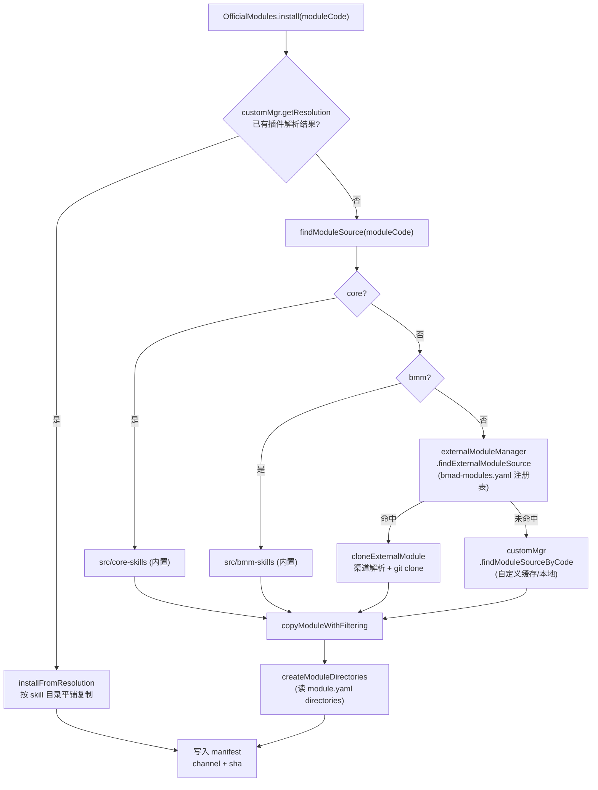

# 10. 模块管理 — 官方 / 外部 / 自定义

## 10.1 一句话定位

模块管理是 BMAD harness 的**分发与来源层**:它定义了"一个模块是什么"(可分发的 skill + agent + config 包),并用三套并行的来源管理器——官方内置、官方远程注册表、用户自定义——把模块从各自的原点取回、解析、安装到宿主项目磁盘。版本化的分发则由与来源**正交**的渠道系统承担([第 05 章](../第二部分-核心系统篇/05-渠道与版本解析.md)),本章只关心"模块从哪儿来、怎么落地"。

## 10.2 心智模型

把一个 BMAD 模块想象成一个**自描述的基因包**:一个目录,内含 `module.yaml`(声明 `code`、`name`、配置 schema、要创建的 `directories`)、若干 `agents/*.md`、若干技能目录,以及一份 `module-help.csv`(技能清单)。这个包可以来自三个地方:

- **官方内置**(`core`、`bmm`):直接打包在 installer 的 `src/core-skills`、`src/bmm-skills` 里,无网络、无 git。
- **官方远程**(`tea`、`cis`、`gds` 等):登记在仓库根的 `bmad-modules.yaml` 注册表里,按渠道(stable/next/pinned)从 GitHub 克隆。
- **自定义**:用户随手给的任意 Git URL 或本地路径,通过 `.claude-plugin/marketplace.json` 发现,或直接当作模块目录。

来源决定"去哪儿拿",渠道决定"拿哪个版本"——二者是正交的两个轴。下面的图把"拿来之后装哪"的派发逻辑画清楚:



派发的核心是 `findModuleSource` 的级联:内置优先、官方注册表次之、自定义兜底。一旦定位到源目录,无论来自哪条路径,后续的"过滤复制 + 声明式建目录 + 写 manifest"是统一的——这正是"模块=统一形状的包"的体现。

## 10.3 源码走读

### 10.3.1 注册表:`bmad-modules.yaml` 是唯一事实源

官方远程模块不再走远程 marketplace 拉取,而是登记在仓库根的一个 YAML 文件里。这个文件既是"有哪些官方模块"的名册,也是它们在 installer 选择器里的展示顺序与默认渠道来源。

> `bmad-modules.yaml:11`
>
> ```yaml
> modules:
>   bmad-method-test-architecture-enterprise:
>     url: https://github.com/bmad-code-org/bmad-method-test-architecture-enterprise
>     module-definition: src/module.yaml
>     code: tea
>     name: "BMad Test Architect"
>     defaultSelected: false
>     type: bmad-org
>     npmPackage: bmad-method-test-architecture-enterprise
>     default_channel: stable
> ```

每个条目用 `code`(如 `tea`)作为 installer 内部的短标识,`url` 指向 GitHub 仓库,`module-definition` 告诉克隆后去哪个相对路径找 `module.yaml`。`default_channel` 让单个模块可以声明自己的默认渠道——例如 `bmad-automator` 登记 `default_channel: next`,因为它仍是实验性模块。

值得注意的是 `bmad-method-wds-expansion` 条目里的 `plugin_name: bmad-wds`:

> `bmad-modules.yaml:67`
>
> ```yaml
>   bmad-method-wds-expansion:
>     url: https://github.com/bmad-code-org/bmad-method-wds-expansion
>     module-definition: src/module.yaml
>     code: wds
>     plugin_name: bmad-wds # WDS marketplace.json declares the plugin under this name
>     npmPackage: bmad-wds
>     default_channel: stable
> ```

`plugin_name` 是注册表与仓库内 `marketplace.json` 之间的**桥接键**:注册表用 `code` 做安装标识,但该仓库的 `marketplace.json` 里插件叫 `bmad-wds`,二者并不一致,因此显式登记这个映射,避免按 `code` 在 marketplace 里找不到插件。这种"键分离"是官方模块也复用自定义模块的 marketplace 发现机制留下的痕迹。

### 10.3.2 三源派发:`findModuleSource` 的级联

`OfficialModules` 是模块安装的统一入口,但它的 `listAvailable()` 只列出内置模块——其余模块由它持有的 `externalModuleManager` 与按需 `require` 的 `customMgr` 补齐。真正体现"三源合一"的是 `findModuleSource`:

> `tools/installer/modules/official-modules.js:203`
>
> ```js
> async findModuleSource(moduleCode, options = {}) {
>   if (options.channelOptions === undefined && this.channelOptions) {
>     options = { ...options, channelOptions: this.channelOptions };
>   }
>   const projectRoot = getProjectRoot();
>
>   if (moduleCode === 'core') {
>     const corePath = getSourcePath('core-skills');
>     if (await fs.pathExists(corePath)) return corePath;
>   }
>   if (moduleCode === 'bmm') {
>     const bmmPath = getSourcePath('bmm-skills');
>     if (await fs.pathExists(bmmPath)) return bmmPath;
>   }
>
>   const externalSource = await this.externalModuleManager.findExternalModuleSource(moduleCode, options);
>   if (externalSource) return externalSource;
>
>   const { CustomModuleManager } = require('./custom-module-manager');
>   const customMgr = new CustomModuleManager();
>   const customSource = await customMgr.findModuleSourceByCode(moduleCode, options);
>   if (customSource) return customSource;
>
>   return null;
> }
> ```

级联顺序是设计决策而非随意的:内置优先(零成本、确定性强),官方注册表次之(已知仓库、可走渠道),自定义兜底(用户随手给的最不确定来源)。开头那段 `channelOptions` 透传是关键——预安装阶段的配置收集与真正安装步骤必须看到**同一个 git ref**,否则会出现"收集配置时拉了 next、安装时又退回 stable"的错位。

### 10.3.3 内置模块:`core` 与 `bmm` 的自描述

内置模块不走任何克隆,直接从 installer 源码树读取。`getModuleInfo` 解析目录下的 `module.yaml`:

> `tools/installer/modules/official-modules.js:141`
>
> ```js
> async getModuleInfo(modulePath, defaultName, sourceDescription) {
>   const moduleConfigPath = path.join(modulePath, 'module.yaml');
>   if (!(await fs.pathExists(moduleConfigPath))) {
>     const { CustomModuleManager } = require('./custom-module-manager');
>     const customMgr = new CustomModuleManager();
>     const resolved = customMgr.getResolution(defaultName);
>     if (resolved && resolved.synthesizedModuleYaml) {
>       return { id: resolved.code, path: modulePath, name: resolved.name, /* ... */ };
>     }
>     return null;
>   }
>   const moduleInfo = { id: defaultName, path: modulePath, /* ... */ version: '5.0.0' };
>   try {
>     const config = yaml.parse(await fs.readFile(moduleConfigPath, 'utf8'));
>     if (config.code) moduleInfo.id = config.code;
>     moduleInfo.name = config.name || moduleInfo.name;
>     moduleInfo.dependencies = config.dependencies || [];
>     moduleInfo.defaultSelected = config.default_selected === undefined ? false : config.default_selected;
>   } catch (error) { /* warn */ }
>   return moduleInfo;
> }
> ```

注意 `module.yaml` 不存在时的分支:它会去查 `CustomModuleManager` 的解析缓存里有没有"合成出来的 module.yaml"(`synthesizedModuleYaml`)。这是给 [10.3.6](#1036-插件解析pluginresolver-的五策略) 中策略 5——仓库根本没有 `module.yaml`、由 `PluginResolver` 现场合成——留的逃生口,让无 `module.yaml` 的插件也能在 `listAvailable` 里被当作合法模块展示。

### 10.3.4 官方外部模块:`ExternalModuleManager` 的渠道化克隆

官方远程模块的克隆由 `ExternalModuleManager.cloneExternalModule` 完成,这是整章最复杂的函数。它把"渠道计划 → ref 解析 → 克隆/更新 → 记录解析结果 → 装依赖"串成一条管线。

先看渠道决策与"同计划短路":

> `tools/installer/modules/external-manager.js:214`
>
> ```js
> const hasExplicitChannelInput =
>   options.channelOptions &&
>   (options.channelOptions.global ||
>     (options.channelOptions.nextSet && options.channelOptions.nextSet.size > 0) ||
>     (options.channelOptions.pins && options.channelOptions.pins.size > 0));
> const existingResolution = ExternalModuleManager._resolutions.get(moduleCode);
> const haveUsableCache = await fs.pathExists(moduleCacheDir);
>
> if (!hasExplicitChannelInput && existingResolution && haveUsableCache) {
>   return moduleCacheDir;
> }
> const planEntry = decideChannelForModule({
>   code: moduleCode,
>   channelOptions: options.channelOptions,
>   registryDefault: moduleInfo.defaultChannel,
> });
> ```

一次安装会多次调用 `cloneExternalModule`(收集配置、建目录、重建 help 目录各调一次)。注释点明了不做短路的后果:"若不带 flag 重新解析,会退回 stable 覆盖掉一次 pinned 安装"。`decideChannelForModule` 是纯函数,优先级为 `--pin > --next=CODE > --channel(全局) > 注册表默认 > stable`——渠道的全部决策逻辑都收在 [第 05 章](../第二部分-核心系统篇/05-渠道与版本解析.md) 讲的 `channel-plan.js` 里,这里只调用。

再看 tag 查询失败时的离线兜底:

> `tools/installer/modules/external-manager.js:258`
>
> ```js
> const cachedMarker = await readChannelMarker(path.join(moduleCacheDir, '.bmad-channel.json'));
> if (cachedMarker?.channel && (await fs.pathExists(moduleCacheDir))) {
>   if (!silent) {
>     await prompts.log.warn(
>       `Could not check for updates to ${moduleInfo.name} (${error.message}); using cached ${cachedMarker.version || cachedMarker.channel}.`,
>     );
>   }
>   ExternalModuleManager._resolutions.set(moduleCode, { channel: cachedMarker.channel, /* ... */ planSource: 'cached' });
>   return moduleCacheDir;
> }
> ```

GitHub tag API 有 60 次/小时的匿名限额,网络也可能抖动。当已有缓存时,这里把"查不到更新"降级为"沿用缓存版本"而非报错——对 update/quick-update 语义无损。`_resolutions` 是**静态 Map**,跨实例共享:

> `tools/installer/modules/external-manager.js:58`
>
> ```js
> class ExternalModuleManager {
>   // moduleCode → { channel, version, ref, sha, repoUrl, resolvedFallback }
>   // Populated when cloneExternalModule resolves a channel. Shared across all
>   // instances so the manifest writer (which often instantiates a fresh
>   // ExternalModuleManager) sees resolutions made during install.
>   static _resolutions = new Map();
> ```

manifest 写入器常常 `new` 一个全新的 `ExternalModuleManager` 实例去读解析结果。若解析结果存在实例字段上,新实例就读不到。用静态字段把"安装期的一次性解析结论"提升为进程级状态,是绕开实例边界最简单的办法。

克隆本身按渠道分流:`next` 走 `git clone --depth 1` 拉 main HEAD,`stable`/`pinned` 走 `git clone --depth 1 --branch <tag>`,更新已有缓存时则用 `git fetch` + `git checkout FETCH_HEAD`。渠道切换(如 stable→next)会先 `fs.remove` 整个缓存目录再重克隆,避免不同 ref 的浅克隆纠缠。克隆完成后写一个 `.bmad-channel.json` 标记,下次离线时就是上面的兜底依据。

### 10.3.5 自定义模块:`CustomModuleManager` 的源解析

自定义模块面向的是"任意 Git 主机 + 任意本地路径"。它的第一步是把用户随手输入的字符串解析成结构化描述符,`parseSource` 是其中信息密度最高的一段:

> `tools/installer/modules/custom-module-manager.js:169`
>
> ```js
> const deepPathPatterns = [
>   /^(.+?)\/(?:-\/)?(?:tree|blob)\/([^/]+)(?:\/(.+))?$/,
>   /^(.+?)\/src\/(?:branch\/|commit\/|tag\/)?([^/]+)(?:\/(.+))?$/,
> ];
> for (const pattern of deepPathPatterns) {
>   const match = repoPath.match(pattern);
>   if (match) {
>     repoPath = match[1];
>     if (match[2]) urlRef = match[2];
>     if (match[3]) { const cleaned = match[3].replace(/\/+$/, ''); if (cleaned) subdir = cleaned; }
>     break;
>   }
> }
> ```

用户常贴的是浏览器地址栏的深链(GitHub 的 `/tree/main/subdir`、GitLab 的 `/-/tree/...`、Gitea 的 `/src/branch/...`)。这里用两条正则统一抽取"仓库路径 + 内嵌 ref + 子目录",把浏览器链接转成可克隆的 URL + subdir + version。刻意不做 host 专属解析——`git clone` 能接受任何 URL,manager 只需把 ref 和 subdir 剥出来。

输入还支持 `@version` 后缀(如 `https://...git@v1.2.0`),但解析时小心避开 SSH 的 `git@host:` 前缀:

> `tools/installer/modules/custom-module-manager.js:90`
>
> ```js
> if (lastAt > 0) {
>   const candidate = trimmedRaw.slice(lastAt + 1);
>   const before = trimmedRaw.slice(0, lastAt);
>   if (/^[\w.\-+/]+$/.test(candidate) && !candidate.includes(':')) {
>     const beforeLooksLikeRepo = isLocalSourcePath(before) || /^https?:\/\//i.test(before) || /^git@[^:]+:.+/.test(before);
>     if (beforeLooksLikeRepo) { versionSuffix = candidate; trimmed = before; }
>   }
> }
> ```

`git@github.com:owner/repo` 里的 `@` 属于协议,绝不能被当成版本后缀吞掉。判定规则是:`@` 后面的串必须像 ref,且 `@` 前面的部分必须已是一个完整的仓库地址——只有同时满足才剥离版本。

`resolveSource` 是高层协调器,决定走"发现模式"还是"直连模式":

> `tools/installer/modules/custom-module-manager.js:328`
>
> ```js
> async resolveSource(input, options = {}) {
>   const parsed = this.parseSource(input);
>   if (!parsed.isValid) throw new Error(parsed.error);
>   let rootDir; let repoPath; let sourceUrl;
>   if (parsed.type === 'local') {
>     rootDir = parsed.localPath; repoPath = null; sourceUrl = null;
>   } else {
>     repoPath = await this.cloneRepo(input, options);
>     sourceUrl = parsed.cloneUrl;
>     rootDir = parsed.subdir ? path.join(repoPath, parsed.subdir) : repoPath;
>     if (parsed.subdir && !(await fs.pathExists(rootDir))) {
>       throw new Error(`Subdirectory '${parsed.subdir}' not found in cloned repository`);
>     }
>   }
>   const marketplace = await this.readMarketplaceJsonFromDisk(rootDir);
>   const mode = marketplace ? 'discovery' : 'direct';
>   return { parsed, rootDir, repoPath, sourceUrl, marketplace, mode };
> }
> ```

发现模式(有 `.claude-plugin/marketplace.json`)交给 `PluginResolver` 解析出多个可装模块;直连模式(无 marketplace.json)则把目录本身当作单个模块。这种二分让自定义模块既能装"一个仓库多插件"的市场,也能装"一个目录即一个模块"的简单场景。

`cloneRepo` 在更新已有缓存时有个浅克隆陷阱的处理:

> `tools/installer/modules/custom-module-manager.js:440`
>
> ```js
> let defaultBranch = 'main';
> try {
>   defaultBranch = execSync('git symbolic-ref refs/remotes/origin/HEAD --short', {
>     cwd: repoCacheDir, stdio: 'pipe',
>   }).toString().trim().replace('origin/', '');
> } catch { /* Fallback if origin/HEAD is not set */ }
> execSync(`git fetch --depth 1 origin ${quoteCustomRef(defaultBranch)}`, { /* ... */ });
> execSync(`git reset --hard origin/${quoteCustomRef(defaultBranch)}`, { /* ... */ });
> ```

浅克隆里 `origin/HEAD` 是陈旧的,直接 `git reset --hard origin/HEAD` 拉不到默认分支的新提交。这里先用 `git symbolic-ref` 查出真实的默认分支名(不一定是 `main`),再显式 fetch 该分支。这是把"渠道=next"语义落到自定义模块上的关键——自定义的 URL 无 ref 时就被记为 `next`,克隆的是远程默认分支的 HEAD。

### 10.3.6 插件解析:`PluginResolver` 的五策略

当一个自定义仓库含 `marketplace.json`,`PluginResolver.resolve` 负责把"一个 plugin 声明"翻译成"一个或多个可安装的模块定义"。它按五种策略依次尝试,逐级降级:

> `tools/installer/modules/plugin-resolver.js:29`
>
> ```js
> async resolve(repoPath, plugin) {
>   const skillRelPaths = plugin.skills || [];
>   if (skillRelPaths.length === 0) return [];
>   const repoRoot = path.resolve(repoPath);
>   const skillPaths = [];
>   for (const rel of skillRelPaths) {
>     const abs = path.resolve(repoPath, rel.replace(/^\.\//, ''));
>     // Guard against path traversal (.. segments, absolute paths in marketplace.json)
>     if (!abs.startsWith(repoRoot + path.sep) && abs !== repoRoot) continue;
>     if (await fs.pathExists(abs)) skillPaths.push(abs);
>   }
>   if (skillPaths.length === 0) return [];
>   const result =
>     (await this._tryRootModuleFiles(repoPath, plugin, skillPaths)) ||
>     (await this._trySetupSkill(repoPath, plugin, skillPaths)) ||
>     (await this._trySingleStandalone(repoPath, plugin, skillPaths)) ||
>     (await this._tryMultipleStandalone(repoPath, plugin, skillPaths)) ||
>     (await this._synthesizeFallback(repoPath, plugin, skillPaths));
>   return result;
> }
> ```

策略链从"最规范的布局"(根目录有 `module.yaml` + `module-help.csv`)到"最宽松的兜底"(什么都没有就现场合成)。开头的路径穿越防护不是多余的——`marketplace.json` 里的 `skills` 路径是外部输入,若含 `..` 或绝对路径,会把仓库外的文件拽进安装范围。约束到 `repoRoot` 之内是确定性地收紧信任边界。

前四策略都要求磁盘上存在 `module.yaml` + `module-help.csv`,只是位置不同(根公共父目录 / `-setup` 技能的 assets / 单技能 assets / 每个技能各自一份)。当四种都不命中,策略 5 从 `SKILL.md` 的 frontmatter 现场合成:

> `tools/installer/modules/plugin-resolver.js:229`
>
> ```js
> async _synthesizeFallback(repoPath, plugin, skillPaths) {
>   const skillInfos = [];
>   for (const skillPath of skillPaths) {
>     const frontmatter = await this._parseSkillFrontmatter(skillPath);
>     skillInfos.push({ dirName: path.basename(skillPath), name: frontmatter.name || path.basename(skillPath), description: frontmatter.description || '' });
>   }
>   const synthesizedYaml = { code: plugin.name, name: this._formatDisplayName(plugin.name), /* ... */ default_selected: false };
>   const synthesizedCsv = this._buildSynthesizedHelpCsv(moduleName, skillInfos);
>   return [{ /* ... */ strategy: 5, synthesizedModuleYaml: synthesizedYaml, synthesizedHelpCsv: synthesizedCsv }];
> }
> ```

合成的 `module-help.csv` 用标准的 13 列格式,每行一个技能。这让"只写了 `SKILL.md`、没写任何模块元数据"的仓库也能被当作模块安装——降低第三方分发的门槛,代价是合成的模块没有声明式 `directories`、没有配置 schema,能力是退化版的。这是"宽容兜底"与"规范优先"的权衡:先尝试规范布局,失败也不拒绝,而是降级到合成。

### 10.3.7 安装落地:`install` 与 `installFromResolution`

两条安装路径分别对应"已解析的自定义插件"与"其余来源"。`install` 先探测自定义解析缓存,命中就走 `installFromResolution`,否则走 `findModuleSource` + 过滤复制:

> `tools/installer/modules/official-modules.js:255`
>
> ```js
> async install(moduleName, bmadDir, fileTrackingCallback = null, options = {}) {
>   const { CustomModuleManager } = require('./custom-module-manager');
>   const customMgr = new CustomModuleManager();
>   const resolved = customMgr.getResolution(moduleName);
>   if (resolved) {
>     return this.installFromResolution(resolved, bmadDir, fileTrackingCallback, options);
>   }
>   const sourcePath = await this.findModuleSource(moduleName, { silent: options.silent, channelOptions: options.channelOptions });
>   const targetPath = path.join(bmadDir, moduleName);
>   if (await fs.pathExists(targetPath)) await fs.remove(targetPath);
>   await this.copyModuleWithFiltering(sourcePath, targetPath, fileTrackingCallback, options.moduleConfig);
>   if (!options.skipModuleInstaller) await this.createModuleDirectories(moduleName, bmadDir, options);
>   const { Manifest } = require('../core/manifest');
>   const manifestObj = new Manifest();
>   const versionInfo = await manifestObj.getModuleVersionInfo(moduleName, bmadDir, sourcePath);
>   const resolution = this.externalModuleManager.getResolution(moduleName);
>   await manifestObj.addModule(bmadDir, moduleName, {
>     version: resolution?.version || versionInfo.version, source: versionInfo.source,
>     npmPackage: versionInfo.npmPackage, repoUrl: versionInfo.repoUrl,
>     channel: resolution?.channel, sha: resolution?.sha,
>   });
>   return { success: true, module: moduleName, path: targetPath, versionInfo };
> }
> ```

manifest 条目里 `channel` 与 `sha` 直接取自 `externalModuleManager.getResolution(moduleName)`——这正是 [10.3.4](#1034-官方外部模块externalmodulemanager-的渠道化克隆) 里那个静态 `_resolutions` Map 的消费者。一次安装期解析出的渠道和提交 SHA,被原样写进项目的 `manifest.yaml`,使后续 update/quick-update 可复现、可审计。

自定义路径 `installFromResolution` 则从克隆元数据**反推**渠道:

> `tools/installer/modules/official-modules.js:353`
>
> ```js
> const hasGitClone = !!resolved.repoUrl;
> const manifestEntry = {
>   version: resolved.cloneRef || (hasGitClone ? 'main' : resolved.version || null),
>   source: 'custom', npmPackage: null, repoUrl: resolved.repoUrl || null,
> };
> if (hasGitClone) {
>   manifestEntry.channel = resolved.cloneRef ? 'pinned' : 'next';
>   if (resolved.cloneSha) manifestEntry.sha = resolved.cloneSha;
>   if (resolved.rawInput) manifestEntry.rawSource = resolved.rawInput;
> }
> if (resolved.localPath) manifestEntry.localPath = resolved.localPath;
> await manifestObj.addModule(bmadDir, resolved.code, manifestEntry);
> ```

自定义模块没有注册表声明的 `default_channel`,渠道完全由克隆行为推导:带了 ref(无论是 `@version` 还是 `--pin`)就是 `pinned`,裸 URL 就是 `next`,本地路径则没有渠道概念。这说明渠道是**来源无关的版本轴**——官方模块靠注册表 + flag 决定,自定义模块靠"有没有指定 ref"决定,但最终都落到同一套 `channel/sha` 元数据里,被 manifest 统一记录。

复制阶段 `copyModuleWithFiltering` 不是无脑全拷,它做了一组声明式过滤:

> `tools/installer/modules/official-modules.js:478`
>
> ```js
> async copyModuleWithFiltering(sourcePath, targetPath, fileTrackingCallback = null, moduleConfig = {}) {
>   const sourceFiles = await this.getFileList(sourcePath);
>   for (const file of sourceFiles) {
>     if (file.startsWith('sub-modules/')) continue;       // IDE 专属,另行处理
>     const isInSidecarDirectory = path.dirname(file).split('/').some((dir) => dir.toLowerCase().endsWith('-sidecar'));
>     if (isInSidecarDirectory) continue;                  // agent 专属资产,安装期不需要
>     if (file === 'module.yaml') continue;                // 仅安装期需要
>     if (file === 'config.yaml') continue;                // 由配置收集器生成实际值
>     if (file.startsWith('agents/') && file.endsWith('.md')) {
>       const content = await fs.readFile(sourceFile, 'utf8');
>       const agentMatch = content.match(/<agent[^>]*\slocalskip="true"[^>]*>/);
>       if (agentMatch) { await prompts.log.message(`  Skipping web-only agent: ${path.basename(file)}`); continue; }
>     }
>     await this.copyFile(sourceFile, targetFile);
>     if (fileTrackingCallback) fileTrackingCallback(targetFile);
>   }
> }
> ```

`sub-modules/`(IDE 专属,交给 [第 09 章](../第二部分-核心系统篇/09-IDE集成-部署到宿主.md) 的 IDE 集成)、`*-sidecar/`(agent 专属资产)、根 `module.yaml`(仅安装期用)、根 `config.yaml`(由配置收集器生成)都被排除。`localskip="true"` 的 agent 是"仅 Web 端"的,不复制到本地安装。这套过滤把"模块包里哪些是运行资产、哪些是构建期/平台专属资产"用约定而非脚本区分,避免把无关文件洒进项目。

### 10.3.8 声明式建目录:`createModuleDirectories`

模块还能声明它需要在项目里创建的工作目录。这是用声明式配置替代了早期"有安全风险的 module installer 脚本"模式:

> `tools/installer/modules/official-modules.js:590`
>
> ```js
> for (const dirRef of directories) {
>   const varMatch = dirRef.match(/^\{([^}]+)\}$/);
>   if (!varMatch) continue;
>   const configKey = varMatch[1];
>   const dirValue = moduleConfig[configKey];
>   if (!dirValue || typeof dirValue !== 'string') continue;
>   let dirPath = dirValue.replace(/^\{project-root\}\/?/, '');
>   dirPath = dirPath.replaceAll('{project-root}', '');
>   const fullPath = path.join(projectRoot, dirPath);
>   // Validate path is within project root (prevent directory traversal)
>   const normalizedPath = path.normalize(fullPath);
>   const normalizedRoot = path.normalize(projectRoot);
>   if (!normalizedPath.startsWith(normalizedRoot + path.sep) && normalizedPath !== normalizedRoot) {
>     await prompts.log.warn(color.yellow(`${configKey} path escapes project root, skipping: ${dirPath}`));
>     continue;
>   }
> ```

`directories` 是 `module.yaml` 里的一个数组,元素形如 `{design_artifacts}`——是对配置项的引用,实际路径由配置收集阶段填入。这里再次出现路径穿越防护:`normalizedPath` 必须落在 `projectRoot` 之内,否则跳过并告警。声明式的好处是 installer 不执行模块自带的任意脚本,只读一个 YAML 键然后 `fs.ensureDir`,攻击面被压到最小。

更新场景下,若目录路径变了(配置改了 `design_artifacts` 的值),它会**移动**旧目录而非新建空目录,并防 parent/child 误移动:

> `tools/installer/modules/official-modules.js:641`
>
> ```js
> if (oldFullPath) {
>   const normalizedNewAbsolute = path.normalize(fullPath);
>   if (
>     normalizedOldAbsolute.startsWith(normalizedNewAbsolute + path.sep) ||
>     normalizedNewAbsolute.startsWith(normalizedOldAbsolute + path.sep)
>   ) {
>     await prompts.log.warn(color.yellow(
>       `${configKey}: cannot move between parent/child paths (${oldDirPath} / ${dirPath}), creating new directory instead`,
>     ));
>     oldFullPath = null;
>   }
> }
> ```

`docs/planning → docs/planning/v2` 这种父子路径之间的"移动"在文件系统语义上是危险的(`mv` 把目录塞进自己的子目录),这里检测到就降级为新建并提示用户手动迁移。这种边角处理体现了 installer 对"更新既有安装"这一路径的重视——它不只是首次安装,还要保证演化时的数据安全。

## 10.4 设计决策与权衡

**注册表即仓库文件,放弃远程 marketplace。** `bmad-modules.yaml` 是官方模块的唯一事实源,远程拉取已退役(见 `external-manager.js:51` 的注释)。好处是确定性强、可审计、不依赖外部服务可用性;代价是新增官方模块必须改本仓库并发版 installer——分发节奏被仓库发版周期绑定。自定义模块的 marketplace.json 则保留了"第三方独立分发"的口子,二者各司其职。

**解析结论用静态字段跨实例共享。** `ExternalModuleManager._resolutions` 与 `CustomModuleManager._resolutionCache` 都是静态 Map。安装流程里多个组件各自 `new` 出 manager 实例,若解析结果挂在实例上就会丢失。静态字段是最朴素的"进程级一次解析、多处消费"方案,牺牲了实例隔离换来流程内的状态可见性。

**渠道正交于来源。** 官方模块靠注册表 `default_channel` + CLI flag 决定渠道,自定义模块靠"有没有指定 ref"推导出 pinned/next,本地路径无渠道。但无论哪种来源,最终都写进同一套 `manifest` 的 `channel/sha` 字段。这让 update/quick-update 不必区分来源,只看渠道元数据就能决定刷新策略——这是把异构来源统一到一个版本模型上的关键抽象。

**五策略渐进降级,宽容兜底。** `PluginResolver` 从最规范布局到现场合成逐级尝试,保证"只写了 SKILL.md"的仓库也能安装。代价是合成模块能力退化(无 `directories`、无配置 schema)。这是分发门槛与规范性的权衡:宁可降级也不拒绝,把规范性留给模块作者自愿升级。

**声明式过滤与建目录替代任意脚本。** 安装期不执行模块自带脚本,只用 `copyModuleWithFiltering` 的约定过滤 + `module.yaml` 的 `directories` 键 `ensureDir`。安全性提升,但模块无法在安装时做"需要图灵完备逻辑"的初始化——这类需求被推到运行时由确定性 Python 脚本承担([第 08 章](../第二部分-核心系统篇/08-确定性解析核-Python约束LLM.md))。

## 10.5 与 Claude Code harness 的对照

Claude Code 的扩展分发是**运行时 registry**:plugins/skills 通过 npm 包或 marketplace 在 agent 启动时被加载进自己的对话循环,registry 是一个在线服务,harness 在二进制里实现加载逻辑。BMAD 的"registry"则是一个**仓库里的 YAML 文件**——`bmad-modules.yaml` 本身就是可读、可 diff、可 lint 的产物,模块的解析与安装全部是确定性 JS,没有 LLM 参与。

更深层的差异在于"模块装到哪"。Claude Code 把插件装进**自己的运行时**(进程内存 / 配置目录),由它自己的工具系统在 loop 里调度。BMAD 把模块装进**宿主 agent 的项目磁盘**(`bmad/` 目录 + IDE 配置),它自己不跑 loop——模块落地后,是宿主 agent(Claude Code / Cursor / Codex)在读这些 `SKILL.md` 与 agent 名册。换句话说,Claude Code 的模块是"运行时加载的扩展",BMAD 的模块是"安装到磁盘、交给宿主解释的声明式基因包"。这也解释了为何 BMAD 的安装器要如此在意"过滤哪些文件、建哪些目录、记哪些渠道"——它没有运行时可兜底,磁盘上落下的就是宿主看到的全部。

## 10.6 小结

模块管理把"模块从哪儿来"拆成三条独立管线:内置直接读源码树、官方远程走注册表+渠道化克隆、自定义走任意 URL/路径+marketplace 发现。三者在 `findModuleSource` 的级联里汇合,再统一经过过滤复制、声明式建目录、manifest 记录渠道与 SHA 落地。`PluginResolver` 的五策略让自定义分发的门槛降到"一个 SKILL.md 即可",而渠道系统作为正交的版本轴,让所有来源共享同一套可复现的版本元数据。模块落地后如何被组织成多智能体协作,是下一章的主题。

下一章 → [11. 多智能体编排 — Party Mode](./11-多智能体编排-PartyMode.md)
