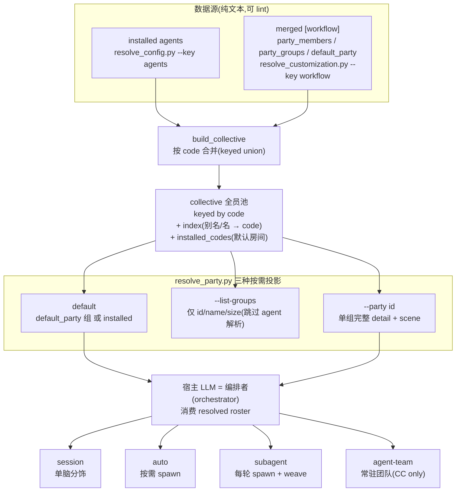

# 11. 多智能体编排 — Party Mode

> 一句话定位:Party Mode 是 BMAD 在**技能层**实现的多智能体编排——它把多个 installed agent 与自定义 persona 凑成一场"派对"圆桌,由确定性脚本 `resolve_party.py` 按 `code` 把两者合并成一个 collective(全员池),再按需投影成名册交给宿主 LLM 编排;四种 `party_mode`(session / auto / subagent / agent-team)声明了"谁来发声",而编排本身是写给宿主 LLM 的指令,不是运行时调度器。

## 11.1 心智模型:剧组而非调度器

读 Party Mode 的源码前,先立一个心智模型:**它不是一个 agent 调度器,而是一个"剧组"**。

- **collective(全员池)**= 演员库。每个 member 有一个 `code`(选角用的小名),installed agent 与 custom member 都进这个池子,同 `code` 的 custom 覆盖 installed。
- **party_groups(命名场次)**= 剧目。每个 group 有一个 `id`,从池子里点 `members`(一串 code)组成一个"房间";也可以不点人,留一个 `scene` 让模型临场选角(open-cast)。
- **scene(舞台说明)**= 自由文本的舞台指示:谁三杯下肚、谁跟谁不对付、谁最爱拷问。同一拨人配不同 scene 就是不同的房间。
- **party_mode(演出形式)**= 谁来发声:`session` 单脑分饰、`subagent` 每轮 spawn 真 agent 再 weave、`agent-team` 常驻团队直接互怼、`auto` 两者按需混搭。
- **resolve_party.py**= 选角导演。它不跑 agent,只把"这一场该谁上、什么氛围"解析成一份 JSON roster,交给宿主 LLM 这个"导演"去演。

关键在于:选角(合并、覆盖、投影)是**确定性 Python 逻辑**,而演出(怎么说话、谁先谁后、要不要 spawn)是**写给 LLM 的声明式指令**。这条分界线正是 BMAD 范式的缩影——把不该让 LLM 自由发挥的逻辑下沉成脚本,把该它发挥的留给 SKILL.md 的 prose(见 [第 8 章](../第二部分-核心系统篇/08-确定性解析核-Python约束LLM.md))。



## 11.2 源码走读

### 11.2.1 激活:解析名册,消费而非推导

Party Mode 的入口在 `SKILL.md`。激活流程的第 4 步明确要求宿主 LLM **调用脚本拿名册,而不是自己推导**:

> `src/core-skills/bmad-party-mode/SKILL.md:13`
>
> ```
> - **Scripts** (run via `uv run`): `{project-root}/_bmad/scripts/resolve_customization.py` resolves `{workflow.*}`; `{skill-root}/scripts/resolve_party.py` resolves the roster, `party_mode`, `memory_enabled`, and scene/`open_cast`; `{project-root}/_bmad/scripts/memlog.py` reads/writes per-party memory.
> ```

三个脚本各司其职:`resolve_customization.py` 做三层合并(见 [第 7 章](../第二部分-核心系统篇/07-定制化与三层合并.md)),`resolve_party.py` 在合并结果之上解析名册,`memlog.py` 读写记忆。LLM 只消费它们的 JSON 输出——这是 BMAD 把确定性逻辑从 LLM 手里夺过来的标准手法。

`SKILL.md` 开篇一句话就把宿主 LLM 钉在"编排者"的位置上:

> `src/core-skills/bmad-party-mode/SKILL.md:8`
>
> ```
> Run a round-table where these agents talk to each other and to the user like real, distinct people in conversation. You're the orchestrator.
> ```

"编排者"(orchestrator)这个词是整章的题眼:它负责让派对发生,但派对里"谁说话、说什么"由 persona 与 scene 驱动,编排者只做调度与 weave。

### 11.2.2 build_collective:按 code 合并的 keyed union

`resolve_party.py` 的核心是 `build_collective`——把 installed agents 与 custom `party_members` 合并成一个按 `code` 索引的全员池:

> `src/core-skills/bmad-party-mode/scripts/resolve_party.py:94`
>
> ```python
> def build_collective(agents: dict, party_members: list):
>     """One pool keyed by code. Custom members override matching installed agents.
>
>     Returns (collective, index, installed_codes):
>       * collective — every member (installed + custom), the pool groups draw
>         from and the orchestrator can summon by name.
>       * index — maps every resolvable token (code, prefix-stripped alias,
>         lower-cased name) to a canonical code.
>       * installed_codes — the codes occupying an installed-agent slot, in
>         order. This is the DEFAULT room: installed agents (with any custom
>         override applied in place), and NOT the pure-custom additions. So
>         shipping or defining custom members grows the pool without crowding
>         the default party.
>     """
> ```

注意三件返回物的分工:`collective` 是池子本身;`index` 是一个"宽容的查找表",把 `code`、去前缀的别名、小写的 `name` 都映射到同一个 canonical code——这让用户用 `analyst` 或 `Analyst` 都能 summon 到同一个人;`installed_codes` 则单独记住"哪些 code 占着 installed 槽位",它定义了**默认房间**。

合并规则在 custom member 的循环里具象化——同 `code` 覆盖,新 `code` 追加但不挤进默认房间:

> `src/core-skills/bmad-party-mode/scripts/resolve_party.py:134`
>
> ```python
>     for m in party_members or []:
>         code = m.get("code")
>         if not code:
>             continue
>         # A custom member overrides an installed agent it matches by code/alias/name.
>         canonical = index.get(code) or index.get(code.lower()) or code
>         entry = {"code": canonical, "source": "custom"}
>         for field in ("name", "icon", "title", "persona", "capabilities", "model"):
>             if m.get(field) is not None:
>                 entry[field] = m[field]
>         entry.setdefault("name", canonical)
>         register(canonical, entry)
>         # An override keeps the installed slot; a brand-new custom does not join it.
> ```

设计动机有三层。其一,`canonical = index.get(code) or ...` 让一个 custom member 能用它自己的短 `code`(如 `analyst`)覆盖 installed 的长 code(如 `bmad-agent-analyst`)——靠的是下面这个别名归一化函数:

> `src/core-skills/bmad-party-mode/scripts/resolve_party.py:86`
>
> ```python
> def _alias(code: str) -> str:
>     """Short alias for an installed agent code: bmad-agent-analyst -> analyst."""
>     for prefix in ("bmad-agent-", "bmad-"):
>         if code.startswith(prefix):
>             return code[len(prefix):]
>     return code
> ```

其二,覆盖是"就地替换"——`register(canonical, entry)` 用同一个 canonical code 重写 `collective` 里的槽位,所以 custom member **保留 installed 槽位**,默认房间里这个位置就换了张脸。其三,全新的 custom code 不进 `installed_codes`,于是它进了池子(能被 group 点名、能被 summon),却**不挤进默认房间**——这正是 `customize.toml` 里那句"the default room stays installed-only; a custom member shows up when a group uses them or you summon one by name"的代码依据。这套 keyed union 与 [第 7 章](../第二部分-核心系统篇/07-定制化与三层合并.md)三层合并的"匹配 key 替换、新 key 追加"是同一条纪律:

> `src/core-skills/bmad-party-mode/customize.toml:11`
>
> ```
> # --- Configurable below. Overrides merge per BMad structural rules: ---
> #   scalars: override wins • plain arrays: append
> #   arrays of tables keyed by `code`/`id`: matching key replaces, new keys append
> ```

### 11.2.3 三种投影:按需裁剪,不加载用不到的东西

`resolve_party.py` 的 `main` 不是一次性吐出全部名册,而是按调用参数做**三种投影**,只解析当下需要的部分。最便宜的 `--list-groups` 直接跳过昂贵的 installed-agent 解析:

> `src/core-skills/bmad-party-mode/scripts/resolve_party.py:228`
>
> ```python
>     # Group menu never needs the (more expensive) installed-agent resolve.
>     if args.list_groups:
>         _emit({
>             "party_mode": party_mode,
>             "default_party": default_party,
>             "groups": group_menu(groups),
>         })
>         return
> ```

`group_menu` 只返回每个 group 的 `id`/`name`/`member_count`(无 `members` 的标 `open_cast: true`)——一个"挑哪个房间"的廉价菜单,不泄露任何 member 细节。

默认调用(无 flag)返回的是"入场该加载的活跃名册":配了 `default_party` 就解析那个 group,否则就是 installed agents:

> `src/core-skills/bmad-party-mode/scripts/resolve_party.py:249`
>
> ```python
>     # Default: the active roster to load on entry.
>     result = {"party_mode": party_mode, "groups": group_menu(groups),
>               "installed_agents_resolved": agents_ok}
>     g = find_group(groups, default_party) if default_party else None
>     if g is not None:
>         result.update(group_detail(g, collective, index))
>     else:
>         # No default group: the installed agents (custom additions stay in the
>         # pool but don't crowd the default room), exactly like a plain install.
>         result.update({"active": "installed",
>                        "members": [collective[c] for c in installed_codes],
>                        "memory_enabled": party_memory})
>     _emit(result)
> ```

注意 `installed_agents_resolved: agents_ok` 这个标志——installed agent 解析失败时它为 `false`,`SKILL.md` 要求 LLM 据此告知用户、用返回的东西将就、临场即兴。这是 BMAD 的容错哲学:脚本失败不阻断,降级到 LLM 的 improvisation。

`--party <id>` 才会展开某个 group 的完整 detail,而 `scene` 只在这里浮现:

> `src/core-skills/bmad-party-mode/scripts/resolve_party.py:197`
>
> ```python
>     raw_members = g.get("members", []) or []
>     members, unresolved = resolve_members(raw_members, collective, index)
>     detail = {"active": g["id"], "name": g.get("name", g["id"]),
>               "members": members, "unresolved": unresolved,
>               "memory_enabled": bool(g.get("memory", False))}
>     if g.get("scene"):
>         detail["scene"] = g["scene"]
>     if not raw_members:
>         detail["open_cast"] = True
>     return detail
> ```

`scene` 是 freeform 的舞台说明,**只在某个 group 成为活跃名册时才返回**,菜单里绝不出现——因为它只在"这一场要怎么演"时才相关。`unresolved` 把 group 里点不到的 code 原样返回,同样交给 LLM 临场处理而非报错。

### 11.2.4 named-set 与 scene:定义一次,复用多次

Party Mode 的"命名分组"在 `customize.toml` 里以 `[[workflow.party_groups]]` 表数组落地,`id` 是 key。仓库自带一个 "Code Review Crew":

> `src/core-skills/bmad-party-mode/customize.toml:170`
>
> ```
> [[workflow.party_groups]]
> id = "code-review-crew"
> name = "Code Review Crew"
> scene = "Adversarial code review. Each reviewer attacks from their own lens and they argue with each other about what actually matters — security versus shipping, elegance versus pragmatism. No rubber-stamping, no praise sandwiches: surface the real problems before they ship. Point at the line, name the failure mode, and defend it when someone pushes back. Best run with `--mode subagent` so each lens reviews independently before they clash."
> members = ["sec-hawk", "adversary", "edge-hunter", "craftsman", "shipper"]
> memory = false  # each review stands on its own; flip to true to remember past reviews
> ```

这个 group 把五个 custom member(`sec-hawk` 等,定义在同文件 `[[workflow.party_members]]` 段)点成一个对抗式评审房间。`scene` 是一行自由文本,告诉房间"这是对抗式评审、各自从自己的镜头攻、互相争论什么才要紧"——没有固定词汇,模型读了就演。`members` 留空则是 open-cast:scene 命名一个池子(如"Star Wars Rebels 宇宙里的人物按情境登场"),模型临场选角。

`create-party.md` 把这套 named-set + scene 模型讲得最清楚——它定义了"创作一个派对"产出的三样东西:

> `src/core-skills/bmad-party-mode/references/create-party.md:7`
>
> ```
> Sparse `[workflow]` override entries for `bmad-party-mode`:
>
> - `[[workflow.party_members]]` — one per persona: `code`, `name`, `icon`, `title`, `persona`, optional `capabilities`, optional `model`.
> - `[[workflow.party_groups]]` — when the personas form a named room: `id`, `name`, an optional freeform `scene`, `members` (codes), and `memory` (`true`/`false`). `members` is optional: leave it off for an open-cast room whose `scene` names a pool the model casts from on the fly. `memory` is whether the group remembers across sessions; ask the user when they don't say, default `false`.
> - `default_party` — set only if the user wants this group to load by default.
>
> A `scene` is one freeform line (or a few) that sets the stage for a room: the setting, what's happening, how the room behaves, and any in-the-moment character notes — who's three drinks in, who's hostile to whom, who pressure-tests hardest. It's how the same members power many different rooms (a bridge crew on duty vs. the same crew off-duty in the lounge vs. a hostile buyer panel). Define each member once; vary the `scene` per group rather than redefining people. There's no fixed vocabulary — write it plainly and the model plays it.
> ```

设计动机:把"人"和"房间"解耦。member 定义一次(voice、ethos、quirks),丢进不同的 group + scene 就能演不同的戏——同一拨 bridge crew,值班时是一个房间,下班 lounge 里是另一个,面对 hostile buyer 又是一个。这是 named-set 复用的精髓:`code`/`id` 是稳定锚点,`scene` 是可变的舞台层。`create-party.md` 还强调 `persona` 字段才是"整场游戏的全部"——扁平的 title 只产生扁平的声音,细节才让一个 member 在桌上"蒙眼也认得出是谁"。

### 11.2.5 模式四态:谁来发声

`party_mode` 决定派对怎么"发声"。`SKILL.md` 把四种模式声明为一份指令表:

> `src/core-skills/bmad-party-mode/SKILL.md:41`
>
> ```
> Use `{workflow.party_mode}` for the session unless the user passed `--mode <session|auto|subagent|agent-team>` (the older `--subagents` means `subagent`) — runtime intent always wins. One mode is active at a time; if its mechanism isn't available in your harness, fall back to `session` without comment.
>
> - **`session`** — voice every persona inline, one mind behind every voice. The floor every other mode degrades to; needs no extra instructions.
> - **`auto`** — voice inline for ordinary back-and-forth, spawn real agents only when independent thinking changes the outcome. Load `references/mode-auto.md` for that call; when it says to spawn, follow `references/mode-subagent.md`.
> - **`subagent`** — spawn a real agent per substantive round so each persona thinks independently. Load `references/mode-subagent.md`, favor faster cheaper models if available for each subagent.
> - **`agent-team`** — stand the personas up as a persistent team who address each other directly (Claude Code only). Load `references/mode-agent-team.md`.
> ```

注意两个要点:其一,"runtime intent always wins"——`--mode` 覆盖配置,这是把"会话级意图"置于"持久配置"之上的设计;其二,模式不可用时静默降级到 `session`——`session` 是所有模式的"地板",需要零额外指令,任何宿主都能跑。这保证了 Party Mode 在没有 spawn 能力的宿主(如纯 Cursor)上也不崩,只是退化为单脑分饰。

`auto` 模式把"什么时候该 spawn"也下沉成一份可判定的判据,而不是交给 LLM 临场拍脑袋:

> `src/core-skills/bmad-party-mode/references/mode-auto.md:7`
>
> ```
> Spawn independent agents when divergent, uncolored thinking is the value of the round:
>
> - A genuine evaluation, review, or critique — the kind that fails if one mind voices every side and they drift into agreement (code review, red-team, a hard look at a plan).
> - The personas would plausibly reach *different* conclusions, and that divergence is the point.
> - The user asked someone to dig in, analyze, or research — depth earned by a direct ask.
>
> Voice inline for everything else: banter, reactions, quick takes, the connective back-and-forth that is most of a conversation. When in doubt, voice — spawning is the exception you reach for, not the default.
> ```

判据的核心是"独立性是否改变结论"——评审、红队、深挖这类"一个脑子扮两边会漂移成共识"的轮次才 spawn,其余闲聊、反应、串联都 inline。"when in doubt, voice" 把 spawn 定义为例外而非默认,既省成本又保住了对话的流动性。

`subagent` 模式最体现 Party Mode 的编排张力:每个 persona 由独立 agent 思考,但它们彼此看不见,编排者要把并行回回复 weave 成一段对话:

> `src/core-skills/bmad-party-mode/references/mode-subagent.md:14`
>
> ```
> Each agent saw only the user's message and the context you handed it, so left raw they reply in parallel and never to one another. Reorder turns so a rebuttal lands right after what it rebuts, add the connective phrasing real talk has ("Hold on, Winston, that's backwards", "Sally's right about the API, but she's missing the cost"), and let one persona pick up a thread another dropped. Never change what an agent argued — weave delivery, preserve substance.
> ```

"weave delivery, preserve substance"是 subagent 模式的宪法:编排者可以重排顺序、加串联词、让一个人接另一个人的话头,但**绝不能改写 agent 实际论证的内容**。这是把"编排"和"执行"划清边界——编排者负责织出一段自然的对话,substance 留给独立思考的 agent。同文件还强调"trust their thinking, hold the form":约束长度和立场(别写成报告、要回应刚才的话),但别用 do/don't 清单去脚本化它们的推理——"约束推理会杀死它"。

`agent-team` 模式则把编排者的角色从"weaver"换成"host",因为成员现在直接互怼、不再需要事后缝合:

> `src/core-skills/bmad-party-mode/references/mode-agent-team.md:3`
>
> ```
> Active when `{workflow.party_mode}` resolves to `agent-team` (or a `--mode agent-team` override). Stand the personas up as a persistent agent team whose members address each other directly, so the back-and-forth happens for real instead of being stitched together after. Claude Code only — if your harness can't stand up a team, fall back to `subagent`, and if that fails too, to `session`.
>
> Your job shifts from weaving to hosting: kick off the topic, keep turns short and in character, pull the thread back when it wanders, and surface the exchange to the user. Voice, brevity, and clash still hold.
> ```

`agent-team` 是 Claude Code 专属——它依赖宿主能立起一个常驻、成员可直接对话的 agent 团队(对应 Claude Code 的 subagent/team 能力)。不可用时降级链是 `agent-team → subagent → session`。模式之间不是平行的功能选择,而是一条"独立性递增、宿主依赖递增"的光谱:`session` 零依赖单脑分饰,`subagent` 每轮独立思考但需事后 weave,`agent-team` 真实互怼但需要常驻团队运行时。

## 11.3 设计决策与权衡

**1. 选角下沉为确定性脚本,LLM 只消费 resolved roster。** `build_collective` 的合并、覆盖、别名归一化全是 Python 逻辑,LLM 不重新推导"谁在池子里、谁覆盖了谁"。这与 [第 8 章](../第二部分-核心系统篇/08-确定性解析核-Python约束LLM.md)确定性解析核一脉相承——把"事实的合并"交给脚本,把"如何说话"交给 LLM。代价是脚本要自己处理 failure(`agents_ok=False`),靠 LLM 的 improvisation 兜底。

**2. 按需投影(lazy projection)。** 三种调用形态(default / `--list-groups` / `--party`)各只解析当下需要的部分:菜单跳过昂贵的 installed-agent 解析,默认名册只返回活跃房间 + 其他 group 的名字,`scene` 只在单组 detail 里浮现。代价是调用方要分多次拉取不同粒度的信息,换来的是"不把用不到的 member detail 灌进上下文"——在 token 即成本的 LLM 场景里,这是正确的取舍。

**3. `code`/`id` 作为 override 锚点。** custom member 同 `code` 就地覆盖 installed agent(保留槽位),新 `code` 进池但不挤默认房间。这让"重塑已有 persona"和"新增 persona"用同一条 merge 规则表达,且默认房间始终是 installed-only——shipped custom member(如 Code Review Crew)"不召唤不上桌,零成本"。这条 keyed-union 纪律与三层定制化([第 7 章](../第二部分-核心系统篇/07-定制化与三层合并.md))完全同构。

**4. 模式在技能层声明,运行时降级。** 四种 `party_mode` 是 `SKILL.md` 里的 prose 指令,不是运行时调度原语。`agent-team` 依赖宿主的常驻团队能力,不可用时沿 `agent-team → subagent → session` 静默降级。这换来的是跨宿主可移植性(Party Mode 在任何宿主上至少能以 `session` 跑),代价是"模式是否真的生效"取决于宿主诚实执行 SKILL.md 指令——BMAD 没有 runtime 去强制它,只能靠声明式约束。

## 11.4 与 Claude Code harness 的对照

Claude Code 的多智能体编排是**运行时层**的 Coordinator-Worker:`Task` 工具 / subagent 是编译进二进制的原语,harness 负责 spawn 隔离的 agent 进程、管理其生命周期与工具权限、聚合结果。编排的"调度器"住在运行时里,Coordinator 的原则是"编排但不执行"——协调者把活派给 worker,自己不做实质工作。

BMAD 的 Party Mode 把编排抬到**技能层**,呈现出镜像般的差异。其一,`resolve_party.py` 是确定性解析器,不是调度器——它不 spawn 任何 agent,只产出一份"这一场谁上、什么氛围"的 JSON roster;真正的"调度"是宿主 LLM 读 SKILL.md 指令后自行完成的。其二,即便 `subagent`/`agent-team` 模式真的 spawn 了 agent,那也是宿主 LLM 调用**自己的原生 subagent 能力**,BMAD 只贡献名册解析与对话纪律(weave/host 规则),不拥有 agent 生命周期。其三,`session` 模式恰恰是 Coordinator-Worker 的反例——编排者**既编排又执行**,一个脑子分饰所有声音;这是 BMAD 在无运行时 spawn 能力时的合理退化,也是它"没有自己的运行时"这一范式特征的直接体现。

一句话概括差异:Claude Code 的 harness 编排"agent 如何运行"(生命周期、隔离、工具);BMAD 的 harness 编排"哪些 persona 上桌、怎么对话"(名册、scene、声音纪律)。前者用二进制里的调度器约束运行,后者用 Markdown + TOML + Python 约束行为——这正是 [前言](../00-前言与范式总论.md) 所说的"两种 harness"在多智能体场景下的具体投影。

## 11.5 小结

Party Mode 是 BMAD 多智能体编排的唯一入口:它用 `resolve_party.py` 把 installed agents 与 custom members 按 `code` 合并成 collective,用 `party_groups` 的 named-set + scene 把人组织成可复用的房间,用四种 `party_mode` 声明"谁来发声"。整套编排的确定性部分(合并、覆盖、投影)下沉为 Python 脚本,灵活性部分(怎么说话、要不要 spawn、如何 weave)留给 SKILL.md 的 prose 指令——这条分界线是 BMAD 范式在编排场景的标准切法。与 Claude Code 运行时层的 Coordinator-Worker 相比,BMAD 的编排发生在技能层:它不 spawn、不拥有 agent 生命周期,只产出名册与对话纪律,把真正的执行让渡给宿主。

下一章 → [12. 意图捕获与 Spec 契约](../第三部分-高级模式篇/12-意图捕获与Spec契约.md)
