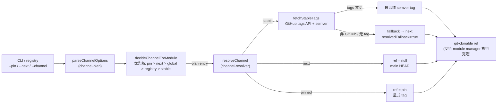

# 05. 渠道与版本解析

> 一句话定位:本章讲安装器在**克隆一个模块之前**如何决定"拉哪个 ref"——把这件本可揉进安装流程的事,显式建模成一层纯函数式的"渠道解析",让分发策略可单测、可缓存、可审计。

## 5.1 心智模型:渠道 = 一种解析策略

BMAD 的模块来自 GitHub 仓库,而一个仓库同时存在很多可拉取的 ref:`main` 分支的 HEAD、一串 `v1.7.0`/`v1.6.2` 的 tag、甚至 `v2.0.0-rc.1` 这样的预发布。"到底拉哪一个"如果交给安装流程顺手决定,就会和 `git clone` 物理动作搅在一起,既难测、也难复现。

BMAD 的做法是把这件事拆成两个纯模块:

- **`channel-plan`** 回答"用哪种**策略**":对每个模块给出一个 plan entry——`stable` / `next` / `pinned`,并附带这个决定"来自哪里"(`flag:--pin` / `registry` / `default`)。
- **`channel-resolver`** 回答"这个策略**解析成哪个 ref**":把 plan entry 翻译成 `git clone --branch <ref>` 能直接吃的引用,或 `null`(表示拉 HEAD)。

`stable` / `next` / `pinned` 三种渠道,本质是三种"解析策略":

| 渠道 | 解析策略 | 产物 ref |
|---|---|---|
| `stable` | 取最高纯 semver tag(排除 prerelease) | `v1.7.0` 这类 tag |
| `next` | 拉 main 分支 HEAD | `null`(即不带 `--branch`) |
| `pinned` | 用用户显式指定的 tag | 用户给的 tag |

策略选定后,才轮到 `version-resolver` 干另一件相关但相反的事——**从磁盘元数据反推"实际装上的版本是什么"**,供升级检测与日志汇报使用。



这张图也点出了本章的核心张力:**"决定策略"和"解析 ref"是两个独立的纯阶段,中间隔着一条 plan entry 的数据契约。** 克隆动作(改文件系统、拉网络)被刻意推到这两个阶段之外。

## 5.2 源码走读:channel-resolver —— 解析策略的纯函数实现

### 5.2.1 parseGitHubRepo:双格式 URL 归一

`channel-resolver.js` 开宗明义,在文件头注释里声明自己是 pure 的——"no prompts, no git, no filesystem",只与 GitHub tags API 和 semver 数学打交道。第一块真正干活的代码是 URL 解析:

> `tools/installer/modules/channel-resolver.js:29`
>
> ```js
> function parseGitHubRepo(url) {
>   if (!url || typeof url !== 'string') return null;
>   const trimmed = url
>     .trim()
>     .replace(/\.git$/, '')
>     .replace(/\/$/, '');
>
>   // https://github.com/owner/repo
>   const httpsMatch = trimmed.match(/^https?:\/\/github\.com\/([^/]+)\/([^/]+)(?:\/.*)?$/i);
>   if (httpsMatch) return { owner: httpsMatch[1], repo: httpsMatch[2] };
>
>   // git@github.com:owner/repo
>   const sshMatch = trimmed.match(/^git@github\.com:([^/]+)\/([^/]+)$/i);
>   if (sshMatch) return { owner: sshMatch[1], repo: sshMatch[2] };
>
>   return null;
> }
> ```

同时接纳 HTTPS 与 SSH 两种写法、并先剥掉 `.git` 后缀和尾斜杠——因为注册表里模块的 `repo` 字段写法不可控。返回 `null` 而非抛错是刻意的:`null` 是一个可被上层用来走 fallback 的信号(见 5.2.4),把"无法解析"当成普通数据而非异常,是纯函数风格的典型选择。

### 5.2.2 normalizeStableTag:排除 prerelease

`stable` 渠道承诺的是"最高纯 semver tag",而"纯"意味着拒绝 `-alpha`/`-beta`/`-rc` 这类预发布:

> `tools/installer/modules/channel-resolver.js:86`
>
> ```js
> function normalizeStableTag(tagName) {
>   if (typeof tagName !== 'string') return null;
>   const stripped = tagName.startsWith('v') ? tagName.slice(1) : tagName;
>   const valid = semver.valid(stripped);
>   if (!valid) return null;
>   // Exclude prereleases. semver.prerelease returns null for pure releases.
>   if (semver.prerelease(valid)) return null;
>   return valid;
> }
> ```

先剥前导 `v`(`v1.7.0` → `1.7.0`),再 `semver.valid` 校验,最后用 `semver.prerelease` 把任何含预发布标识的 tag 过滤掉。这一步是 `stable` 渠道语义的根基——它保证走 stable 的人永远不会被一个 `-rc` tag"升级"走。返回值是清洗后的 version 字符串,而原始 tag 名(`v1.7.0`)在调用处另行保留,因为 `git clone --branch` 需要原始 ref 名。

### 5.2.3 fetchStableTags:进程内缓存 + 降序排序

拿到 owner/repo 后,真正去打 GitHub tags API 的是 `fetchStableTags`:

> `tools/installer/modules/channel-resolver.js:104`
>
> ```js
> async function fetchStableTags(owner, repo, { timeout } = {}) {
>   const cacheKey = `${owner}/${repo}`;
>   if (tagCache.has(cacheKey)) return tagCache.get(cacheKey);
>
>   // GitHub returns up to 100 tags per page; one page is plenty for our modules.
>   const url = `${GITHUB_API_BASE}/repos/${owner}/${repo}/tags?per_page=100`;
>   const raw = await fetchJson(url, { timeout });
>   if (!Array.isArray(raw)) {
>     throw new TypeError(`Unexpected response from ${url}`);
>   }
>
>   const stable = [];
>   for (const entry of raw) {
>     const version = normalizeStableTag(entry?.name);
>     if (version) stable.push({ tag: entry.name, version });
>   }
>   stable.sort((a, b) => semver.rcompare(a.version, b.version));
>
>   tagCache.set(cacheKey, stable);
>   return stable;
> }
> ```

三个设计点值得注意:其一,`tagCache` 是模块级的 `Map`,以 `owner/repo` 为键——一次安装里多个模块若来自同一仓库(或同一模块被反复 resolve),只打一次 API。其二,只取一页 100 条,注释直说"对我们的模块够用了",这是用领域知识换掉分页复杂度的务实取舍。其三,结果按 `semver.rcompare` 降序排好,调用方取 `[0]` 即最高版本——把"取最高"这件语义明确的事固化在数据结构里,而非让每个调用方各自排序。

### 5.2.4 resolveChannel:三种渠道与 fallback 语义

`resolveChannel` 是整个模块的枢纽,把 plan entry 翻译成 git ref。先看 `next` 与 `pinned` 这两个"无需外部查询"的分支:

> `tools/installer/modules/channel-resolver.js:144`
>
> ```js
> async function resolveChannel({ channel, pin, repoUrl, timeout }) {
>   if (channel === 'pinned') {
>     if (!pin) throw new Error('resolveChannel: pinned channel requires a pin value');
>     return { channel: 'pinned', ref: pin, version: pin, resolvedFallback: false };
>   }
>
>   if (channel === 'next') {
>     return { channel: 'next', ref: null, version: 'main', resolvedFallback: false };
>   }
> ```

`next` 渠道直接返回 `ref: null`——`git clone` 不带 `--branch` 就是拉默认分支 HEAD。这里把"渠道=一种解析策略"具象成一个纯数据返回值,克隆逻辑留给调用方,resolver 因此可单测、无副作用。`pinned` 则要求必须带 `pin` 值,否则抛错(这是合约违反,该 fail-fast)。

`stable` 分支才是真正会打网络的,也是最体现 fallback 设计的地方:

> `tools/installer/modules/channel-resolver.js:154`
>
> ```js
>   if (channel === 'stable') {
>     const parsed = parseGitHubRepo(repoUrl);
>     if (!parsed) {
>       // No GitHub URL — caller must handle by falling back to next.
>       return { channel: 'next', ref: null, version: 'main', resolvedFallback: true, reason: 'not-a-github-url' };
>     }
>
>     try {
>       const tags = await fetchStableTags(parsed.owner, parsed.repo, { timeout });
>       if (tags.length === 0) {
>         return { channel: 'next', ref: null, version: 'main', resolvedFallback: true, reason: 'no-stable-tags' };
>       }
>       const top = tags[0];
>       return { channel: 'stable', ref: top.tag, version: top.tag, resolvedFallback: false };
>     } catch (error) {
>       // Propagate the error; callers decide whether to fall back or abort.
>       error.message = `Failed to resolve stable channel for ${parsed.owner}/${parsed.repo}: ${error.message}`;
>       throw error;
>     }
>   }
> ```

注意两条 fallback 路径的区别:URL 不可解析、或解析出空 tag 列表时,resolver **不抛错**,而是返回一个 `channel:'next'` 的结果并打上 `resolvedFallback: true` 加 `reason`——把降级这件事做成可观测的数据,让调用方知情后自行决定是否接受。但 `fetchStableTags` 抛出的网络/API 错误(如 403 限流)被原样上抛:这是"环境性故障"而非"语义性空缺",不该被悄悄降级。`stable` 与 `next` 的边界,就划在"能不能从仓库读出有效 tag"这一行上。

### 5.2.5 tagExists:克隆前的预校验

`--pin` 给的 tag 是否真实存在?如果直接交给 `git clone`,用户要等完一次完整克隆才知道 tag 写错了。`tagExists` 用一次轻量 API 调用提前校验:

> `tools/installer/modules/channel-resolver.js:182`
>
> ```js
> async function tagExists(owner, repo, tagName, { timeout } = {}) {
>   const url = `${GITHUB_API_BASE}/repos/${owner}/${repo}/git/refs/tags/${encodeURIComponent(tagName)}`;
>   try {
>     await fetchJson(url, { timeout });
>     return true;
>   } catch (error) {
>     if (error.statusCode === 404) return false;
>     throw error;
>   }
> }
> ```

打的是 `/git/refs/tags/<tag>` 这个轻量端点,而非拉整个 tag 列表。关键是错误分流:`404` 是"tag 不存在"的正常语义,翻译成 `false`;其他状态码(网络错、限流)才上抛。把"不存在"从异常空间搬回布尔空间,调用方就能用 `if (!await tagExists(...))` 自然地校验,而不用 try/catch 一段本不该是异常的分支。

### 5.2.6 classifyUpgrade:语义化升级分类

装完之后要判断"这是一次 patch / minor / major 升级吗",供日志和升级提示使用:

> `tools/installer/modules/channel-resolver.js:201`
>
> ```js
> function classifyUpgrade(currentVersion, newVersion) {
>   const current = semver.valid(semver.coerce(currentVersion));
>   const next = semver.valid(semver.coerce(newVersion));
>   if (!current || !next) return 'unknown';
>   if (semver.lte(next, current)) return 'none';
>   const diff = semver.diff(current, next);
>   if (diff === 'patch') return 'patch';
>   if (diff === 'minor' || diff === 'preminor') return 'minor';
>   if (diff === 'major' || diff === 'premajor') return 'major';
>   // prepatch, prerelease — treat conservatively as minor (prereleases shouldn't
>   // normally surface here since stable channel filters them out).
>   return 'minor';
> }
> ```

先用 `semver.coerce` 把可能带前缀、带额外字符的版本串"榨"出 semver,榨不出来就归 `unknown`(注释建议调用方按 major 对待,保守处理)。`semver.lte` 先拦掉"没升级甚至降级"的情况归 `none`——降级在这里和"无变化"等同对待,因为分类的目的是"要不要提醒用户这是一次破坏性升级",降级不在此列。最末把 `prepatch`/`prerelease` 也归 `minor`,注释点明:走 stable 渠道时这些本不该出现,这里只是兜底。

## 5.3 源码走读:channel-plan —— 策略决策与优先级

### 5.3.1 pinned 是合成的渠道

`channel-plan` 同样在文件头声明 pure。一个容易被忽略的细节藏在常量定义里:

> `tools/installer/modules/channel-plan.js:18`
>
> ```js
> const VALID_CHANNELS = new Set(['stable', 'next']);
> ```

合法渠道集合只有 `stable` 和 `next`——`pinned` 不在其中。这是因为 `pinned` 不是一个用户能用 `--channel pinned` 选到的"模式",而是 `--pin CODE=TAG` 触发后**合成**出来的渠道。把"显式指定 tag"建模成一种由具体 flag 派生的合成状态,而非与 stable/next 平起平坐的选项,体现了"显式优先于策略"的语义层级。

### 5.3.2 parseChannelOptions:冲突检测与重复收集

CLI 标志先被 `parseChannelOptions` 归一成一个结构化对象。全局渠道来自三个可能冲突的别名:

> `tools/installer/modules/channel-plan.js:41`
>
> ```js
>   const distinct = new Set(aliases.map((a) => a.value).filter(Boolean));
>   if (distinct.size > 1) {
>     warnings.push(
>       `Conflicting channel flags: ${aliases
>         .filter((a) => a.value)
>         .map((a) => a.flag + '=' + a.value)
>         .join(', ')}. Using first: ${aliases.find((a) => a.value).flag}.`,
>     );
>   }
>   const firstValid = aliases.find((a) => a.value);
>   if (firstValid) global = firstValid.value;
> ```

`--channel`、`--all-stable`、`--all-next` 三者可能同时出现。这里不抛错,而是检测到冲突时生成一条 warning,并按"第一个有效别名"取值。把歧义降级为可观测的 warning 而非硬中断,与 resolver 的 fallback 哲学一脉相承:让安装尽量往前走,把判断权留给用户读日志。

可重复标志 `--next=CODE` 与 `--pin CODE=TAG` 则分别收进 `Set` 和 `Map`。`--pin` 的解析尤其讲究:

> `tools/installer/modules/channel-plan.js:90`
>
> ```js
> function parsePinSpec(spec) {
>   if (typeof spec !== 'string') return null;
>   const idx = spec.indexOf('=');
>   if (idx <= 0 || idx === spec.length - 1) return null;
>   const code = spec.slice(0, idx).trim();
>   const tag = spec.slice(idx + 1).trim();
>   if (!code || !tag) return null;
>   return { code, tag };
> }
> ```

用 `indexOf('=')` 而非 `split('=')`——因为 tag 名里理论上可以含 `=`(虽然罕见),`split` 会把它截断,而 `slice(idx+1)` 保证 `=` 之后整体作为 tag。`idx <= 0` 排除了无 `=` 或 code 为空,`idx === length-1` 排除了 tag 为空。这种边界处理把"畸形输入"也归到 `null`,由调用方生成 warning 跳过,而非崩溃。

### 5.3.3 decideChannelForModule:五级优先级链

整个 plan 模块的核心是这一段优先级判断:

> `tools/installer/modules/channel-plan.js:110`
>
> ```js
> function decideChannelForModule({ code, channelOptions, registryDefault }) {
>   const { global, nextSet, pins } = channelOptions || { nextSet: new Set(), pins: new Map() };
>
>   if (pins && pins.has(code)) {
>     return { channel: 'pinned', pin: pins.get(code), source: 'flag:--pin' };
>   }
>   if (nextSet && nextSet.has(code)) {
>     return { channel: 'next', source: 'flag:--next' };
>   }
>   if (global) {
>     return { channel: global, source: 'flag:--channel' };
>   }
>   if (registryDefault && VALID_CHANNELS.has(registryDefault)) {
>     return { channel: registryDefault, source: 'registry' };
>   }
>   return { channel: 'stable', source: 'default' };
> }
> ```

五级优先级自上而下:`--pin` > `--next=CODE` > `--channel`(全局) > registry default > `stable`。这个顺序的语义是"越具体越优先":针对单个模块的 pin/next,压过全局 flag,全局 flag 压过注册表里模块自带的 `default_channel`,最后才落到稳定的 `stable` 兜底。每个分支都带 `source` 字段,把"这个决定从哪来"写进返回值——日志和调试因此能精确追溯每个模块的渠道来源。注意 `registryDefault` 还要过一道 `VALID_CHANNELS.has()` 校验:注册表是外部数据,不可信,必须确认它给的是合法渠道才采纳。

### 5.3.4 bundledTargetWarnings:内置模块的边界提醒

`core` / `bmm` 这类模块是**随安装器二进制一起发布**的,没有 git clone 可言,因此对它们用 `--pin`/`--next` 毫无意义:

> `tools/installer/modules/channel-plan.js:179`
>
> ```js
> function bundledTargetWarnings(channelOptions, bundledCodes) {
>   const warnings = [];
>   const bundled = new Set(bundledCodes || []);
>   const hint = '(bundled module; use `npx bmad-method@next install` for a prerelease)';
>   for (const code of channelOptions?.pins?.keys() || []) {
>     if (bundled.has(code)) {
>       warnings.push(`--pin for '${code}' has no effect ${hint}.`);
>     }
>   }
>   for (const code of channelOptions?.nextSet || []) {
>     if (bundled.has(code)) {
>       warnings.push(`--next for '${code}' has no effect ${hint}.`);
>     }
>   }
>   return warnings;
> }
> ```

不报错,只 warning,并顺手给出正确的替代路径——`npx bmad-method@next install`(换安装器自身的渠道,而非给内置模块指定 ref)。这是"渠道"概念在两个层面上的体现:模块有渠道,安装器自身也有渠道(npm 的 `@next`/`@latest`),内置模块的"版本"由后者决定。同类地,`orphanPinWarnings` 提醒那些指向"根本没被选中安装的模块"的 `--pin`/`--next`,同样是只 warning 不中断。

## 5.4 源码走读:version-resolver —— 从磁盘反推已装版本

渠道解析决定"拉哪个 ref",`version-resolver` 干的是反向问题:"装完之后,这个模块实际是哪个版本?" 它从磁盘上的权威元数据里找答案,偏好顺序四级递降:

> `tools/installer/modules/version-resolver.js:24`
>
> ```js
> async function resolveModuleVersion(moduleName, options = {}) {
>   const moduleSourcePath = await normalizeDirectoryPath(options.moduleSourcePath);
>   const packageJsonPath = await findPackageJsonPath(moduleName, moduleSourcePath);
>
>   if (packageJsonPath) {
>     const packageVersion = await readPackageJsonVersion(packageJsonPath);
>     if (packageVersion) {
>       return { version: packageVersion, source: 'package.json', path: packageJsonPath };
>     }
>   }
>
>   const moduleYamlPath = await findModuleYamlPath(moduleName, moduleSourcePath);
>   if (moduleYamlPath) {
>     const moduleVersion = await readModuleYamlVersion(moduleYamlPath);
>     if (moduleVersion) {
>       return { version: moduleVersion, source: 'module.yaml', path: moduleYamlPath };
>     }
>   }
>
>   const marketplaceVersion = await findMarketplaceVersion(moduleName, moduleSourcePath, options.marketplacePluginNames || []);
>   if (marketplaceVersion) {
>     return marketplaceVersion;
>   }
>
>   const fallbackVersion = normalizeVersion(options.fallbackVersion);
>   if (fallbackVersion) {
>     return { version: fallbackVersion, source: 'fallback', path: null };
>   }
>
>   return { version: null, source: null, path: null };
> }
> ```

四级偏好是 `package.json` → `module.yaml` → `.claude-plugin/marketplace.json` → 调用方 fallback。这个顺序反映了"谁最权威":npm 生态的标准 `package.json` 最可信,其次是 BMAD 自己的 `module.yaml`,再次是 IDE 插件市场的 `marketplace.json`(里面可能列了多个 plugin,需要按 name/code 匹配),最后才用调用方给的兜底值。每一级都返回 `source` 和 `path`,和 `decideChannelForModule` 的 `source` 一样,让"版本从哪读出来的"可追溯。

向上搜索不是无界的,`findSearchBoundary` 在遇到项目边界时主动停下:

> `tools/installer/modules/version-resolver.js:182`
>
> ```js
> async function findSearchBoundary(startDir) {
>   let currentDir = normalizedStartDir;
>   for (let depth = 0; depth <= DEFAULT_PARENT_DEPTH; depth++) {
>     if (
>       (await fs.pathExists(path.join(currentDir, 'package.json'))) ||
>       (await fs.pathExists(path.join(currentDir, '.claude-plugin', 'marketplace.json'))) ||
>       (await fs.pathExists(path.join(currentDir, '.git')))
>     ) {
>       return currentDir;
>     }
>
>     const parentDir = path.dirname(currentDir);
>     if (parentDir === currentDir) {
>       break;
>     }
>     currentDir = parentDir;
>   }
>
>   return normalizedStartDir;
> }
> ```

`package.json`、`marketplace.json`、`.git` 三种标记都视为"项目根",向上找元数据时遇到任一即止——防止从一个嵌套子目录一路读到无关的父项目,误把别人的 `package.json` 当成本模块版本。配合 `DEFAULT_PARENT_DEPTH = 8` 的硬上限,构成双重保险。`version-resolver` 是本章三个模块里唯一碰文件系统的,但它仍是"只读探测",不改任何状态。

`marketplace.json` 里一个文件可能声明多个 plugin,`extractMarketplaceVersion` 要按 `name`/`code` 精确匹配,匹配不到则退而取所有有效版本里最高的:

> `tools/installer/modules/version-resolver.js:259`
>
> ```js
> function extractMarketplaceVersion(data, moduleName, marketplacePluginNames = []) {
>   const plugins = Array.isArray(data?.plugins) ? data.plugins : [];
>   if (plugins.length === 0) {
>     return null;
>   }
>
>   const preferredNames = new Set(
>     [moduleName, ...marketplacePluginNames]
>       .filter((value) => typeof value === 'string')
>       .map((value) => value.trim())
>       .filter(Boolean),
>   );
>
>   const exactMatches = [];
>   const fallbackVersions = [];
>
>   for (const plugin of plugins) {
>     const version = normalizeVersion(plugin?.version);
>     if (!version) {
>       continue;
>     }
>
>     fallbackVersions.push(version);
>
>     const pluginNames = [plugin?.name, plugin?.code].filter((value) => typeof value === 'string').map((value) => value.trim());
>     if (pluginNames.some((name) => preferredNames.has(name))) {
>       exactMatches.push(version);
>     }
>   }
>
>   return pickBestVersion(exactMatches.length > 0 ? exactMatches : fallbackVersions);
> }
> ```

两段式:先收集精确匹配(`exactMatches`),同时把所有有效版本存进 `fallbackVersions`;有精确匹配就用精确匹配集合,否则退到全集。`pickBestVersion` 再用 `compareVersionsDescending` 排序取最高——它优先用 semver 比较,semver 不可解析时退到 `localeCompare` 的数值排序,兼容非标版本串。

## 5.5 设计决策与权衡

**1. 解析与克隆分离,把网络副作用关进最小的笼子。** `channel-resolver` 和 `channel-plan` 在文件头都明确写了 "pure. No prompts, no git, no filesystem"。唯一打网络的是 `fetchStableTags`/`tagExists`/`fetchJson`,且都收在 `channel-resolver` 内部;`channel-plan` 连网络都不碰。这让"决定拉哪个 ref"这件充满分支逻辑的事可以脱离 `git clone` 单独单测——你可以构造任意 plan entry 喂给 `resolveChannel`,而不必真的克隆。代价是调用方要负责把返回的 `ref` 喂给真正的克隆器,多一层间接。

**2. fallback 是数据,不是异常。** 无论 stable 渠道遇到"非 GitHub URL"还是"无纯 semver tag",都不抛错,而是返回一个 `channel:'next'`、`resolvedFallback:true`、带 `reason` 的结果。异常只留给环境性故障(网络、限流、403)。这条线划得很清楚:**语义性空缺降级、环境性故障上抛**。好处是安装流程不会因为某个社区模块恰好没打 tag 就中断,且降级可观测;代价是调用方必须主动检查 `resolvedFallback`,否则会"悄悄"拉到 main HEAD。

**3. pinned 是合成的渠道,显式优先于策略。** `VALID_CHANNELS` 只有 `stable`/`next`,`pinned` 由 `--pin` 在 `decideChannelForModule` 里合成,并排在优先级最顶。这把"用户显式指定的 tag"和"系统选的策略"分成两个语义层级——显式压过策略,策略压过默认。同时 `tagExists` 在克隆前预校验 pin 值,用一次轻量 API 换掉一次可能漫长的失败克隆,是"快速失败"原则的体现。

**4. 版本反推四级偏好 + 边界感知搜索。** `version-resolver` 面对"版本可能写在四种不同文件里"的现实,用 `package.json` → `module.yaml` → `marketplace.json` → fallback 的固定偏好顺序消解歧义,并用 `findSearchBoundary` 在项目根处停止向上搜索。这换来的是对多来源元数据的鲁棒性,代价是搜索逻辑较重(`buildSearchRoots` 区分 core/bmm 与外部模块走不同缓存路径)。它也是本章唯一读文件系统的模块,但仍限于只读探测。

## 5.6 与 Claude Code harness 的对照

Claude Code 的"版本"主要由 npm 包版本(`claude-code@latest`/`@next`)和服务端 model routing 决定,用户侧的切换是粗粒度的——`npx` 拉哪个版本就跑哪个版本,ref 的实际解析发生在 npm 发布管线里,不作为一层可单测的纯函数暴露给用户。

BMAD 作为方法论 harness,面对的是"模块来自任意 GitHub 仓库、注册表可声明默认渠道、用户可逐模块 override"的复杂分发场景。它的选择是把"哪个 ref 要被克隆"显式建模成两层纯函数(`channel-plan` 决策 + `channel-resolver` 解析),并通过 `version-resolver` 从磁盘反推已装版本以闭环。这体现了 BMAD 的一贯特质:把本可揉进安装流程、靠副作用顺带完成的逻辑,下沉成可审计、可单测、带 `source` 追溯的解析层。`source` 字段的存在尤其关键——Claude Code 的版本对用户基本是"一个不透明的版本号",而 BMAD 的每个渠道决定和每个版本读数都能回答"它从哪里来"。

## 5.7 小结

渠道与版本解析是安装器在"克隆之前"的一道纯函数关卡:`channel-plan` 用五级优先级把每个模块的决定收敛成一个 plan entry,`channel-resolver` 把它翻译成 git ref 并以 fallback 数据而非异常处理语义空缺,`version-resolver` 则在装完后从磁盘元数据反推实际版本。三者共同把"分发策略"从 `git clone` 的副作用里剥离出来,可单测、可缓存、可追溯。这一层解析出的 ref,最终要交给安装引擎去真正落地到磁盘——那是下一章的话题。

下一章 → [06. 技能系统 — 双手](06-技能系统-双手.md)
