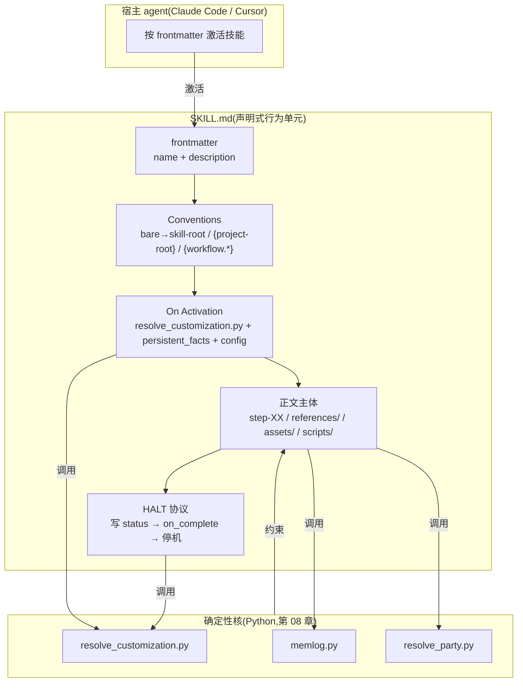
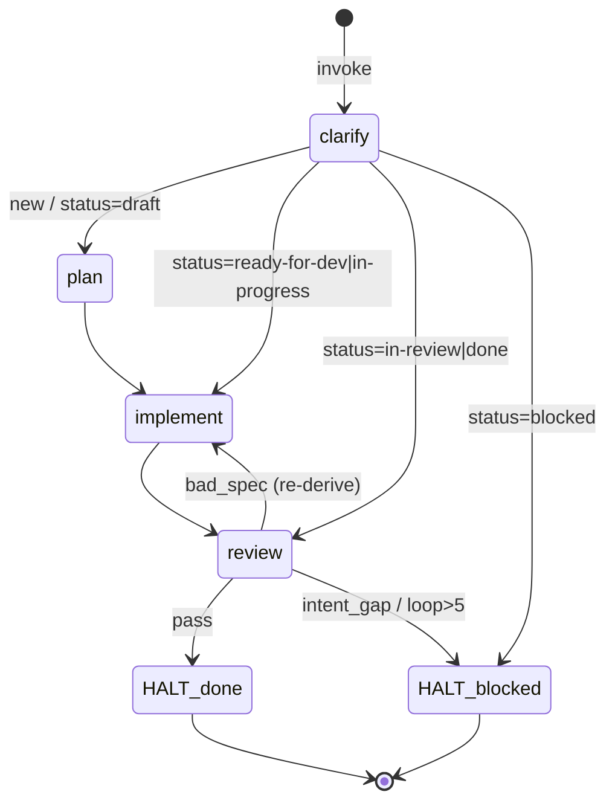

# 06. 技能系统 — 双手

> 安装器把 harness 落到磁盘(第 02、04 章),模块系统打包它的基因(第 03 章)。当宿主 agent 真正"动手"做事时,驱动它的就是技能——`SKILL.md` 这一份声明式行为单元。本章解剖 `SKILL.md` 的统一骨架,并以三种形态对照说明它如何成为 BMAD 约束 LLM 的主载体。

## 6.1 一句话定位

**技能(SKILL)是 BMAD 约束宿主 LLM 的主载体**:一份带 frontmatter 的 Markdown,声明"激活时做什么、按什么步骤做、调用哪些确定性脚本、在哪里停机"。它不跑循环——宿主 agent 跑——但它把不该让 LLM 自由发挥的逻辑(配置合并、名册解析、记忆追加、状态路由)下沉为脚本调用与显式协议,从而把方法论"焊"进宿主的行为里。前言里说"双手",正是指:技能是 harness 伸进宿主、操作世界的那双手。

## 6.2 心智模型:技能是一张"激活即执行的剧本"

Claude Code 自带 skill 系统——`SKILL.md` 的 frontmatter(`name` + `description`)就是宿主识别并按需激活技能的契约。BMAD 没有另造运行时,而是**复用这套宿主机制**,在 `SKILL.md` 正文里塞进一套远比普通技能更重的"方法论剧本":

- **frontmatter**(`name` / `description`):激活契约,告诉宿主"何时唤起我"。
- **Conventions**:路径解析约定——bare path 从 skill root 解析,`{project-root}` 前缀从工程目录解析,`{workflow.<name>}` 从 `customize.toml` 解析。
- **On Activation**:确定性启动序列——调 `resolve_customization.py` 合并三层定制、加载 `persistent_facts`、读 `config.yaml`、(可选)探测交互/headless 模式。
- **正文主体**:三种形态各异——派生式(spec)、状态机(dev-auto)、路由(party-mode),但都把行为拆成可引用的 `step-XX.md` / `references/*.md` / `assets/*.md`。
- **HALT 协议**:写终态 `status`、调 `on_complete`、停机——把"何时退出、退出前做什么"显式化,而非留给 LLM 自行判断。
- **customize.toml**:`[workflow]` 表暴露激活钩子(`activation_steps_prepend/append`、`persistent_facts`、`on_complete`)与技能专属键,团队/个人在不改核心的前提下覆盖(详见[第 7 章](07-定制化与三层合并.md))。



三种技能形态对照如下,后续源码走读将逐一展开:

| 形态 | 技能 | 约束方式 | 正文主体形态 | 代表性脚本 |
|---|---|---|---|---|
| 派生式 | `bmad-spec` | 只写 append-only 日志,产物每次派生 | 一段 Operation + Self-Validate | `memlog.py` |
| 状态机 | `bmad-dev-auto` | `status` 字段驱动 step 跳转,HALT 收束 | `step-01`…`step-04` 链 | `resolve_customization.py` |
| 路由 | `bmad-party-mode` | 意图分流 + 名册解析 + 模式切换 | 激活路由 + `references/` 模式手册 | `resolve_party.py` |

## 6.3 源码走读

### 6.3.1 frontmatter 与路径约定:三技能共享的激活契约

三个技能的 `SKILL.md` 顶部都是同样的 YAML frontmatter——`name` 是宿主索引键,`description` 是宿主判断"何时唤起我"的自然语言触发器。BMAD 的差别不在 frontmatter 本身,而在 description 的精确度:

> `src/core-skills/bmad-spec/SKILL.md:1`
>
> ```yaml
> ---
> name: bmad-spec
> description: Distill any intent input into the SPEC kernel + companions — the canonical, preservation-validated machine contract for downstream work. Use when the user says "create a spec", "distill this into a spec", "validate this spec", or "update the spec".
> ---
> ```

description 既说清"产出什么"(SPEC kernel + companions),又枚举触发短语。把触发条件写进 description,等于把"路由判断"从 LLM 的自由心证下沉成可对照的文本——这也是一种约束。

路径约定是三技能完全一致的部分,`bmad-dev-auto` 表述得最直白:

> `src/bmm-skills/4-implementation/bmad-dev-auto/SKILL.md:48`
>
> ```markdown
> ## Conventions
>
> - Bare paths (e.g. `step-01-clarify-and-route.md`) resolve from the skill root.
> - `{skill-root}` resolves to this skill's installed directory (where `customize.toml` lives).
> - `{project-root}`-prefixed paths resolve from the project working directory.
> - `{skill-name}` resolves to the skill directory's basename.
> ```

四条规则覆盖了技能内部所有引用:bare path 从技能根解析(让 `step-01`、`references/`、`assets/` 这类同目录引用省去前缀);`{project-root}` 前缀指向工程目录(让技能引用宿主项目的产出物);`{skill-root}` 锁定 `customize.toml` 所在目录(让脚本调用有稳定锚点)。这一约定让同一份 `SKILL.md` 无论装到哪个项目都能正确解析路径——技能因此可分发、可复用,而不依赖硬编码绝对路径。

### 6.3.2 激活流程:resolve_customization.py 把三层合并前置

三技能的 `On Activation` 共享同一套启动序列,差别只在"之后做什么"。`bmad-party-mode` 把它写得最完整:

> `src/core-skills/bmad-party-mode/SKILL.md:17`
>
> ```markdown
> ## On Activation
>
> 1. **Resolve customization:** `uv run {project-root}/_bmad/scripts/resolve_customization.py --skill {skill-root} --key workflow`. On failure, read `{skill-root}/customize.toml` directly and use defaults. Then run each `{workflow.activation_steps_prepend}` entry, and hold each `{workflow.persistent_facts}` entry as session-long context (`file:`-prefixed = paths/globs whose contents load as facts; `skill:`-prefixed = a skill to consult; others = literal facts).
> 2. Load `{project-root}/_bmad/core/config.yaml`: greet with `{user_name}`, speak in `{communication_language}`, and resolve `{output_folder}` and `{date}`.
> 3. **Detect intent and route.** ...
> ```

第一步永远是用 `uv run` 调 `resolve_customization.py` 合并三层定制(base → team → user),把解析出的 `[workflow]` 表喂给后续步骤。这里的关键设计是**"解析失败则回退读 `customize.toml` 默认值"**——确定性脚本是首选约束手段,但 BMAD 不让它成为单点故障:脚本挂了,技能仍能用默认配置继续,只是丢失了团队/个人覆盖。`persistent_facts` 的三种前缀(`file:` / `skill:` / 字面量)则把"会话级长期上下文"也声明化——哪些文件当事实加载、哪些技能当参考咨询,都写在配置里而非靠 LLM 临场记忆。

`customize.toml` 本身是"DO NOT EDIT"的默认层,override 留给 team/user 文件。`bmad-spec` 的默认层暴露了技能专属键:

> `src/core-skills/bmad-spec/customize.toml:25`
>
> ```toml
> persistent_facts = [
>   "file:{project-root}/project-context.md",
> ]
>
> # Executed when the workflow completes. Scalar or array of instructions.
> on_complete = ""
>
> spec_template = "assets/spec-template.md"
> spec_filename = "SPEC.md"
> spec_output_path = "{output_folder}/specs"
> run_folder_pattern = "spec-{slug}"
> ```

`spec_template` / `spec_filename` / `spec_output_path` / `run_folder_pattern` 是 spec 专属的"产物形状"配置。把它们放进 `customize.toml` 而非写死在 `SKILL.md` 里,意味着团队可以替换 spec 模板(例如给研究类项目加一个 hypothesis 字段)、改产物目录,而不必 fork 技能本身。这是"声明式"的真正落点:行为参数化、可覆盖、可 lint。

### 6.3.3 派生式形态:bmad-spec —— 只写日志,产物每次重算

`bmad-spec` 是三种形态里约束最"硬"的:它不让 LLM 直接编辑产物 `SPEC.md`,而是要求 LLM 只往一个 append-only 的 `.memlog.md` 追加决策,再从日志**派生**出 `SPEC.md`。派生关系是它的核心:

> `src/core-skills/bmad-spec/SKILL.md:54`
>
> ```markdown
> `.memlog.md` is canonical — an append-only, chronological record of every decision, constraint, capability (with its stable `CAP-N`), assumption, open question, and bit of user direction, one line each in the order it happened, never edited or reordered. `SPEC.md` and every spec-authored companion are **derived on each run** from the memlog (the decision-of-record) plus the sources it cites for raw content — never hand-patched.
> ```

"日志为权威、产物为派生"是 BMAD 约束 LLM 的一种范式选择:LLM 擅长生成但不擅长"原地精确修改"——让它直接改一份长文档,容易漏改、漂移。改成"只追加日志、每次重算产物",就把"修改"这个易错操作消解成"追加 + 重渲染"两个更可控的操作。代价是每次更新都要重算,但 spec 体量小,重算可接受。

写入日志走的是共享脚本 `memlog.py`,与 `resolve_customization.py` 同目录(原子写,不回读):

> `src/core-skills/bmad-spec/SKILL.md:58`
>
> ```markdown
> Writes go through the shared script — `{project-root}/_bmad/scripts/memlog.py`, the same location as `resolve_customization.py` (atomic; never read it back except to resume):
>
> - `uv run {project-root}/_bmad/scripts/memlog.py init --workspace {spec-folder} --field topic="<what is being specced>"` — once, at create.
> - `uv run {project-root}/_bmad/scripts/memlog.py append --workspace {spec-folder} --type <decision|constraint|capability|...> --text "<one-line gist, reason included>"` — as each lands.
> ```

注意 `bmad-spec` 没有 `scripts/` 目录——它复用宿主共享的 `_bmad/scripts/memlog.py`,自己的 `assets/` 只放模板(`spec-template.md`)与 headless 契约(`headless-schemas.md`)。共享脚本 + 技能本地 assets 的分工,让"通用机制"与"技能专属内容"分离:换一个技能仍能用同一个 memlog 机制,只是模板不同。`headless-schemas.md` 把无界面调用的 JSON 契约也声明化:

> `src/core-skills/bmad-spec/assets/headless-schemas.md:1`
>
> ```markdown
> ## Success
>
> ```json
> {
>   "status": "complete",
>   "files": [
>     "_bmad-output/specs/spec-quarter-drop/SPEC.md",
>     "_bmad-output/specs/spec-quarter-drop/glossary.md",
>     "_bmad-output/specs/spec-quarter-drop/.memlog.md"
>   ]
> }
> ```
> ```

headless 返回只暴露 `status` + `files`,刻意不把 capability 数、verdict 等塞进 JSON——"契约极小,其余信息都在那些文件里"。这是为"技能被另一个技能调用"设计的:上游技能只关心成功与否和动了哪些文件,细节去文件里读。spec 的形态因此天然支持被流水线编排(详见[第 13 章](../第四部分-工程实践篇/13-四阶段交付流水线.md))。

### 6.3.4 状态机形态:bmad-dev-auto —— status 驱动 step 跳转

`bmad-dev-auto` 把一次无人值守开发循环显式建模成状态机:用 `spec_file` frontmatter 里的 `status` 字段标记当前态,用 `step-XX.md` 文件标记状态间的转移逻辑。`SKILL.md` 顶部就把铁律钉死:

> `src/bmm-skills/4-implementation/bmad-dev-auto/SKILL.md:10`
>
> ```markdown
> **Goal:** Turn intent into a hardened, reviewable artifact, without human interaction.
>
> **CRITICAL:** If a step says "read fully and follow step-XX", you read and follow step-XX. No exceptions.
> ```

"No exceptions" 直接写进技能——BMAD 用祈使句把"不可跳步、不可重排、不可预读"变成 LLM 必须服从的硬约束。`Workflow Execution` 段进一步明确执行模型:

> `src/bmm-skills/4-implementation/bmad-dev-auto/SKILL.md:96`
>
> ```markdown
> Follow the step files in order. Read one step fully, execute it, then load the next step only when directed. Do not skip, reorder, or pre-load steps.
> ```

"load the next step only when directed"——下一步由当前 step 显式指示,而非由 LLM 推断。这是把"控制流"从 LLM 手里夺走、交给声明式 step 链的关键:每一步的 `## NEXT` 段就是状态转移函数。

状态的真身在 `step-01` 的意图检查里暴露——它根据既有 spec 的 `status` 做 `EARLY EXIT` 路由:

> `src/bmm-skills/4-implementation/bmad-dev-auto/step-01-clarify-and-route.md:18`
>
> ```markdown
> If the invocation prompt explicitly points to an existing spec file with recognized `status` frontmatter, set `spec_file`, then **EARLY EXIT** to the appropriate step:
> - `draft` → `./step-02-plan.md`
> - `ready-for-dev` or `in-progress` → `./step-03-implement.md`
> - `in-review` → `./step-04-review.md`
> - `blocked` → HALT with status `blocked` and blocking condition `blocked spec supplied`.
> - `done` → set `review_loop_iteration` to `0` in the frontmatter, then **EARLY EXIT** to `./step-04-review.md` for a fresh review pass.
> ```

`status` 就是一个枚举状态变量,这张映射表就是状态转移图。`EARLY EXIT` = 跳到目标 step 不再回;`done` 不是终态而是"重审入口"。把恢复点建模成"读 status → 跳 step",让 dev-auto 天然支持断点续跑:同一个技能二次调用带同一份 spec,自动从上次中断处接续。状态机的全部转移如下:



### 6.3.5 HALT 协议:把停机显式化

状态机的每个终态都收敛到 `HALT`。`bmad-dev-auto` 把 HALT 协议写成了固定五步,是三技能里最规范的停机定义:

> `src/bmm-skills/4-implementation/bmad-dev-auto/SKILL.md:14`
>
> ```markdown
> ## HALT
>
> To HALT with a final status and optional blocking condition:
>
> 1. If `{spec_file}` is known and exists, update `status` in frontmatter and append missing result details under `## Auto Run Result`.
> 2. If `{spec_file}` is unknown or missing, create `{implementation_artifacts}/bmad-dev-auto-result-<slug-or-timestamp>.md` with: ...
> 3. Run: `python3 {project-root}/_bmad/scripts/resolve_customization.py --skill {skill-root} --key workflow.on_complete`
> 4. If the resolved `workflow.on_complete` is non-empty, follow it as the final instruction before exiting.
> 5. Stop the workflow.
> ```

HALT 不是"LLM 觉得做完了就停"——它是一个有副作用的固定序列:先把终态 `status` 写回 frontmatter(让下一次调用能读出结局)、再落一份 result 摘要、然后**用脚本解析 `on_complete` 钩子**并执行、最后才停机。第 3、4 步尤其关键:停机前的"最后一句话"也由 `customize.toml` 的 `on_complete` 配置驱动,而非写死——团队可以在"每次 dev-auto 结束时"挂上自定义收尾指令(如发通知、写审计)。

`step-04-review` 的末尾正是调用 HALT 收束 `done` 终态:

> `src/bmm-skills/4-implementation/bmad-dev-auto/step-04-review.md:79`
>
> ```markdown
> ## Finalize
>
> Prepare `Auto Run Result` details: ...
> Set `{spec_file}` frontmatter `followup_review_recommended` from the judgment above.
> If version control is available, commit. Do not push.
> Capture `final_revision` (current HEAD after committing, or `NO_VCS` if version control is unavailable) into `{spec_file}` frontmatter.
>
> HALT with status `done`.
> ```

`done` 之前要把 `final_revision`(提交后的 HEAD)写回 frontmatter——下一次 review 的 diff 基线就靠它。"Do not push" 也是显式约束:dev-auto 自动提交但不自动推送,把"对外可见性"这个高风险动作留给人类。HALT 把这些收尾动作打包成协议,确保无论从哪个 step 退出,终态产物都自洽可审计。

`blocked` 是另一种 HALT。`step-04` 的 review 修复循环用 `review_loop_iteration` 计数器防发散:

> `src/bmm-skills/4-implementation/bmad-dev-auto/step-04-review.md:67`
>
> ```markdown
> Before each bad_spec loopback, read `{spec_file}` frontmatter `review_loop_iteration` (missing means `0`), increment it by 1, and write it back. If it exceeds 5, append the triage-log entry for this pass with `addressed_findings: none`, then HALT with status `blocked` and blocking condition `review repair loop exceeded 5 iterations (non-convergence)`.
> ```

把"非收敛"显式建模成计数器上限,而不是依赖 LLM 自觉停止——这是 BMAD 对抗 LLM "无限改但改不收敛"倾向的典型手段:用确定性边界兜底。

### 6.3.6 subagent 强制:能力不可用则 HALT blocked

`bmad-dev-auto` 把 subagent 当作硬依赖,而非可选增强:

> `src/bmm-skills/4-implementation/bmad-dev-auto/SKILL.md:32`
>
> ```markdown
> ## Subagents
>
> Using subagents when instructed is mandatory. If you cannot, HALT with status `blocked` and blocking condition `no subagents`.
> ```

"mandatory + 无法则 HALT blocked"——BMAD 不让技能在能力缺失时静默降级。降级会改变行为语义(本该独立审查的变成自我审查),与其悄悄走样,不如显式阻塞、把决策交还人类。`step-04` 的 review 正是靠并行 subagent 实现"盲审":

> `src/bmm-skills/4-implementation/bmad-dev-auto/step-04-review.md:25`
>
> ```markdown
> Launch Blind Hunter and Edge Case Hunter in parallel without prior conversation context.
>
> - **Blind Hunter** — prompt:
>   > Invoke the `bmad-review-adversarial-general` skill on this diff:
>   >
>   > {diff_output}
> - **Edge Case Hunter** — prompt:
>   > Invoke the `bmad-review-edge-case-hunter` skill on this diff:
> ```

"without prior conversation context"是关键约束——审查 subagent 不继承主循环的上下文,从而避免确认偏误。两个 hunter 并行 spawn,各自只拿到 diff,互不可见。这是"用 subagent 隔离上下文"的设计:主 agent 知道太多反而审不出问题,用干净的 subagent 做盲审更有效(审查三件套详见[第 15 章](../第四部分-工程实践篇/15-质量与审查-Review三件套.md))。

### 6.3.7 路由形态:bmad-party-mode —— 意图分流 + 确定性名册

`bmad-party-mode` 的正文主体不是 step 链,而是"激活时路由 + 运行时模式切换"。它的 `On Activation` 第 3 步就分了流:

> `src/core-skills/bmad-party-mode/SKILL.md:21`
>
> ```markdown
> 3. **Detect intent and route.** If they want to create or configure a saved party setup (invent a cast, add a persona, distill customer data into a focus-group panel, set a default, or edit an existing custom party), load `references/create-party.md` and follow it. Otherwise run a party — continue below.
> 4. **Resolve the roster:** `uv run {skill-root}/scripts/resolve_party.py --project-root {project-root} --skill {skill-root}`. It returns the active roster ...
> ```

第 3 步是意图路由(创建/配置 party → `references/create-party.md`;否则 → 运行 party),第 4 步立刻把"该有哪些人入场"交给确定性脚本 `resolve_party.py`。注意这个脚本在技能本地的 `scripts/` 目录(不同于 spec 复用共享脚本)——因为名册解析是 party-mode 专属逻辑,不该污染共享层。

`resolve_party.py` 的核心是 `build_collective`:把已安装 agent 与用户自定义 member 合并成一个按 `code` 索引的池,自定义 member 按 code/alias/name 覆盖同名已安装 agent:

> `src/core-skills/bmad-party-mode/scripts/resolve_party.py:94`
>
> ```python
> def build_collective(agents: dict, party_members: list):
>     """One pool keyed by code. Custom members override matching installed agents.
>
>     Returns (collective, index, installed_codes):
>       * collective — every member (installed + custom), the pool groups draw
>         from and the orchestrator can summon by name.
>       ...
>       * installed_codes — the codes occupying an installed-agent slot, in
>         order. This is the DEFAULT room: installed agents (with any custom
>         override applied in place), and NOT the pure-custom additions. So
>         shipping or defining custom members grows the pool without crowding
>         the default party.
>     """
> ```

"自定义 member 进池但不挤占默认房间"是一个精心选择的语义:用户在 `customize.toml` 里加了五个 Code Review Crew 成员,默认 party 仍是已安装 agent——自定义成员只在被显式分组或按名召唤时才入场。这让"扩展能力"与"默认行为"解耦:加人不会改变开箱即用的体验。

名册解析是惰性的——`--list-groups` 只返回名字菜单,不解析成员详情:

> `src/core-skills/bmad-party-mode/scripts/resolve_party.py:163`
>
> ```python
> def group_menu(groups):
>     """Names only — the cheap menu. Open-cast groups (no roster) are flagged."""
>     out = []
>     for g in groups or []:
>         if not isinstance(g, dict) or not g.get("id"):
>             continue
>         members = g.get("members", []) or []
>         entry = {"id": g["id"], "name": g.get("name", g["id"]),
>                  "member_count": len(members)}
>         if not members:
>             entry["open_cast"] = True
>         out.append(entry)
>     return out
> ```

菜单只给 `id` / `name` / `member_count`,完整成员详情(`group_detail`)仅在选定某 group 时才解析。这种惰性投影把"列出所有房间"做成廉价操作,避免每次都把全部 agent 加载进上下文——一个为 LLM token 预算而做的工程权衡。

运行时还有一层模式路由,`party_mode` 决定"谁来说话":

> `src/core-skills/bmad-party-mode/SKILL.md:42`
>
> ```markdown
> Use `{workflow.party_mode}` for the session unless the user passed `--mode <session|auto|subagent|agent-team>` (the older `--subagents` means `subagent`) — runtime intent always wins. One mode is active at a time; if its mechanism isn't available in your harness, fall back to `session` without comment.
>
> - **`session`** — voice every persona inline, one mind behind every voice. The floor every other mode degrades to; needs no extra instructions.
> - **`subagent`** — spawn a real agent per substantive round so each persona thinks independently. Load `references/mode-subagent.md`, favor faster cheaper models if available for each subagent.
> ```

四种模式是一组"执行后端"选择,且 "runtime intent always wins"——运行时 `--mode` 覆盖配置。注意与 dev-auto 的对比:dev-auto 的 subagent 是 mandatory(不可用则 HALT blocked),而 party-mode 的 subagent 模式"不可用则静默回退 session"。差别源于语义:dev-auto 的盲审缺失 subagent 会让审查失效(硬依赖);party-mode 缺失 subagent 只是少了"独立思考",群聊本身仍成立(软增强)。BMAD 对"何时硬约束、何时软降级"的区分,正是声明式技能能精确表达的。

### 6.3.8 on_complete:贯穿三技能的收尾钩子

三种形态的停机都落在 `on_complete` 钩子上。`bmad-party-mode` 在 `Wrapping Up` 末尾调用它,与 dev-auto 的 HALT 第 4 步遥相呼应:

> `src/core-skills/bmad-party-mode/SKILL.md:58`
>
> ```markdown
> - Run `{workflow.on_complete}` if non-empty, then drop back to normal mode.
> ```

`on_complete` 是三技能共享的扩展点:默认空字符串(无行为),团队可在 `customize.toml` 覆盖成任意收尾指令。它让"技能结束后做什么"也变成可配置项——同一个技能,团队 A 挂审计日志、团队 B 挂通知,核心 `SKILL.md` 一行不改。这是 BMAD"三层定制"在技能层面的具体投影(机制详见[第 7 章](07-定制化与三层合并.md))。

## 6.4 设计决策与权衡

**1. 用声明式 `SKILL.md` 而非代码定义行为。** 把行为写成 Markdown + 祈使句,而非编译进二进制。代价是约束力依赖 LLM"愿意服从"——BMAD 用"No exceptions""mandatory""HALT blocked"这类强祈使语 + 确定性脚本兜底来弥补:能下沉的逻辑(配置合并、名册、记忆、状态计数器)绝不让 LLM 自由发挥,只在 LLM 擅长的"理解意图、生成内容"环节留出空间。

**2. 三种形态共享骨架、分化主体。** frontmatter / Conventions / On Activation / HALT / customize.toml 五件套统一,但正文主体按约束方式分化:派生式(只写日志、产物重算)对抗"原地修改漂移";状态机(status + step 链)对抗"控制流不可预测";路由(意图分流 + 模式切换)对抗"行为单一"。这避免了"一个万能技能模板"的过度抽象——形态与要约束的失败模式一一对应。

**3. 确定性脚本作为约束的"锚"。** `resolve_customization.py` / `memlog.py` / `resolve_party.py` 把易错的合并、追加、解析下沉为无副作用、可单测的 Python(第 08 章详述)。技能正文反复出现 `uv run {project-root}/_bmad/scripts/...` 的调用——LLM 被要求"调用并服从输出",而非自己实现逻辑。脚本失败时技能仍能以默认配置回退运行,不构成单点故障。

**4. 硬约束与软降级按语义区分。** dev-auto 的 subagent 是硬依赖(盲审失效 → HALT blocked);party-mode 的 subagent 是软增强(群聊仍成立 → 静默回退 session)。这种区分不是偶然,而是写在每个技能的语义判断里——BMAD 让"该硬则硬、该软则软"成为技能作者的显式决定,而非框架的统一策略。

## 6.5 与 Claude Code harness 的对照

Claude Code 的 skill 系统是 BMAD 技能的**宿主底座**:`SKILL.md` 的 frontmatter 格式、按 description 激活、subagent 生成机制,都是 Claude Code 提供的运行时能力。BMAD 没有重造这些,而是复用它们——这正是"方法论 harness"与"运行时 harness"的分工边界:运行时 harness 提供"如何激活、如何 spawn、如何调工具",方法论 harness 提供"激活后按什么流程做、在哪里停、产物长什么样"。

差异在约束的来源与形态。Claude Code 的约束编译进二进制(工具协议、权限管线、hooks);BMAD 的约束全部在纯文本里(`SKILL.md` + `customize.toml` + Python 脚本),可 lint、可 diff、可团队评审。Claude Code 的 skill 通常是"一段被激活时注入的提示";BMAD 的技能是一张带状态机、HALT 协议、确定性脚本调用的"方法论剧本"——它不只是告诉 LLM 做什么,还显式规定了何时停、停前做什么、能力缺失时如何阻塞。一句话:Claude Code 的 skill 是"能力插件",BMAD 的 skill 是"被约束的工作流"。更深一层,BMAD 把"控制流"(step 跳转、status 路由、循环上限)从 LLM 手里夺走交给声明式结构——这是运行时 harness 不会替你做的事。

## 6.6 小结

技能系统是 BMAD 伸进宿主的"双手":一份 `SKILL.md` 把激活流程、步骤、引用、脚本、停机协议全部声明化,让宿主 LLM 在被约束的轨道上做事。三种形态——派生式、状态机、路由——分别对抗"修改漂移""控制流不可预测""行为单一",共享同一套 frontmatter / Conventions / On Activation / HALT / customize.toml 骨架。HALT 协议把停机显式化,subagent 强制把能力依赖显式化,确定性脚本把易错逻辑下沉——这三者共同构成"用声明式结构约束 LLM"的完整手法。

但本章反复出现的 `resolve_customization.py`、`memlog.py`、`resolve_party.py` 只是"被调用",它们的合并规则、原子写、惰性投影尚未展开;而 `customize.toml` 的三层覆盖(base → team → user)如何合并、`persistent_facts` 如何被加载,也只是点到为止。下一章[第 7 章 — 定制化与三层合并](07-定制化与三层合并.md)拆解定制化合并机制,再下一章[第 08 章 — 确定性解析核](08-确定性解析核-Python约束LLM.md)走进这些 Python 脚本本身,看确定性逻辑如何被写成可单测、无副作用的约束核。
