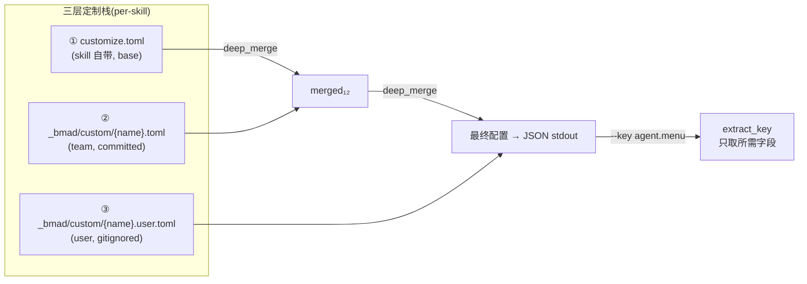

# 07. 定制化与三层合并

## 7.1 一句话定位

定制化是 BMAD "不改核心即可演化" 的扩展点:它用三层 TOML 覆盖把团队策略与个人偏好以纯文本方式叠加在技能默认值之上,合并规则全部由确定性 Python 脚本执行——LLM 只负责声明意图,不负责算合并。

## 7.2 心智模型

把 BMAD 的定制化想成一个**洋葱式的配置栈**。最内层是技能自带的 `customize.toml`,随包发布、`DO NOT EDIT`;中间层是团队提交到仓库的 `_bmad/custom/{name}.toml`,承载组织策略;最外层是个人本地的 `{name}.user.toml`,被 `.gitignore` 忽略。运行时不是把三层"拼接",而是从内向外做一次 `deep_merge`:每一层都把前一层的结果当作 `base`,把当前层当作 `override`,递归压平成一份最终配置。

这个模型的关键在于:**合并是结构性而非语义性的**。脚本不看字段名、不懂 "menu 是什么意思",只根据 TOML 值的形状(标量 / 表 / 数组)套用四条规则。因此任何技能只要把可定制面写成带约定形状的 TOML,就自动获得了三层叠加能力,无需为每个字段写合并代码。



另有两条平行管线:每技能的 `resolve_customization.py` 走三层,中心配置的 `resolve_config.py` 走四层(多出 installer 拥有的两层 `config.toml` / `config.user.toml`)。`bmad-customize` 技能则是一层"人机协作外壳":发现可定制面 → 路由到 agent 还是 workflow → 编写 override → 调解析器验证。

## 7.3 源码走读

### 7.3.1 三层定位与项目根探测

`resolve_customization.py` 的入口先确定三层文件的路径。技能名取自技能目录的 basename,默认值来自技能目录内的 `customize.toml`,而 team/user 两层来自项目根下的 `_bmad/custom/`。项目根通过向上查找 `_bmad` 或 `.git` 标志目录定位。

> `src/scripts/resolve_customization.py:58`

```python
def find_project_root(start: Path):
    current = start.resolve()
    while True:
        if (current / "_bmad").exists() or (current / ".git").exists():
            return current
        parent = current.parent
        if parent == current:
            return None
        current = parent
```

这里同时认 `_bmad` 和 `.git` 两种标志,既支持已安装 BMAD 的项目,也兼容裸 git 仓库。定位到项目根后,三层文件按固定命名拼出,缺失的非 base 层静默返回空 dict(不报错),让合并照常进行。

> `src/scripts/resolve_customization.py:217`

```python
    team = {}
    user = {}
    if project_root:
        custom_dir = project_root / "_bmad" / "custom"
        team = load_toml(custom_dir / f"{skill_name}.toml")
        user = load_toml(custom_dir / f"{skill_name}.user.toml")

    merged = deep_merge(defaults, team)
    merged = deep_merge(merged, user)
```

三层按 `defaults → team → user` 顺序连续 `deep_merge`。注意 `find_project_root` 优先用技能目录而非 `cwd` 定位——注释明确指出:用 `cwd` 先行不安全,因为 `cwd` 的某级祖先可能恰好有别的项目遗留的 `_bmad/`。

### 7.3.2 deep_merge 与形状感知的数组合并

合并的真正难点在数组:一个 `[[agent.menu]]` 数组,base 有 7 个菜单项,override 想替换其中一项、追加一项,不能简单覆盖或全量追加。BMAD 的解法是**形状感知**:先检测数组里每个表是否携带统一的标识符字段(`code` 或 `id`),是则按标识符合并,否则纯追加。

> `src/scripts/resolve_customization.py:98`

```python
def _detect_keyed_merge_field(items):
    if not items or not all(isinstance(item, dict) for item in items):
        return None
    for candidate in _KEYED_MERGE_FIELDS:
        if all(item.get(candidate) is not None for item in items):
            return candidate
    return None
```

`_KEYED_MERGE_FIELDS = ("code", "id")`。关键约束是"每个 item 都有同一个字段":只要有一项缺 `code`,或一半用 `code` 一半用 `id`,就返回 `None` 退化为追加。注释把这种混用称为 "schema smell"——这是有意的安全降级,宁可追加也不猜该按哪个键合并。

> `src/scripts/resolve_customization.py:115`

```python
def _merge_by_key(base, override, key_name):
    result = []
    index_by_key = {}
    for item in base:
        if not isinstance(item, dict):
            continue
        if item.get(key_name) is not None:
            index_by_key[item[key_name]] = len(result)
        result.append(dict(item))
    for item in override:
        if not isinstance(item, dict):
            result.append(item)
            continue
        key = item.get(key_name)
        if key is not None and key in index_by_key:
            result[index_by_key[key]] = dict(item)
        else:
            if key is not None:
                index_by_key[key] = len(result)
            result.append(dict(item))
    return result
```

`index_by_key` 维护"键→结果下标"的映射。base 阶段建表,override 阶段遇到已存在的键就**原地替换**该下标(用 `dict(item)` 直接覆盖,而非再递归 deep_merge),遇到新键就追加并登记。注意替换是整项替换而非字段级合并——菜单项一旦被 override,就以 override 的完整定义为准。

这三层逻辑汇于 `deep_merge`,它是整个定制化系统的"物理定律":

> `src/scripts/resolve_customization.py:152`

```python
def deep_merge(base, override):
    if isinstance(base, dict) and isinstance(override, dict):
        result = dict(base)
        for key, over_val in override.items():
            if key in result:
                result[key] = deep_merge(result[key], over_val)
            else:
                result[key] = over_val
        return result
    if isinstance(base, list) and isinstance(override, list):
        return _merge_arrays(base, override)
    return override
```

四条规则浓缩于此:表+表递归深合并;数组+数组走形状感知;其余(标量、类型不匹配)override 直接覆盖。模块顶部 docstring 还点出一条无操作的约束:**没有删除机制**——override 不能删 base 的项;要"关掉"一个默认,只能用相同 `code` 覆盖成 no-op,或 fork 整个技能。

### 7.3.3 CLI 契约:--skill 与 --key

合并结果默认全量输出为 JSON,但更常见的用法是只取一个字段。`--key` 支持点号路径,可重复,这正是技能激活时按需取用的入口。

> `src/scripts/resolve_customization.py:227`

```python
    if args.key:
        output = {}
        for key in args.key:
            value = extract_key(merged, key)
            if value is not _MISSING:
                output[key] = value
    else:
        output = merged
```

`extract_key` 沿点号逐层下钻(`agent.menu` → 先取 `agent` 表,再取其 `menu` 数组),任一层缺失就返回哨兵 `_MISSING`。这样技能可以 `--key agent` 拿整个 agent 配置,也可以 `--key agent.menu` 只拿菜单数组,而不必让 LLM 自己从大 JSON 里捞字段——把"取哪个字段"也下沉成确定性参数。

文件头 docstring 给出了三种典型调用,即技能激活时的契约:

> `src/scripts/resolve_customization.py:19`

```
  uv run resolve_customization.py --skill /abs/path/to/skill-dir
  uv run resolve_customization.py --skill ... --key agent
  uv run resolve_customization.py --skill ... --key agent.menu
```

仅依赖 stdlib `tomllib`,要求 Python 3.11+。脚本本身无状态、单次进出、输出走 stdout、错误走 stderr——一个教科书式的"确定性解析核"。

### 7.3.4 中心配置的四层合并

`resolve_config.py` 解决的是另一类配置:项目级的中心配置(`user_name`、`communication_language` 等)。它复用完全相同的 `deep_merge`,但层数从三层变四层,多出 installer 拥有的两层。

> `src/scripts/resolve_config.py:156`

```python
    base_team = load_toml(bmad_dir / "config.toml", required=True)
    base_user = load_toml(bmad_dir / "config.user.toml")
    custom_team = load_toml(bmad_dir / "custom" / "config.toml")
    custom_user = load_toml(bmad_dir / "custom" / "config.user.toml")

    merged = deep_merge(base_team, base_user)
    merged = deep_merge(merged, custom_team)
    merged = deep_merge(merged, custom_user)
```

四层的语义分工清晰:`config.toml` / `config.user.toml` 由 installer 写入(机器拥有),`custom/config.toml` / `custom/config.user.toml` 由人编写(团队提交 / 个人忽略)。installer 写的 `config.user.toml` 记录本机安装信息,人写的 `custom/config.user.toml` 记录个人偏好,二者通过目录分层避免互相覆盖。CLI 入口是 `--project-root`(而非 `--skill`),`--key` 同样支持点号路径取值。

### 7.3.5 两类定制面:agent 与 workflow

技能通过 `customize.toml` 顶层块声明自己暴露哪类定制面:`[workflow]` 或 `[agent]`。二者字段集不同,但都遵循合并规则。

workflow 面以 `bmad-dev-auto` 为例,字段精简:

> `src/bmm-skills/4-implementation/bmad-dev-auto/customize.toml:12`

```toml
[workflow]
activation_steps_prepend = []
activation_steps_append = []
persistent_facts = [
  "file:{project-root}/**/project-context.md",
]
on_complete = ""
```

四个字段都是"钩子":`activation_steps_prepend`/`append` 往激活流程前后插步骤,`persistent_facts` 注入全运行期事实(支持 `file:` 前缀按 glob 加载文件),`on_complete` 是终态指令。`persistent_facts` 与两个 `steps` 是数组,按追加语义合并;`on_complete` 是标量,覆盖生效。

agent 面以 `bmad-agent-analyst`(Mary, Business Analyst)为例,字段更丰富,核心是带 `code` 的菜单数组:

> `src/bmm-skills/1-analysis/bmad-agent-analyst/customize.toml:57`

```toml
[[agent.menu]]
code = "BP"
description = "Expert guided brainstorming facilitation"
skill = "bmad-brainstorming"

[[agent.menu]]
code = "MR"
description = "Market analysis, competitive landscape, customer needs and trends"
skill = "bmad-market-research"
```

每个菜单项有 `code`(短标识)、`description`、和一个动作——要么 `skill`(调用已注册技能),要么 `prompt`(直接执行提示文本)。因为**每个 item 都带 `code`**,所以菜单数组自动进入按键合并模式:override 用相同 `code` 替换某项、用新 `code` 追加项,而不会把整个菜单推倒重来。文件头 `DO NOT EDIT` 与注释强调 `name`/`title` 不可改(改身份需另建自定义 agent),其余 persona 字段(`icon`、`role`、`identity`、`communication_style`、`principles`)均可覆盖——`principles` 与 `persistent_facts` 作为数组追加,把组织的价值观叠在默认之上。

### 7.3.6 bmad-customize 技能:发现 → 路由 → 编写 → 验证

前述脚本是"确定性核";`bmad-customize` 技能是套在核外面的"协作外壳",负责把人的自然语言意图翻译成正确位置的 TOML override。它的流程是发现、路由、编写、验证四步。

发现阶段调用 `list_customizable_skills.py` 扫描技能目录,按 `[agent]`/`[workflow]` 块分类,并查 override 是否已存在:

> `src/core-skills/bmad-customize/scripts/list_customizable_skills.py:144`

```python
            surfaces_found = [k for k in SURFACE_KEYS if k in data]
            if not surfaces_found:
                errors.append(
                    f"no [agent] or [workflow] block in {customize_toml}"
                )
                continue
            for surface in surfaces_found:
                entry = dict(entry_base)
                entry["surface"] = surface
                if surface == "agent":
                    agents.append(entry)
                else:
                    workflows.append(entry)
```

`SURFACE_KEYS = ("agent", "workflow")`。一个技能可同时暴露两类面,扫描器为每个面各发一条 entry。同技能若在多个 root 出现,以先扫到的为准(`seen_names` 去重),因此 project-local 安装优先于 user-global。每个 entry 还带 `has_team_override` / `has_user_override` 标志,让"审计/迭代"意图能直接定位已定制过的技能。

路由阶段是技能的核心判断:同一个意图该落到 agent 面还是 workflow 面。SKILL.md 给出明确启发式:

> `src/core-skills/bmad-customize/SKILL.md:54`

```
**Single-surface heuristic:**
- Workflow-level: template swap, output path, step-specific behavior, or a named scalar already exposed (`*_template`, `on_complete`). Surgical, reliable.
- Agent-level: persona, communication style, org-wide facts, menu changes, behavior that should apply to every workflow the agent dispatches.
```

简言之:改一个工作流的输出/步骤 → workflow 面;改角色人格/组织级事实/菜单 → agent 面。横跨多个工作流的意图(如"该 agent 跑的所有工作流都要加载合规清单")应落在 agent 面的 `persistent_facts`/`principles`,而非逐个改 workflow。

编写阶段强调 override 必须稀疏——只写被改的字段,绝不复制整份 `customize.toml`:

> `src/core-skills/bmad-customize/SKILL.md:71`

```
Overrides are sparse: only the fields being changed. Never copy the whole `customize.toml`.
```

稀疏性是三层合并能成立的前提:如果 override 全量复制默认值,那么 base 的后续更新会被 override 的旧值"冻住",三层叠加的演化价值就丧失了。

最后是验证。技能写完 override 后,必须回调解析器确认合并结果如预期:

> `src/core-skills/bmad-customize/SKILL.md:88`

```
4. Verify:
   python3 {project-root}/_bmad/scripts/resolve_customization.py --skill <install-path> --key <agent-or-workflow>
   Show the merged output, point out the changed fields.
```

这一步把"人以为写了什么"和"机器实际合并出什么"对齐:如果字段名拼错、把数组当标量写、或 scope 选错,验证输出会暴露差异,技能据此重进编写阶段。即便解析器缺失,SKILL.md 也给出了手动三层合并的降级路径(读三个文件、按相同规则手算)。整个闭环里,LLM 只产生 TOML 文本和读 JSON 输出,合并算术始终在 Python 侧。

## 7.4 设计决策与权衡

**合并规则结构性、不看字段名。** 好处是任何技能零成本获得三层叠加——只要把可定制面写成带 `code`/`id` 的表数组或普通表即可。代价是规则的表达力有上限:无法表达"这个数组按内容去重"或"这个标量只在为空时才覆盖"这类语义合并。BMAD 选择了"规则够笨,因此可预测"。

**替换是整项替换,无删除机制。** 菜单项被 override 时整体替换而非字段级深合并,且无法删除 base 项。这是有意的保守:避免 override 意外半改一项导致内部不一致。要"关掉"默认项,只能用同 `code` 覆盖成 no-op。牺牲了灵活性,换来了"override 永远只增不减、可审计"的特性。

**installer 层与人写层在中心配置里分目录隔离。** 四层而非三层,是因为 installer 会重写 `config.toml`/`config.user.toml`,而人写的 `custom/config.toml` 不应被覆盖。用目录(`_bmad/` vs `_bmad/custom/`)而非文件名后缀区分拥有者,让"机器拥有"与"人拥有"的边界在文件树上一眼可辨。

**稀疏 override 是硬约束而非建议。** 全量复制默认值会让 base 演化失效。SKILL.md 把"Never copy the whole customize.toml"写成规则,并由验证步骤兜底——验证时若发现 override 与默认值完全一致,即是信号。

## 7.5 与 Claude Code harness 的对照

Claude Code 的扩展点主要是 hooks、MCP、subagents、skills,这些扩展最终汇入 settings.json 和运行时工具协议,由二进制内的调度逻辑在每轮循环里解释执行——扩展的"合并"发生在运行时、由 harness 代码掌握语义。

BMAD 的定制化走的是另一条路:扩展是纯文本 TOML,合并发生在技能激活时的一次脚本调用里,语义完全由结构性规则决定、不依赖任何运行时。Claude Code 的 hook 能拦截并改写工具调用,是"运行时拦截";BMAD 的 override 是"声明式叠加",不改执行路径,只改喂给 LLM 的配置数据。前者强在动态控制力,后者强在可 lint、可 diff、可团队评审——override 文件就是一行 `git diff`,审计成本趋近于零。

这也呼应了全书脊梁:BMAD 把"该确定的"下沉为脚本(合并算术),把"该灵活的"留给声明式文本(override 内容),LLM 始终不碰合并逻辑。

## 7.6 小结

定制化系统由三个部件协作:`resolve_customization.py` / `resolve_config.py` 提供确定性的三/四层合并核,`customize.toml` 声明技能的可定制面,`bmad-customize` 技能把人的意图路由成正确位置的稀疏 override 并用核验证。四条结构性合并规则(标量覆盖、表深合并、键数组按 `code`/`id` 合并、其余追加)让任何技能零成本获得团队/个人叠加能力,而"不改核心即可演化"正是这套机制的范式价值所在。

合并只是约束 LLM 的确定性核之一;下一章将走进更广义的"确定性核"——Python 脚本如何在技能激活时被调用、如何用其输出约束宿主 LLM 的行为。

下一章 → [第 8 章 确定性解析核](../第二部分-核心系统篇/08-确定性解析核.md)
