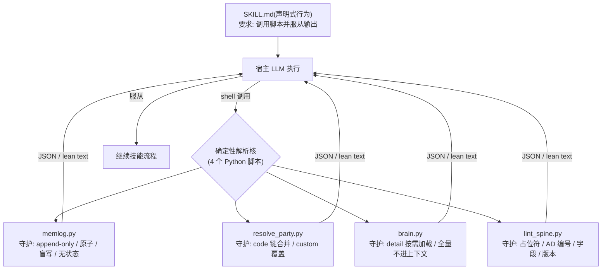

# 08. 确定性解析核 — 用 Python 约束 LLM

## 8.1 一句话定位

本章拆解 BMAD 的"确定性解析核":四个 Python 脚本——`memlog.py`、`resolve_party.py`、`brain.py`、`lint_spine.py`——把不该交给 LLM 自由发挥的逻辑(记忆写入、名册合并、技术库检索、架构 lint)下沉为可复现的机械操作,LLM 在技能激活时被要求调用它们并服从其输出。这是全书范式的要点:BMAD 不跑 agent loop,而是用确定性逻辑从外部约束宿主 LLM 的行为。

## 8.2 心智模型

把宿主 LLM 想象成一个才华横溢但不可靠的书记员。你不会让它手写台账(它会涂改历史)、凭记忆排座次(它会臆造成员)、背诵整本参考手册(它会撑爆上下文)、或用肉眼核对编号(它会数错)。相反,你给它四台机器:一台只能追加的盖章机、一台名册合并机、一台目录检索终端、一台 lint 扫描仪。书记员只负责操作机器、读取其输出;机器保证那些"必须精确"的部分。

这就是 BMAD 的确定性解析核所处的位置:它运行在宿主 agent 之内、LLM 之外,以普通 shell 命令的形式被调用,但其输出是该领域的唯一事实来源。声明式的 `SKILL.md` 负责"要求调用并服从",确定性的 Python 负责把结果算对。



四个脚本守护的是四个不同的"不变量",但共享同一种结构:LLM 调用 → 脚本做确定性计算 → 返回结构化输出 → LLM 服从。下面逐一走读。

## 8.3 源码走读

### 8.3.1 memlog.py — 记忆是事实日志,不是可变状态

`memlog.py` 是一个技能级的工作记忆:跨会话持久、按时间顺序记录"工作中每一件重要的事"。它的设计核心是三条不变量,把"LLM 会如何搞坏一个记忆文件"逐条堵死。

> `src/scripts/memlog.py:18`
>
> ```python
> Three invariants make it trustworthy:
>
>   1. Append-only, chronological. Entries land at the end, in the order they happen.
>      Nothing is ever inserted backward, reordered, edited, or removed. There is no
>      edit or delete subcommand by design; history is never rewritten.
>   2. Write-only / blind. Every command is an atomic, context-free write and echoes the
>      new state as one line of JSON, so the caller never re-reads the file mid-session.
>      The one time the file is read is on resume — and the caller reads it itself, not
>      via this script.
>   3. No lifecycle status. A memory log has no "complete" flag. Whether the work is done,
>      blocked, or paused is itself a fact that happened, so it is recorded as an entry
>      (e.g. `append --type event --text "session complete"`), never as frontmatter the
>      log would have to mutate.
> ```

三条不变量分别约束三件 LLM 不可靠的事:**改写历史**(第 1 条——没有 `edit`/`delete` 子命令,从 API 上杜绝)、**反复读写制造不一致**(第 2 条——盲写,调用方中途不回读,恢复时由调用方自己读)、**用状态字段隐式表达生命周期**(第 3 条——"完成/阻塞/暂停"本身是一条日志条目,而非需要被改写的 frontmatter 标志)。注意第 3 条的精妙处:frontmatter 里的 `topic`/`goal`/`updated` 是可被 `set` 替换的描述性元数据,但正文的编年记录永不可变——状态被降格为事实,而非可变状态。

原子写把这些不变量落到磁盘层面:崩溃永远不会留下半条记录。

> `src/scripts/memlog.py:122`
>
> ```python
> def write_atomic(path: Path, text: str) -> None:
>     """Temp + flush + fsync + atomic rename, so a crash never half-writes an entry."""
>     tmp = path.with_suffix(path.suffix + ".tmp")
>     with open(tmp, "w", encoding="utf-8") as f:
>         f.write(text)
>         f.flush()
>         os.fsync(f.fileno())
>     os.replace(tmp, path)
> ```

`temp + flush + fsync + os.replace` 是经典的崩溃安全写法:先写临时文件、强制落盘、再原子改名。`os.replace` 在同一文件系统上是原子的,要么看到旧文件、要么看到完整新文件,绝不会看到半截。这条防线之所以必要,是因为 memlog 跨会话持久——一次崩溃若留下残缺条目,会污染此后所有会话的恢复基线。

盲写在 `cmd_append` 里体现为"算完即写、写完即回执",调用方不需要也不应该回读文件来确认状态。

> `src/scripts/memlog.py:164`
>
> ```python
> def cmd_append(args) -> int:
>     path = resolve(args)
>     meta, body = split(path.read_text(encoding="utf-8"))
>     text = " ".join(args.text.split())  # collapse newlines/runs → one-line entry, no prose bloat
>     label = args.type or ""
>     if args.by:
>         label = f"{label} by {args.by}".strip()  # attribution: "(idea by user)" / "(by coach)"
>     tag = f"({label}) " if label else ""
>     entry = f"- {tag}{text}"
>     body = (body.rstrip("\n") + "\n" + entry) if body.strip() else entry  # always at the end
>     touch(meta)
>     write_atomic(path, render(meta, body))
>     ack(path, body)
>     return 0
> ```

两个细节值得注意:`" ".join(args.text.split())` 把任意换行/连续空白压成一行——记忆条目永远是单行,防止 LLM 把一段散文塞进去撑爆日志;`body = ... + "\n" + entry` 强制追加在末尾,印证第 1 条不变量。最后 `ack(path, body)` 把新的条目数作为一行 JSON 打印出来,这就是"盲写"的回执:调用方从回执得知"现在有几条",而不必回读文件。脚本本身读文件(为保留已有正文),但**调用方**(LLM)中途不读——读写职责被切开了。

→ 完整实现见 `src/scripts/memlog.py`。

### 8.3.2 resolve_party.py — 名册按 code 合并,custom 覆盖 installed

`resolve_party.py` 解决的是多智能体编排([第 11 章](../第三部分-高级模式篇/11-多智能体编排-PartyMode.md))的前置问题:把已安装的 BMAD agent 名册与用户在 `customize.toml` 里自定义的 `party_members` 合并成一份确定性的集体名册,让编排器消费"已解析的名册"而非每会话重新推导。

> `src/core-skills/bmad-party-mode/scripts/resolve_party.py:94`
>
> ```python
> def build_collective(agents: dict, party_members: list):
>     """One pool keyed by code. Custom members override matching installed agents.
>
>     Returns (collective, index, installed_codes):
>       * collective — every member (installed + custom), the pool groups draw
>         from and the orchestrator can summon by name.
>       * index — maps every resolvable token (code, prefix-stripped alias,
>         lower-cased name) to a canonical code.
>       * installed_codes — the codes occupying an installed-agent slot, in
>         order. This is the DEFAULT room: installed agents (with any custom
>         override applied in place), and NOT the pure-custom additions. So
>         shipping or defining custom members grows the pool without crowding
>         the default party.
>     """
> ```

合并策略是"以 code 为键的并集",关键设计在 `installed_codes`:默认房间只包含已安装 agent 占据的槽位(连同对其的 custom 覆盖),而**纯新增**的 custom 成员进入池子但不挤进默认房间。这意味着定义自定义成员扩大了可选池,却不会改变开箱即用的默认阵容——一个团队加人不会偷偷改变所有人的默认体验。这条规则是确定性的:同样的输入永远产出同样的名册,编排器不必"猜"。

custom 覆盖 installed 的具体逻辑,靠一个多 token 索引把 code/别名/小写名都映射到同一规范 code。

> `src/core-skills/bmad-party-mode/scripts/resolve_party.py:134`
>
> ```python
>     for m in party_members or []:
>         code = m.get("code")
>         if not code:
>             continue
>         # A custom member overrides an installed agent it matches by code/alias/name.
>         canonical = index.get(code) or index.get(code.lower()) or code
>         entry = {"code": canonical, "source": "custom"}
>         for field in ("name", "icon", "title", "persona", "capabilities", "model"):
>             if m.get(field) is not None:
>                 entry[field] = m[field]
>         entry.setdefault("name", canonical)
>         register(canonical, entry)
>         # An override keeps the installed slot; a brand-new custom does not join it.
> ```

`canonical = index.get(code) or index.get(code.lower()) or code` 让 custom 成员能以 code、去前缀别名(`bmad-agent-analyst` → `analyst`)或小写名任一形式匹配到已安装 agent,然后**就地覆盖**而非新增一条。覆盖只改字段、不改槽位——这与上面 `installed_codes` 的语义自洽:被覆盖的 agent 仍占默认房间那个位置,只是换了人设。把"覆盖"实现成"按键就地替换",合并结果因此无歧义、可复现,LLM 无需参与合并判断。

这份脚本还把"惰性"做进了调用图:便宜的菜单查询根本不触发昂贵的 agent 解析。

> `src/core-skills/bmad-party-mode/scripts/resolve_party.py:228`
>
> ```python
>     # Group menu never needs the (more expensive) installed-agent resolve.
>     if args.list_groups:
>         _emit({
>             "party_mode": party_mode,
>             "default_party": default_party,
>             "groups": group_menu(groups),
>         })
>         return
> ```

`--list-groups` 只读 `customize.toml` 里的分组定义,返回 id/名称/人数,完全不调用 `resolve_config.py` 去加载已安装 agent。这与 `brain.py` 的上下文经济同源:能不加载就不加载,把成本推迟到真正需要详情的那一刻。

→ 完整实现见 `src/core-skills/bmad-party-mode/scripts/resolve_party.py`。

### 8.3.3 brain.py — 技术库按需服务,不把全量塞进上下文

`brain.py` 是一个"技术库服务":管理一个头脑风暴技法库(CSV),以子命令按需提供检索,而**绝不在交互中把整个目录灌进上下文**。这是确定性脚本对"上下文预算"的守护——LLM 不该自己决定塞多少进上下文。

> `src/core-skills/bmad-brainstorming/scripts/brain.py:5`
>
> ```python
> """Serve the brainstorming technique library without loading it all into context.
>
> The library is a CSV (category, technique_name, description, detail). `description`
> is a short gist — enough to propose and run most techniques. `detail` is optional:
> a path (relative to the CSV's directory) to a fuller instruction file for a technique
> complex enough to warrant one. Only `show` resolves detail files, and only for the
> technique asked for — so the heavy material never enters context until it is run.
> ```

目录被设计成两层:`description`(短摘要,足以提出和运行多数技法)与 `detail`(可选,指向更完整的指令文件)。只有 `show` 子命令解析 `detail` 文件,且只解析被点名的那一个技法——重材料在技法真正运行前绝不进入上下文。把库拆成"轻量索引 + 按需详情",是让一个大库可以在不撑爆上下文的前提下被 LLM 浏览的关键。

`resolve_detail` 是这条原则的落点:无 detail 则返回 `None`,文件缺失只是 stderr 警告而非致命错误。

> `src/core-skills/bmad-brainstorming/scripts/brain.py:104`
>
> ```python
> def resolve_detail(row: dict, csv_dir: Path) -> str | None:
>     """Return the contents of a row's detail file, or None if there is no detail
>     (or the file is missing — a missing file is reported to stderr, not fatal)."""
>     if not row.get("detail"):
>         return None
>     path = (csv_dir / row["detail"]).resolve()
>     if not path.is_file():
>         print(f"# detail file not found for {row['technique_name']}: {row['detail']}", file=sys.stderr)
>         return None
>     return path.read_text(encoding="utf-8").strip()
> ```

缺失文件走 stderr、返回 `None`、不致命——脚本选择"尽力而为地降级"而非"崩溃阻断流程",因为技法库的检索不该因为某个 detail 文件丢失就让整个技能停摆。这种容错属于确定性脚本的职责:它知道哪些失败可以吞掉、哪些必须上报,而 LLM 很难稳定地做出这个判断。

脚本甚至用"拒绝执行"来防止 LLM 误把全量目录灌进上下文。

> `src/core-skills/bmad-brainstorming/scripts/brain.py:701`
>
> ```python
>     elif args.cmd == "list":
>         if not args.category and not args.all:
>             print(
>                 "error: `list` needs --category (one or more) — or --all to dump the whole "
>                 "catalog on purpose. Use `categories` for the cheap map, or `random` to draw blind.",
>                 file=sys.stderr,
>             )
>             return 2
> ```

`list` 不带 `--category` 也不带 `--all` 时直接报错退出。这不是输入校验的洁癖,而是有意的"脚枪防线":把整个目录一次性倒进上下文是个坏操作,要发生就必须是显式、刻意的(`--all`)。`html` 子命令同理——它把浏览页写到文件而非 stdout,因为"把整个目录打印到 stdout"正是它要防止的事。脚本在这里充当了上下文预算的守门人,把"是否值得占用上下文"的机械判断从 LLM 手里拿走。

→ 完整实现见 `src/core-skills/bmad-brainstorming/scripts/brain.py`。

### 8.3.4 lint_spine.py — 占位符与编号的机械 lint

`lint_spine.py` 是架构决策记录(`ARCHITECTURE-SPINE.md`)的"机械半":专门做 LLM 做不好的事——数字编号、字面占位符、表格版本——而把语义判断留给 rubric walker。它的开篇宣言直陈了分工理由。

> `src/bmm-skills/3-solutioning/bmad-architecture/scripts/lint_spine.py:5`
>
> ```python
> """lint-spine — the mechanical half of spine decision-integrity, done deterministically.
>
> LLMs miscount IDs and miss literal placeholders; a grep does not. This linter owns the
> checks a script does better than a prompt, and leaves the semantic half (is each Rule
> actually enforceable? does the boundary make sense?) to the rubric walker.
> ```

"LLMs miscount IDs and miss literal placeholders; a grep does not."——这一句定义了整章的取舍线:**脚本 owns 机械校验,LLM owns 语义判断**。一条规则是否真的可执行、边界是否合理,是 LLM 擅长的语义推理;而 AD 编号是否单调递增、有没有遗留 `TBD`,是 LLM 不可靠但 grep/regex 极擅长的字面匹配。把后者从提示词里剥离出来,既更准也更省 token。

为了让行号在"跳过代码块"的同时仍然对得上真实文件,脚本用了一个等行数空白替换的技巧。

> `src/bmm-skills/3-solutioning/bmad-architecture/scripts/lint_spine.py:60`
>
> ```python
> def blank_fences(text: str) -> str:
>     """Replace each fenced block with the same number of newlines, so scanning skips fenced
>     content while every line number outside the fence stays put."""
>     return FENCE.sub(lambda m: "\n" * m.group(0).count("\n"), text)
> ```

 fenced 代码块(mermaid 图、源码树)里的 `TBD`、`AD-3` 不该被当成活体缺陷报出来,但简单删除会令后续行号错位。这里把每个 fence 替换成**等数量的换行**,既跳过了内容、又保住了行号偏移——报告的行号能精确指回真实文件。这种"对行号负责"的细节,正是机械 lint 相比"让 LLM 读一遍找问题"的优势:它的输出可被精确定位、可被自动化消费。

AD 编号校验体现了脚本对"单调性"这种 LLM 易错规则的处理。

> `src/bmm-skills/3-solutioning/bmad-architecture/scripts/lint_spine.py:119`
>
> ```python
>         if num in seen:
>             findings.append({
>                 "category": "ad_id",
>                 "severity": "high",
>                 "detail": f"AD-{num} id reused (also at line {seen[num]})",
>                 "location": loc,
>             })
>         else:
>             seen[num] = file_line
>         if prev is not None and num <= prev:
>             findings.append({
>                 "category": "ad_id",
>                 "severity": "high",
>                 "detail": f"AD-{num} is non-monotonic (follows AD-{prev}); ids must ascend and never renumber",
>                 "location": loc,
>             })
>         prev = num if prev is None else max(prev, num)
> ```

两条规则:编号**不可重复**(reuse)、**必须单调递增**(non-monotonic)。`prev = ... max(prev, num)` 而非直接 `prev = num`,是为了在出现一次倒序后不引发后续连锁误报。让一个脚本用 `seen` 字典 + `prev` 游标来保证编号唯一且递增,远比在提示词里写"请检查编号是否连续"可靠——后者 LLM 几乎必然在长文档里数错。

最后,这个 linter 的退出码永远是 0。

> `src/bmm-skills/3-solutioning/bmad-architecture/scripts/lint_spine.py:240`
>
> ```python
>         try:
>             text = spine_path.read_text(encoding="utf-8")
>         except (OSError, UnicodeDecodeError) as e:
>             # honor the "exit code is always 0" contract: a read/decode failure travels in JSON
>             result = {"ok": False, "error": f"could not read {spine_path}: {e}", "findings": [], "total_findings": 0}
>         else:
>             result = lint(text)
>
>     out = json.dumps(result, indent=2)
>     if args.output:
>         Path(args.output).write_text(out + "\n", encoding="utf-8")
>     else:
>         print(out)
>     return 0
> ```

"退出码永远 0、findings 走 JSON"是一条刻意的契约:连读取/解码失败都封装进 JSON 而非用非零退出码抛出。原因是调用方是 Reviewer Gate / rubric walker([第 15 章](../第四部分-工程实践篇/15-质量与审查-Review三件套.md))——非零退出码会打断 agent 流程或被误读为"脚本崩了",而结构化的 findings 让调用方自己决定哪些严重到要阻断。脚本只负责"如实报告",不负责"裁决"。

→ 完整实现见 `src/bmm-skills/3-solutioning/bmad-architecture/scripts/lint_spine.py`。

## 8.4 设计决策与权衡

**下沉什么、留下什么。** 四个脚本共同划出一条取舍线:把 LLM 不可靠的事下沉为脚本,把 LLM 擅长的事留给提示词。`memlog.py` 下沉了"改写历史/原子落盘/盲写回执",把记忆的**词汇**(`--type`/`--by` 叫什么)留给宿主技能;`resolve_party.py` 下沉了"按键合并/覆盖规则",把分组**语义**(场景描述)留给配置;`brain.py` 下沉了"按需加载/防止全量灌入",把"选哪个技法"的**创意判断**留给 LLM;`lint_spine.py` 下沉了"编号/占位符/版本"的**机械校验**,把"规则是否可执行"的**语义判断**留给 rubric walker。每个脚本都在 docstring 里明示了这条分工——确定性脚本不是为了取代 LLM,而是为了把 LLM 从它不擅长的苦力活里解放出来。

**脚本即契约,输出即事实。** 这四个脚本的输出(JSON 或 lean text)在被调用领域是唯一事实来源:`resolve_party.py` 的名册、`lint_spine.py` 的 findings、`memlog.py` 的条目数。确定性在脚本里,激活在 `SKILL.md` 里——技能文本要求 LLM 调用脚本并服从其输出。这种"声明式要求 + 机械执行"的二分,让约束可读、可 lint,而不必编译进运行时。

**退出码让位于结构化结果。** `lint_spine.py` 退出码永远 0,`brain.py` 在"全量灌入"这种危险操作上用 `return 2` 主动拒绝。两种策略并不矛盾:前者是"findings 是数据、由调用方裁决",后者是"这个操作本身不该发生、必须显式确认"。共同点是——脚本把"是否阻断流程"的决策权交还调用方,而非用退出码替它做决定。

**盲写与原子写约束交互模式。** `memlog.py` 的 `ack` 让调用方从回执而非回读得知状态。这约束的不只是文件,而是 LLM 与记忆的**交互模式**:写完即走、不反复窥视。把交互模式固化进工具,比在提示词里写"请不要反复读取文件"可靠得多。

## 8.5 与 Claude Code harness 的对照

Claude Code 约束 LLM 的手段是编译进二进制的工具协议、权限管线与 hooks——它们运行在 agent loop **之内**,在工具调用的前后拦截、阻断或改写。BMAD 没有这个运行时:它的脚本以普通 shell 命令被调用,约束来自 `SKILL.md` 的声明式要求("调用并服从")加脚本自身的机械正确性,而非一个能强制拦截的权限层。

最接近的类比是 Claude Code 的 `PreToolUse`/`PostToolUse` hooks:它们能在工具调用前确定性阻断。但 BMAD 的脚本不是 hook——它是技能**主动调用**的工具,其约束力来自"绕过它手工重算更易出错"这一现实,而非运行时强制。这是一种"软确定性":BMAD 不拥有运行时,无法像 Claude Code 那样用二进制保证"你绝不能跳过权限检查";它只能保证"跳过脚本来手算,结果一定更糟"。这是不跑 agent loop 的方法论 harness 唯一可得的约束形态——也是 [第 00 章](../00-前言与范式总论.md) 所说的"harness 在 Markdown + TOML + Python 里"的具体含义。

## 8.6 小结

确定性解析核是 BMAD 范式的要点:把不该让 LLM 自由发挥的逻辑下沉为 Python 脚本,LLM 激活时被要求调用并服从。`memlog.py` 守护记忆的 append-only/原子/盲写/无状态,`resolve_party.py` 守护名册的 code 键合并,`brain.py` 守护上下文预算的按需加载,`lint_spine.py` 守护架构文档的机械完整性——四者共同划出"确定性 vs 灵活性"的取舍线。这些脚本与 [第 07 章](../第二部分-核心系统篇/07-定制化与三层合并.md) 的三层定制合并、[第 06 章](../第二部分-核心系统篇/06-技能系统-双手.md) 的技能系统一起,构成了 BMAD 约束宿主 LLM 的完整机制。下一章 [第 09 章](../第二部分-核心系统篇/09-IDE集成-部署到宿主.md) 将转向这套机制如何被部署进宿主 agent 的 IDE 配置。
