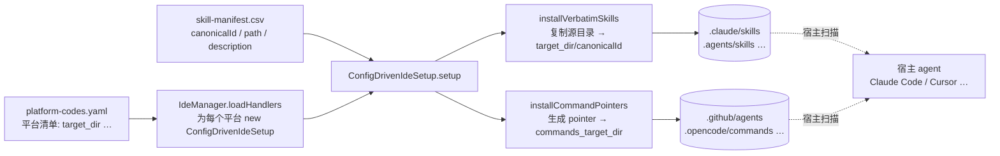

# 09. IDE 集成 — 部署到宿主

## 9.1 一句话定位

本章讲 BMAD 这套"方法论 harness"如何**落地进宿主 agent**——installer 不为每个 IDE 写一份专属代码,而是用一张 YAML 配置表(`platform-codes.yaml`)驱动一个通用安装器,把声明式技能目录按 `canonicalId` 原样复制到各宿主约定的 skills 目录(如 Claude Code 的 `.claude/skills`),并按需生成 command pointer 文件让宿主识别技能。新增一个宿主平台,通常只需在 YAML 里加几行,零 JS 代码。

## 9.2 心智模型

BMAD 是方法论,宿主是运行时。installer 的工作不是"教会宿主做事",而是"把方法论写成宿主能读的文件,放到宿主会去翻的目录里"。不同 IDE 翻书的目录不同:Claude Code 翻 `.claude/skills`,Cursor / Codex / Copilot 翻跨工具标准目录 `.agents/skills`,Kiro 翻 `.kiro/skills`……但"翻书"这个动作(扫目录、加载 `SKILL.md`、注入上下文)是宿主自带的运行时能力。所以 installer 只需知道"每个宿主的书架在哪",剩下的复制动作对所有宿主都一样。

这正是"配置驱动"的内核:**把"宿主差异"压缩成纯数据(`target_dir` / `global_target_dir`),把"安装动作"统一成一个 `ConfigDrivenIdeSetup` 类**。差异越大、越不适合用数据表达的平台,才需要回退到代码——而 BMAD 恰好把宿主差异限定在"放哪个目录、要不要 pointer、pointer 长什么样"这三件可以用字段描述的事上。



上图把"配置 → 通用安装器 → 两类产物 → 宿主读取"的链路一次铺开。下面逐层走读源码。

## 9.3 源码走读

### 9.3.1 platform-codes.yaml:配置即平台清单

这张表是所有宿主适配的唯一真相源。开头的注释本身就是"配置驱动的契约说明书"。

> `tools/installer/ide/platform-codes.yaml:1`
>
> ```yaml
> # BMAD Platform Codes Configuration
> #
> # Each platform entry has:
> #   name: Display name shown to users
> #   preferred: Whether shown as a recommended option on install
> #   suspended: (optional) Message explaining why install is blocked
> #   installer:
> #     target_dir: Directory where skill directories are installed (project/workspace)
> #     global_target_dir: (optional) User-home directory for global install
> #     ancestor_conflict_check: (optional) Refuse install when ancestor dir has BMAD files
> #
> # Multiple platforms may share the same target_dir or global_target_dir — many tools
> # read from the shared `.agents/skills/` and `~/.agents/skills/` cross-tool standard.
> ```

一个平台能装进 BMAD 的全部前提就是这几行字段。末句点明:多平台共享 `target_dir` 不是缺陷而是设计——`.agents/skills` 是一份跨工具标准,Cursor / Codex / Copilot / Gemini 都读它。

看两个 `preferred` 平台,体会"同构配置、不同落地":

> `tools/installer/ide/platform-codes.yaml:52`
>
> ```yaml
>   claude-code:
>     name: "Claude Code"
>     preferred: true
>     installer:
>       target_dir: .claude/skills
>       global_target_dir: ~/.claude/skills
> ```

Claude Code 作为推荐宿主,项目级落 `.claude/skills`、用户级落 `~/.claude/skills`——这正好是 Claude Code 运行时会扫描的两个 skills 目录。installer 不需要知道 Claude Code 内部如何加载,只需把文件放对位置。

> `tools/installer/ide/platform-codes.yaml:136`
>
> ```yaml
>   github-copilot:
>     name: "GitHub Copilot"
>     preferred: true
>     installer:
>       target_dir: .agents/skills
>       global_target_dir: ~/.agents/skills
>       commands_target_dir: .github/agents
>       commands_extension: .agent.md
>       commands_body_template: "LOAD the FULL {project-root}/{target_dir}/{canonicalId}/SKILL.md, READ its entire contents and follow its directions exactly!"
>       commands_filter: agents-only
> ```

Copilot 与 Claude Code 的差异全在这几个可选字段里:它除了读 skills 目录,还需在 `.github/agents` 下放显式 pointer 文件(扩展名 `.agent.md`)才能在 Custom Agents 选择器里出现;`commands_filter: agents-only` 让选择器只露 persona agent。同一个 `ConfigDrivenIdeSetup` 靠这几个字段就适配了完全不同的宿主激活机制——这就是"配置驱动"想达到的效果。

### 9.3.2 platform-codes.js:YAML 加载与缓存

加载逻辑极其朴素,没有任何 per-IDE 分支。

> `tools/installer/ide/platform-codes.js:13`
>
> ```js
> async function loadPlatformCodes() {
>   if (_cachedPlatformCodes) {
>     return _cachedPlatformCodes;
>   }
>
>   if (!(await fs.pathExists(PLATFORM_CODES_PATH))) {
>     throw new Error(`Platform codes configuration not found at: ${PLATFORM_CODES_PATH}`);
>   }
>
>   const content = await fs.readFile(PLATFORM_CODES_PATH, 'utf8');
>   _cachedPlatformCodes = yaml.parse(content);
>   return _cachedPlatformCodes;
> }
> ```

读 YAML、`parse`、缓存,三步。`_cachedPlatformCodes` 让一次 install 流程里多次读取只解析一次;`clearCache` 留给测试。把"平台清单"做成一个可缓存的纯数据加载函数,是后续所有 handler 共享同一份配置的前提。

### 9.3.3 manager.js:配置驱动的 handler 发现

`IdeManager` 不再硬编码"支持哪些 IDE",而是从 YAML 动态生成 handler。

> `tools/installer/ide/manager.js:53`
>
> ```js
>   async loadConfigDrivenHandlers() {
>     const { loadPlatformCodes } = require('./platform-codes');
>     const platformConfig = await loadPlatformCodes();
>
>     const { ConfigDrivenIdeSetup } = require('./_config-driven');
>
>     for (const [platformCode, platformInfo] of Object.entries(platformConfig.platforms)) {
>       // Skip if no installer config (platform may not need installation)
>       if (!platformInfo.installer) continue;
>
>       const handler = new ConfigDrivenIdeSetup(platformCode, platformInfo);
>       if (typeof handler.setBmadFolderName === 'function') {
>         handler.setBmadFolderName(this.bmadFolderName);
>       }
>       this.handlers.set(platformCode, handler);
>     }
>   }
> ```

这是"配置驱动 = 零代码新增宿主"的落点:遍历 YAML 里每个平台,`new` 一个同样的 `ConfigDrivenIdeSetup(platformCode, platformInfo)` 塞进 `handlers` Map。没有 `switch`、没有 `if (ide === 'cursor')`。新增宿主只要在 YAML 加条目,这里自动出现一个 handler。

当用户一次选了多个共享 `target_dir` 的平台(如 codex + cursor + copilot 都用 `.agents/skills`),`setupBatch` 用一张"认领表"去重:

> `tools/installer/ide/manager.js:199`
>
> ```js
>     const claimedTargets = new Map();
>     for (const ideName of ideList) {
>       const handler = this.handlers.get(ideName.toLowerCase());
>       if (!handler) {
>         results.push(await this.setup(ideName, projectDir, bmadDir, options));
>         continue;
>       }
>
>       const target = handler.installerConfig?.target_dir || null;
>       const claim = target ? claimedTargets.get(target) : null;
>       const skipTarget = !!claim;
>
>       const result = await this.setup(ideName, projectDir, bmadDir, {
>         ...options,
>         skipTarget,
>         sharedWith: claim?.firstIde || null,
>         sharedTarget: target,
>         sharedSkillCount: claim?.skillCount || 0,
>       });
>
>       if (target && !claim) {
>         const writtenCount = result.handlerResult?.results?.skillDirectories || result.handlerResult?.results?.skills || 0;
>         if (result.success && writtenCount > 0) {
>           claimedTargets.set(target, { firstIde: ideName, skillCount: writtenCount });
>         }
>       }
>       results.push(result);
>     }
> ```

首个平台写目录并"认领"该 `target_dir`,后续同目录平台传 `skipTarget: true` 跳过复制。注意认领条件是 `result.success && writtenCount > 0`——首个平台若失败,目录不被认领,下一个 peer 接管成为新的首写者,避免留一个空/坏目录被静默跳过。这种"失败不认领"的细节是把去重做对的关键。

### 9.3.4 _config-driven.js:通用安装器主体

`ConfigDrivenIdeSetup` 是整个 IDE 适配层唯一的核心类。它的 `setup` 方法完全由配置字段决定路由:

> `tools/installer/ide/_config-driven.js:214`
>
> ```js
>     if (!this.installerConfig) {
>       return { success: false, reason: 'no-config' };
>     }
>
>     // When a peer platform in the same install batch owns this target_dir,
>     // skip the skill write — the peer has already populated it. Command
>     // pointers, however, write to a separate per-IDE directory and must
>     // still be generated for this IDE; they are not deduped across peers.
>     if (options.skipTarget) {
>       const results = { skills: 0, sharedTargetHandledByPeer: true };
>       if (this.installerConfig.commands_target_dir) {
>         results.commands = await this.installCommandPointers(projectDir, bmadDir, this.installerConfig, options);
>       }
>       return { success: true, results };
>     }
>
>     if (this.installerConfig.target_dir) {
>       return this.installToTarget(projectDir, bmadDir, this.installerConfig, options);
>     }
>
>     return { success: false, reason: 'invalid-config' };
> ```

`skipTarget` 分支揭示了共享目录的语义:技能复制可去重,但 command pointer 是 per-IDE 的(各自不同的 `commands_target_dir`),必须各自生成。这段注释把"为什么 pointer 不去重"讲得很清楚——因为 pointer 落在 IDE 私有目录,而技能落在共享目录,两者的去重边界不同。

核心复制动作在 `installVerbatimSkills`,它读 `skill-manifest.csv` 逐行落地:

> `tools/installer/ide/_config-driven.js:420`
>
> ```js
>     const csvPath = path.join(bmadDir, '_config', 'skill-manifest.csv');
>     if (!(await fs.pathExists(csvPath))) return 0;
>
>     const csvContent = await fs.readFile(csvPath, 'utf8');
>     const records = csv.parse(csvContent, { columns: true, skip_empty_lines: true });
>
>     let count = 0;
>     for (const record of records) {
>       const canonicalId = record.canonicalId;
>       if (!canonicalId) continue;
>
>       const relativePath = record.path.startsWith(bmadPrefix) ? record.path.slice(bmadPrefix.length) : record.path;
>       const sourceFile = path.join(bmadDir, relativePath);
>       const sourceDir = path.dirname(sourceFile);
>       if (!(await fs.pathExists(sourceDir))) continue;
>
>       // Clean target before copy to prevent stale files
>       const skillDir = path.join(targetPath, canonicalId);
>       await fs.remove(skillDir);
>       await fs.ensureDir(skillDir);
>       // …filter out .DS_Store / *.swp etc., then fs.copy(sourceDir, skillDir, { filter })
>       count++;
>     }
>     return count;
> ```

安装动作就是"按 CSV 逐行,把源目录原样复制到 `targetPath/canonicalId`"。`canonicalId` 既是 manifest 里的逻辑名,也是宿主 skills 目录下的物理目录名——宿主靠目录名识别技能。先 `remove` 再 `copy` 保证幂等:重装不会残留旧文件;`filter` 剔除 `.DS_Store`、`*.swp` 等系统/编辑器垃圾。"verbatim"(逐字)这个词点明:源 `SKILL.md` 被直接使用,不做 frontmatter 转换或文件生成——技能的内容由作者写死,installer 只搬运。

### 9.3.5 path-utils:层级路径 → 扁平文件名

宿主 skills 目录是扁平的(一个目录下一个技能),而 BMAD 源码是层级的(`bmm/agents/pm.md`)。`path-utils` 把后者映射成前者,规则集中在 `toDashName`:

> `tools/installer/ide/shared/path-utils.js:35`
>
> ```js
> function toDashName(module, type, name) {
>   const isAgent = type === AGENT_SEGMENT;
>
>   // For core module, skip the module name: use 'bmad-agent-name.md' instead of 'bmad-agent-core-name.md'
>   if (module === 'core') {
>     return isAgent ? `bmad-agent-${name}.md` : `bmad-${name}.md`;
>   }
>   // For standalone module, include 'standalone' in the name
>   if (module === 'standalone') {
>     return isAgent ? `bmad-agent-standalone-${name}.md` : `bmad-standalone-${name}.md`;
>   }
>
>   // Module artifacts: bmad-module-name.md or bmad-agent-module-name.md
>   const dashName = name.replace(/\//g, '-'); // Flatten nested paths
>   return isAgent ? `bmad-agent-${module}-${dashName}.md` : `bmad-${module}-${dashName}.md`;
> }
> ```

扁平命名规则浓缩在此:agent 类型加 `bmad-agent-` 前缀(以便宿主/用户一眼区分 persona),其余加 `bmad-`。`core` 模块省略模块名(`bmad-agent-brainstorming` 而非 `bmad-agent-core-brainstorming`),`standalone` 显式保留。这套规则让"层级路径 → 唯一扁平名"成为纯函数,可单测、可逆(`parseDashName` 能还原各段)。

从相对路径推导的入口是 `toDashPath`:

> `tools/installer/ide/shared/path-utils.js:63`
>
> ```js
> function toDashPath(relativePath) {
>   if (!relativePath || typeof relativePath !== 'string') {
>     return 'bmad-unknown.md';
>   }
>
>   const withoutExt = relativePath.replace(/\.(md|yaml|yml|json|xml|toml)$/i, '');
>   const parts = withoutExt.split(/[/\\]/);
>
>   const module = parts[0];
>   const type = parts[1];
>   let name;
>
>   // For agents, if nested in a folder (more than 3 parts), use the folder name only
>   if (type === 'agents' && parts.length > 3) {
>     name = parts[2];
>   } else {
>     name = parts.slice(2).join('-');
>   }
>
>   return toDashName(module, type, name);
> }
> ```

`toDashPath` 把 `bmm/agents/pm.md` 拆成 `module` / `type` / `name` 三段再交给 `toDashName`。agents 嵌套时(如 `bmm/agents/tech-writer/tech-writer.md`)只取文件夹名,避免 `tech-writer-tech-writer` 这种冗余。这是 `canonicalId` 生成规则的"路径推导版"——当技能没有显式 `canonicalId` 时的回退计算。

两条路径的优先级由一个极小函数定调:

> `tools/installer/ide/shared/path-utils.js:203`
>
> ```js
> function resolveSkillName(artifact) {
>   if (artifact.canonicalId) {
>     return `${artifact.canonicalId}.md`;
>   }
>   return toDashPath(artifact.relativePath);
> }
> ```

`canonicalId` 是首选,`toDashPath` 是回退。这定义了"技能逻辑名"的唯一来源:能从 manifest 显式读到 `canonicalId` 就用它,否则按路径推导。这种"显式优先、推导兜底"的模式贯穿 BMAD 的配置处理(参见[第 07 章 定制化与三层合并](07-定制化与三层合并.md))。

### 9.3.6 skill-manifest:canonicalId 映射

`canonicalId` 从哪来?每个技能源目录旁可以放一个 `bmad-skill-manifest.yaml` sidecar,声明该目录产物的 `canonicalId` 与 `type`。

> `tools/installer/ide/shared/skill-manifest.js:12`
>
> ```js
> async function loadSkillManifest(dirPath) {
>   const manifestPath = path.join(dirPath, 'bmad-skill-manifest.yaml');
>   try {
>     if (!(await fs.pathExists(manifestPath))) return null;
>     const content = await fs.readFile(manifestPath, 'utf8');
>     const parsed = yaml.parse(content);
>     if (!parsed || typeof parsed !== 'object') return null;
>     if (parsed.canonicalId || parsed.type) return { __single: parsed };
>     return parsed;
>   } catch (error) {
>     console.warn(`Warning: Failed to parse bmad-skill-manifest.yaml in ${dirPath}: ${error.message}`);
>     return null;
>   }
> }
> ```

sidecar 支持两种形态:顶层直接写 `canonicalId` 的"单条目"(用 `__single` 标记,对该目录所有文件生效),或按文件名分键的"多条目"。这让一个目录里的多个产物(如 `help.md` 与 `pm.md`)各自映射到不同 `canonicalId`。

查 `canonicalId` 是一个纯函数:

> `tools/installer/ide/shared/skill-manifest.js:33`
>
> ```js
> function getCanonicalId(manifest, filename) {
>   if (!manifest) return '';
>   // Single-entry manifest applies to all files in the directory
>   if (manifest.__single) return manifest.__single.canonicalId || '';
>   // Multi-entry: look up by filename directly
>   if (manifest[filename]) return manifest[filename].canonicalId || '';
>   return '';
> }
> ```

单条目对全目录生效,多条目按文件名查;返回空串表示该文件不属于任何技能,调用方据此跳过。无副作用,易测。sidecar 是构建期的输入;构建产物会汇成一份总的 `skill-manifest.csv`,后者才是安装期的真相(见下节)。

### 9.3.7 installed-skills:CSV 追踪已装技能

安装完成后,所有技能的 `canonicalId` / `path` / `description` 被汇总写入 `_bmad/_config/skill-manifest.csv`。`installed-skills.js` 读这份"已装技能总账",供检测与清理使用。

> `tools/installer/ide/shared/installed-skills.js:14`
>
> ```js
> async function getInstalledCanonicalIds(bmadDir) {
>   const ids = new Set();
>   if (!bmadDir) return ids;
>
>   const csvPath = path.join(bmadDir, '_config', 'skill-manifest.csv');
>   if (!(await fs.pathExists(csvPath))) return ids;
>
>   try {
>     const content = await fs.readFile(csvPath, 'utf8');
>     const records = csv.parse(content, { columns: true, skip_empty_lines: true });
>     for (const record of records) {
>       if (record.canonicalId) ids.add(record.canonicalId);
>     }
>   } catch {
>     // Unreadable/invalid manifest — treat as no info
>   }
>
>   return ids;
> }
> ```

注意它和上一节 sidecar 的区别:sidecar 是构建期输入(每个源目录一份),CSV 是安装期产物/真相(全局一份)。`detect()`、`cleanup()` 都靠这份 CSV 判断"哪些目录条目是 BMAD 装的"。

判断"某目录条目是否 BMAD 所有"分两层:

> `tools/installer/ide/shared/installed-skills.js:43`
>
> ```js
> function isBmadOwnedEntry(entry, canonicalIds) {
>   if (!entry || typeof entry !== 'string') return false;
>   if (entry.toLowerCase().startsWith('bmad-os-')) return false;
>   if (canonicalIds && canonicalIds.size > 0) return canonicalIds.has(entry);
>   return entry.toLowerCase().startsWith('bmad');
> }
> ```

优先用 CSV 的 `canonicalIds` 精确匹配;无 CSV 时回退到 `bmad` 前缀启发式。`bmad-os-*` 被显式排除——这是 BMAD 保留的工具技能,任何清理模式下都不动。两层判定让清理既能精确(有账本)又能兜底(无账本,如祖先目录里没有 `_bmad` 的早期安装)。

### 9.3.8 command pointer:让宿主识别技能

部分宿主(Copilot、OpenCode)不只读 skills 目录,还要求一个显式的"指针文件"才能把技能暴露成可调用的命令。`installCommandPointers` 负责生成这些极简 markdown:

> `tools/installer/ide/_config-driven.js:96`
>
> ```js
> function expandBodyTemplate(template, { canonicalId, targetDir }) {
>   return template.replaceAll('{canonicalId}', canonicalId).replaceAll('{target_dir}', targetDir);
> }
>
> function buildCommandPointerBody(description, canonicalId, { template, targetDir }) {
>   const bodyText = expandBodyTemplate(template, { canonicalId, targetDir });
>   return `---\ndescription: ${yamlSafeSingleLine(description)}\n---\n\n${bodyText}\n`;
> }
> ```

pointer 文件就是一个极简 markdown:YAML frontmatter 放 `description`,正文是模板展开后的"指向技能"的指令(OpenCode 是 `@skills/{canonicalId}`,Copilot 是 `LOAD the FULL …/SKILL.md …`)。模板可 per-platform 覆盖,所以同一份 `canonicalId` 在不同宿主生成不同激活指令;`{project-root}` 占位符留给宿主运行时展开。

生成主循环里有三道前置过滤,体现"防御性 + 平台适配":

> `tools/installer/ide/_config-driven.js:319`
>
> ```js
>     for (const record of records) {
>       const canonicalId = record.canonicalId;
>       if (!canonicalId) continue;
>
>       // Defensive basename validation. canonicalId comes from a trusted
>       // manifest today, but the value flows directly into a file path —
>       // reject anything that could escape commands_target_dir.
>       if (!isSafeCanonicalId(canonicalId)) {
>         result.skippedInvalidId++;
>         continue;
>       }
>
>       if (filter === 'agents-only' && !(await isAgentSkill(record, bmadDir))) {
>         result.skippedFiltered++;
>         continue;
>       }
>
>       if (this.name === 'opencode' && RESERVED_OPENCODE_COMMANDS.has(canonicalId)) {
>         result.skippedCollision++;
>         continue;
>       }
>
>       let description = (record.description || '').trim();
>       if (!description) {
>         description = `Run the ${canonicalId} skill`;
>         result.fallbackDescription++;
>       }
>
>       const body = buildCommandPointerBody(description, canonicalId, { template, targetDir });
>       const commandFile = path.join(commandsPath, `${canonicalId}${extension}`);
> ```

`isSafeCanonicalId` 防路径穿越(即便 manifest 当前可信,值会直接拼进文件路径);`agents-only` 过滤让 Copilot 选择器只露 persona(resolved by 读源 `customize.toml` 是否有 `[agent]` 段);reserved 名检查避免遮蔽 OpenCode 内建斜杠命令。`description` 缺失时回退到默认串。三道过滤都是"宁可跳过不可错放",保证 pointer 生成不会破坏宿主原有命令面。

pointer 还要做幂等与手改保护:`looksLikeGeneratorOutput` 区分"生成器产物"(可安全刷新 description)与"用户手改"(保留),`forceCommands` 可强制覆盖。这让重装既能传播 manifest 的 description 变更,又不践踏用户定制——与[第 07 章](07-定制化与三层合并.md)三层合并"显式优先、保留定制"的精神一致。

## 9.4 设计决策与权衡

1. **配置驱动压扁宿主差异**。整个 IDE 适配层没有 per-IDE 的 handler `.js` 文件(历史上有 copilot / kilo / rovodev 专属 installer,现已被 `ConfigDrivenIdeSetup` 取代,只在 `cleanup` 里残留针对这三个平台的标记清理逻辑,见 `_config-driven.js:519` 起)。代价是:遇到需要复杂宿主特定逻辑的平台,YAML 字段不够用时要回到代码。但 BMAD 把"差异"限定在"放哪个目录、要不要 pointer、pointer 长什么样",这三件事恰好都能用数据表达,于是配置驱动成立。

2. **canonicalId 作物理目录名**。技能逻辑名 = 安装目录名,宿主直接按目录名识别。好处是安装 / 检测 / 清理三方共用同一套 ID,无需二次映射;回退链 `resolveSkillName`(canonicalId → `toDashPath`)保证没显式 ID 时也能推出一致的名字。代价是 `canonicalId` 必须是安全 basename(`isSafeCanonicalId` 校验),且一旦发布就难改名——改名等于换了一个技能,旧名下的 pointer 与目录会变成孤儿。

3. **共享 target_dir 的认领去重**。多平台共享 `.agents/skills` 时只写一次,但认领条件是 `success && writtenCount > 0`,失败不认领、由后续 peer 接管。command pointer 不去重,因为它们落在 IDE 私有目录。这条边界(技能去重、pointer 不去重)的依据是两类产物的"共享性"不同,而非实现省事。

4. **pointer 的幂等与手改保护**。`looksLikeGeneratorOutput` 用"正文尾部是否匹配生成器输出 + frontmatter 是否恰好一行 description"来判定,而非全文相等——这样 description-only 的 manifest 变更能就地刷新,而用户对正文的编辑被保留。牺牲了一点判定的严格性(伪造正文尾部即可骗过),换取"重装不践踏定制"这个更重要的体验目标。

## 9.5 与 Claude Code harness 的对照

Claude Code 作为运行时 harness,它的 skill 加载机制是编译进二进制的:扫描 `.claude/skills` 与 `~/.claude/skills`,读 `SKILL.md`,注入上下文。BMAD 不重复造这套机制——它只是"把文件放到 Claude Code 会扫描的目录里",然后退出。换句话说,BMAD 的 installer 是 Claude Code skill 系统的**上游数据生产者**,不是替代品:Claude Code 决定"怎么读",BMAD 决定"读到什么"。

更本质的对照:Claude Code 的扩展点(skills / hooks / subagents)是运行时能力,新增一个 skill 在 Claude Code 侧是"注册一个运行时单元";而在 BMAD 侧,新增一个技能是"往 `skill-manifest.csv` 加一行、往源目录写一个 `SKILL.md`",是构建期 / 安装期的纯数据操作。连"装到哪个宿主"这件看似运行时的事,BMAD 也用一张 YAML 表完成了——这正是[第 00 章](../00-前言与范式总论.md)所说的"Claude Code 的 harness 在二进制里,BMAD 的 harness 在 Markdown + TOML + Python 里"在 IDE 集成层的具体回响。

## 9.6 小结

IDE 集成是 BMAD harness"安装进宿主"的最后一公里:`platform-codes.yaml` 把宿主差异压缩成 `target_dir` 等纯数据,`ConfigDrivenIdeSetup` 用同一套逻辑为所有宿主复制技能目录、生成 command pointer,`skill-manifest.csv` 与 `canonicalId` 串联起"源 → 安装 → 检测 → 清理"全链路的唯一身份。其结果是:新增一个宿主平台通常零 JS 代码。至此,从[第 02 章安装器入口](../第一部分-基础篇/02-安装器入口-心跳起搏.md)、[第 04 章安装引擎](../第一部分-基础篇/04-安装引擎-落到磁盘.md)到本章,installer 这条线闭环——技能已就位、宿主已识别。下一章[第 10 章 模块管理](../第三部分-高级模式篇/10-模块管理-官方外部自定义.md)转向"这些技能从哪来":官方 / 外部 / 自定义模块如何被打包、注册、分发。
