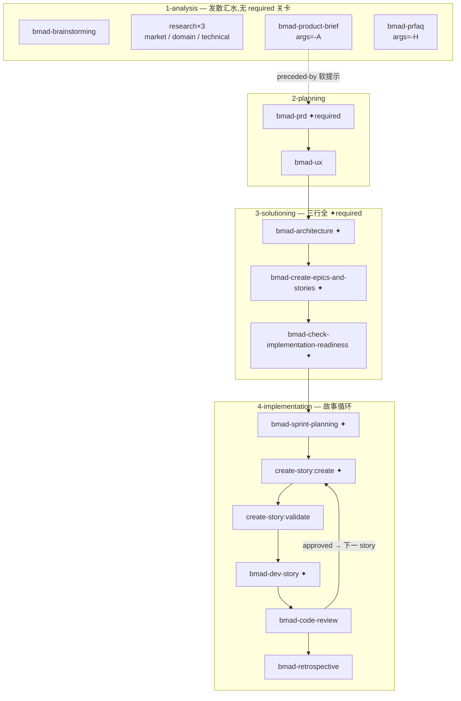

# 13. 四阶段交付流水线

## 一句话定位

BMM 模块把 `module-help.csv` 里的四个路由字段——`phase` / `preceded-by` / `followed-by` / `required`——织成一张从 analysis 到 implementation 的技能路由图;这是 BMAD 对"plan 模式 / 结构化工作流"的方法论层实现:它不是跑在进程里的状态机,而是一张声明式的技能间路由表,由宿主 agent 在激活技能时读取并服从。

## 心智模型

理解这张流水线,最要紧的一点是:**图里没有任何运行时**。没有 `switch(phase)`、没有强制转移的代码、没有锁住前进步骤的权限门。四阶段纯粹是**数据**——每个技能在 CSV 里登记自己属于哪个 `phase`、之前该跑什么(`preceded-by`)、之后该交给谁(`followed-by`)、是不是必经关卡(`required`)。宿主 agent 读这张表,在完成一个技能后顺着 `followed-by` 的指针提议下一个技能,在遇到 `required=true` 时把它当成"不能跳过"的关卡对待。

可以把四个阶段想成一条河流的四级落差:

- **第一级 analysis** 是开阔的汇水区,多条支流(头脑风暴、各类研究、brief、prfaq)并行汇入,没有强制关卡;
- **第二、三级 planning / solutioning** 落差收窄,`required` 关卡开始出现,水流必须依次穿过 PRD、architecture、epics、readiness 几道闸;
- **第四级 implementation** 落入一个反复回旋的涡流——故事循环(create-story → dev-story → code-review → 下一 story),直到 epic 收尾走向 retrospective。

表里还有一条与主流水线正交的"外环":`phase=anytime` 的技能(`bmad-quick-dev`、`bmad-correct-course`、`bmad-document-project` 等)不属于任何阶段,随时可调。其中 `bmad-quick-dev` 是把整条流水线压扁成"意图进、代码出"的捷径,`bmad-correct-course` 是中途纠偏的逃生舱。它们与四阶段共享同一张表,却不被阶段约束——这是"声明式路由"的弹性所在:一张表既容纳严格主干,又容纳松散外环。



图中 `✦` 标 `required=true` 的关卡,实线为 `followed-by` 主流,虚线为 `preceded-by` 软提示,`CR → CSC` 的回边就是故事循环。

## 源码走读

### 13.1 模块自述:四阶段即方法论骨架

> `src/bmm-skills/module.yaml:3`
>
> ```yaml
> description: "Full-lifecycle AI agile development: analysis, planning, architecture, implementation"
> ```

`module.yaml` 的一行 `description` 把整个 BMM 模块的卖点压缩成四个词:analysis、planning、architecture、implementation。注意措辞与 CSV 里的 phase 标签略有出入——模块自述用旗舰技能的名字(architecture)指代第三阶段,而路由表里这一阶段叫 `3-solutioning`。这种"阶段名 vs 旗舰技能名"的轻微错位是有意的:对外讲方法论时用工程师熟悉的概念(架构),对内路由时用一个更宽泛的过程名(solutioning,涵盖架构 + 拆 epic + 就绪检查)。

### 13.2 路由表的数据契约

> `src/bmm-skills/module-help.csv:1`
>
> ```
> module,skill,display-name,menu-code,description,action,args,phase,preceded-by,followed-by,required,output-location,outputs
> ```

13 列里真正承担"流水线编排"的是后五列:`phase` 给技能盖上阶段戳,`preceded-by` / `followed-by` 是前后向指针,`required` 标记关卡,`output-location` 把产物归到阶段目录。把编排逻辑下沉成纯数据列的好处是:任何工具(菜单渲染器、help 目录、宿主路由逻辑)都能用同一种方式解析这张表,无需理解一段编排代码;前置几列(skill / display-name / menu-code / description / action / args)服务的则是"技能本身怎么被调用与展示"。带 `action` 列还顺带支持了"同一技能多种动作"——这一点在第四阶段的故事循环里会看到关键用法。

### 13.3 第一阶段 analysis:发散,无关卡

> `src/bmm-skills/module-help.csv:16`(description 列省略,仅示路由字段)
>
> ```
> skill              args  phase        preceded-by  followed-by  required
> bmad-product-brief -A    1-analysis                             false
> bmad-prfaq         -H    1-analysis                             false
> ```

phase 1-analysis 的六行(`bmad-brainstorming`、`market/domain/technical-research`、`product-brief`、`prfaq`)全部 `required=false`、全部没有 `preceded-by`。也就是说这一阶段是**并行入口**:用户可从任意一支开始,也可都做。其中 `product-brief` 与 `prfaq` 互为替代——CSV 里通过描述文字("alternative to product brief")和不同的 `args` 标志(`-A` / `-H`)区分两种进入产品概念的方式:brief 是温和的"我已想清楚,帮我成文",prfaq 是严苛的 Working Backwards gauntlet。这种"替代关系靠描述 + 参数标志表达,而非靠显式的 `alternative-of` 字段"是这张路由表的一个特点:它不试图穷举所有关系语义,把"哪种更合适"留给 LLM 在激活时判断。

### 13.4 第二、三阶段:required 关卡链

> `src/bmm-skills/module-help.csv:18`(description 列省略,仅示路由字段)
>
> ```
> skill                                phase           preceded-by                  followed-by  required
> bmad-prd                             2-planning      bmad-product-brief                         true
> bmad-ux                              2-planning      bmad-prd                                   false
> bmad-architecture                    3-solutioning                                              true
> bmad-create-epics-and-stories        3-solutioning   bmad-architecture                          true
> bmad-check-implementation-readiness  3-solutioning   bmad-create-epics-and-stories              true
> ```

从 phase 2 开始 `required=true` 出现,并形成一条靠 `preceded-by` 串起来的链:`bmad-product-brief → bmad-prd → bmad-ux → bmad-architecture → bmad-create-epics-and-stories → bmad-check-implementation-readiness`。注意 `required` 与 `preceded-by` 是两个正交的维度:`required` 回答"能不能跳过"(不能),`preceded-by` 回答"建议先做谁"。于是 PRD 是 `required` 而 ux 不是——你可以不做 UX 直奔架构,但 PRD 躲不过。phase 3-solutioning 三行全 `required`,是整条流水线最"硬"的一段:架构 → 拆 epic/story → 就绪检查,三道闸缺一不可,任一缺失即意味着"还没准备好实现"。

### 13.5 第四阶段 implementation:故事循环

> `src/bmm-skills/module-help.csv:25`(description 列省略,仅示路由字段)
>
> ```
> skill             action    phase             preceded-by                followed-by                required
> bmad-create-story create    4-implementation  bmad-sprint-planning       bmad-create-story:validate true
> bmad-create-story validate  4-implementation  bmad-create-story:create   bmad-dev-story             false
> bmad-dev-story              4-implementation  bmad-create-story:validate                            true
> bmad-code-review            4-implementation  bmad-dev-story                                        false
> ```

phase 4 的精髓在 `bmad-create-story` 这一行:它用 `bmad-create-story:validate` / `bmad-create-story:create` 这种带冒号的写法,把同一个技能的两种 `action` 编码成两个路由节点。`create`(起故事)→ `validate`(校验)→ `dev-story`(实现)→ `code-review`(评审)构成内层循环;`code-review` 的描述里写明"if issues back to DS if approved then next CS or ER if epic complete"——approved 时回到 `create-story` 起下一个故事, epic 完成时走向 `retrospective`。这是整张表里唯一真正的"循环"结构,但它仍然不是代码里的 `while` 循环:它是 `followed-by` 指针 + 描述里的条件文字,由宿主 agent 在每次 `code-review` 后判断走向。`required` 关卡在此阶段落在 `sprint-planning`、`create-story:create`、`dev-story` 三处——计划、起故事、执行故事三者不可跳,而 `validate`、`code-review`、`retrospective` 可选。

### 13.6 阶段到产物的物理映射

阶段的划分不仅体现在路由表里,还体现在磁盘布局上。`module.yaml` 把产物目录也按阶段切开:

> `src/bmm-skills/module.yaml:28`
>
> ```yaml
> planning_artifacts: # Phase 1-3 artifacts
>   prompt: "Where should planning artifacts be stored? (Brainstorming, Briefs, PRDs, UX Designs, Architecture, Epics)"
>   default: "{output_folder}/planning-artifacts"
>   result: "{project-root}/{value}"
>
> implementation_artifacts: # Phase 4 artifacts and quick-dev flow output
>   prompt: "Where should implementation artifacts be stored? (Sprint status, stories, reviews, retrospectives, Quick Flow output)"
>   default: "{output_folder}/implementation-artifacts"
>   result: "{project-root}/{value}"
> ```

行尾注释明确把 `planning_artifacts` 标为 Phase 1-3、`implementation_artifacts` 标为 Phase 4;两段 `prompt` 括号里列举的产物(Brainstorming/Briefs/PRDs/.../Epics vs Sprint status/stories/reviews/retrospectives)也正好按阶段对齐。于是"是否进入实现"这件事在文件系统里肉眼可辨——前三阶段的规划产物与第四阶段的实现产物物理隔离。这两个目录又被声明式地交给安装器去创建:

> `src/bmm-skills/module.yaml:43`
>
> ```yaml
> # Directories to create during installation (declarative, no code execution)
> directories:
>   - "{planning_artifacts}"
>   - "{implementation_artifacts}"
>   - "{project_knowledge}"
> ```

注释里那句 `declarative, no code execution` 几乎是全书脊梁的缩影:建目录这件事本可以写成一段 Python,但 BMAD 选择把它列成数据,让安装器(见[第 02 章](../第一部分-基础篇/02-安装器入口-心跳起搏.md))在安装期确定性地产出。阶段边界因此从路由表一路贯穿到目录结构,且全程不依赖 LLM 自由发挥。

## 设计决策与权衡

1. **路由即数据,而非代码**。`phase` / `preceded-by` / `followed-by` 是 CSV 列,由确定性解析读出,没有一段编排逻辑被编译进任何二进制。代价是:阶段转移不被运行时强制——若宿主 agent 无视 `preceded-by` 直接跳到 implementation,没有任何代码会拦截它。BMAD 用 SKILL.md 的文字指令 + 这张表的显眼程度来"说服"而非"强制" LLM。这是方法论 harness 与运行时 harness 的根本取舍:用约束力换可移植性(同一张表能装进任何宿主)。

2. **required 是软关卡**。`required=true` 标记必经,但它本身只是一行布尔数据;真正让它生效的是宿主 agent 在激活该技能时被要求"检查前置是否齐备"。BMAD 选择不造一个硬状态机,而是把"关卡"建模成数据 + 技能内的自检步骤——`bmad-check-implementation-readiness` 这个技能本身,就是 phase 3 末尾那道关卡的自检脚本化。

3. **循环用指针 + 条件文字表达**。故事循环没有循环结构,只有 `create-story:validate` 的 `followed-by=bmad-dev-story` 与 `code-review` 描述里的条件分支。好处是表保持扁平(每行一个节点);代价是循环语义要靠读者把多行 + 描述拼起来才看得清——这正是本章 Mermaid 图存在的理由。

4. **替代关系靠描述而非字段**。brief vs prfaq 的互斥没有专门列,靠描述里的"alternative to"和 `args` 标志传递。牺牲了机器可读的精确性,换取了表的简洁——替代判断本就高度依赖上下文,交给 LLM 比交给一个 `alternative-of` 列更合适。

## 与 Claude Code harness 的对照

Claude Code 的 plan 模式是一种**运行时模式**:进入后,工具调用被二进制内的权限管线约束,exit mode 之前不能写文件。它的"结构化"靠的是进程里真实生效的代码。BMAD 的四阶段流水线没有任何对应的运行时模式切换——阶段只是技能上的一个标签,宿主 agent 始终在同一个对话循环里,只是"当前该激活哪个技能"由这张路由表提示。换言之:Claude Code 用二进制约束"能不能做",BMAD 用声明式路由表提示"接下来该做什么";前者是硬围栏,后者是软路标。

故事循环是两者形态最接近的地方:Claude Code 的 agent loop 是 `while(true)` 真循环,BMAD 的 create-story → dev-story → code-review → create-story 是靠 `followed-by` 指针拼出来的"声明式循环"。但二者机制完全不同——前者由进程驱动,后者由 LLM 在每次技能结束时读表并自行决定是否回到起点。这正呼应了[前言](../00-前言与范式总论.md)的脊梁:BMAD 不跑 agent loop,它把 loop 的"形状"编码进数据,让宿主的 loop 去跑。

## 小结

四阶段流水线是 BMM 模块的方法论主干:`phase` 给技能盖章,`preceded-by` / `followed-by` 织出前后向路由,`required` 标出关卡,产物目录按阶段物理隔离,且建目录本身也是声明式数据。这一切都是 `module-help.csv` 与 `module.yaml` 里的纯数据,没有运行时状态机——BMAD 把"结构化工作流"做成了声明式技能图,而非一段编排代码。下一章将深入第四阶段的那段涡流:故事循环(create-story / dev-story / code-review)如何在指针与条件文字之间真正转起来,以及 `required` 关卡在技能内部如何被自检步骤落地。

下一章 → [第 14 章](../第四部分-工程实践篇/14-实现循环与故事周期.md)
