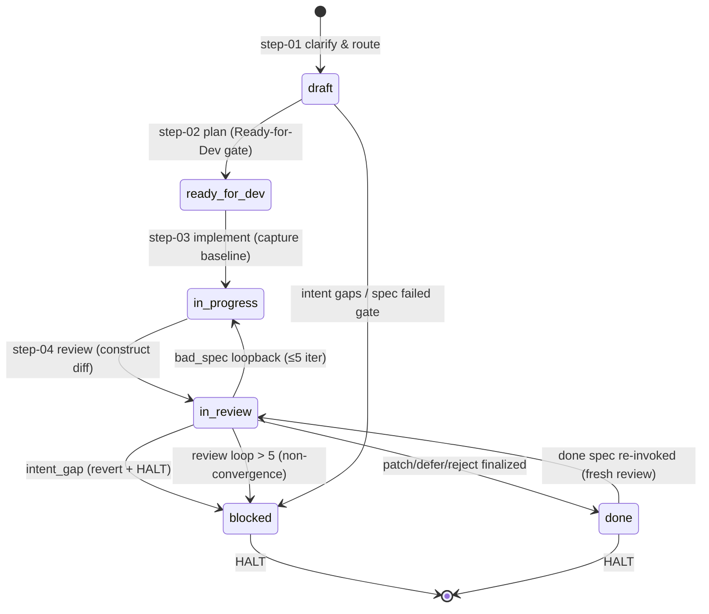

# 14. 开发循环 — dev-auto 与 quick-dev

## 14.1 一句话定位

`bmad-dev-auto` 是 BMAD 四阶段流水线在 implementation 阶段的**无人值守开发循环**——它把"澄清意图→规划→实现→审查"织成一条由 spec frontmatter `status` 驱动的状态机,在宿主 agent 上一口气跑完,中途不向人类提问;`bmad-quick-dev` 则是同一套骨架的**有人值守变体**,在检查点暂停等待人类,并在末尾追加 step-05 生成可点击的 review trail。两者共同构成了"harness 驱动宿主跑循环"这一范式最完整的样本。

## 14.2 心智模型:spec 是状态机,步骤是迁移函数

理解 dev-auto 的关键,是把它看作一台**以 spec 文件为状态寄存器的有限状态机**:

- **状态**存在 spec frontmatter 的 `status` 字段里:`draft → ready-for-dev → in-progress → in-review → done`(外加 `blocked` 这个终止陷阱态)。
- **迁移函数**是四个 step 文件。每个 step 读入当前状态、执行确定性动作、写回新状态,然后把控制权交给下一个 step(或回环)。
- **循环回路**在 step-04 review 里:审查若发现 `bad_spec`,回退到 step-03 重新派生代码,再回到 step-04——直到收敛或触发非收敛保护(5 次上限)。
- **HALT 协议**是唯一的退出契约:无论正常完成、阻塞还是非收敛,都通过 HALT 写回 status 并停机。



quick-dev 复用 step-01 到 step-04 的骨架,但在每个 step 里保留了**等待人类输入的检查点**(`WAIT FOR INPUT`),并在 step-04 之后插入 step-05 present——把 diff 重新组织成"按关注点排序的可点击 review trail",交还人类评审。dev-auto 与 quick-dev 的差异,本质是**同一状态机的两种运行模式**:自动挡与手动挡。

## 14.3 源码走读

### 14.3.1 SKILL.md:无人值守循环的骨架与 HALT 协议

dev-auto 的 `SKILL.md` 开篇就锁死了两条不可违背的约束:目标是无人工干预地产出 hardened artifact,以及"step 说读哪个文件就必须读哪个文件"。

> `src/bmm-skills/4-implementation/bmad-dev-auto/SKILL.md:8`
>
> ```markdown
> **Goal:** Turn intent into a hardened, reviewable artifact, without human interaction.
>
> **CRITICAL:** If a step says "read fully and follow step-XX", you read and follow step-XX. No exceptions.
> ```

"without human interaction" 是 dev-auto 与 quick-dev 的分水岭。这句目标声明把整个技能推向了无人值守模式:任何需要人类决策的岔路都必须走 HALT,而非就地提问。而 "read fully and follow" 这条 CRITICAL 规则,是 BMAD 用自然语言实现"指令指针"的手段——step 文件之间的跳转不靠代码调度器,靠的是 LLM 读完一个文件后严格服从其中的 `./step-XX.md` 引用。这是 step-file 架构的运行时基础。

HALT 协议是这台状态机唯一的退出契约,它规定停机时必须做的四件事:

> `src/bmm-skills/4-implementation/bmad-dev-auto/SKILL.md:14`
>
> ```markdown
> To HALT with a final status and optional blocking condition:
> 1. If `{spec_file}` is known and exists, update `status` in frontmatter and append missing result details under `## Auto Run Result`.
> 2. If `{spec_file}` is unknown or missing, create `{implementation_artifacts}/bmad-dev-auto-result-<slug-or-timestamp>.md` ...
> 3. Run: `python3 {project-root}/_bmad/scripts/resolve_customization.py --skill {skill-root} --key workflow.on_complete`
> 4. If the resolved `workflow.on_complete` is non-empty, follow it as the final instruction before exiting.
> 5. Stop the workflow.
> ```

HALT 的设计动机是**让每次停机都可审计**:status 写回 frontmatter,结果追加到 spec,再跑一次 `resolve_customization.py` 解析 `on_complete` 钩子——这是三层定制化(见[第 7 章](../第二部分-核心系统篇/07-定制化与三层合并.md))在循环出口处的最后一次介入点。即便 spec 文件尚未建立(极早阻塞),也要创建一个 result 文件落盘,绝不"静默退出"。第 3 步调用确定性脚本而非让 LLM 自行决定收尾动作,延续了 BMAD "把不该交给 LLM 的逻辑下沉为脚本"的一贯路线。

SKILL.md 还内联了 Ready-for-Dev 标准与 subagent 强制要求:

> `src/bmm-skills/4-implementation/bmad-dev-auto/SKILL.md:36`
>
> ```markdown
> A specification is "Ready for Development" when:
> - **Actionable**: Every task has a file path and specific action.
> - **Logical**: Tasks ordered by dependency.
> - **Testable**: All ACs use Given/When/Then.
> - **Complete**: No placeholders or TBDs.
> - **Sufficient**: No known requirement, acceptance, dependency, or implementation gaps remain unresolved.
> - **Coherent**: No unresolved ambiguities or internal contradictions.
> ```

这六条标准(下文记作 ALTS²C)是 step-02 质量门的判据,也是 step-04 triage 区分 `bad_spec` 与 `intent_gap` 的概念基础:如果一个缺陷"spec 本该写清楚却没写清楚",归 `bad_spec`;如果"意图本身就缺失",归 `intent_gap`。这个二分法的源头就在这里。

### 14.3.2 step-01 clarify-and-route:spec status 驱动的路由

step-01 是整台状态机的入口,也是唯一做"分流"的步骤。它先做 intent check,若调用意图已指向一个带 `status` 的 spec,就**按 status 早退**到对应 step:

> `src/bmm-skills/4-implementation/bmad-dev-auto/step-01-clarify-and-route.md:18`
>
> ```markdown
> If the invocation prompt explicitly points to an existing spec file with recognized `status` frontmatter, set `spec_file`, then **EARLY EXIT** to the appropriate step:
> - `draft` → `./step-02-plan.md`
> - `ready-for-dev` or `in-progress` → `./step-03-implement.md`
> - `in-review` → `./step-04-review.md`
> - `blocked` → HALT with status `blocked` and blocking condition `blocked spec supplied`.
> - `done` → set `review_loop_iteration` to `0` in the frontmatter, then **EARLY EXIT** to `./step-04-review.md` for a fresh review pass.
> ```

这段是状态机的迁移表本体。注意几个设计细节:第一,`ready-for-dev` 与 `in-progress` 共享同一条迁移(都进 step-03),因为前者是首次实现、后者是 review 回环后的重新实现,对 implement 步骤而言无差别。第二,`done` 不是真终态——重新调用会重置 `review_loop_iteration` 并跳 step-04 做一次全新审查,把"已完成"当作"可复审"的起点。第三,`blocked` 是陷阱态:人类交回一个 blocked spec 并不会自动恢复,而是再次 HALT,强迫人类先解除阻塞条件。EARLY EXIT 机制让 dev-auto 具备**幂等可恢复性**:循环在任何一步被中断后,重新调用会从 status 指示的位置继续,而非从头跑。

对于全新意图(spec 不存在),step-01 要澄清意图并建立上下文。它区分两条路径——epic story path 与 freeform path:

> `src/bmm-skills/4-implementation/bmad-dev-auto/step-01-clarify-and-route.md:39`
>
> ```markdown
> 2. **Check for a valid cached epic context.** Look for `{implementation_artifacts}/epic-<N>-context.md` ... A file is **valid** when it exists, is non-empty, starts with `# Epic <N> Context:` (with the correct epic number), and no file in `{planning_artifacts}` is newer.
>    - **If valid:** load it as the primary planning context. Do not load raw planning docs (PRD, architecture, UX, etc.).
>    - **If missing, empty, or invalid:** compile it in the next bullet.
> 3. **Compile epic context if needed.** ... spawning a subagent with `./compile-epic-context.md` as its prompt.
> ```

epic context 是一个**缓存层**:把 PRD、架构、UX 等散落的规划文档蒸馏成一个 context 文件,避免每次实现都重新消化全套规划文档。有效性校验用"planning_artifacts 里没有更新的文件"作为失效条件——一个纯文件时间戳比较的失效策略,简单但足以覆盖"规划文档改了就得重编译"的常见场景。编译工作交给 subagent,是为了不让原始文档把主循环的上下文撑爆(context snowballing)。

step-01 末尾的路由逻辑确定了 `spec_file` 路径,并处理重名:

> `src/bmm-skills/4-implementation/bmad-dev-auto/step-01-clarify-and-route.md:60`
>
> ```markdown
> Derive a valid kebab-case slug from the clarified intent. If the intent references a tracking identifier (story number, issue number, ticket ID), lead the slug with it (e.g. `3-2-digest-delivery`, `gh-47-fix-auth`). If `{implementation_artifacts}/spec-{slug}.md` already exists: if its status is `draft`, treat it as the same work and resume it ... otherwise append `-2`, `-3`, etc. Set `spec_file` = `{implementation_artifacts}/spec-{slug}.md`.
> ```

slug 以 tracking identifier 打头,让 spec 文件名天然可追溯。重名时只在 `draft` 状态下视为"同一工作的续作"并复用,其余状态一律 `-2`、`-3` 递增——避免把一个已实现或已审查的 spec 覆盖掉。

### 14.3.3 step-02 plan:Ready-for-Dev 质量门

step-02 把意图填进 spec 模板,然后用 ALTS²C 六标准做门禁。它的第一个动作是保护已存在的 intent-contract:

> `src/bmm-skills/4-implementation/bmad-dev-auto/step-02-plan.md:14`
>
> ```markdown
> 1. Draft resume check. If `{spec_file}` exists with `status: draft`, read it and capture the verbatim `<intent-contract>...</intent-contract>` block as `preserved_intent_contract`. Otherwise `preserved_intent_contract` is empty.
> ...
> 3. Read `./spec-template.md` fully. Fill it out based on the intent and investigation. If `{preserved_intent_contract}` is non-empty, substitute it for the `<intent-contract>` block in your filled spec before writing.
> ```

`<intent-contract>` 是 spec 中**只读的意图核心**(下节详述)。draft 恢复时,即便 spec 其余部分被重写,intent-contract 也必须逐字保留——因为 step-04 在 `bad_spec` 回环时只会修改 contract 之外的部分,contract 的稳定性是整个回环逻辑的前提。代码库调查交给 subagent 并要求"只给蒸馏摘要",同样是上下文管控。

质量门本身是一个"修复一次,再验一次"的两段式门禁:

> `src/bmm-skills/4-implementation/bmad-dev-auto/step-02-plan.md:21`
>
> ```markdown
> ### READY-FOR-DEVELOPMENT GATE
> Re-read `./SKILL.md`, then re-read `{spec_file}` from disk and verify the spec meets the READY FOR DEVELOPMENT standard.
> - **If the spec meets the standard:** set `{spec_file}` frontmatter status to `ready-for-dev`, then continue to step 3.
> - **If the spec does not meet the standard:** repair it once, then re-read it from disk and verify again. If it still does not meet the standard, HALT with status `blocked`, blocking condition `spec failed ready-for-development standard` ...
> ```

"re-read from disk" 不是冗余——它防止 LLM 用内存里的旧版本自我蒙蔽。修复只给一次机会:通过则放行,否则直接 HALT。这是 BMAD 对 LLM 自我评估可信度的清醒判断:允许一次自纠,但不允许无限自纠。门禁通过后 status 置 `ready-for-dev`,状态机迁移到 step-03。

### 14.3.4 step-03 implement:baseline revision 与 subagent 交接

step-03 是最短的一个步骤,却承载了两个关键不变量:baseline 锚定与实现-审查的可回溯性。

> `src/bmm-skills/4-implementation/bmad-dev-auto/step-03-implement.md:18`
>
> ```markdown
> ### Baseline
> Capture `baseline_revision` (current HEAD, or `NO_VCS` if version control is unavailable) into `{spec_file}` frontmatter before making any changes.
>
> ### Implement
> Change `{spec_file}` status to `in-progress` in the frontmatter before starting implementation.
> ...
> Hand `{spec_file}` to an implementation subagent.
> ```

`baseline_revision` 必须在**任何代码改动之前**写入 frontmatter——它是 step-04 构造 diff 的锚点。这个顺序约束无法用代码强制,只能靠 SKILL.md 的指令纪律,但它一旦被遵守,review 步骤就能可靠地拿到"本次改动全貌"。`NO_VCS` 兜底让技能在无版本控制环境仍可降级运行(best-effort diff),体现了 BMAD 对非理想环境的容忍。

实现交由 subagent 完成,主循环只做验收:

> `src/bmm-skills/4-implementation/bmad-dev-auto/step-03-implement.md:33`
>
> ```markdown
> After the implementation subagent returns, verify every task in the `## Tasks & Acceptance` section of `{spec_file}` is complete and every acceptance criterion is satisfied. Mark each finished task `[x]`. If any task is not done or any acceptance criterion is not satisfied, finish the missing work before proceeding. If the missing work cannot be completed, HALT with status `blocked`, blocking condition `implementation verification failed` ...
> ```

主循环把 spec 当作"合同"交给 subagent,subagent 返回后逐条核对 Tasks & Acceptance。这种"主循环当监工、subagent 当施工队"的分工,是 BMAD 控制 LLM 上下文膨胀的核心手法:subagent 在隔离的上下文里写代码,主循环只持有 spec 与验收结论,不会被实现细节淹没。

### 14.3.5 step-04 review:对抗式双猎手与五类 triage

step-04 是整台循环最复杂、也最能体现"harness 约束 LLM"的步骤。它先构造 diff,然后**并行**启动两个对抗式审查 subagent:

> `src/bmm-skills/4-implementation/bmad-dev-auto/step-04-review.md:25`
>
> ```markdown
> Launch Blind Hunter and Edge Case Hunter in parallel without prior conversation context.
> - **Blind Hunter** — prompt:
>   > Invoke the `bmad-review-adversarial-general` skill on this diff:
>   > {diff_output}
> - **Edge Case Hunter** — prompt:
>   > Invoke the `bmad-review-edge-case-hunter` skill on this diff:
>   > {diff_output}
> ```

"without prior conversation context" 是关键:两个审查 subagent 不继承实现阶段的任何上下文,只看 diff——这模拟了真实代码评审者"只看改动"的视角,避免审查者被实现者的叙事带偏。并行启动 Blind Hunter(通用对抗)与 Edge Case Hunter(边界专项)形成双盲交叉审查。注意 diff 构造阶段明确禁止 `git add`("Do NOT `git add` anything — this is read-only inspection"),把审查与暂存彻底隔离。

审查完成后进入 triage——这是 step-04 的智慧核心。所有发现被去重、赋严重度,然后归入五类,其中前三类"是本故事的问题",后两类"不是本故事的问题":

> `src/bmm-skills/4-implementation/bmad-dev-auto/step-04-review.md:44`
>
> ```markdown
> - **intent_gap** — caused by the change; cannot be resolved from the spec because the captured intent is incomplete. Do not infer intent unless there is exactly one possible reading.
> - **bad_spec** — caused by the change, including direct deviations from spec. The spec should have been clear enough to prevent it. When in doubt between bad_spec and patch, prefer bad_spec ...
> - **patch** — caused by the change; trivially fixable without human input. Just part of the diff.
> - **defer** — pre-existing issue not caused by this story, surfaced incidentally by the review. Collect for later focused attention.
> - **reject** — noise. Drop silently. When unsure between defer and reject, prefer reject ...
> ```

triage 分类的精髓在于**因果归属**:同一个缺陷,根因在 intent-contract 内→`intent_gap`(人类漏给意图,必须 HALT);根因在 contract 外→`bad_spec`(spec 写得不够清楚,修 spec 再重派生);实现层面的小错→`patch`(直接修);与本故事无关的既有问题→`defer`(记入 deferred-work);噪声→`reject`(丢弃)。两条"悬而未决时偏好"规则(`bad_spec` > `patch`、`reject` > `defer`)体现了倾向收敛的工程判断:优先做 spec 级修复以产生更连贯的代码,优先丢弃以避免 deferred-work 膨胀。

triage 之后按**级联顺序**处理:

> `src/bmm-skills/4-implementation/bmad-dev-auto/step-04-review.md:67`
>
> ```markdown
> Process findings in cascading order. If intent_gap exists, lower findings are moot; follow the intent_gap branch below. If bad_spec exists, lower findings are moot since code will be re-derived. If neither exists, process patch and defer normally. Before each bad_spec loopback, read `{spec_file}` frontmatter `review_loop_iteration` (missing means `0`), increment it by 1, and write it back. If it exceeds 5, ... HALT with status `blocked` and blocking condition `review repair loop exceeded 5 iterations (non-convergence)`.
> ```

级联的意思是:只要存在 `intent_gap`,其下的 `bad_spec`/`patch`/`defer` 都失效(代码会被 revert);只要存在 `bad_spec`,`patch`/`defer` 也失效(代码会被重新派生)。`bad_spec` 触发回环:revert 代码 → 修 spec(记入 Spec Change Log)→ 重跑 step-03 → 再回 step-04。`review_loop_iteration` 是非收敛保护:超过 5 次就判定回环不收敛,HALT。这个上限是 BMAD 对"LLM 反复修同一处却修不好"的护栏——它不假定 LLM 能无限自我修正,而是设定一个理性的熔断阈值。

`bad_spec` 回环时的 spec 修复有一套严格的 KEEP 机制:

> `src/bmm-skills/4-implementation/bmad-dev-auto/step-04-review.md:69`
>
> ```markdown
> - **bad_spec** — Root cause is outside `<intent-contract>`. Do not modify content inside `<intent-contract>`. Before reverting code: extract KEEP instructions for positive preservation (what worked well and must survive re-derivation). Revert code changes. Read the `## Spec Change Log` ... strictly respect all logged constraints when amending the sections outside `<intent-contract>` ...
> ```

revert 之前先提取 KEEP——把"上一轮实现中做对了、必须在重派生中保留的部分"显式记下,避免重新实现时把好的部分一起扔掉。Spec Change Log 是 append-only 的约束账本:每次 spec 修订都记录触发 finding、修订内容、规避的已知坏状态、KEEP 指令,后续修订必须"严格尊重"已有条目。这让回环不是简单的"推倒重来",而是"带着约束的重新派生",每轮都在累积约束而非丢失信息。

### 14.3.6 spec-template.md:intent-contract 与 append-only 日志

spec 模板是状态机的状态寄存器结构。frontmatter 承载所有机器可读的状态字段:

> `src/bmm-skills/4-implementation/bmad-dev-auto/spec-template.md:1`
>
> ```markdown
> ---
> title: '{title}'
> type: 'feature' # feature | bugfix | refactor | chore
> status: 'draft' # draft | ready-for-dev | in-progress | in-review | done | blocked
> review_loop_iteration: 0 # incremented by step-04 before each review loopback
> followup_review_recommended: false # set by step-04 on status: done ...
> context: [] # optional: `{project-root}/`-prefixed paths ...
> warnings: [] # optional: machine-readable warnings ...
> ---
> ```

`status` 是状态机的主轴,`review_loop_iteration` 是回环计数器,`followup_review_recommended` 是 done 时的后续建议标志,`context` 是实现期要加载的项目级文档引用,`warnings`(如 `oversized`、`multiple-goals`)是给编排层的机器可读信号。这些字段让 spec 不仅是人读的设计文档,更是可被 step 逻辑解析的状态载体。

模板的核心结构是 `<intent-contract>` 块——spec 中唯一在 review 回环里**只读**的部分:

> `src/bmm-skills/4-implementation/bmad-dev-auto/spec-template.md:17`
>
> ```markdown
> <intent-contract>
> ## Intent
> **Problem:** ONE_TO_TWO_SENTENCES
> **Approach:** ONE_TO_TWO_SENTENCES
> ## Boundaries & Constraints
> **Always:** INVARIANT_RULES
> **Block If:** DECISIONS_REQUIRING_HUMAN_INPUT
> **Never:** NON_GOALS_AND_FORBIDDEN_APPROACHES
> ## I/O & Edge-Case Matrix
> | Scenario | Input / State | Expected Output / Behavior | Error Handling |
> </intent-contract>
> ```

intent-contract 把意图固化成 Problem/Approach + Always/Block If/Never 三层边界 + I/O 矩阵。`Block If` 字段直接接 HALT:执行中一旦触发这些"需人类决策"条件就阻塞停机。这个块之所以只读,是因为它是意图的**不可动基线**——step-04 判定 `intent_gap` 时,根因落在这个块内意味着"人类给的意图本身不完整",LLM 无权替人类补意图,只能 HALT;而 `bad_spec` 的根因在块外,LLM 有权修订 spec 的其余部分。intent-contract 的只读性,是"什么该让 LLM 自由发挥、什么不该"在文件结构层面的物化。

模板尾部两个 append-only 日志是回环的审计轨迹:

> `src/bmm-skills/4-implementation/bmad-dev-auto/spec-template.md:68`
>
> ```markdown
> ## Spec Change Log
> <!-- Append-only. Populated by step-04 during review loops. Do not modify or delete existing entries.
>      Each entry records: what finding triggered the change, what was amended, what known-bad state
>      the amendment avoids, and any KEEP instructions ... -->
>
> ## Review Triage Log
> <!-- Append-only. Populated by step-04 on EVERY review pass, including loopbacks and blocked exits.
>      Each entry records triage decision counts for intent_gap, bad_spec, patch, defer, and reject ... -->
> ```

Spec Change Log 记录 spec 的演化约束,Review Triage Log 记录每次审查(含回环与阻塞退出)的 triage 统计。两者都禁止修改历史条目——这让一个跑完的 spec 自带完整的决策审计轨迹:读者能回溯"哪一轮 review 发现了什么、归类为什么、修了哪里、保留了什么"。这种自审计性是无人值守循环赢得信任的关键:既然中间没有人类盯着,产物就必须自带不可篡改的过程记录。

### 14.3.7 quick-dev:加回人类检查点与 step-05 present

quick-dev 的 SKILL.md 在目标上与 dev-auto 只差一个词——把"without human interaction"换成"reviewable artifact",并显式声明检查点纪律:

> `src/bmm-skills/4-implementation/bmad-quick-dev/SKILL.md:88`
>
> ```markdown
> ## WORKFLOW ARCHITECTURE
> This uses **step-file architecture** for disciplined execution:
> - **Micro-file Design**: Each step is self-contained and followed exactly
> - **Just-In-Time Loading**: Only load the current step file
> - **Sequential Enforcement**: Complete steps in order, no skipping
> - **State Tracking**: Persist progress via spec frontmatter and in-memory variables
> ...
> ### Critical Rules (NO EXCEPTIONS)
> - **NEVER** load multiple step files simultaneously
> - **ALWAYS** read entire step file before execution
> - **NEVER** skip steps or optimize the sequence
> - **ALWAYS** halt at checkpoints and wait for human input
> ```

quick-dev 的 Critical Rules 比 dev-auto 多了一条"halt at checkpoints and wait for human input"——这是手动挡与自动挡在指令层面的唯一开关。step-file 架构(JIT 加载、顺序强制、微文件)在两者间完全复用:BMAD 把"是否等待人类"做成一个正交维度,不因交互模式不同而重写骨架。

quick-dev 的独有增量是 step-05 present——它把 diff 重新组织成"按关注点排序的可点击 review trail":

> `src/bmm-skills/4-implementation/bmad-quick-dev/step-05-present.md:13`
>
> ```markdown
> Build the trail as an ordered sequence of **stops** — clickable `path:line` references with brief framing — optimized for a human reviewer reading top-down to understand the change:
> 1. **Order by concern, not by file.** Group stops by the conceptual concern they address ...
> 2. **Lead with the entry point** — the single highest-leverage file:line a reviewer should look at first ...
> 3. **Inside each concern**, order stops from most important / architecturally interesting to supporting.
> 4. **End with peripherals** — tests, config, types, and other supporting changes come last.
> 5. **Every code reference is a clickable spec-file-relative link.** ... Format each stop as a markdown link: `[short-name:line](../../path/to/file.ts#L42)`.
> ```

Suggested Review Order 不是按文件排序的 diff,而是**按关注点重组的阅读路径**:入口点优先、概念分组、外围垫后,每个 stop 一行不超过 15 词的框架说明 + 一个 spec-relative 可点击链接。这把"给人类看的 review 体验"从 git diff 的扁平文件列表,升级成了带叙事结构的导览。链接用 spec 文件目录的相对路径动态计算,保证在 VS Code 里可点开——这是 BMAD 把"可审计性"延伸到人类评审体验的设计。

step-05 还负责把 spec 标 done、同步 sprint 状态、提交(不 push)并打开编辑器:

> `src/bmm-skills/4-implementation/bmad-quick-dev/step-05-present.md:57`
>
> ```markdown
> 1. If version control is available and the tree is dirty, create a local commit with a conventional message derived from the spec title.
> 2. Open the spec in the user's editor so they can click through the Suggested Review Order:
>    - Resolve two absolute paths: (1) the repository root (`git rev-parse --show-toplevel` ...), (2) `{spec_file}`. Run `code -r "{absolute-root}" "{absolute-spec-file}"` ...
>    - If `code` is not available (command fails), skip gracefully and tell the user the spec file path instead.
> ```

`code -r` 先开仓库根目录再开 spec 文件,确保 VS Code 在正确的上下文里打开;`code` 不可用时优雅降级为打印路径。末尾的 Display Summary 还会给出"Ctrl+click / Cmd+click 跳转"的导航提示,并主动 offer push 或开 PR——把"代码写完"到"人类接管评审"的最后一公里也照顾到。这与 dev-auto 在 step-04 Finalize 里直接 commit 不 push、HALT done 形成对照:quick-dev 的终点是"把人类请回驾驶座",dev-auto 的终点是"无人值守地把活干完并停机"。

## 14.4 设计决策与权衡

**spec frontmatter 即状态寄存器。** BMAD 没有为 dev-auto 写一个 Python 调度器来跟踪循环进度,而是把状态写进 spec 文件的 frontmatter(`status`、`review_loop_iteration`、`baseline_revision`、`final_revision`)。代价是每次状态迁移都要读写磁盘、且依赖 LLM 诚实地写回;收益是状态天然持久化、可审计、可恢复——循环在任何一步被打断,重新调用就能从 frontmatter 指示的位置续跑。这是"用文件当数据库"的典型权衡,在 LLM agent 场景下尤其合理:LLM 本就没有可靠的内存态,把状态外化到文件反而消除了"记忆漂移"的风险。

**review 回环用 bad_spec 修 spec 而非直接修代码。** 当审查发现"spec 该写清楚却没写清楚"时,dev-auto 选择 revert 代码、修 spec、重新派生,而非在代码上打补丁。代价是回环成本高(重新实现一遍)、可能触发非收敛;收益是每次回环都让 spec 更精确,最终产物是"自洽的 spec + 由它派生的代码",而非"spec + 一堆补丁"。Spec Change Log 的 KEEP 机制与 append-only 约束账本,就是为了把回环从"推倒重来"升级为"带约束的重新派生",让每轮都累积而非丢失信息。5 次熔断是对这个策略的现实护栏——承认 LLM 有修不好的时候。

**triage 的因果归属二分法。** 把"本故事的问题"再二分为 `intent_gap`(根因在 intent-contract,人类的责任)与 `bad_spec`(根因在 contract 外,spec 的责任),是这台循环最精巧的设计。它把"代码错了"这个笼统结论,拆解成"该找谁负责"的明确归属:intent_gap 必须 HALT 交还人类,bad_spec 可以自修回环。这个二分法的可行性,完全依赖 intent-contract 的只读边界——没有那个边界,就无法判断根因"在 contract 内还是外"。这是文件结构与流程逻辑的深度耦合:结构设计支撑了流程决策。

**dev-auto 与 quick-dev 共骨架、异交互模式。** 两者共享 step-01 到 step-04、共享 spec 模板与 Ready-for-Dev 标准,只在"是否等待人类"和"是否有 step-05"上分叉。这把交互模式做成正交维度,避免了为有人/无人值守各写一套流水线。代价是 quick-dev 的 step 文件里混杂了"等待人类"的指令,增加了一些认知负担;收益是核心逻辑只维护一份,演化时不会两条路分叉漂移。

## 14.5 与 Claude Code harness 的对照

Claude Code 的运行时 harness 用一个 `while(true)` 异步生成器驱动对话循环,用工具协议、权限管线、hooks 和上下文压缩来约束 LLM 的每一步行为——循环的"指针"和"调度器"都在二进制里。dev-auto 展示了 BMAD 范式的对照面:它**没有自己的运行时循环**,而是用四个 step 文件 + spec frontmatter `status` 字段,在宿主 agent 的对话循环之上"模拟"出一台状态机。step 之间的跳转靠的是 `read fully and follow ./step-XX.md` 这条自然语言指令,LLM 充当指令指针;状态的持久化靠 spec 文件的读写,而非内存。

更深层的对照在"约束手段"上。Claude Code 用 hooks 在工具调用的前后插入确定性逻辑(如 PreToolUse 拦截),用权限管线决定工具是否放行——这些是**运行时层面的硬约束**。dev-auto 的约束则是**方法论层面的软约束**:HALT 协议、Ready-for-Dev 门禁、triage 分类规则、5 次熔断,全都是写在 Markdown 里的指令,靠 LLM 服从 SKILL.md 来生效;唯一的硬约束出口是 `resolve_customization.py` 这个确定性脚本,在激活与 HALT 时被调用。换言之,Claude Code 的 harness 在二进制里约束"agent 如何运行",dev-auto 的 harness 在 Markdown 里约束"agent 做什么、按什么流程做、何时必须停"。step-04 的对抗式双猎手与 triage 归属,正是这种"用声明式流程替代运行时调度"的极致体现——它把一个本可以写成代码调度器的 review loop,拆解成了 LLM 可读、可审计、可定制的 step 指令。

## 14.6 小结

dev-auto 与 quick-dev 是 BMAD 四阶段流水线在 implementation 阶段的落地:一台以 spec `status` 为状态寄存器、以四个 step 文件为迁移函数的有限状态机,配上一套 HALT 退出契约与 Ready-for-Dev 质量门。step-04 的对抗式双猎手 + 五类 triage + bad_spec 回环,把"代码审查"从一个被动检查升级成了一个带 KEEP 约束、有熔断保护的收敛循环;spec 的 append-only 双日志让无人值守的产物自带不可篡改的审计轨迹。quick-dev 在同一骨架上加回人类检查点与 step-05 review trail,把"可审计"延伸到人类评审体验。两者共同证明了 BMAD 的核心命题:不跑 agent loop,也能用声明式 step 文件驱动宿主跑出一个可控、可恢复、可审计的开发循环。

下一章 → [第 15 章:审查与质量门 — adversarial review 与 edge-case hunter](../第四部分-工程实践篇/15-审查与质量门-adversarial-review与edge-case-hunter.md)
