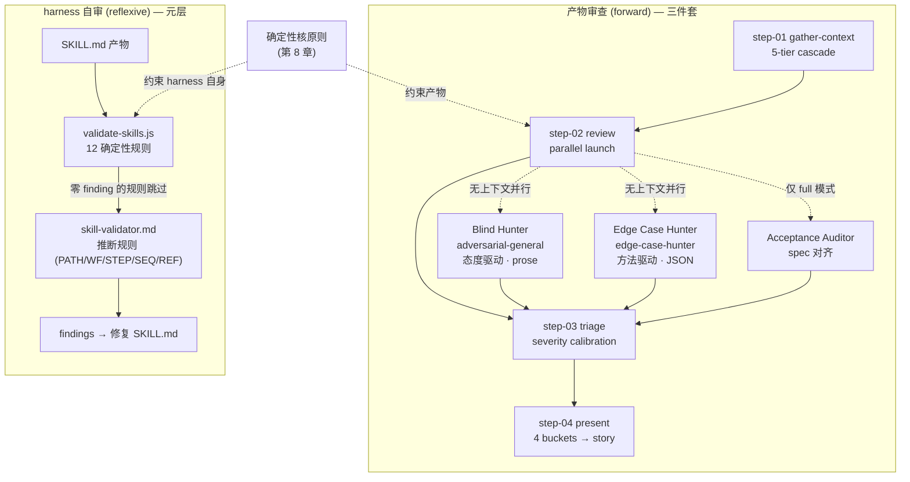

# 15. 质量与审查 — Review 三件套

## 15.1 一句话定位

BMAD 把"代码审查"做成三件可复现的工程能力——`bmad-code-review` 编排、`bmad-review-edge-case-hunter` 方法驱动、`bmad-review-adversarial-general` 态度驱动——而 `validate-skills.js` 把同一套"确定性优先、判断补位"的审查逻辑反身作用于 harness 自身:审查既作用于产物,也作用于定义 harness 的那些 `SKILL.md`。

## 15.2 心智模型

先看清两条审查轴线,再进源码。

第一条是**产物审查(forward)**:`bmad-code-review` 是一个四步编排器,它不在自己体内写审查逻辑,而是把 diff 同时派给三个相互正交的审查层,再由一个 `triage` 步骤统一归一化、评级、分流。三个层各有盲区、互不通气——这是刻意的"信息不对称",让每层只能就 diff 论 diff,不被"已知答案"污染。

第二条是**harness 自审(reflexive)**:因为 BMAD 的行为定义就是一堆 `SKILL.md` 纯文本,它可以用 `validate-skills.js` 对这些产物跑确定性 lint。这是 [第 8 章](../第二部分-核心系统篇/08-确定性解析核-Python约束LLM.md)确定性核原则的反身应用——同一把"用确定性逻辑约束 LLM"的尺子,转过来量 harness 自己。



两条轴线的形状高度同构:都是"低层级机械检查 + 高层级判断"分层,确定性部分先跑、可跳过,判断部分只处理前者筛不出的东西。这正是本章要讲清的范式。

## 15.3 源码走读

### 15.3.1 编排者 `bmad-code-review`:四步骨架与激活

`bmad-code-review` 自己不审查,它只负责"把审查流程钉死成不可压缩的顺序"。它的入口是一个标准的 step-file 架构:

> `src/bmm-skills/4-implementation/bmad-code-review/SKILL.md:65`
>
> ```markdown
> ## WORKFLOW ARCHITECTURE
>
> This uses **step-file architecture** for disciplined execution:
>
> - **Micro-file Design**: Each step is self-contained and followed exactly
> - **Just-In-Time Loading**: Only load the current step file
> - **Sequential Enforcement**: Complete steps in order, no skipping
> - **State Tracking**: Persist progress via in-memory variables
> - **Append-Only Building**: Build artifacts incrementally
> ```

step-file 把审查流程切成互不干扰的微文件,只加载当前步、顺序执行、不可跳过。这与 [第 6 章](../第二部分-核心系统篇/06-技能系统-双手.md) 的技能系统一脉相承——把"流程纪律"这种不该让 LLM 自由发挥的东西,下沉为文件结构约束。激活时它还先调用确定性解析核:

> `src/bmm-skills/4-implementation/bmad-code-review/SKILL.md:26`
>
> ```markdown
> Run: `python3 {project-root}/_bmad/scripts/resolve_customization.py --skill {skill-root} --key workflow`
> ```

这一步把 `workflow` 块按 base → team → user 三层合并解析出来(见 [第 7 章](../第二部分-核心系统篇/07-定制化与三层合并.md)),决定 `activation_steps_prepend/append`、`persistent_facts` 等可被团队/个人覆盖的钩子。审查流程本身是可定制的,但定制点被约束在确定性脚本能解析的结构里。

"不可压缩"被进一步用全大写禁令钉死:

> `src/bmm-skills/4-implementation/bmad-code-review/SKILL.md:82`
>
> ```markdown
> ### Critical Rules (NO EXCEPTIONS)
>
> - **NEVER** load multiple step files simultaneously
> - **ALWAYS** read entire step file before execution
> - **NEVER** skip steps or optimize the sequence
> - **ALWAYS** follow the exact instructions in the step file
> - **ALWAYS** halt at checkpoints and wait for human input
> ```

不准并行预读、不准跳步、不准"优化"顺序、checkpoint 必停。BMAD 把"流程不可压缩"写成强约束的典型手法——LLM 哪怕想走捷径,这些禁令也挡在前面。

### 15.3.2 `gather-context`:五级瀑布定位审查目标

第一步的核心难题是"审什么"。`step-01` 不直接问用户,而是用五级瀑布逐级兜底,命中即停:

> `src/bmm-skills/4-implementation/bmad-code-review/steps/step-01-gather-context.md:18`
>
> ```markdown
> 1. **Find the review target.** The conversation context before this skill was triggered IS your starting point — not a blank slate. Check in this order — stop as soon as the review target is identified:
>
>    **Tier 1 — Explicit argument.**
>    Did the user pass a PR, commit SHA, branch, spec file, or diff source this message?
>    - PR reference → resolve to branch/commit via `gh pr view`. If resolution fails, ask for a SHA or branch.
>    - Commit or branch → use directly.
>    - Spec file → set `{spec_file}` to the provided path. Check its frontmatter for `baseline_commit`. If found, use as diff baseline.
> ```

五级依次是:显式参数 → 近期对话 → sprint 跟踪(`*sprint-status*` 里 status 为 `review` 的 story)→ 当前 git 状态 → 询问。把"该读的上下文其实已经在对话里了"显式化,避免无谓提问;每一级都附带 diff-mode 关键词扫描(staged / uncommitted / branch diff / commit range / provided diff),让"审查范围"也能从自然语言里解析出来。

确定目标后,一个贯穿后续三步的开关被设定:

> `src/bmm-skills/4-implementation/bmad-code-review/steps/step-01-gather-context.md:66`
>
> ```markdown
> 4. **Set the spec context.**
>    - If `{spec_file}` is already set (from Tier 1 or Tier 2): verify the file exists and is readable, then set `{review_mode}` = `"full"`.
>    - Otherwise, ask the user: **Is there a spec or story file that provides context for these changes?**
>      - If yes: set `{spec_file}` to the path provided, verify the file exists and is readable, then set `{review_mode}` = `"full"`.
>      - If no: set `{review_mode}` = `"no-spec"`.
> ```

`{review_mode}` 是整条流水线的总开关:有 spec 才能对齐验收标准(Acceptance Auditor 才会启动),无 spec 则降级为纯代码审查。一个变量决定审查深度——这是 BMAD 用单个 frontmatter 变量承载"流程分支"的常见做法。

### 15.3.3 `review`:三层并行与信息不对称

第二步把 diff 同时派给三个审查层。关键设计是"无上下文并行":

> `src/bmm-skills/4-implementation/bmad-code-review/steps/step-02-review.md:16`
>
> ```markdown
> 2. Launch Blind Hunter and Edge Case Hunter in parallel without prior conversation context. If `{review_mode}` = `"full"`, include the Acceptance Auditor in the same parallel launch. If subagents are not available, generate prompt files in `{implementation_artifacts}` for each applicable reviewer role and HALT.
> ```

"without prior conversation context"是点睛之笔——三层 reviewer 拿到的只有 diff 本身,看不到对话历史、看不到 spec(除了 Acceptance Auditor)。这种信息不对称让每层只能就 diff 论 diff,防止"已知答案"反向污染审查。即使宿主不支持 subagent,它也不退化为单次审查,而是落盘成 prompt 文件、HALT,让用户在**另一个会话(最好是另一个 LLM)**里跑——把"信息隔离"做实到执行环境层面。

失败不阻断流程:

> `src/bmm-skills/4-implementation/bmad-code-review/steps/step-02-review.md:34`
>
> ```markdown
> 3. **Subagent failure handling**: If any subagent fails, times out, or returns empty results, append the layer name to `{failed_layers}` (comma-separated) and proceed with findings from the remaining layers.
> ```

某层挂了就记进 `{failed_layers}`,用幸存层的 finding 继续。这个变量在 `triage` 里会被复用——若结果全清但有过失败层,会警告"审查可能不完整"而不是宣布干净。

### 15.3.4 `triage`:严重度校准(本章重点)

第三步是整套审查的灵魂。三层 reviewer 各报各的,格式还不一样(Blind Hunter 是 prose 列表、Edge Case Hunter 是 JSON、Acceptance Auditor 是 markdown),`triage` 要把它们归一化、去重、评级、分流。评级的核心纪律是"先读码再打分":

> `src/bmm-skills/4-implementation/bmad-code-review/steps/step-03-triage.md:31`
>
> ```markdown
> 3. **Read the code before rating.** Before assigning severity, open the source at each finding's location and read enough surrounding code to judge reachability -- call sites, guards, and validation that live outside the diff hunk. Do not rate from the diff hunk alone. Severity reflects the real consequence at a real call site, not the worst theoretical reading.
> 4. **Assign severity** to each finding by consequence for the artifact's main consumer (software user, document reader, etc).
>    Disregard any severity assigned by a reviewing subagent. Review subagents operate under by-design information asymmetry and do not have enough context to set final severity for this workflow.
>    - `low` -- none or cosmetic
>    - `medium` -- tolerable
>    - `high` -- intolerable
> ```

这段话把 triage 的设计哲学讲透了:严重度**不是 reviewer 给的**,是 triage 阶段重新打开源码、读到调用点和守卫之后才定的。"Disregard any severity assigned by a reviewing subagent"——明确废弃 subagent 自带的评级,因为它们"operate under by-design information asymmetry"。信息不对称是上一步刻意造的特性,那么评级权就必须收归唯一有全量上下文的 triage。严重度只有三档(low/medium/high),且以"真实调用点的真实后果"而非"最坏理论读法"为准——把评级从主观印象锚定到可达性证据上。

分流成四桶,且受 `{review_mode}` 约束:

> `src/bmm-skills/4-implementation/bmad-code-review/steps/step-03-triage.md:39`
>
> ```markdown
> 5. **Route** each finding into exactly one triage bucket:
>    - **decision_needed** -- There is an ambiguous choice that requires human input. The code cannot be correctly patched without knowing the user's intent. Only possible if `{review_mode}` = `"full"`.
>    - **patch** -- Code issue that is fixable without human input. The correct fix is unambiguous.
>    - **defer** -- Pre-existing issue not caused by the current change. Real but not actionable now.
>    - **dismiss** -- Noise, false positive, or handled elsewhere.
>
>    If `{review_mode}` = `"no-spec"` and a finding would otherwise be `decision_needed`, reclassify it as `patch` (if the fix is unambiguous) or `defer` (if not).
> ```

每个 finding 必须落入且仅落入一桶。`decision_needed` 需要 spec 充当"用户意图仲裁者"——没有 spec 它就无法成立,只能降级为 patch 或 defer。`{review_mode}` 的约束在此再次显形:有/无 spec 不仅改变审查深度,还改变 finding 的可处置路径。

### 15.3.5 `present`:四桶落盘与状态回写

第四步把分流结果变成可追踪的产物,而非只丢进对话:

> `src/bmm-skills/4-implementation/bmad-code-review/steps/step-04-present.md:21`
>
> ```markdown
> If `{spec_file}` exists and contains a Tasks/Subtasks section, append a `### Review Findings` subsection. Write all findings in this order:
>
> 1. **`decision-needed`** findings (unchecked):
>    `- [ ] [Review][Decision] <Title> — <Detail>`
>
> 2. **`patch`** findings (unchecked):
>    `- [ ] [Review][Patch] <Title> [<file>:<line>]`
>
> 3. **`defer`** findings (checked off, marked deferred):
>    `- [x] [Review][Defer] <Title> [<file>:<line>] — deferred, pre-existing`
> ```

finding 以带标签(`[Review][Decision/Patch/Defer]`)的 checklist 落进 story 文件,decision/patch 未勾选、defer 已勾选并标记 pre-existing。审查产物因此可追踪、可勾选、可回溯;`defer` 还会同步追加到 `deferred-work.md`,把"既存但暂不处理"的东西从隐形债务变成显式台账。

审查结果直接驱动流水线状态机:

> `src/bmm-skills/4-implementation/bmad-code-review/steps/step-04-present.md:88`
>
> ```markdown
> - If all `decision-needed` and `patch` findings were resolved (fixed or dismissed) AND no unresolved `high`/`medium` findings remain: set `{new_status}` = `done`. Update the story file Status section to `done`.
> - If `patch` findings were left as action items, or unresolved issues remain: set `{new_status}` = `in-progress`. Update the story file Status section to `in-progress`.
> ```

清零 → `done`,有遗留 → `in-progress`,并回写 `sprint-status.yaml`。审查不是终点,而是 [第 14 章](../第四部分-工程实践篇/14-开发循环-dev-auto与quick-dev.md) 开发循环里 story 状态迁移的判据——这就是为什么 `gather-context` 要去读 sprint-status、`present` 要去写 sprint-status:审查嵌在流水线里,而不是孤立的一锤子。

### 15.3.6 `edge-case-hunter`:方法驱动、命名集泛化、deletion-check

三件套的第二件走的是与方法论相反的另一条路——不靠态度,靠机械枚举:

> `src/core-skills/bmad-review-edge-case-hunter/SKILL.md:8`
>
> ```markdown
> **Goal:** You are a pure path tracer. Never comment on whether code is good or bad; only list missing handling.
> ```

> `src/core-skills/bmad-review-edge-case-hunter/SKILL.md:20`
>
> ```markdown
> **Your method is exhaustive path enumeration — mechanically walk every branch, not hunt by intuition. Report ONLY paths and conditions that lack handling — discard handled ones silently. Do NOT editorialize or add filler. Do not assign severity labels, rankings, or priority levels.**
> ```

"pure path tracer""mechanically walk every branch, not hunt by intuition""do not assign severity"——edge-case-hunter 把覆盖度交给流程而非直觉,且明确禁止评好坏、禁止定级。判断全部留给下游 triage,自己只负责"哪里没处理"。这是"方法驱动"的极致:输出结构化 JSON(四个固定字段 `location` / `trigger_condition` / `guard_snippet` / `potential_consequence`),就是为了被 triage 机械归一化。

覆盖度的关键招是"命名集泛化":

> `src/core-skills/bmad-review-edge-case-hunter/SKILL.md:37`
>
> ```markdown
> - Consider implicit branches: the diff special-cases or changes the handling of one or more members of a fixed set of values — enums, status codes, sentinels, type tags, flags, value ranges. The rest of the set is implicit branches (e.g. the diff changes the `RED` and `YELLOW` cases of a `RED`/`YELLOW`/`GREEN` enum; `GREEN` is the implicit branch)
> ```

diff 改了一个固定集合(枚举、状态码、哨兵值、类型标签)里的某些成员,没改的就是"隐式分支",必须检查是否漏处理。这把"枚举的另一半"从盲区变成显式路径——这正是近期 commit `b0d508c7 feat(edge-case-hunter): add named-set generalization pass` 落地的能力,把原本依赖 reviewer 直觉的覆盖点固化成一条机械规则。

当 diff 删除了代码,还会触发一个次要的 deletion-check:

> `src/core-skills/bmad-review-edge-case-hunter/references/deletion-check.md:5`
>
> ```markdown
> For each chunk of removed or replaced code (ignore pure renames and whitespace), ask: did it carry behavior or a contract that the change neither re-established nor intentionally retired? Add a finding for any resulting regression, orphaned reference, or newly-dead code.
> ```

删除审查只问一个问题:被删的代码是否承载了"既未重建、也未有意退役"的行为或契约。把"删代码"这个最容易被略过的操作,变成一次可审计的契约丢失检查。它从属于主路径分析(findings 通常很少),输出并入同一个 JSON 数组,只多两个字段 `kind: "deletion"` 和 `confidence`。

### 15.3.7 `adversarial-general`:态度驱动

第三件走的是与 edge-case-hunter 完全相反的路——靠"怀疑态度"逼出深度:

> `src/core-skills/bmad-review-adversarial-general/SKILL.md:10`
>
> ```markdown
> **Your Role:** You are a cynical, jaded reviewer with zero patience for sloppy work. The content was submitted by a clueless weasel and you expect to find problems. Be skeptical of everything. Look for what's missing, not just what's wrong.
> ```

> `src/core-skills/bmad-review-adversarial-general/SKILL.md:27`
>
> ```markdown
> Review with extreme skepticism — assume problems exist. Find at least ten issues to fix or improve in the provided content.
> ```

"cynical, jaded reviewer""assume problems exist""Find at least ten issues"——它用强制的怀疑姿态和"至少找十个"的硬性下限,把 reviewer 推到不轻易放过任何一个疑点的状态。与 edge-case-hunter 的"机械枚举、禁止评好坏"互补:一个保覆盖度(每个分支都走到),一个保深度(每个疑点都怀疑到底)。正因为态度驱动、不带结构,它的输出是无序的 prose 列表、不定级——留给 triage 去归一化和评级。

三层因此正交:Blind Hunter(adversarial)管"该怀疑的都怀疑了没",Edge Case Hunter 管"该走的路径都走了没",Acceptance Auditor 管"该实现的行为都实现了没"。三者盲区不重叠,triage 再做交集去重。

### 15.3.8 元层:`validate-skills.js` + `skill-validator.md` 审查 harness 自身

现在转到第二条轴线。BMAD 的行为定义就是一堆 `SKILL.md`,所以它能把审查逻辑转过来量自己。`validate-skills.js` 是一把确定性的尺子:

> `tools/validate-skills.js:6`
>
> ```js
>  * What it checks:
>  * - SKILL-01: SKILL.md exists
>  * - SKILL-02: SKILL.md frontmatter has name
>  * - SKILL-03: SKILL.md frontmatter has description
>  * - SKILL-04: name format (lowercase, hyphens, no forbidden substrings)
>  * - SKILL-05: name matches directory basename
>  * - SKILL-06: description quality (length, "Use when"/"Use if")
>  * - SKILL-07: SKILL.md has body content after frontmatter
>  * - PATH-02: no installed_path variable
>  * - STEP-01: step filename format
>  * - STEP-06: step frontmatter has no name/description
>  * - STEP-07: step count 2-10
>  * - SEQ-02: no time estimates
> ```

12 条规则覆盖 skill 结构的最基本契约:存在性、命名格式、frontmatter 必填项、路径变量禁用、步骤文件名/数量、禁用时序估算。这是确定性核原则的反身应用——用 JS lint 审查 harness 自己的声明式产物。校验全靠正则与计数,零推断:

> `tools/validate-skills.js:43`
>
> ```js
> const NAME_REGEX = /^bmad-[a-z0-9]+(-[a-z0-9]+)*$/;
> const STEP_FILENAME_REGEX = /^step-\d{2}[a-z]?-[a-z0-9-]+\.md$/;
> const TIME_ESTIMATE_PATTERNS = [/takes?\s+\d+\s*min/i, /~\s*\d+\s*min/i, /estimated\s+time/i, /\bETA\b/];
> ```

> `tools/validate-skills.js:492`
>
> ```js
>     const stepCount = stepFiles.filter((f) => f.startsWith('step-')).length;
>     if (stepCount > 0 && (stepCount < 2 || stepCount > 10)) {
>       const detail =
>         stepCount < 2
>           ? `Only ${stepCount} step file found — consider inlining into workflow.md.`
>           : `${stepCount} step files found — more than 10 risks LLM context degradation.`;
> ```

注意 `STEP-07` 的理由:"more than 10 risks LLM context degradation"——把对 LLM 行为的经验认知(步骤太多会上下文退化)固化成一个确定性阈值。这正是 BMAD 的核心手法:把关于 LLM 的经验沉淀成机器可判的规则,而非留在人脑或 prompt 里。

确定性只能查机械规则,需要判断的规则交给 `skill-validator.md` 这个推断式校验器,且明确两段式:

> `tools/skill-validator.md:5`
>
> ```markdown
> ## First Pass — Deterministic Checks
>
> Before running inference-based validation, run the deterministic validator:
>
> ```bash
> node tools/validate-skills.js --json path/to/skill-dir
> ```
>
> Review its JSON output. For any rule that produced **zero findings** in the first pass, **skip it** during inference-based validation below — it has already been verified. ... Focus your inference effort on the remaining rules that require judgment (PATH-01, PATH-03, PATH-04, PATH-05, WF-03, STEP-02, STEP-03, STEP-04, STEP-05, SEQ-01, REF-01, REF-02, REF-03).
> ```

确定性 12 条先跑,零 finding 的规则在推断阶段**跳过**(已验证),推断只做"需要判断"的规则:路径解析是否相对正确(PATH-01)、是否跨 skill 引用(PATH-05)、变量引用是否有定义(REF-01)、skill 调用是否用 "invoke" 措辞(REF-03)等等。确定性优先、推断补位——这与三件套里"reviewer 报告、triage 评级"的分工完全同构:低层级机械检查先把能确定的确定掉,高层级判断只处理筛不出的。`--strict` 模式下 HIGH+ 直接 exit 1,这把校验接进了 CI 门槛(`process.env.GITHUB_ACTIONS` 还会输出 `::warning::` 注解)。

## 15.4 设计决策与权衡

**信息不对称是特性,不是缺陷。** 三层 reviewer 在"无上下文"下并行,牺牲了它们的全局视野,换来两件事:一是审查不被"已知答案"污染(你不会因为知道意图就对齐着夸代码),二是评级一致性——严重度收归唯一有全量上下文的 triage,`step-03` 甚至明令"Disregard any severity assigned by a reviewing subagent"。代价是 reviewer 可能报出在真实调用点根本不可达的"理论问题",而这正是 triage 要"读码再评级"去过滤的。

**方法驱动与态度驱动分工,而非二选一。** edge-case-hunter 用机械枚举 + 命名集泛化保覆盖度,adversarial 用怀疑态度 + "至少十个"硬下限保深度,Acceptance Auditor 保 spec 对齐。三者盲区正交,输出格式也不同(JSON / prose / markdown),triage 统一归一化。选择"两层都用"而非"一层全能",是因为单一视角必然有盲区——互补的代价是 triage 的去重与归一化负担,但这个负担被限制在一个有全量上下文的步骤里,可承受。

**严重度只评三档、只看真实后果。** low/medium/high 三档,以"真实调用点的真实后果"而非"最坏理论读法"为准。档位越少、锚点越实,评级越稳定、越少主观拉锯。`decision_needed` 桶的存在承认了"有些问题没有唯一正确解,需要人裁决"——这比硬塞一个 patch 更诚实。

**确定性优先的两层校验,产物审查与自审同构。** 无论审产物(reviewer→triage)还是审 harness(validate-skills→skill-validator),都是"低层级机械 + 高层级判断"分层,确定性部分先跑、可跳过。这套同构不是巧合:它是 [第 8 章](../第二部分-核心系统篇/08-确定性解析核-Python约束LLM.md) 确定性核原则在两个方向上的同一实例化——一个朝向代码产物,一个朝向定义行为的 SKILL.md 产物。

## 15.5 与 Claude Code harness 的对照

Claude Code 也内置了 `/code-review` skill,但它是一个运行时 skill:审查逻辑活在 skill 体内与二进制里,流程靠运行时调度,项目侧无法 lint 它的内部结构。BMAD 的审查则是声明式产物——`bmad-code-review` 的四步是四个 `step-*.md` 文件,`workflow` 块可被 [第 7 章](../第二部分-核心系统篇/07-定制化与三层合并.md) 的三层合并覆盖,整套流程都能被 `validate-skills.js` 跑确定性 lint。同样"审 diff",前者是运行时能力,后者是可读、可定制、可校验的工程产物。

更深一层是**自反性**。Claude Code 的 harness(对话循环、工具系统、权限管线)编译在二进制里,项目侧无法对它自身跑 lint;BMAD 的 harness 是 `SKILL.md` + `customize.toml` + JS 脚本,`validate-skills.js` 能直接对它跑 12 条确定性规则。这就是"审查既作用于产物,也作用于 harness 自身"的真正含义——只有当 harness 的行为定义本身就是可读产物时,它才能用同一把确定性尺子量自己。运行时 harness 做不到这件事,因为它的约束机制不暴露为可 lint 的文本。这也是 [第 0 章](../00-前言与范式总论.md) 那句"BMAD 的 harness 在 Markdown + TOML + Python 里"在质量维度上的具体兑现。

## 15.6 小结

Review 三件套把"审查"从一次性的人脑活动,改造成一条可复现的流水线:`bmad-code-review` 编排四步、三层 reviewer 在信息不对称下并行、triage 统一读码评级并四桶分流、结果落盘回写 sprint 状态。edge-case-hunter 用机械枚举与命名集泛化保覆盖度,adversarial 用怀疑态度保深度,二者正交互补。而 `validate-skills.js` + `skill-validator.md` 把同一套"确定性优先、判断补位"的分层校验反身作用于 harness 自身——因为 BMAD 的行为定义就是可 lint 的纯文本,它才能审自己。下一章 [第 16 章](../第四部分-工程实践篇/16-构建你自己的方法论harness.md) 把全书这些组件——安装器、模块、技能、定制化、确定性核、四阶段流水线、审查三件套——收束成一条可迁移的路线图。
