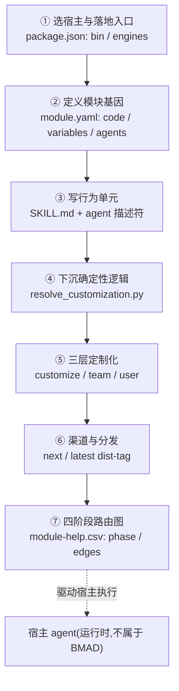
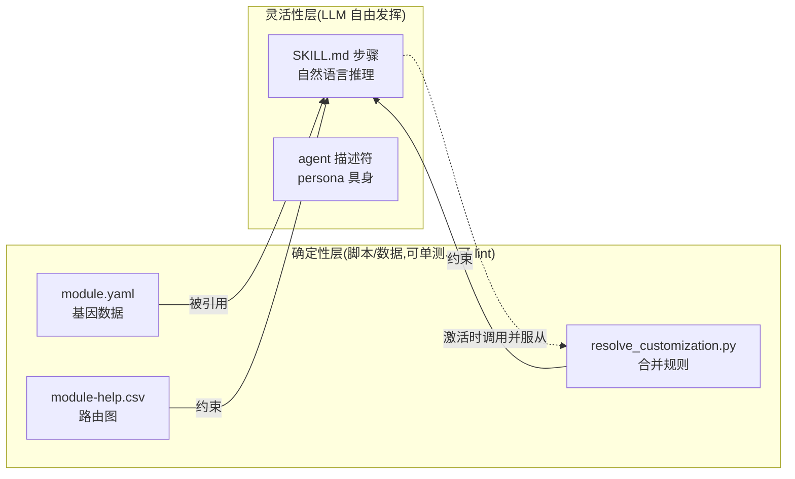

# 16. 构建你自己的方法论 harness

## 16.1 一句话定位

本章是全书的收束章。它不再拆解某个新组件,而是从前 15 章提炼出一条**可迁移的构建路线图**:选宿主与落地目录 → 定义 module.yaml 基因 → 写 SKILL.md 行为单元 → 把确定性逻辑下沉为脚本 → 三层定制化 → 渠道与分发 → 四阶段路由图。每一步都对应到仓库里一个真实产物,由此把"方法论 harness"从抽象范式还原为一份可照着做的工程清单。

## 16.2 心智模型:方法论 harness 是一套"安装进宿主"的约束层

读完前 15 章,有一个判断应当已经成形:BMAD-METHOD **不是一个运行时**。它不跑 `while(true)`、不调度工具、不管上下文窗口——这些都是宿主 agent(Claude Code / Cursor / Codex)的职责。BMAD 做的,是把自己"安装"进宿主,从外部重塑宿主的行为。

理解这一点的关键是把 harness 想成**三层产物**:

- **数据层**(声明式):`module.yaml`、`module-help.csv`、`customize.toml`——纯文本、可 grep、可 lint,定义"有哪些 agent、走什么流程、用什么配置"。
- **确定性核层**(脚本):`resolve_customization.py` 这类 Python 脚本——把不该交给 LLM 自由发挥的合并/解析逻辑钉死,LLM 激活技能时被要求调用并服从其输出。
- **行为层**(自然语言):`SKILL.md` 与 agent 描述符——只放"允许 LLM 推理"的部分:步骤的措辞、persona 的具身、与用户的对话风格。

整个 harness 的张力,就落在**多少逻辑放进确定性核、多少留给行为层**。本章的路线图,本质是在七步里反复回答这个问题。



## 16.3 源码走读:七步路线图各对应一个产物

### 第一步 选宿主与落地入口

harness 没有运行时,但需要一个**被宿主调用的入口**。这个入口就是 npm 包的 `bin`。

> `package.json:21-25`
>
> ```json
>   "main": "tools/installer/bmad-cli.js",
>   "bin": {
>     "bmad": "tools/installer/bmad-cli.js",
>     "bmad-method": "tools/installer/bmad-cli.js"
>   },
> ```

`bmad` 与 `bmad-method` 两个命令名都指向同一个 CLI 文件。设计动机很直白:harness 的"产品形态"是一个安装器,而非一个常驻进程;用户执行 `npx bmad-method install`,harness 把自己写到磁盘上就退场,剩下的是宿主 agent 的事。落地入口只负责"安装"这一件事。

入口侧的运行要求也被显式声明,而不是藏在 README 里:

> `package.json:113-115`
>
> ```json
>   "engines": {
>     "node": ">=20.12.0"
>   },
> ```

`engines.node>=20.12.0` 把"宿主侧的运行环境"前置成可被 npm 拒绝的硬约束。这与 [第 09 章](../第二部分-核心系统篇/09-IDE集成-部署到宿主.md)讲的 IDE 集成同构:harness 不假定运行时,但明确声明它需要什么样的宿主土壤。

进入 CLI 本身,可以看到入口不做编排,只做"装载子命令":

> `tools/installer/bmad-cli.js:74-81`
>
> ```js
> const commandsPath = path.join(__dirname, 'commands');
> const commandFiles = fs.readdirSync(commandsPath).filter((file) => file.endsWith('.js'));
>
> const commands = {};
> for (const file of commandFiles) {
>   const command = require(path.join(commandsPath, file));
>   commands[command.command] = command;
> }
> ```

子命令不是硬编码的 `if/else` 链,而是扫描 `commands/` 目录、按文件 `require`。这与模块系统的"声明式打包"([第 03 章](../第一部分-基础篇/03-模块系统-基因.md))同构:新增一个安装能力,只需往目录里丢一个 `.js` 文件,分发中枢本身不必改动。入口越"笨",扩展点越多。

### 第二步 定义模块基因

落地之后,harness 要回答的第一个问题是"我是谁、装哪些东西"。这就是 `module.yaml` 的职责。

> `src/bmm-skills/module.yaml:1-4`
>
> ```yaml
> code: bmm
> name: "BMad Method"
> description: "Full-lifecycle AI agile development: analysis, planning, architecture, implementation"
> default_selected: true # This module will be selected by default for new installations
> ```

`code: bmm` 是模块在注册表里的稳定短码身份;`default_selected: true` 决定安装向导是否默认勾选它。设计动机:模块的"可发现性"与"默认权重"本身被声明化——安装器读这行决定 UI,而不需要任何代码判断。`description` 则同时是给人和给 LLM 看的说明书。

基因不只是元信息,还包括**变量**与**落盘结构**:

> `src/bmm-skills/module.yaml:43-48`
>
> ```yaml
> # Directories to create during installation (declarative, no code execution)
> directories:
>   - "{planning_artifacts}"
>   - "{implementation_artifacts}"
>   - "{project_knowledge}"
> ```

注释直白到几乎多余:`declarative, no code execution`。落盘结构是数据列表而非过程代码,安装器只读它去 `mkdir`;变量插值(`{planning_artifacts}`)让目录名随团队配置漂移,而 YAML 结构本身不变。这是"基因层只声明、不执行"的典型样本——把可变的东西(具体路径)留给变量,把不变的东西(有几个产物目录)钉死在声明里。

### 第三步 写行为单元

行为单元分两半:哪些 agent 存在(基因层声明),每个 agent 怎么想怎么说话(SKILL.md 与 customize.toml)。基因层只存 agent 的"本质":

> `src/bmm-skills/module.yaml:49-60`
>
> ```yaml
> # Agent roster — essence only. External skills (party-mode, retrospective,
> # advanced-elicitation, help catalog) read these descriptors to route, display,
> # and embody agents. Full persona and behavior live in each agent's
> # customize.toml. `team` defaults to the module code when omitted; users can
> # add their own agents (real or fictional) via _bmad/custom/config.toml or _bmad/custom/config.user.toml.
> agents:
>   - code: bmad-agent-analyst
>     name: Mary
>     title: Business Analyst
>     icon: "📊"
>     team: software-development
>     description: "Channels Porter's strategic rigor and Minto's Pyramid Principle..."
> ```

注释把边界划得很清楚:名册只存"essence"——`code` / `name` / `icon` / `description`。路由、菜单显示、具身扮演都由外部技能(party-mode 等)读这些描述符完成,而完整 persona 下沉到每个 agent 自己的 `customize.toml`。这是行为单元的切分原则:**基因层只回答"有谁",不回答"它怎么想"**。后者属于可被三层定制覆盖的灵活性层(详见 [第 06 章](../第二部分-核心系统篇/06-技能系统-双手.md)、[第 11 章](../第三部分-高级模式篇/11-多智能体编排-PartyMode.md))。

### 第四步 下沉确定性逻辑

这是整条路线图里张力最大的一步:把多少逻辑写成 LLM 必须服从的脚本。BMAD 的选择是——凡涉及"合并、解析、名册去重"这类**结果必须唯一**的逻辑,一律下沉为确定性 Python 脚本。`resolve_customization.py` 的文件 docstring 同时是契约和测试基准:

> `src/scripts/resolve_customization.py:1-8`
>
> ```python
> """
> Resolve customization for a BMad skill using three-layer TOML merge.
>
> Reads customization from three layers (highest priority first):
>   1. {project-root}/_bmad/custom/{name}.user.toml  (personal, gitignored)
>   2. {project-root}/_bmad/custom/{name}.toml        (team/org, committed)
>   3. {skill-root}/customize.toml                    (skill defaults)
> ...
> ```

设计动机:三层优先级(`user` > `team` > `skill defaults`)被写成文件路径约定,而非运行时启发式。LLM 不需要"理解"谁该覆盖谁,它只需要调用脚本、收下 stdout 的 JSON。

下沉的第二个特征是**零第三方依赖**:

> `src/scripts/resolve_customization.py:43-51`
>
> ```python
> try:
>     import tomllib
> except ImportError:
>     sys.stderr.write(
>         "error: Python 3.11+ is required (stdlib `tomllib` not found).\n"
>         "Install a newer Python or run the resolution manually per the\n"
>         "fallback instructions in the skill's SKILL.md.\n"
>     )
>     sys.exit(3)
> ```

只用 stdlib `tomllib`,失败时 `exit(3)` 并把人退回到 SKILL.md 里的手动说明。确定性核的可移植性被置于功能丰富度之上——脚本要能在任何装了 Python 3.11+ 的宿主上 `uv run` 起来,不能因为某个 `pip` 包缺失而让整套合并失效(详见 [第 08 章](../第二部分-核心系统篇/08-确定性解析核-Python约束LLM.md))。

合并逻辑本身是纯函数,无 IO、可单测:

> `src/scripts/resolve_customization.py:152-168`
>
> ```python
> def deep_merge(base, override):
>     """Recursively merge override into base using structural rules.
>     - Table + table: deep merge
>     - Array + array: shape-aware (keyed merge if all items have code/id, else append)
>     - Anything else: override wins
>     """
>     if isinstance(base, dict) and isinstance(override, dict):
>         result = dict(base)
>         for key, over_val in override.items():
>             if key in result:
>                 result[key] = deep_merge(result[key], over_val)
>             else:
>                 result[key] = over_val
>         return result
>     if isinstance(base, list) and isinstance(override, list):
>         return _merge_arrays(base, override)
>     return override
> ```

`deep_merge` 输入两个 `dict`、输出一个 `dict`,不碰文件系统、不碰网络。这正是"可变逻辑下沉"该有的形态:它被 LLM 调用,但 LLM 无法改变它的行为——给同样的输入,永远得到同样的输出。

### 第五步 三层定制化

下沉成脚本之后,"如何合并"就不再是 LLM 的自由,而是脚本的语义。关键在于这套语义是**纯结构性**的,不特判任何字段名:

> `src/scripts/resolve_customization.py:23-35`
>
> ```
> Merge rules (purely structural — no field-name special-casing):
>   - Scalars (string, int, bool, float): override wins
>   - Tables: deep merge (recursively apply these rules)
>   - Arrays of tables where every item shares the *same* identifier
>     field (every item has `code`, or every item has `id`):
>     merge by that key (matching keys replace, new keys append)
>   - All other arrays — including arrays where only some items have
>     `code` or `id`, or where items mix the two keys:
>     append (base items followed by override items)
>
> No removal mechanism — overrides cannot delete base items. To suppress
> a default, fork the skill or override the item by code with a no-op
> description/prompt.
> ```

两条规则值得记住:其一,数组只有在**所有项都有同一个标识符**(全 `code` 或全 `id`)时才按键合并,否则纯追加——混用标识符被视为 schema smell,落回更安全的追加语义;其二,显式声明**无删除机制**,要压制一个默认项,只能"按 code 覆盖成 no-op"或干脆 fork 技能。

设计动机:这两条都是用"牺牲灵活性"换"可复现性"。若允许 override 删除 base 项,三层合并就会变成一套依赖顺序、难以推理的状态机;若让 LLM 自己判断"这个数组该按键合并还是追加",结果就漂移成启发式。把它们钉死在脚本里,意味着无论哪个 LLM、哪次激活,合并结果都唯一(详见 [第 07 章](../第二部分-核心系统篇/07-定制化与三层合并.md))。

按键合并的检测逻辑印证了"纯结构性"这一选择:

> `src/scripts/resolve_customization.py:98-112`
>
> ```python
> def _detect_keyed_merge_field(items):
>     """Return 'code' or 'id' if every table item carries that *same* field.
>
>     All items must share the same identifier (all `code`, or all `id`).
>     Mixed arrays — where some items use `code` and others use `id` —
>     return None and fall through to append semantics. This is intentional:
>     mixing identifier keys within one array is a schema smell, and
>     append-fallback is safer than guessing which key should merge.
>     """
>     if not items or not all(isinstance(item, dict) for item in items):
>         return None
>     for candidate in _KEYED_MERGE_FIELDS:
>         if all(item.get(candidate) is not None for item in items):
>             return candidate
>     return None
> ```

函数只看数据形状(是否每个 dict 都带 `code` 或 `id`),不问字段含义。这种"只认结构、不认语义"的策略,让同一套合并器能服务于 agent 名册、技能列表、配置表等任何 TOML 数据——确定性核的通用性正来自它的"无知"。

### 第六步 渠道与分发

写完基因、行为、定制化,harness 还要能被分发出去。BMAD 用 npm dist-tag 实现渠道(stable / next / pinned),分发逻辑落在安装器里:

> `tools/installer/bmad-cli.js:24-37`
>
> ```js
> async function checkForUpdate() {
>   try {
>     // Prereleases (e.g. 6.5.1-next.0) live on the `next` dist-tag; stable
>     // releases live on `latest`. semver.prerelease() returns null for stable,
>     // so this correctly routes pre-1.0-next/rc/etc. without string matching.
>     const tag = semver.prerelease(packageJson.version) ? 'next' : 'latest';
>
>     const result = execSync(`npm view ${packageName}@${tag} version`, {
>       encoding: 'utf8',
>       stdio: 'pipe',
>       timeout: 5000,
>     }).trim();
> ```

`semver.prerelease()` 对 stable 版返回 `null`、对预发布返回非空数组——一行就把"渠道=一种版本解析策略"具象化:同一个包名 `bmad-method`,按 dist-tag `next` 或 `latest` 路由到不同发布轨道。更新检查是 best-effort:5 秒超时、失败静默(`catch {}`),因为它绝不能阻塞安装主流程(渠道与版本的完整解析见 [第 05 章](../第二部分-核心系统篇/05-渠道与版本解析.md))。

### 第七步 四阶段路由图

最后一步,把所有技能织成一张方法论路由图。这张图不是代码里的对象图,而是一张平面 CSV:

> `src/bmm-skills/module-help.csv:1`
>
> ```
> module,skill,display-name,menu-code,description,action,args,phase,preceded-by,followed-by,required,output-location,outputs
> ```

列名本身就是路由图的边定义:`phase` 给节点分层,`preceded-by` / `followed-by` 给有向边,`required` 标记强制关卡。从这张表里可以读出完整的四阶段拓扑:

> `src/bmm-skills/module-help.csv:18-28`
>
> ```
> BMad Method,bmad-prd,...,2-planning,bmad-product-brief,,true,...
> BMad Method,bmad-architecture,...,3-solutioning,,,true,...
> BMad Method,bmad-create-epics-and-stories,...,3-solutioning,bmad-architecture,,true,...
> BMad Method,bmad-check-implementation-readiness,...,3-solutioning,bmad-create-epics-and-stories,,true,...
> BMad Method,bmad-sprint-planning,...,4-implementation,,,true,...
> BMad Method,bmad-create-story,Validate Story,VS,...,4-implementation,bmad-create-story:create,bmad-dev-story,false,...
> BMad Method,bmad-dev-story,...,4-implementation,bmad-create-story:validate,,true,...
> BMad Method,bmad-code-review,...,4-implementation,bmad-dev-story,,false,...
> ```

设计动机:整张技能拓扑是平面表格、可 grep、可 lint、可被 `validate:skills` 脚本校验(见 `package.json` 的 `validate:skills` 任务)。LLM 不需要"理解"流程,它只需要在被激活时读出"我处在哪一行、前驱是谁、后继是谁"。注意 `bmad-create-story:validate` 这种带冒号的子动作引用,以及 `followed-by bmad-dev-story` 再回到 `code-review`、`code-review` 又可指回 `dev-story`——story cycle 的循环边全靠 `preceded-by` / `followed-by` 两列表达,无需任何状态机代码(四阶段流水线的完整语义见 [第 13 章](../第四部分-工程实践篇/13-四阶段交付流水线.md))。

## 16.4 设计决策与权衡:确定性 vs 灵活性

整条路线图反复出现的核心张力,是**把多少逻辑放进确定性核、多少留给行为层**。BMAD 给出的是一份可操作的取舍清单:

| 逻辑类型 | 放哪一层 | 理由 |
|---|---|---|
| 配置合并 / 名册去重 / 路径解析 | 确定性脚本(`resolve_customization.py`) | 结果必须唯一、可复现、可单测 |
| 技能拓扑(phase / 前驱后继 / required) | 声明式数据(`module-help.csv`) | 可 grep、可 lint、可版本化 |
| 模块身份 / 落盘结构 / agent 名册 | 声明式数据(`module.yaml`) | 装载逻辑只读不执行 |
| 技能步骤的措辞、persona 具身、对话风格 | 行为层(`SKILL.md` / agent 描述符) | 这才是 LLM 该自由发挥的部分 |



由此可以识别两条**反模式**,它们恰好是 BMAD 用脚本与 CSV 规避掉的:

- **把可变逻辑硬编码进技能正文**。如果三层合并的优先级、数组按键合并还是追加,被写进 SKILL.md 的自然语言里,那么每次激活都要靠 LLM "理解"并执行,结果必然漂移。BMAD 的做法是:正文只写"请调用 `resolve_customization.py --skill ...` 并服从其输出",规则本身在脚本里。
- **让 LLM 自由合并配置**。若把 `customize.toml` / `team` / `user` 三层交给 LLM 自己挑挑拣拣,合并就变成不可审计的启发式。BMAD 用纯结构性规则(`No removal mechanism`、`shape-aware array merge`)把这条路堵死——要压制一个默认项,必须显式按 `code` 覆盖成 no-op,留下可追溯的痕迹。

这两条反模式的共同病灶,是把本该确定性的逻辑错放进了灵活性层。BMAD 的工程纪律是:**凡是"给同样输入必须得到同样输出"的逻辑,不许进自然语言**。

## 16.5 与 Claude Code harness 的对照

走完全书,两种 harness 的本质差异已经清晰可见。Claude Code 是**运行时 harness**:它的约束机制(工具协议、权限管线、hooks、上下文压缩)编译在二进制里,约束的是"agent 如何运行"——它跑 `while(true)`、它调度工具、它截断上下文。BMAD 是**方法论 harness**:它的约束机制(`SKILL.md` + 确定性 Python 脚本 + 三层定制合并)躺在 Markdown / TOML / Python 里,约束的是"agent 做什么、按什么流程做"——它不跑循环,它把自己装进宿主。

最关键的一行对照是:**Claude Code 的 harness 在二进制里,BMAD 的 harness 在文本与脚本里**。前者约束运行,后者约束内容。

但这两种范式并非二选一,而是**可互补**。Claude Code 提供了运行时能力最强的宿主之一:它的 hook 与 subagent 机制恰好可以作为 BMAD 确定性核的挂载点——把 `resolve_customization.py` 包成一个 PreToolUse hook,每次技能激活前先跑它,把合并后的 JSON 注入上下文,LLM 拿到的就是已被钉死的结果而非自由发挥的空间。同样,BMAD 的 `module-help.csv` 路由图可以指导 Claude Code 的 plan 模式:四阶段的 `phase` / `preceded-by` / `followed-by` 给出了结构化工作流的骨架,Claude Code 的运行时则负责在每一步里真正驱动工具调用。

换言之,BMAD 提供的是"方法论层",Claude Code 提供的是"运行时层"。你可以用 BMAD 的声明式技能与确定性脚本约束任何宿主,而 Claude Code 是其中运行时能力最强、hook 机制最成熟的那一个宿主——两者叠加,既得到 BMAD 的可控、可复现、可审计,又得到 Claude Code 的工具调度与上下文管理。这不是替代关系,而是栈式叠加。

## 16.6 小结

本章把全书拆解过的五大组件——安装器、模块系统、技能系统、定制化与确定性核、四阶段流水线——收束成一条七步构建路线图,每一步都对应到仓库里一个可读的产物:`package.json` 的 `bin`、`module.yaml` 的基因、`SKILL.md` 的行为单元、`resolve_customization.py` 的合并规则、三层 `customize.toml`、`next`/`latest` dist-tag、`module-help.csv` 的路由图。贯穿七步的工程纪律只有一条:**凡是结果必须唯一的逻辑,下沉为脚本或数据,不许进自然语言**。BMAD 的 harness 由此成为一套可 grep、可 lint、可版本化的文本与脚本,而非一个黑箱二进制——它装进任何宿主,从外部重塑宿主的行为。若你想从源码层面快速定位上述任一产物,下一章 → [附录 A · 源码导航地图](../附录/A-源码导航地图.md)给出了全仓库的索引。
