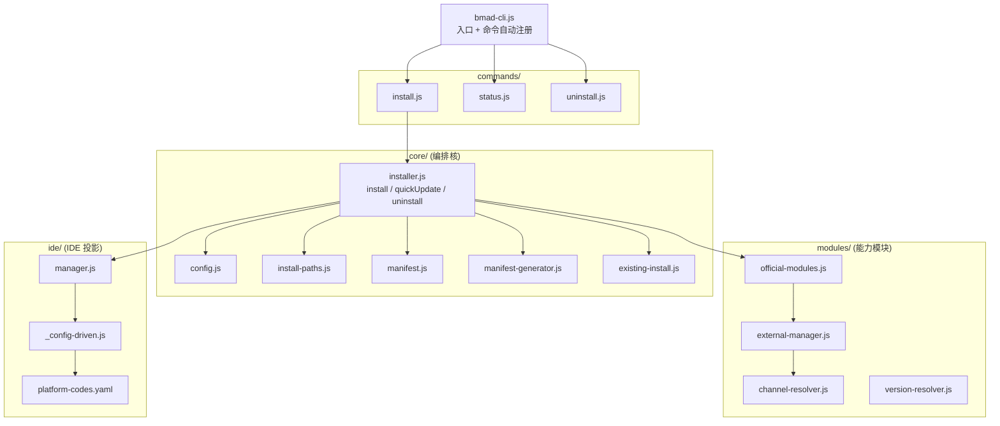
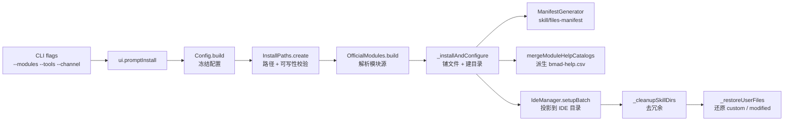

# A. 源码导航地图

## A.1 一句话定位

本章是全书的"索引页":它把 installer 的依赖树、一次安装的数据流、以及散落在 `tools/installer/` 与 `src/scripts/` 里的六大核心设计模式,收敛成一张可点击的源码地图——每项都标注 `file:line` 入口,后续各章可据此回溯到具体实现。

## A.2 心智模型:installer 是一条"声明式基因 → 磁盘落地 → IDE 投影"管线

BMAD 没有自己的运行时(见 [前言](../00-前言与范式总论.md))。它的"安装"不是启动一个常驻进程,而是一次性的**铺管子**:把仓库里声明式的 `module.yaml` / `customize.toml` / `module-help.csv` 当作"基因",经过 installer 解析、合并、派生,落地成目标项目的 `_bmad/` 目录与各 IDE 的约定目录。installer 跑完即退,剩下的是磁盘上一堆纯文本——宿主 agent 在运行时读这些文本,行为由此被重塑。

这条管线由四层文件构成依赖树,自上而下是入口、命令、编排核、能力模块:



树根是 `bmad-cli.js`,它不知道具体命令长什么样;树叶是 `platform-codes.yaml` 这样的纯声明配置。中间每一层都只依赖下一层的抽象,不跨层调用——这是后续可单测、可替换的前提。

## A.3 源码走读

### A.3.1 依赖树:从 CLI 到 core/modules/ide

入口 `bmad-cli.js` 用一个 `readdirSync` 循环把 `commands/` 下每个 `.js` 自动注册成 commander 子命令,新增命令只需丢一个文件,不必改入口:

> `tools/installer/bmad-cli.js:74`
>
> ```js
> const commandsPath = path.join(__dirname, 'commands');
> const commandFiles = fs.readdirSync(commandsPath).filter((file) => file.endsWith('.js'));
>
> const commands = {};
> for (const file of commandFiles) {
>   const command = require(path.join(commandsPath, file));
>   commands[command.command] = command;
> }
> ```
>
> 命令注册是"约定优于配置":每个命令文件 `module.exports = { command, description, options, action }`,入口只负责发现与装配。这让 `install` / `status` / `uninstall` 三条命令彼此独立,新增命令零侵入。

`commands/install.js` 是命令与编排核之间的薄胶水层——它只负责解析 flags、做前置校验、然后把控制权交给 `Installer`:

> `tools/installer/commands/install.js:6`
>
> ```js
> const { Installer } = require('../core/installer');
> const { UI } = require('../ui');
>
> const installer = new Installer();
> const ui = new UI();
> ```
>
> 命令层持有一个 `Installer` 单例和一个 `UI`。`ui.promptInstall(options)` 把交互/无头 flags 归一成原始 config,再交给 `installer.install(config)`。命令层不含业务逻辑,只做接线——这使得同一套 installer 既能被 CLI 调,也能被 `quickUpdate` 内部复用。

编排核 `core/installer.js` 在文件头部一口气 require 了四个方向的依赖,正好对应依赖树的四条分支:

> `tools/installer/core/installer.js:1`
>
> ```js
> const { Manifest } = require('./manifest');
> const { OfficialModules } = require('../modules/official-modules');
> const { IdeManager } = require('../ide/manager');
> const { FileOps } = require('../file-ops');
> const { Config } = require('./config');
> const { getProjectRoot, getSourcePath } = require('../project-root');
> const { ManifestGenerator } = require('./manifest-generator');
> const { InstallPaths } = require('./install-paths');
> const { ExternalModuleManager } = require('../modules/external-manager');
> const { resolveModuleVersion } = require('../modules/version-resolver');
> ```
>
> 这组 require 就是依赖树的"接缝清单":`core/` 内部(manifest/config/paths)、`modules/`(official/external/version)、`ide/`(manager)。installer 把它们组合起来,但自身不实现任何一项能力——它是纯编排。

### A.3.2 安装数据流:Config → InstallPaths → OfficialModules → IdeManager → Manifest

`Installer.install()` 的前四行,就是整条安装数据流的骨架。原始用户输入先被 `Config.build` 规整并冻结,再由 `InstallPaths.create` 解析路径并做可写性校验,接着 `OfficialModules.build` 解析模块源,最后 `ExistingInstall.detect` 探测旧安装以决定是更新还是全新装:

> `tools/installer/core/installer.js:37`
>
> ```js
> async install(originalConfig) {
>   let updateState = null;
>   try {
>     const config = Config.build(originalConfig);
>     const paths = await InstallPaths.create(config);
>     const officialModules = await OfficialModules.build(config, paths);
>     const existingInstall = await ExistingInstall.detect(paths.bmadDir);
> ```
>
> 这四步顺序有讲究:`Config` 必须先冻结(下游不再能改用户意图),`InstallPaths` 必须在碰模块源之前完成可写性校验(失败即 fail-fast,不留半成品),`ExistingInstall` 必须在写文件之前探测(否则无法区分"更新需备份 custom 文件"与"全新装")。

`Config` 是一条"清洗 + 冻结"边界。构造函数把 `modules` / `ides` 复制成数组后 `Object.freeze`,连整个 config 也冻结,确保下游拿到的配置不可变:

> `tools/installer/core/config.js:20`
>
> ```js
>     this.directory = directory;
>     this.modules = Object.freeze([...modules]);
>     this.ides = Object.freeze([...ides]);
>     ...
>     this.channelOptions = channelOptions || null;
>     this.setOverrides = setOverrides || {};
>     Object.freeze(this);
> ```
>
> 冻结把"用户意图"封存成一个不可变快照。`channelOptions` 因为内含 `Map`/`Set`(不可深冻结)被显式排除在冻结外,注释也点明了这一例外——这是"尽量不可变,但承认 JS 集合类型的现实"的务实折中。

`InstallPaths.create` 是一个静态工厂:它读 `package.json` 拿版本、解析项目根、把 `_bmad/` 及其子目录一次性算出并对每个目录做 `ensureWritableDir`:

> `tools/installer/core/install-paths.js:7`
>
> ```js
>   static async create(config) {
>     const srcDir = getProjectRoot();
>     ...
>     const projectRoot = path.resolve(config.directory);
>     await ensureWritableDir(projectRoot, 'project root');
>
>     const bmadDir = path.join(projectRoot, BMAD_FOLDER_NAME);
>     const isUpdate = await fs.pathExists(bmadDir);
>     const configDir = path.join(bmadDir, '_config');
>     ...
>     return new InstallPaths({ srcDir, version, projectRoot, bmadDir, configDir, ... isUpdate });
>   }
> ```
>
> 所有路径派生集中在一个不可变对象里(`constructor` 里 `Object.freeze(this)`),下游通过 `paths.moduleDir(name)` / `paths.manifestFile()` 等方法取值,不自行拼路径。`isUpdate` 在此刻就定下,贯穿后续的"更新 vs 全新装"分支——一个布尔值驱动整条管线的备份/清理行为。

数据流的后半段在 `_installAndConfigure` 与 `_setupIdes` 里展开,产物是一组派生文件。完整数据流如下:



### A.3.3 六大设计模式清单

下表是本章的核心索引。每一项都是 BMAD 把"本该交给 LLM 自由发挥的逻辑"下沉为确定性的一个落点,入口 `file:line` 指向最典型的实现:

| 设计模式 | 入口 | 一句话 |
|---|---|---|
| 纯函数 resolver | `tools/installer/modules/channel-resolver.js:144` | 渠道解析只算数据、不碰 git/fs,可单测 |
| 配置驱动 IDE | `tools/installer/ide/_config-driven.js:140` | 一个类吃一份 YAML,消灭 per-IDE 安装文件 |
| 声明式 module | `src/bmm-skills/module.yaml:1` | 变量/提示/目录/名册全是声明,无代码执行 |
| 三层合并 | `src/scripts/resolve_customization.py:152` | 纯结构 TOML 深合并,无字段名特例 |
| append-only 记录 | `tools/installer/core/installer.js:502` | 读现有 + 末尾追加,不重写整文件 |
| 派生式 spec | `tools/installer/core/installer.js:1046` | 多源声明派生为单一有序产物,非手写 |

**纯函数 resolver。** `resolveChannel` 把"渠道"具象成一种纯数据返回值——`stable` 查 GitHub tags 取最高纯 semver,`next` 返回 `ref: null`(即拉 main HEAD),`pinned` 直接回传用户给的 tag:

> `tools/installer/modules/channel-resolver.js:144`
>
> ```js
> async function resolveChannel({ channel, pin, repoUrl, timeout }) {
>   if (channel === 'pinned') {
>     if (!pin) throw new Error('resolveChannel: pinned channel requires a pin value');
>     return { channel: 'pinned', ref: pin, version: pin, resolvedFallback: false };
>   }
>
>   if (channel === 'next') {
>     return { channel: 'next', ref: null, version: 'main', resolvedFallback: false };
>   }
> ```
>
> resolver 只与 GitHub tags API 和 semver 数学打交道,不执行 `git clone`。克隆逻辑留在调用方(`external-manager`)。这种分离让 resolver 可单测、无副作用,也使"渠道=一种解析策略"这件事变得数据化、可组合。stable 找不到 tag 时返回 `resolvedFallback: true` 并退化成 next 语义——降级是数据字段而非异常分支。

**配置驱动 IDE。** 历史上每个 IDE 各有一个 installer 文件;`ConfigDrivenIdeSetup` 用一个类吃掉 `platform-codes.yaml` 里的一份配置,统一处理所有 IDE:

> `tools/installer/ide/_config-driven.js:140`
>
> ```js
> class ConfigDrivenIdeSetup {
>   constructor(platformCode, platformConfig) {
>     this.name = platformCode;
>     this.displayName = platformConfig.name || platformCode;
>     this.preferred = platformConfig.preferred || false;
>     this.platformConfig = platformConfig;
>     this.installerConfig = platformConfig.installer || null;
>     this.bmadFolderName = BMAD_FOLDER_NAME;
>     this.configDir = this.installerConfig?.target_dir || null;
>   }
> ```
>
> 新增一个 IDE 现在只需在 `platform-codes.yaml` 加一段 `target_dir` / `commands_target_dir` 配置,不必写新代码。IDE 间的差异(是否检查祖先冲突、是否只投影 persona agent)通过 `ancestor_conflict_check` / `commands_filter` 等开关表达。代价是:真正需要 IDE 特殊逻辑的场景,只能靠开关枚举,无法写任意代码——这是"用声明换掉代码"的典型取舍。

**声明式 module。** `module.yaml` 是一个模块的全部"基因":身份、可交互变量(带 prompt/scope/default/选项)、要建的目录、agent 名册——全是声明,installer 只读取与代入,不执行其中的任何"代码":

> `src/bmm-skills/module.yaml:1`
>
> ```yaml
> code: bmm
> name: "BMad Method"
> description: "Full-lifecycle AI agile development: analysis, planning, architecture, implementation"
> default_selected: true
> ...
> directories:
>   - "{planning_artifacts}"
>   - "{implementation_artifacts}"
>   - "{project_knowledge}"
> ```
>
> `directories` 是纯声明:installer 读到这三行就建三个目录,变量 `{planning_artifacts}` 在安装时被用户的回答代入。agent 名册(下方 `agents:` 列表)同理——它只描述 essence(code/name/icon/team/description),完整 persona 与行为住在每个 agent 自己的 `customize.toml` 里。这种"身份在 module.yaml、行为在 customize.toml、运行时合并"的分层,让名册可被外部技能路由、显示、拟人化,而不必加载完整定义。

**三层合并。** `resolve_customization.py` 是确定性核的代表:它用纯 stdlib `tomllib`,按"个人 > 团队 > 默认"三层把 TOML 深合并成 JSON 输出,规则完全结构化:

> `src/scripts/resolve_customization.py:152`
>
> ```python
> def deep_merge(base, override):
>     if isinstance(base, dict) and isinstance(override, dict):
>         result = dict(base)
>         for key, over_val in override.items():
>             if key in result:
>                 result[key] = deep_merge(result[key], over_val)
>             else:
>                 result[key] = over_val
>         return result
>     if isinstance(base, list) and isinstance(override, list):
>         return _merge_arrays(base, override)
>     return override
> ```
>
> 合并规则对字段名无任何特例:dict 深合并、list 走"形状感知"(若每项都有 `code`/`id` 则按键合并替换,否则纯追加)、标量覆盖赢。把这套规则下沉成 Python 脚本而非交给 LLM,意味着"团队 override 了哪个 agent"是可复现、可审计的确定性结果。三层合并的细节见 [第 7 章](../第二部分-核心系统篇/07-定制化与三层合并.md)。

**append-only 记录。** installer 在更新时需要保留被"跳过模块"的 skill 记录,它选择读出现有 CSV、在末尾追加行、再整体写回,而不是重写整个 manifest:

> `tools/installer/core/installer.js:502`
>
> ```js
>     const currentContent = await fs.readFile(csvPath, 'utf8');
>     const prefix = currentContent.endsWith('\n') ? currentContent : `${currentContent}\n`;
>     await fs.writeFile(csvPath, prefix + appendedRows.join('\n') + '\n', 'utf8');
> ```
>
> 追加而非重写,保证未触碰的行原样保留——这与运行时 agent sidecar 往 `_bmad/memory/` 追加记忆日志是同构思想:历史只增不改,审计可回放。installer 还显式把 `_memory` / `memory` 子树排除在"custom 文件"检测之外(`bmadMemoryPaths`,见 `installer.js:840`),因为这些是用户运行时状态,不属于 installer 管理的覆盖层。

**派生式 spec。** `module-help.csv` 是每个模块自带的声明式技能目录(13 列:phase/preceded-by/followed-by/required 等),installer 把所有模块的这份 CSV 合并、排序,派生出单一的 `bmad-help.csv`:

> `tools/installer/core/installer.js:1123`
>
> ```js
>     const decorated = allRows.map((row, index) => ({ row, index, cols: this.parseCSVLine(row) }));
>     decorated.sort((a, b) => {
>       const moduleA = (a.cols[0] || '').toLowerCase();
>       const moduleB = (b.cols[0] || '').toLowerCase();
>       if (moduleA !== moduleB) return moduleA.localeCompare(moduleB);
>       const phaseA = a.cols[PHASE_INDEX] || '';
>       const phaseB = b.cols[PHASE_INDEX] || '';
>       if (phaseA !== phaseB) return phaseA.localeCompare(phaseB);
>       return a.index - a.index;
>     });
> ```
>
> 稳定排序(`a.index - b.index` 兜底)保留作者在 phase 内的原始顺序。产物 `bmad-help.csv` 与每个模块的 `config.yaml`(`generateModuleConfigs`,`installer.js:949`)一样,都是从声明派生而非手写——单一真相源在 `module.yaml` / `module-help.csv`,所有下游产物由 installer 重算。这避免了手写产物的漂移,代价是派生逻辑集中在 installer 这一个单点。

`module-help.csv` 本身就是四阶段流水线的声明式技能图,表头与几行数据可印证 phase 链:

> `src/bmm-skills/module-help.csv:1`
>
> ```csv
> module,skill,display-name,menu-code,description,action,args,phase,preceded-by,followed-by,required,output-location,outputs
> ...
> BMad Method,bmad-prd,Create Edit and Review PRD,PRD,...,2-planning,bmad-product-brief,,true,planning_artifacts,prd
> BMad Method,bmad-architecture,Architecture,CA,...,3-solutioning,,,true,planning_artifacts,architecture
> BMad Method,bmad-create-epics-and-stories,Create Epics and Stories,CE,...,3-solutioning,bmad-architecture,,true,planning_artifacts,epics and stories
> ```
>
> `phase` 列(`1-analysis`/`2-planning`/`3-solutioning`/`4-implementation`/`anytime`)与 `preceded-by`/`followed-by`/`required` 共同织成方法论路由图。installer 的 `PHASE_INDEX = 7`(`installer.js:1050`)正是按这列排序——列序是契约,与 schema 常量 `MODULE_HELP_CSV_HEADER` 对齐。

## A.4 设计决策与权衡

1. **纯函数与副作用分离(resolver / merge)。** `channel-resolver` 与 `resolve_customization.py` 都把"算什么"和"做什么"切开:前者只返回数据,后者只输出 JSON。收益是可单测、可复现;代价是调用方必须自己接住返回值去做 git clone / 写文件,链路上多一层显式接线。这是 BMAD 把确定性逻辑下沉的统一手法——宁可多写一层胶水,也不让核心算法沾上 I/O。

2. **配置驱动消灭 per-IDE 代码。** `ConfigDrivenIdeSetup` 一个类 + `platform-codes.yaml` 取代了过去每个 IDE 一个 installer 文件。新增 IDE 的成本从"写一个 JS 文件"降到"加一段 YAML";代价是 IDE 间的差异只能用预先枚举的开关(`target_dir` / `commands_filter` / `ancestor_conflict_check`)表达,无法写任意逻辑。当某个 IDE 真的需要独特行为时(如 OpenCode 的保留命令集 `RESERVED_OPENCODE_COMMANDS`),只能以特判 `if (this.name === 'opencode')` 的形式硬接回代码——这是声明式边界的已知泄漏点。

3. **单一真相源 + 派生产物。** `module.yaml` 是模块的唯一真相源,`config.yaml` / `bmad-help.csv` / `skill-manifest.csv` / `files-manifest.csv` 全部由 installer 派生。好处是手写产物不会与声明漂移;代价是派生逻辑(排序规则、列序契约、CSV 转义)集中压在 installer 这一个单点,installer 因此长到 1600+ 行。BMAD 选择了"中心化派生"而非"分布式手写",这与它"可复现、可审计"的脊梁一致。

4. **不可变配置 + 前置校验。** `Config` 与 `InstallPaths` 都在构造时 `Object.freeze`,且 `InstallPaths.create` 在碰任何模块源之前先对每个目标目录做 `ensureWritableDir`。失败立刻抛错,不留半成品目录。这是 fail-fast 在安装管线里的具体化:宁可早早退出,也不在管线中段才发现写不进去。

## A.5 与 Claude Code harness 的对照

Claude Code 的"安装"是装一个 npm 二进制——配置(`settings.json` / hooks / permissions)在运行时被二进制读取并执行,installer 与运行时是同一进程。BMAD 的 installer 则是一条**离线一次性管线**:它跑完即退,不驻留,产物是磁盘上的纯文本(`_bmad/` + 各 IDE 目录)。宿主 agent 在运行时读这些文本,行为才被重塑。

更本质的差异在 IDE 投影:Claude Code 自己就是 IDE agent,不存在"投影进异构 IDE"的问题;BMAD 必须把同一套技能以不同目录约定(`.claude/skills`、`.agents/skills`、`.opencode/commands`...)铺进 Claude Code / Cursor / Codex / Windsurf 等多个异构宿主。`ConfigDrivenIdeSetup` + `platform-codes.yaml` 正是为弥合这种"一对多投影"而生——Claude Code 的 harness 不需要这层,因为它不面对多宿主问题。

## A.6 小结

本章给了一张源码地图:依赖树(`bmad-cli → commands → core/{installer} → modules + ide`)、数据流(`Config → InstallPaths → OfficialModules → IdeManager → Manifest`)、以及六大设计模式的 `file:line` 入口。核心信息是——BMAD 的 installer 是一条把声明式基因落地为磁盘纯文本的确定性管线,纯函数 resolver、配置驱动 IDE、声明式 module、三层合并、append-only 记录、派生式 spec 各自管住一类"不该让 LLM 自由发挥"的逻辑。后续章节会沿着这张地图深入:定制化与三层合并见 [第 7 章](../第二部分-核心系统篇/07-定制化与三层合并.md),技能清单见下一附录。

下一附录 → 附录 B. 技能清单
