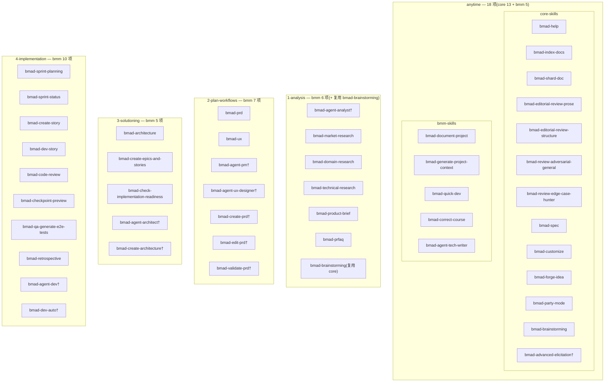
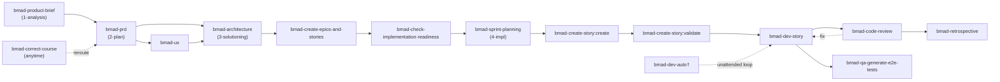

# B. 技能完整清单

本附录穷举 BMAD-METHOD 仓库 `src/` 下全部 `SKILL.md` 技能文件(共 **46** 项),按**来源**(`core-skills` / `bmm-skills`)与**路由 phase** 分组列表。

## 怎么读这份清单

每行的路由元数据——`menu-code`、`phase`、`preceded-by`、`followed-by`、`required`、`output-location`——取自各模块根目录的 `module-help.csv`(`src/core-skills/module-help.csv` 与 `src/bmm-skills/module-help.csv`)。这两个 CSV 不是文档,而是 BMAD 的**确定性路由图数据源**:第 13 章把它们作为"用 CSV 表达技能路由图、再由确定性逻辑解析"的机制来剖析。本附录即该路由图在源码层面的完整数据快照。

字段含义:

- **menu-code**:交互菜单入口码(如 `PRD`、`CS`)。菜单码在**各自模块内**分配,跨模块可能出现重复——例如 `SP` 同时用于 core 的 `bmad-spec` 与 bmm 的 `bmad-sprint-planning`,实际路由以模块为命名空间区分。
- **phase**:技能在四阶段流水线中的归属——`anytime`(横切,不绑定阶段)、`1-analysis`、`2-plan-workflows`、`3-solutioning`、`4-implementation`。本附录即按此字段分小节,故表中不再单列 `phase` 列(小节标题即该组 phase)。
- **preceded-by / followed-by**:路由边,定义技能间的先后约束(第 13 章的路由图即由这些边织成)。
- **required**:该技能在所属 phase 是否强制(`true`/`false`)。
- **output-location**:产物落盘位置(模板变量如 `{output_folder}` 由配置解析,见第 10 章)。

`module-help.csv` **未收录**的技能(agent 人格定义、DEPRECATED 兼容垫片等)在 `menu-code` 与 `output-location` 列标注"目录未收录",`description` 取自该 `SKILL.md` 的 frontmatter。此类条目以 `†` 标记。

## 技能按 phase 分组总览

> `anytime` 横切全部阶段;`1-analysis → 2-plan-workflows → 3-solutioning → 4-implementation` 依序推进。同一技能可能物理位于某 phase 目录、却以 `anytime` 路由(如 `bmad-quick-dev` 文件在 `4-implementation/` 但 phase=anytime)——以 CSV 的 `phase` 字段为准。

## B.1 Core 技能(core-skills)

`core-skills` 目录不分 phase 子目录,其 `module-help.csv` 将全部技能标记为 `anytime`——它们是横切型工具,可在任何阶段被调用。

### anytime(13 项)

| 技能(name) | 文件路径 | menu-code | preceded-by | followed-by | required | output-location | description |
|---|---|---|---|---|---|---|---|
| `bmad-brainstorming` | `src/core-skills/bmad-brainstorming/SKILL.md` | BSP | — | — | false | `{output_folder}/brainstorming` | Use early in ideation or when stuck generating ideas. |
| `bmad-party-mode` | `src/core-skills/bmad-party-mode/SKILL.md` | PM | — | — | false | — | Orchestrate multi-agent discussions when you need multiple perspectives or want agents to collaborate. |
| `bmad-help` | `src/core-skills/bmad-help/SKILL.md` | BH | — | — | false | — | (CSV 未提供 description) |
| `bmad-index-docs` | `src/core-skills/bmad-index-docs/SKILL.md` | ID | — | — | false | — | Use when LLM needs to understand available docs without loading everything. |
| `bmad-shard-doc` | `src/core-skills/bmad-shard-doc/SKILL.md` | SD | — | — | false | — | Use when doc becomes too large (>500 lines) to manage effectively. |
| `bmad-editorial-review-prose` | `src/core-skills/bmad-editorial-review-prose/SKILL.md` | EP | — | — | false | report located with target document | Use after drafting to polish written content. |
| `bmad-editorial-review-structure` | `src/core-skills/bmad-editorial-review-structure/SKILL.md` | ES | — | — | false | — | Use when doc produced from multiple subprocesses or needs structural improvement. |
| `bmad-review-adversarial-general` | `src/core-skills/bmad-review-adversarial-general/SKILL.md` | AR | — | — | false | — | Use for quality assurance or before finalizing deliverables. Code Review in other modules runs this automatically. |
| `bmad-review-edge-case-hunter` | `src/core-skills/bmad-review-edge-case-hunter/SKILL.md` | ECH | — | — | false | — | Use alongside adversarial review for orthogonal coverage — method-driven not attitude-driven. |
| `bmad-spec` | `src/core-skills/bmad-spec/SKILL.md` | SP | — | — | false | `{output_folder}/specs/spec-{slug}` | Use to distill any intent input (brief, PRD, transcript, …) into a succinct SPEC.md contract. |
| `bmad-customize` | `src/core-skills/bmad-customize/SKILL.md` | BC | — | — | false | `{project-root}/_bmad/custom` | Use when you want to change how an agent or workflow behaves — add persistent facts, swap templates, insert activation hooks. |
| `bmad-forge-idea` | `src/core-skills/bmad-forge-idea/SKILL.md` | FI | — | — | false | `{output_folder}/forge` | Use to pressure-test and harden an idea until it proves out, hardens into something buildable, or dies cheaply. |
| `bmad-advanced-elicitation`† | `src/core-skills/bmad-advanced-elicitation/SKILL.md` | 目录未收录 | — | — | — | 目录未收录 | Push the LLM to reconsider, refine, and improve its recent output. Use when user asks for deeper critique (socratic, first principles, pre-mortem, red team). |

## B.2 BMM 技能(bmm-skills)

`bmm-skills` 按 phase 子目录组织,但其 `module-help.csv` 给出的路由 `phase` 并不总与物理目录一致(见 anytime 组)。下文按路由 `phase` 分小节。

### anytime(5 项)

| 技能(name) | 文件路径 | menu-code | preceded-by | followed-by | required | output-location | description |
|---|---|---|---|---|---|---|---|
| `bmad-document-project` | `src/bmm-skills/1-analysis/bmad-document-project/SKILL.md` | DP | — | — | false | project-knowledge | Analyze an existing project to produce useful documentation. |
| `bmad-generate-project-context` | `src/bmm-skills/3-solutioning/bmad-generate-project-context/SKILL.md` | GPC | — | — | false | output_folder | Scan existing codebase to generate a lean LLM-optimized project-context.md. Essential for brownfield projects. |
| `bmad-quick-dev` | `src/bmm-skills/4-implementation/bmad-quick-dev/SKILL.md` | QQ | — | — | false | implementation_artifacts | Unified intent-in code-out workflow: clarify plan implement review and present. |
| `bmad-correct-course` | `src/bmm-skills/4-implementation/bmad-correct-course/SKILL.md` | CC | — | — | false | planning_artifacts | Navigate significant changes. May recommend start over, update PRD, redo architecture, or correct epics/stories. |
| `bmad-agent-tech-writer` | `src/bmm-skills/1-analysis/bmad-agent-tech-writer/SKILL.md` | WD / US / MG / VD / EC | — | — | false | project-knowledge 等(随 action 变) | 多 action 技能:`write`=Write Document、`update-standards`=Update Standards、`mermaid`=Mermaid Generate、`validate`=Validate Document、`explain`=Explain Concept。 |

### 1-analysis(6 项)

| 技能(name) | 文件路径 | menu-code | preceded-by | followed-by | required | output-location | description |
|---|---|---|---|---|---|---|---|
| `bmad-agent-analyst`† | `src/bmm-skills/1-analysis/bmad-agent-analyst/SKILL.md` | 目录未收录 | — | — | — | 目录未收录 | Strategic business analyst and requirements expert. Use when the user asks to talk to Mary or requests the business analyst. |
| `bmad-market-research` | `src/bmm-skills/1-analysis/research/bmad-market-research/SKILL.md` | MR | — | — | false | planning_artifacts\|project-knowledge | Market analysis, competitive landscape, customer needs and trends. |
| `bmad-domain-research` | `src/bmm-skills/1-analysis/research/bmad-domain-research/SKILL.md` | DR | — | — | false | planning_artifacts\|project_knowledge | Industry domain deep dive, subject matter expertise and terminology. |
| `bmad-technical-research` | `src/bmm-skills/1-analysis/research/bmad-technical-research/SKILL.md` | TR | — | — | false | planning_artifacts\|project_knowledge | Technical feasibility, architecture options and implementation approaches. |
| `bmad-product-brief` | `src/bmm-skills/1-analysis/bmad-product-brief/SKILL.md` | CB | — | — | false | planning_artifacts | An expert guided experience to nail down your product idea in a brief. |
| `bmad-prfaq` | `src/bmm-skills/1-analysis/bmad-prfaq/SKILL.md` | WB | — | — | false | planning_artifacts | Working Backwards guided experience to forge and stress-test your product concept. |

> **跨模块复用**:`bmm-skills/module-help.csv` 另以 `menu-code=BP`、`phase=1-analysis` 收录 `bmad-brainstorming`,但 bmm 侧**无独立 `SKILL.md`**——它复用 core 实现(见 B.1)。这是"路由图引用、实现共享"的一例。

### 2-plan-workflows(7 项)

| 技能(name) | 文件路径 | menu-code | preceded-by | followed-by | required | output-location | description |
|---|---|---|---|---|---|---|---|
| `bmad-prd` | `src/bmm-skills/2-plan-workflows/bmad-prd/SKILL.md` | PRD | `bmad-product-brief` | — | true | planning_artifacts | Facilitated PRD workflow — create via coached discovery, update against a change signal, or validate with an HTML findings report. |
| `bmad-ux` | `src/bmm-skills/2-plan-workflows/bmad-ux/SKILL.md` | CU | `bmad-prd` | — | false | planning_artifacts | Guidance through realizing the plan for your UX. |
| `bmad-agent-pm`† | `src/bmm-skills/2-plan-workflows/bmad-agent-pm/SKILL.md` | 目录未收录 | — | — | — | 目录未收录 | Product manager for PRD creation and requirements discovery. Use when the user asks to talk to John. |
| `bmad-agent-ux-designer`† | `src/bmm-skills/2-plan-workflows/bmad-agent-ux-designer/SKILL.md` | 目录未收录 | — | — | — | 目录未收录 | UX designer and UI specialist. Use when the user asks to talk to Sally. |
| `bmad-create-prd`†(DEPRECATED) | `src/bmm-skills/2-plan-workflows/bmad-create-prd/SKILL.md` | 目录未收录 | — | — | — | 目录未收录 | DEPRECATED — consolidated into `bmad-prd` create intent; will be removed in v7. |
| `bmad-edit-prd`†(DEPRECATED) | `src/bmm-skills/2-plan-workflows/bmad-edit-prd/SKILL.md` | 目录未收录 | — | — | — | 目录未收录 | DEPRECATED — consolidated into `bmad-prd` update intent; will be removed in v7. |
| `bmad-validate-prd`†(DEPRECATED) | `src/bmm-skills/2-plan-workflows/bmad-validate-prd/SKILL.md` | 目录未收录 | — | — | — | 目录未收录 | DEPRECATED — consolidated into `bmad-prd` validate intent; will be removed in v7. |

### 3-solutioning(5 项)

| 技能(name) | 文件路径 | menu-code | preceded-by | followed-by | required | output-location | description |
|---|---|---|---|---|---|---|---|
| `bmad-architecture` | `src/bmm-skills/3-solutioning/bmad-architecture/SKILL.md` | CA | — | — | true | planning_artifacts | Produces the architecture spine: the invariants that keep features, epics and stories consistent. |
| `bmad-create-epics-and-stories` | `src/bmm-skills/3-solutioning/bmad-create-epics-and-stories/SKILL.md` | CE | `bmad-architecture` | — | true | planning_artifacts | (CSV 未提供 description) |
| `bmad-check-implementation-readiness` | `src/bmm-skills/3-solutioning/bmad-check-implementation-readiness/SKILL.md` | IR | `bmad-create-epics-and-stories` | — | true | planning_artifacts | Ensure PRD, UX, Architecture and Epics/Stories are aligned. |
| `bmad-agent-architect`† | `src/bmm-skills/3-solutioning/bmad-agent-architect/SKILL.md` | 目录未收录 | — | — | — | 目录未收录 | System architect and technical design leader. Use when the user asks to talk to Winston. |
| `bmad-create-architecture`†(DEPRECATED) | `src/bmm-skills/3-solutioning/bmad-create-architecture/SKILL.md` | 目录未收录 | — | — | — | 目录未收录 | DEPRECATED — consolidated into `bmad-architecture` create intent; will be removed in v7. |

### 4-implementation(10 项)

| 技能(name) | 文件路径 | menu-code | preceded-by | followed-by | required | output-location | description |
|---|---|---|---|---|---|---|---|
| `bmad-sprint-planning` | `src/bmm-skills/4-implementation/bmad-sprint-planning/SKILL.md` | SP | — | — | true | implementation_artifacts | Kicks off implementation by producing a plan the implementation agents will follow in sequence for every story. |
| `bmad-sprint-status` | `src/bmm-skills/4-implementation/bmad-sprint-status/SKILL.md` | SS | `bmad-sprint-planning` | — | false | — | Anytime: Summarize sprint status and route to next workflow. |
| `bmad-create-story` | `src/bmm-skills/4-implementation/bmad-create-story/SKILL.md` | CS / VS | `bmad-sprint-planning` | `bmad-create-story:validate` | true | implementation_artifacts | 多 action 技能:`create`(CS)= Prepare first found story;`validate`(VS)= Validates story readiness before dev work begins. |
| `bmad-dev-story` | `src/bmm-skills/4-implementation/bmad-dev-story/SKILL.md` | DS | `bmad-create-story:validate` | — | true | — | Story cycle: Execute story implementation tasks and tests, then CR, then back to DS if fixes needed. |
| `bmad-code-review` | `src/bmm-skills/4-implementation/bmad-code-review/SKILL.md` | CR | `bmad-dev-story` | — | false | — | Story cycle: If issues back to DS; if approved then next CS or ER if epic complete. |
| `bmad-checkpoint-preview` | `src/bmm-skills/4-implementation/bmad-checkpoint-preview/SKILL.md` | CK | — | — | false | — | Guided walkthrough of a change from purpose and context into details. Use for human review of commits, branches or PRs. |
| `bmad-qa-generate-e2e-tests` | `src/bmm-skills/4-implementation/bmad-qa-generate-e2e-tests/SKILL.md` | QA | `bmad-dev-story` | — | false | implementation_artifacts | Generate automated API and E2E tests for implemented code. Not for code review or story validation. |
| `bmad-retrospective` | `src/bmm-skills/4-implementation/bmad-retrospective/SKILL.md` | ER | `bmad-code-review` | — | false | implementation_artifacts | Optional at epic end: Review completed work, lessons learned, and next epic. |
| `bmad-agent-dev`† | `src/bmm-skills/4-implementation/bmad-agent-dev/SKILL.md` | 目录未收录 | — | — | — | 目录未收录 | Senior software engineer for story execution and code implementation. Use when the user asks to talk to Amelia. |
| `bmad-dev-auto`† | `src/bmm-skills/4-implementation/bmad-dev-auto/SKILL.md` | 目录未收录 | — | — | — | 目录未收录 | One iteration of an unattended development loop. Use when invoked by name. |

## 四阶段主链路由

下图画出 bmm 流水线由 `preceded-by` / `followed-by` 织成的主干(实线为顺序边,虚线为旁路与回路)。这是第 13 章"路由图即 CSV 边集合"的直观呈现。

## 备注

- **† 标记**:该技能未被 `module-help.csv` 收录,`menu-code` / `output-location` / `required` 字段标"目录未收录",`description` 取自其 `SKILL.md` frontmatter。
- **DEPRECATED(4 项)**:`bmad-create-prd` / `bmad-edit-prd` / `bmad-validate-prd` 已并入统一技能 `bmad-prd`(由会话自动识别 create / update / validate 意图);`bmad-create-architecture` 已并入 `bmad-architecture`。它们保留为薄兼容垫片,使旧调用名与 `_bmad/custom/*.toml` 覆盖继续生效,计划于 v7 移除。
- **agent 人格定义(5 项)**:`bmad-agent-analyst`(Mary)、`bmad-agent-pm`(John)、`bmad-agent-ux-designer`(Sally)、`bmad-agent-architect`(Winston)、`bmad-agent-dev`(Amelia)是按角色组织的 agent 人格,按所在目录归入对应 phase,但不进入 menu 路由,故 CSV 未收录。
- **多 action 技能**:`bmad-agent-tech-writer`(WD/US/MG/VD/EC)与 `bmad-create-story`(CS/VS)在 CSV 中以多个 `action` 行展开,共用一个 `SKILL.md`;本清单合并为一行,`menu-code` 以斜杠列出。
- **跨模块复用**:`bmad-brainstorming` 的实现在 core(BSP / anytime),bmm 路由图以 BP / 1-analysis 复用之,bmm 侧无独立 `SKILL.md`。
- **menu-code 跨模块重复**:`SP` 同时指 core 的 `bmad-spec` 与 bmm 的 `bmad-sprint-planning` 等;路由以**模块名**为命名空间,不产生冲突。

---

技能总数:**46** 项 `SKILL.md` 文件(core-skills 13 + bmm-skills 33),覆盖 5 个路由 phase。
