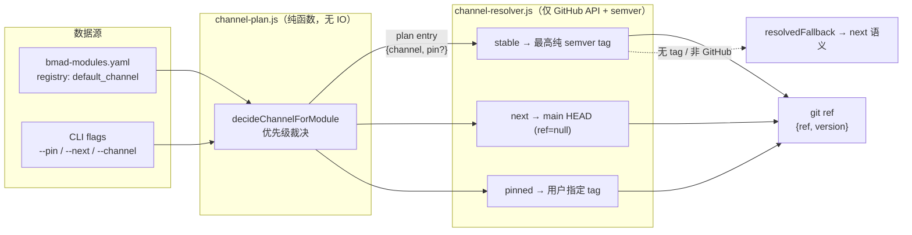

# C. 模块注册表与渠道速查

本章是附录性质的速查手册:把 `bmad-modules.yaml` 注册表里的官方外部模块列成表,把渠道优先级、stable/next/pinned 三种渠道语义、`classifyUpgrade` 的版本判定规则摆在一起,并给出"如何为某模块切渠道"的命令速查。它不展开安装器主流程——那是[第 2 章](../第一部分-基础篇/02-安装器入口-心跳起搏.md)与[第 4 章](../第一部分-基础篇/04-安装引擎-落到磁盘.md)的主题;渠道与版本解析的深度设计走读见[第 5 章](../第二部分-核心系统篇/05-渠道与版本解析.md),模块管理的全貌见[第 10 章](../第三部分-高级模式篇/10-模块管理-官方外部自定义.md)。

## C.1 心智模型:注册表 → 渠道计划 → git ref

BMAD 的外部模块分发依赖三个分离的纯函数层,数据在它们之间单向流动:



三个层的职责边界很清晰:`channel-plan.js` 只做"决定用哪个渠道"的纯逻辑裁决(不碰网络、不碰文件系统);`channel-resolver.js` 把渠道翻译成 `git clone` 能用的 ref(只和 GitHub tags API + semver 打交道);`version-resolver.js` 则在安装完成后从磁盘元数据里读出模块实际版本。这种"计划—解析—落盘核对"的三段分离,正是 BMAD 把确定性逻辑从 LLM 手里拿走的典型手法。

## C.2 模块注册表:bmad-modules.yaml

`bmad-modules.yaml` 是 installer 对外展示哪些模块、以什么顺序展示的唯一真相来源。文件头的注释明确了它的定位与 `default_channel` 字段的语义:

> `bmad-modules.yaml:1`
>
> ```yaml
> # Official module registry — the single source of truth for which modules
> # the BMad installer offers and how they are displayed.
> #
> # default_channel (optional) — the install channel when the user does not
> # override with --channel/--pin/--next. Valid values: stable | next.
> # Omit to inherit the installer's hardcoded default (stable).
> ```

注释把 `default_channel` 定义为"用户不显式覆盖时的安装渠道",合法值只有 `stable` 与 `next`——`pinned` 永远来自命令行,不写在注册表里。省略该字段则继承硬编码默认 `stable`。

注册表里每个条目的字段结构(以第一个模块为例):

> `bmad-modules.yaml:11`
>
> ```yaml
> modules:
>   bmad-method-test-architecture-enterprise:
>     url: https://github.com/bmad-code-org/bmad-method-test-architecture-enterprise
>     module-definition: src/module.yaml
>     code: tea
>     name: "BMad Test Architect"
>     description: "Quality strategy, test automation, and release gates for enterprise teams"
>     defaultSelected: false
>     type: bmad-org
>     npmPackage: bmad-method-test-architecture-enterprise
>     default_channel: stable
> ```

`code` 是 installer 内部引用模块的短码,也是 `--pin`/`--next` 标志定位模块的键;`url` 是 git 克隆源;`npmPackage` 是 npm 分发名(可能与 git 仓库名不同);`type` 标注来源类型(`bmad-org` / `experimental`),`default_channel` 控制无覆盖时的渠道。注意 `module-definition` 指向仓库内的 `module.yaml` 相对路径——它和注册表本身是两份不同的元数据。

### C.2.1 官方外部模块一览

注册表当前收录 6 个模块,完整字段如下:

| name | code | url | npmPackage | default_channel | type |
|---|---|---|---|---|---|
| BMad Test Architect | `tea` | github.com/bmad-code-org/bmad-method-test-architecture-enterprise | bmad-method-test-architecture-enterprise | stable | bmad-org |
| BMad Builder | `bmb` | github.com/bmad-code-org/bmad-builder | bmad-builder | stable | bmad-org |
| BMad Automator Epic Builder Experimental | `automator` | github.com/bmad-code-org/bmad-automator | bmad-story-automator | **next** | experimental |
| BMad Creative Intelligence Suite | `cis` | github.com/bmad-code-org/bmad-module-creative-intelligence-suite | bmad-creative-intelligence-suite | stable | bmad-org |
| BMad Game Dev Studio | `gds` | github.com/bmad-code-org/bmad-module-game-dev-studio.git | bmad-game-dev-studio | stable | bmad-org |
| Whiteport Design Studio | `wds` | github.com/bmad-code-org/bmad-method-wds-expansion | bmad-wds | stable | bmad-org |

两个值得注意的细节:其一,`automator` 是唯一 `default_channel: next` 且 `type: experimental` 的模块——它的描述里也直写了"EXPERIMENTAL: only supports claude and codex currently",注册表的渠道与类型字段和模块自身的成熟度声明保持一致。其二,`wds` 条目额外带了一个 `plugin_name: bmad-wds` 字段(`bmad-modules.yaml:71`),因为它的 `marketplace.json` 以 `bmad-wds` 这个名字声明插件,而 `npmPackage` 也是 `bmad-wds`——`plugin_name` 在 `version-resolver.js` 的 marketplace 版本匹配中会被用到。

## C.3 渠道优先级:channel-plan.js

`channel-plan.js` 是纯函数模块——文件头明确写着"No prompts, no git, no filesystem"。它的核心职责是把 CLI 标志、交互答案、注册表默认值揉成一份"每模块一条渠道计划"。

优先级链在文件头用一行点明:

> `channel-plan.js:13`
>
> ```js
>  * Precedence: --pin > --next=CODE > --channel (global) > registry default > 'stable'.
> ```

这条链的完整裁决逻辑集中在 `decideChannelForModule`:

> `channel-plan.js:110`
>
> ```js
> function decideChannelForModule({ code, channelOptions, registryDefault }) {
>   const { global, nextSet, pins } = channelOptions || { nextSet: new Set(), pins: new Map() };
>
>   if (pins && pins.has(code)) {
>     return { channel: 'pinned', pin: pins.get(code), source: 'flag:--pin' };
>   }
>   if (nextSet && nextSet.has(code)) {
>     return { channel: 'next', source: 'flag:--next' };
>   }
>   if (global) {
>     return { channel: global, source: 'flag:--channel' };
>   }
>   if (registryDefault && VALID_CHANNELS.has(registryDefault)) {
>     return { channel: registryDefault, source: 'registry' };
>   }
>   return { channel: 'stable', source: 'default' };
> }
> ```

这是一段教科书式的优先级瀑布:`--pin` 最先匹配(精确到模块+标签),其次是 `--next=CODE`(精确到模块),再次是 `--channel`(全局),然后才是注册表默认,最后硬编码 `stable`。每个分支返回的 `source` 字段记录了决策来源,供日志与调试追溯——这是"确定性核可审计"的一个微观体现。

CLI 标志的解析在 `parseChannelOptions` 里完成,它处理了标志冲突与重复输入的边界情况:

> `channel-plan.js:31`
>
> ```js
> function parseChannelOptions(options = {}) {
>   const warnings = [];
>   // Global channel from --channel / --all-stable / --all-next.
>   let global = null;
>   const aliases = [];
>   if (options.channel) aliases.push({ flag: '--channel', value: normalizeChannel(options.channel, warnings, '--channel') });
>   if (options.allStable) aliases.push({ flag: '--all-stable', value: 'stable' });
>   if (options.allNext) aliases.push({ flag: '--all-next', value: 'next' });
>
>   const distinct = new Set(aliases.map((a) => a.value).filter(Boolean));
>   if (distinct.size > 1) {
>     warnings.push(
>       `Conflicting channel flags: ${aliases
>         .filter((a) => a.value)
>         .map((a) => a.flag + '=' + a.value)
>         .join(', ')}. Using first: ${aliases.find((a) => a.value).flag}.`,
>     );
>   }
>   // ...--next 与 --pin 的解析见下文
> ```

`--channel`、`--all-stable`、`--all-next` 被统一当作"全局渠道"的别名处理。当多个别名给出不同值时,不报错中断,而是取第一个有效值并追加一条 warning——installer 倾向于"尽量继续、把问题记进 warning"而非硬失败,这与它面向自动化/headless 安装场景的设计一致。

`--next` 与 `--pin` 都是可重复标志,解析为集合与映射:

> `channel-plan.js:54`
>
> ```js
>   // --next=CODE (repeatable)
>   const nextSet = new Set();
>   for (const code of options.next || []) {
>     const trimmed = String(code).trim();
>     if (!trimmed) continue;
>     nextSet.add(trimmed);
>   }
>
>   // --pin CODE=TAG (repeatable)
>   const pins = new Map();
>   for (const spec of options.pin || []) {
>     const parsed = parsePinSpec(spec);
>     if (!parsed) {
>       warnings.push(`Ignoring malformed --pin value '${spec}'. Expected CODE=TAG.`);
>       continue;
>     }
>     if (pins.has(parsed.code)) {
>       warnings.push(`--pin specified multiple times for '${parsed.code}'. Using last: ${parsed.tag}.`);
>     }
>     pins.set(parsed.code, parsed.tag);
>   }
> ```

`--next` 收集成 `Set`(一个模块只能有一个 next 状态),`--pin` 收集成 `Map<code, tag>`(同一模块多次 pin 取最后一个)。畸形 `--pin` 值不中断流程,而是被忽略并记录 warning——`parsePinSpec`(`channel-plan.js:90-98`)要求 `CODE=TAG` 格式且两端非空。

### C.3.1 优先级速查表

| 优先级 | 来源 | 标志形式 | 示例 | 命中时渠道 |
|---|---|---|---|---|
| 1(最高) | 命令行 pin | `--pin CODE=TAG` | `--pin tea=v1.2.0` | pinned |
| 2 | 命令行 next(按模块) | `--next=CODE` | `--next=automator` | next |
| 3 | 命令行全局 | `--channel stable\|next` / `--all-stable` / `--all-next` | `--channel next` | stable 或 next |
| 4 | 注册表默认 | `bmad-modules.yaml` 的 `default_channel` | `default_channel: next` | stable 或 next |
| 5(最低) | 硬编码兜底 | (无任何覆盖) | — | stable |

### C.3.2 bundled 模块的特殊处理

core 和 bmm 是打进 installer 二进制的内置模块,没有 git clone 可覆盖,因此对它们用 `--pin`/`--next` 无意义。`channel-plan.js` 专门发出提示:

> `channel-plan.js:179`
>
> ```js
> function bundledTargetWarnings(channelOptions, bundledCodes) {
>   const warnings = [];
>   const bundled = new Set(bundledCodes || []);
>   const hint = '(bundled module; use `npx bmad-method@next install` for a prerelease)';
>   for (const code of channelOptions?.pins?.keys() || []) {
>     if (bundled.has(code)) {
>       warnings.push(`--pin for '${code}' has no effect ${hint}.`);
>     }
>   }
>   // ...--next 同理
>   return warnings;
> }
> ```

bundled 模块想用预发布版本的正确路径是换 installer 自身的渠道(`npx bmad-method@next install`),而不是 pin 模块——这条 hint 把"模块渠道"和"installer 自身渠道"两个层级区分清楚了。

## C.4 渠道解析:channel-resolver.js

`channel-plan.js` 只决定"用哪个渠道",`channel-resolver.js` 把渠道翻译成 `git clone --branch <ref>` 能直接用的 ref。它同样是纯逻辑模块——文件头声明"only talks to the GitHub tags API and performs semver math. Clone logic lives in the module managers"。

### C.4.1 三渠道语义对照

| 渠道 | `ref`(传给 git clone) | `version` | 解析策略 | 是否可能 fallback |
|---|---|---|---|---|
| stable | 最高纯 semver tag(如 `v1.7.0`) | tag 名 | 调 GitHub tags API,排除 prerelease,取最高 | 是(无 tag 或非 GitHub URL 时退化为 next) |
| next | `null`(即不带 `--branch`,拉 HEAD) | `'main'` | 直接返回,不查 API | 否 |
| pinned | 用户指定的 tag(如 `v1.2.0`) | tag 名 | 直接回传 pin 值,不查 API | 否 |

三渠道的核心分派在 `resolveChannel`:

> `channel-resolver.js:144`
>
> ```js
> async function resolveChannel({ channel, pin, repoUrl, timeout }) {
>   if (channel === 'pinned') {
>     if (!pin) throw new Error('resolveChannel: pinned channel requires a pin value');
>     return { channel: 'pinned', ref: pin, version: pin, resolvedFallback: false };
>   }
>
>   if (channel === 'next') {
>     return { channel: 'next', ref: null, version: 'main', resolvedFallback: false };
>   }
>
>   if (channel === 'stable') {
>     const parsed = parseGitHubRepo(repoUrl);
>     if (!parsed) {
>       return { channel: 'next', ref: null, version: 'main', resolvedFallback: true, reason: 'not-a-github-url' };
>     }
>     try {
>       const tags = await fetchStableTags(parsed.owner, parsed.repo, { timeout });
>       if (tags.length === 0) {
>         return { channel: 'next', ref: null, version: 'main', resolvedFallback: true, reason: 'no-stable-tags' };
>       }
>       const top = tags[0];
>       return { channel: 'stable', ref: top.tag, version: top.tag, resolvedFallback: false };
>     } catch (error) {
>       error.message = `Failed to resolve stable channel for ${parsed.owner}/${parsed.repo}: ${error.message}`;
>       throw error;
>     }
>   }
>   throw new Error(`resolveChannel: unknown channel '${channel}'`);
> }
> ```

`pinned` 与 `next` 都是纯数据返回,零 IO——这让它们可单测、无副作用。只有 `stable` 真正发起网络请求。`stable` 有两条 fallback 路径:URL 不是 GitHub(退化为 next)和仓库无纯 semver tag(退化为 next),均通过 `resolvedFallback: true` + `reason` 标记,让调用方知道实际拿到的是 main HEAD 而非稳定版。而真正的网络异常(如 GitHub API 403/超时)则 `throw`,把"放弃还是重试"的决定权留给上层。

### C.4.2 stable 的 prerelease 过滤

stable 渠道之所以叫"稳定",关键在于它把 prerelease tag 全部排除:

> `channel-resolver.js:86`
>
> ```js
> function normalizeStableTag(tagName) {
>   if (typeof tagName !== 'string') return null;
>   const stripped = tagName.startsWith('v') ? tagName.slice(1) : tagName;
>   const valid = semver.valid(stripped);
>   if (!valid) return null;
>   // Exclude prereleases. semver.prerelease returns null for pure releases.
>   if (semver.prerelease(valid)) return null;
>   return valid;
> }
> ```

`semver.prerelease()` 对 `1.0.0-alpha`、`2.0.0-beta.1`、`3.0.0-rc.1` 这类带 `-` 后缀的版本返回非 null,于是它们被过滤掉。这意味着 stable 渠道永远不会装到一个 prerelease 版本——这是"stable"语义的硬保证,由 semver 数学而非约定来执行。`fetchStableTags`(`channel-resolver.js:104-124`)在拿到过滤后的列表后用 `semver.rcompare` 降序排序,取 `tags[0]` 即最高稳定版,并按 `owner/repo` 维度做进程内缓存,避免同一安装过程中对同一仓库重复请求。

### C.4.3 版本变更分类:classifyUpgrade

`classifyUpgrade` 用于在升级时判断版本跨度,返回 `none`/`patch`/`minor`/`major`/`unknown`:

> `channel-resolver.js:201`
>
> ```js
> function classifyUpgrade(currentVersion, newVersion) {
>   const current = semver.valid(semver.coerce(currentVersion));
>   const next = semver.valid(semver.coerce(newVersion));
>   if (!current || !next) return 'unknown';
>   if (semver.lte(next, current)) return 'none';
>   const diff = semver.diff(current, next);
>   if (diff === 'patch') return 'patch';
>   if (diff === 'minor' || diff === 'preminor') return 'minor';
>   if (diff === 'major' || diff === 'premajor') return 'major';
>   // prepatch, prerelease — treat conservatively as minor
>   return 'minor';
> }
> ```

| `semver.diff` 结果 | `classifyUpgrade` 判定 | 说明 |
|---|---|---|
| `next <= current` | `none` | 相同版本或降级,统一视为"无升级" |
| `patch` | `patch` | 同 major.minor,更高 patch |
| `minor` / `preminor` | `minor` | 同 major,更高 minor |
| `major` / `premajor` | `major` | 不同 major |
| `prepatch` / `prerelease` | `minor` | 保守归为 minor |
| 任一非合法 semver | `unknown` | 调用方应视为 major(最保守) |

注意它用 `semver.coerce` 容忍非标准输入(如 `v1.2` 被强转成 `1.2.0`),但强转失败的直接判 `unknown`——这是"宁可保守也不误判"的设计取向。`prerelease`/`prepatch` 归入 `minor` 而非 `patch`,注释解释了原因:stable 渠道已过滤掉 prerelease,它们本不该出现在这里,故保守处理。

## C.5 落盘版本核对:version-resolver.js

模块克隆完成后,`version-resolver.js` 负责从磁盘元数据里读出模块实际版本——这是"渠道解析给出了预期版本,但最终以磁盘为准"的核对环节。它按四级优先级查找:

> `version-resolver.js:24`
>
> ```js
> async function resolveModuleVersion(moduleName, options = {}) {
>   const moduleSourcePath = await normalizeDirectoryPath(options.moduleSourcePath);
>   const packageJsonPath = await findPackageJsonPath(moduleName, moduleSourcePath);
>
>   if (packageJsonPath) {
>     const packageVersion = await readPackageJsonVersion(packageJsonPath);
>     if (packageVersion) {
>       return { version: packageVersion, source: 'package.json', path: packageJsonPath };
>     }
>   }
>
>   const moduleYamlPath = await findModuleYamlPath(moduleName, moduleSourcePath);
>   if (moduleYamlPath) {
>     const moduleVersion = await readModuleYamlVersion(moduleYamlPath);
>     if (moduleVersion) {
>       return { version: moduleVersion, source: 'module.yaml', path: moduleYamlPath };
>     }
>   }
>
>   const marketplaceVersion = await findMarketplaceVersion(moduleName, moduleSourcePath, options.marketplacePluginNames || []);
>   if (marketplaceVersion) {
>     return marketplaceVersion;
>   }
>   // ...fallback
> ```

四级优先级:`package.json` > `module.yaml` > `.claude-plugin/marketplace.json` > 调用方提供的 fallback。这个顺序反映了对"版本权威性"的判断——npm 包的 `package.json` 是最标准的版本载体,`module.yaml` 是 BMAD 模块自身的声明,`marketplace.json` 是 Claude Code 插件市场的清单。三种元数据格式并存,因为外部模块可能以不同方式分发(git clone / npm / 插件市场),resolver 要兼容所有路径。

搜索根的构建区分了内置与外部模块:

> `version-resolver.js:125`
>
> ```js
> async function buildSearchRoots(moduleName, moduleSourcePath) {
>   const roots = [];
>   const seen = new Set();
>   // ...addRoot 去重逻辑
>   await addRoot(moduleSourcePath);
>
>   if (moduleName === 'core' || moduleName === 'bmm') {
>     await addRoot(getModulePath(moduleName));
>   } else {
>     await addRoot(getExternalModuleCachePath(moduleName));
>   }
>   return roots;
> }
> ```

core/bmm 从内置路径找,外部模块从缓存路径找——这与 `channel-plan.js` 里 bundled 模块不能 pin 的设计呼应:内置模块走完全不同的分发路径。

## C.6 设计决策与权衡

**渠道即解析策略,而非配置开关。** 三种渠道不是布尔标志,而是三种不同的 ref 解析策略,各有独立的代码路径和返回值形状(stable 需查 API、next 零 IO、pinned 直接回传)。这比"一个 channel 字段 + 一堆 if"更清晰,代价是 `resolveChannel` 里三条分支的重复结构。

**计划与解析分离。** `channel-plan.js`(纯逻辑,决定用哪个渠道)与 `channel-resolver.js`(有网络 IO,翻译成 ref)分成两个模块。plan 可被完全单测、可在无网环境跑;resolver 的网络依赖被隔离。代价是调用方需要先调 plan 再调 resolver,两步而非一步。

**stable 的 fallback 而非硬失败。** 当 stable 渠道找不到 tag 或 URL 非 GitHub 时,resolver 不抛异常,而是静默退化为 next 语义并标记 `resolvedFallback`。这让安装"尽量成功",但可能装到非预期版本——`resolvedFallback` + `reason` 字段是把这一权衡显式化的补偿手段。

**版本来源的多级回退。** `version-resolver.js` 的四级优先级兼容了 git/npm/marketplace 三种分发方式,但意味着同一模块在不同环境下可能从不同元数据读到版本号——`source` 字段记录了实际命中源,使结果可追溯。

## C.7 与 Claude Code harness 的对照

Claude Code 的版本与分发是一个 npm 包——你 `npm install -g @anthropic-ai/claude-code` 或 `npx`,版本由 npm registry 决定,预发布靠 dist-tag(`@next`)。这是一条单链路:一个包、一个 registry、一个版本号。

BMAD 的分发是多链路的:installer 自身是 npm 包(可 `@next`),但每个外部模块是独立的 git 仓库,各自有自己的 tag 和 main 分支。渠道系统本质上是给"一堆独立版本源"加了一层统一的解析策略——stable/next/pinned 不是 npm 的 dist-tag,而是 BMAD 自己定义的"如何从 git 仓库挑 ref"的策略。`bmad-modules.yaml` 充当了 BMAD 自己的"mini registry",但它只记录仓库 URL 和默认渠道,真正的版本号要运行时去 GitHub tags API 查。

这种差异的根源在于:Claude Code 的 harness 在二进制里,分发即交付;BMAD 的 harness 在 Markdown + YAML 里,分发是"把一堆仓库按策略克隆到本地"——所以它需要一个比 npm dist-tag 更细粒度的渠道模型。

## C.8 小结

`bmad-modules.yaml` 是 BMAD 的模块注册表,6 个官方外部模块各自带着 code/url/npmPackage/default_channel/type 五要素。渠道系统由两层纯函数构成:`channel-plan.js` 按五级优先级(`--pin` > `--next=CODE` > `--channel` > registry default > `stable`)裁决每个模块用哪个渠道,`channel-resolver.js` 把渠道翻译成 git ref——stable 查 GitHub tags API 取最高纯 semver(排除 prerelease),next 拉 main HEAD,pinned 用用户指定 tag。`classifyUpgrade` 用 semver 数学把版本跨度归类为 patch/minor/major,`version-resolver.js` 则在落盘后从 package.json/module.yaml/marketplace.json 核对实际版本。

### 命令速查:如何为某模块切渠道

```bash
# 把 tea 模块钉在 v1.2.0(最高优先级,精确到标签)
npx bmad-method install --pin tea=v1.2.0

# 让 automator 走 next(main HEAD),其余模块不受影响
npx bmad-method install --next=automator

# 全局走 next(所有选中模块拉 main HEAD)
npx bmad-method install --channel next
# 等价别名
npx bmad-method install --all-next

# 全局走 stable(显式覆盖注册表默认,如 automator 的 next)
npx bmad-method install --channel stable
# 等价别名
npx bmad-method install --all-stable

# 组合:全局 stable,但 cis 单独走 next
npx bmad-method install --channel stable --next=cis

# 组合:全局 next,但 gds 钉在 v0.3.0
npx bmad-method install --all-next --pin gds=v0.3.0

# headless 自动确认(配合 --next/--pin 用于社区模块时不卡交互)
npx bmad-method install --pin tea=v1.2.0 --yes
```

> 注意:对内置模块(core/bmm)用 `--pin`/`--next` 无效——它们打进 installer 二进制,无 git clone 可覆盖。想用预发布 core/bmm,应换 installer 自身渠道:`npx bmad-method@next install`。

渠道与版本解析的完整设计走读(含 fallback 处理的调用方逻辑、tag 缓存策略、`tagExists` 的 pin 预校验)见[第 5 章](../第二部分-核心系统篇/05-渠道与版本解析.md);模块从注册表到磁盘安装的全流程见[第 10 章](../第三部分-高级模式篇/10-模块管理-官方外部自定义.md)。术语定义见附录 D。
