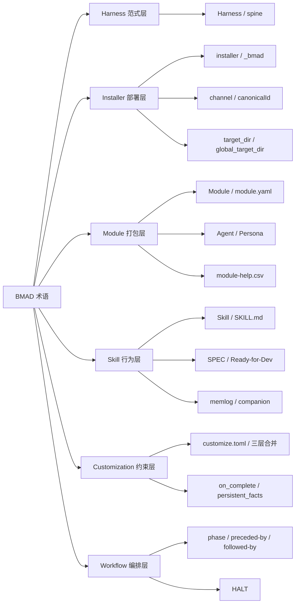

# D. 术语表

本术语表收录全书反复出现的 BMAD-METHOD 核心概念,按字母排序。每条给出:中英术语、一句话定义、出处章节、源码入口(`file:line`,可空)。源码行号基于本书撰写时的 `main` 分支快照,随仓库演进而漂移——以你本地 `git checkout` 后的实际行为为准。

用法:遇到正文里的黑话,先来这里查定义与出处,再带着 `file:line` 去源码对照。术语保留英文原形,中文释义紧随其后。

---

## Agent / Persona(角色 / 人格)

模块在 `module.yaml` 中声明的角色名册条目,含 `code` / `name` / `title` / `icon` / `team` / `description` 六字段;名册只存"精华",完整人格与行为由各 agent 的 `customize.toml` 承载,外部技能据此路由、展示与具身。

- 出处:第 03 章(模块系统)、第 10 章(模块进阶)
- 源码入口:`src/bmm-skills/module.yaml:54`(`agents` 名册数组)、`:55-60`(单条 agent 条目)

---

## canonicalId(规范标识符)

技能的全局唯一扁平标识符,优先取自 `bmad-skill-manifest.yaml` 侧文件的 `canonicalId` 字段;缺失时回退到路径派生名(`toDashPath`),用于在 IDE 目标目录中生成确定性文件名(如 `bmad-create-prd.md`)。

- 出处:第 09 章(IDE 安装与技能落地)
- 源码入口:`tools/installer/ide/shared/path-utils.js:203`(`resolveSkillName`)、`:204-205`(`canonicalId` 判定与回退)

---

## channel: stable / next / pinned(渠道:稳定 / 前沿 / 锁定)

模块在未指定显式版本时的 git ref 解析策略——`stable` 取最高纯 semver tag(排除 `-alpha` / `-beta` / `-rc` 等预发布)、`next` 取 main 分支 HEAD(`ref: null`)、`pinned` 取用户显式指定的 tag。resolver 为纯函数(只访问 GitHub Tags API + semver 运算),克隆逻辑留给调用方。

- 出处:第 05 章(渠道与版本分发)
- 源码入口:`tools/installer/modules/channel-resolver.js:7`(渠道文档)、`:144`(`resolveChannel` 入口)、`:145-147`(pinned)、`:150-151`(next)、`:154-167`(stable)

---

## companion(伴生文件)

SPEC 内核装不下的承重内容(多项目录、表格、图、长文参考)所存放的内容类型化文件(如 `glossary.md`、`architecture-diagrams.md`),与 `SPEC.md` 同级;内核通过 frontmatter 的 `companions:` 数组引用,下游消费者必须一并读取才算拿到完整契约。分为 spec-authored(bmad-spec 拥有)与 adopted(上游技能拥有,bmad-spec 只引用)两类。

- 出处:第 12 章(意图捕获与 Spec 契约)
- 源码入口:`src/core-skills/bmad-spec/SKILL.md:84`(`## Companions`)、`:86`(定义)、`:90-93`(spec-authored vs adopted)

---

## customize.toml / 三层合并(base → team → user)

技能的定制化配置文件,通过 `resolve_customization.py` 按三层优先级合并:skill 默认(`customize.toml`)→ 团队(`_bmad/custom/{name}.toml`,提交进 VCS)→ 个人(`_bmad/custom/{name}.user.toml`,gitignore)。合并为纯结构化规则(标量覆盖、表深合并、带 `code` / `id` 的表数组按键合并,其余追加),无删除机制——要抑制默认项须 fork 技能或以同 `code` 空描述覆盖。

- 出处:第 07 章(定制化与三层合并)
- 源码入口:`src/scripts/resolve_customization.py:5-6`(三层路径文档)、`:217-225`(team / user 加载与 `deep_merge`)、`:152-168`(`deep_merge` 实现)

---

## deep_merge / 深度合并

三层合并的核心算法:表 + 表递归深合并,数组 + 数组按形状感知(全体成员有相同 `code` 或 `id` 则按键合并、替换同键追加新键,否则纯追加),其余标量由覆盖方胜出。纯结构化、无字段名特判,因此同一套规则适用于 agent 名册、workflow 配置等任意 TOML 结构。

- 出处:第 07 章(定制化与三层合并)、第 08 章(确定性核)
- 源码入口:`src/scripts/resolve_customization.py:152`(`def deep_merge`)、`:141-149`(`_merge_arrays` 形状感知)

---

## HALT(停机协议)

工作流的显式退出协议:写终态 `status` 到 spec frontmatter 并追加 `## Auto Run Result`、解析并执行 `workflow.on_complete`、然后停止。把"何时退出、退出前做什么"从 LLM 的自由判断变为协议化的五步序列,确保终态可审计。

- 出处:第 06 章(技能系统)、第 14 章(开发自动化工作流)
- 源码入口:`src/bmm-skills/4-implementation/bmad-dev-auto/SKILL.md:12`(`## HALT`)、`:14-30`(五步协议)

---

## Harness(方法论 harness vs 运行时 harness)

BMAD 是"方法论 harness"——不跑 agent 循环、不接管对话,而是把声明式 skill / agent / customization 层安装进宿主 agent(Claude Code / Cursor / Codex……),用确定性脚本与四阶段工作流从外部约束 LLM。对照之下,Claude Code 是"运行时 harness",自带 `while(true)` 循环、工具协议与权限管线。关键差异:Claude Code 的 harness 在二进制里,BMAD 的 harness 在 Markdown + TOML + Python 里。

- 出处:第 00 章(前言与范式总论)、第 01 章(范式转移与心智模型)
- 源码入口:`bmad-book/_style-guide.md:7-11`(全书脊梁定义)、`bmad-book/00-前言与范式总论.md:23`(一句话定义)、`:60-69`(两种 harness 对照表)

---

## IDE target_dir / global_target_dir(IDE 目标目录 / 全局目录)

`platform-codes.yaml` 中每个 IDE 平台的两个安装路径:`target_dir` 是项目级技能目录(如 `.claude/skills`),`global_target_dir` 是用户主目录级全局安装路径(如 `~/.claude/skills`)。多平台可共享同一目录(跨工具标准 `.agents/skills/`),部分平台还支持 `commands_target_dir` / `commands_filter` 等扩展字段。

- 出处:第 09 章(IDE 安装与技能落地)
- 源码入口:`tools/installer/ide/platform-codes.yaml:8-9`(字段定义)、`:52-57`(claude-code 示例)、`:136-156`(copilot 扩展字段示例)

---

## installer / _bmad 目录(安装器 / BMAD 根目录)

`Installer` 类是部署管线入口,负责模块安装、共享脚本同步、目录创建、配置生成(`config.yaml`)、manifest 与 skill-manifest 写入、IDE 配置、用户文件备份恢复与帮助目录合并;所有产物落地到项目根下的 `_bmad/` 目录(常量 `BMAD_FOLDER_NAME`,集中定义于 `path-utils.js`)。

- 出处:第 02 章(安装器)、第 04 章(安装流程)
- 源码入口:`tools/installer/core/installer.js:20`(`class Installer`)、`:27`(`bmadFolderName = BMAD_FOLDER_NAME`)、`:37`(`install` 主方法)、`tools/installer/ide/shared/path-utils.js:21`(`BMAD_FOLDER_NAME = '_bmad'`)

---

## memlog(追加式记忆日志)

技能的 append-only 工作记忆:按时间顺序、单行追加记录工作中一切重要事项(决策 / 约束 / 能力 / 假设 / 问题 / 方向 / 笔记 / 事件),跨会话持久。三条不变量——只追加不编辑不删除、写盲(echo 新状态不回读)、无生命周期状态标志——使其成为可信单一事实源;原子写入(临时文件 + fsync + rename)防崩溃半写。下游产物(SPEC.md 等)从它派生而非原地编辑。

- 出处:第 08 章(确定性核)、第 12 章(意图捕获与 Spec 契约)
- 源码入口:`src/scripts/memlog.py:5`(append-only memory log 定义)、`:18-33`(三条不变量)、`:122-129`(`write_atomic` 原子写入)、`:78`(`MEMLOG = ".memlog.md"`)

---

## Module / module.yaml(模块 / 模块清单)

BMAD 的分发与打包单元,由 `module.yaml` 声明:模块元信息(`code` / `name` / `description` / `default_selected`)、变量(交互式 prompt + scope + default + result)、目录(安装时声明式创建,无代码执行)与 agent 名册。安装器据此收集配置、创建目录、生成每模块 `config.yaml`。

- 出处:第 03 章(模块系统)、第 10 章(模块进阶)
- 源码入口:`src/bmm-skills/module.yaml:1-4`(模块元信息)、`:13-19`(变量定义示例 `user_skill_level`)、`:44-47`(`directories` 声明式目录)、`:54`(`agents` 名册)

---

## module-help.csv(模块帮助目录)

每个模块根下的 CSV 目录文件,以 13 列 schema 描述该模块全部技能的菜单元信息;安装时由 `mergeModuleHelpCatalogs` 合并所有模块的 `module-help.csv` 为单个 `_bmad/_config/bmad-help.csv`,按模块名、phase 排序。合并时按位置加载(不依赖列名匹配),仅对表头漂移做 advisory 告警。

- 出处:第 13 章(四阶段流水线)、第 15 章(帮助目录与菜单)
- 源码入口:`tools/installer/modules/module-help-schema.js:11`(`MODULE_HELP_CSV_HEADER` schema)、`tools/installer/core/installer.js:1046`(`mergeModuleHelpCatalogs`)、`:1049-1050`(列数 13 与 phase 列索引 7)、`src/bmm-skills/module-help.csv:1`(数据文件头行)

---

## on_complete / persistent_facts(完成回调 / 持久事实)

`customize.toml` 中 `workflow` 表的两个钩子字段:`persistent_facts` 是技能每次激活时作为基础上下文加载的事实列表(`file:` 条目会被读入),`on_complete` 是技能输出后执行的收尾指令(如 HALT 协议中解析并执行)。两者让团队在不改 SKILL.md 正文的前提下注入项目级上下文与收尾动作。

- 出处:第 06 章(技能系统)、第 07 章(定制化)
- 源码入口:`src/core-skills/bmad-spec/SKILL.md:22`(`persistent_facts` 加载)、`:135`(`on_complete` 执行)、`src/bmm-skills/4-implementation/bmad-dev-auto/SKILL.md:28-29`(HALT 中解析 `workflow.on_complete`)

---

## phase / preceded-by / followed-by / required(阶段 / 前置 / 后继 / 必需)

`module-help.csv` 中描述技能在四阶段流水线(analysis → plan → solutioning → implementation)中位置的四个列:`phase` 标注技能所属阶段,`preceded-by` / `followed-by` 声明技能间的执行顺序约束,`required` 标记是否为必选技能。它们共同织成方法论主干的路由图,把"分析→规划→架构→实现"约束为可 lint 的声明式依赖。

- 出处:第 13 章(四阶段流水线)
- 源码入口:`tools/installer/modules/module-help-schema.js:11`(CSV schema 含 `phase,preceded-by,followed-by,required` 四列)、`src/bmm-skills/module-help.csv:1`(数据文件头行)、`bmad-book/_style-guide.md:12`(四阶段工作流定义)

---

## Skill / SKILL.md(技能 / 技能清单)

BMAD 的声明式行为单元,以 `SKILL.md` 为载体:frontmatter 的 `name` / `description` 供宿主 agent 路由与激活,正文定义激活流程(On Activation)、工作区约定、操作步骤(The Operation)、自校验(Self-Validate)等。技能激活时被要求调用确定性脚本(如 `resolve_customization.py`)并服从其输出——这是"用确定性逻辑约束 LLM"的具身。

- 出处:第 06 章(技能系统)、第 11 章(技能激活流程)、第 12 章(Spec 技能实例)
- 源码入口:`src/core-skills/bmad-spec/SKILL.md:1-4`(frontmatter)、`:6-9`(Overview)、`:19-28`(On Activation 流程)

---

## SPEC / Ready-for-Dev(规格契约 / 开发就绪)

`SPEC.md` 是 bmad-spec 技能产出的五字段内核(Why / Capabilities / Constraints / Non-goals / Success signal)加伴生文件的机器契约,从 `.memlog.md` 派生而非手编(bmad-spec 是其唯一写入者)。"Ready for Development"是 dev-auto 定义的规格就绪标准(Actionable / Logical / Testable / Complete / Sufficient / Coherent 六条),满足后规格才可进入实现工作流。

- 出处:第 12 章(意图捕获与 Spec 契约)
- 源码入口:`src/core-skills/bmad-spec/SKILL.md:9`(SPEC kernel 五字段定义)、`:46-50`(spec 文件夹结构)、`src/bmm-skills/4-implementation/bmad-dev-auto/SKILL.md:36`(READY FOR DEVELOPMENT STANDARD)、`:38-44`(六条就绪标准)

---

## spine / 架构 spine(脊梁)

全书的核心论点线索:BMAD 是方法论 harness,不跑 agent loop,把声明式 skill / agent / customization 层安装进宿主,用确定性解析核 + 四阶段工作流约束 LLM。每一章都服务于此脊梁——要么是它的一个组件,要么是它的一次实例化;每章末尾的"与 Claude Code harness 的对照"小节都要落到这一点。

- 出处:第 00 章(前言与范式总论)
- 源码入口:`bmad-book/_style-guide.md:5`(全书脊梁定义)、`bmad-book/00-前言与范式总论.md:23`(一句话定义)

---

## toDashName / 扁平命名(破折号扁平命名)

IDE 安装时把层级路径转为扁平文件名的命名约定:agent 文件加 `bmad-agent-` 前缀(如 `bmad-agent-bmm-pm.md`),其余加 `bmad-` 前缀(如 `bmad-bmm-correct-course.md`);`core` 模块省略模块名,`standalone` 模块含 `standalone` 段。`resolveSkillName` 优先用 `canonicalId`,缺失时回退到 `toDashPath` 路径派生。

- 出处:第 09 章(IDE 安装与技能落地)
- 源码入口:`tools/installer/ide/shared/path-utils.js:6`(DASH-BASED NAMING 标准)、`:35`(`toDashName`)、`:63`(`toDashPath`)、`:123`(`parseDashName` 逆向解析)
