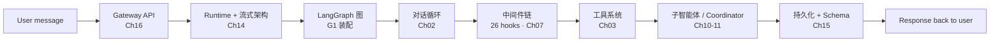

# deerflow-book —— 牧鹿：解码 DeerFlow Harness

> **一本带源码的 Agent 运行时架构深度剖析** —— 拆解字节跳动开源的 [DeerFlow](https://github.com/bytedance/deer-flow)（LangGraph-based Agent Harness）从对话循环到多智能体编排的每一层。

::: tip 源码基线
本书基于 [deer-flow](https://github.com/bytedance/deer-flow) 仓库 commit [`7a6c4a99`](https://github.com/bytedance/deer-flow/commit/7a6c4a994a86583d2a3c056ee9d0f157d4f030c2)（2026-06-26）的源码分析编写。所有 `文件:行号` 锚点都对应该 commit；后续代码演进后，用 `git diff 7a6c4a99 HEAD -- <文件>` 定位变更。
:::

## 与本仓库另外两本书的对照

| | gstack-book | bmad-book | **deerflow-book** |
|---|---|---|---|
| 标本 | garrytan/gstack | bmad-code-org/BMAD-METHOD | **bytedance/deer-flow** |
| 类型 | Skill collection + extension framework | 方法论 harness（安装到宿主 IDE） | **Runtime harness（自跑对话循环）** |
| 谁跑 agent loop | 宿主（Claude Code / Codex） | 宿主 IDE | **DeerFlow 自己（LangGraph 图）** |
| 拆解重点 | Preamble state feed / Iron Laws / Router / audit gate | 三层定制合并 / 确定性解析 / 四阶段流水线 | **对话循环 / 工具系统 / 中间件链 / 状态与线程 / MCP** |

**读顺序建议**：这三种"agent 工程栈"是三种互补视角。**runtime** 视角（DeerFlow）→ **skill collection** 视角（gstack）→ **方法论 harness** 视角（BMAD）。

## 主线：一条消息在 DeerFlow 里的旅程

## 全书概览

| 部分 | 章数 | 主题 |
|---|---|---|
| Part 0 · 前置篇 | 4 | LangChain / LangGraph 基础、函数调用管线、能力注入 |
| Part 1 · 基础篇 | 4 | 智能体编程范式、对话循环、工具系统、沙箱与权限 |
| Part 2 · 核心系统篇 | 5 | 配置、状态与线程、中间件链、上下文管理、记忆系统 |
| Part 3 · 高级模式篇 | 4 | 子智能体、协调器 / 编排、技能系统、MCP 集成 |
| Part 4 · 工程实践篇 | 5 | 运行时+流式、持久化、Gateway API、嵌入式客户端、构建自己的 harness |
| Part 5 · 架构总结 | 2 | 整体管线一条消息旅程、G1 图装配 |
| 附录 | 5 | 源码地图 / 工具清单 / 中间件清单 / 配置速查 / 术语表 |

**总计**：24 章正文 + 5 附录 + 60+ 张 mermaid 图。

## 阅读路径

- **零基础**：先读 [Part 0 前置篇](./第零部分-前置篇/LangChain基础-Agent的砖石)（LangChain + LangGraph 基础），再进正篇
- **时间紧张**：00 → 01 → 02 → 04
- **有经验**：直接读 Part 2（**中间件链是 DeerFlow 的心脏**），遇到概念缺口回溯 Part 1
- **系统学习**：从头到尾，最后 Ch18 构建自己的 Harness
- **查资料**：直接翻附录 A / B / C / D / E

## 开始阅读

- [00 · 前言](./00-前言)
- [Part 0 · LangChain 基础](./第零部分-前置篇/LangChain基础-Agent的砖石)
- [Part 1 · Ch01 智能体编程的新范式](./第一部分-基础篇/01-智能体编程的新范式)

## 声明

本书对 [deer-flow](https://github.com/bytedance/deer-flow)（Apache-2.0）**只做架构分析、不做缺陷审查**。所有代码引用来自公开仓库。DeerFlow 为字节跳动开源项目；本书不隶属于、也不代表字节跳动官方。
