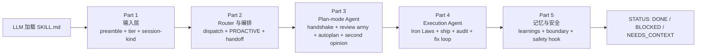

# gstack-book —— Agent 逻辑深度剖析

> 本书只讲一件事：**在 gstack 里，LLM 是怎么做决策的？**
>
> 不讲 Bun 编译、不讲 daemon 部署、不讲多 host 分发、不讲测试 CI —— 那些是承载 agent 的脚手架，不是 agent 本身。本书只拆 agent 逻辑：LLM 拿到什么状态、按什么协议走 plan mode、遇到分歧怎么落 second opinion、修 bug 时被哪些 Iron Law 约束、发布时哪一步会被拦下。

## 这本书**不**讲什么

主动划边界，避免踩空：

| 不讲 | 因为 |
|---|---|
| 三种交付通道（Claude Code 插件 / npm CLI / ClawHub） | 是分发问题，不是 agent 决策 |
| SKILL.md.tmpl 模板引擎 / host 适配器 | 是构建产物问题，agent 只看渲染结果 |
| browse Chromium daemon 的实现 | 是基础设施，agent 只是它的调用者 |
| bin/gstack-paths / GSTACK_HOME / 状态根 | 是路径解析问题，agent 只用 `$GSTACK_STATE_ROOT` |
| Bun compile / build.sh | 是打包问题 |
| free / paid evals / windows-safe 测试分级 | 是 CI 问题 |
| VERSION 文件 / CHANGELOG 格式 / 发布机制 | 是 release 问题 |

如果你想读这些，去看仓库 `README.md` / `ARCHITECTURE.md` / `CLAUDE.md`。或者上一版 gstack-book（已被本次重写覆盖）。

## 这本书讲什么

一条主线：**LLM 从"被加载"到"完成任务"沿途会读到什么、被要求怎么决策**。

## 目录

### [00 前言](00-前言.md) —— 为什么 agent 逻辑需要单独讲

### 第一部分 · 输入层 —— LLM 拿到什么就能决策

| # | 章节 |
|---|---|
| [01 · Preamble：把 bash 输出当作 LLM 的 state feed](第一部分-输入层/01-preamble-作为-LLM-state-feed.md) |
| [02 · Progressive disclosure：preamble-tier 决定上下文密度](第一部分-输入层/02-preamble-tier-与上下文密度.md) |
| [03 · Session kind + First-run activation：3 岔行为分支](第一部分-输入层/03-session-kind-与-first-run.md) |

### 第二部分 · Router 与 skill 编排

| # | 章节 |
|---|---|
| [04 · Router 的路由决策：dispatch 表 + PROACTIVE gate](第二部分-Router与编排/04-router-的路由决策.md) |
| [05 · Skill 之间的编排契约：handoff / benefits-from / pipeline](第二部分-Router与编排/05-skill-之间的编排契约.md) |

### 第三部分 · Plan-mode Agent

| # | 章节 |
|---|---|
| [06 · Plan-mode handshake：AskUserQuestion 满足 end-of-turn](第三部分-Plan-mode-Agent/06-plan-mode-handshake.md) |
| [07 · Review army 4 视角的决策框架](第三部分-Plan-mode-Agent/07-review-army-4-视角.md) |
| [08 · Autoplan：6 决策原则 + Mechanical vs Taste](第三部分-Plan-mode-Agent/08-autoplan-6-决策原则.md) |
| [09 · Second opinion 三件套：codex / adversarial / cross-review dedup](第三部分-Plan-mode-Agent/09-second-opinion-三件套.md) |

### 第四部分 · Execution Agent

| # | 章节 |
|---|---|
| [10 · Iron Laws：agent 的硬约束](第四部分-Execution-Agent/10-iron-laws.md) |
| [11 · Ship 决策边界：Only stop for / Never stop for / Idempotency](第四部分-Execution-Agent/11-ship-决策边界.md) |
| [12 · Plan completion audit：agent 自查交付](第四部分-Execution-Agent/12-plan-completion-audit.md) |
| [13 · QA fix-loop + Confidence calibration + Question tuning](第四部分-Execution-Agent/13-qa-fix-loop-与-confidence.md) |

### 第五部分 · 记忆与安全

| # | 章节 |
|---|---|
| [14 · Learnings loop + gbrain-aware skill 变体](第五部分-记忆与安全/14-learnings-loop-与-gbrain.md) |
| [15 · Boundary instruction + guard/careful/freeze 安全 hook](第五部分-记忆与安全/15-safety-boundary-与-hook.md) |

### 第六部分 · Capstone

| [16 · 写一个只包含 agent 逻辑的新 skill](第六部分-Capstone/16-写一个只有-agent-逻辑的-skill.md) |

### 附录

| [A · Preamble 输出的 KEY 字典](附录/A-preamble-KEY-字典.md) |
| [B · 20+ resolver 与它们注入的 agent 指令](附录/B-resolver-与注入指令.md) |
| [C · Agent 决策术语表](附录/C-agent-决策术语表.md) |

## 阅读约定

- **中文**为主，技术术语（SKILL.md、preamble、resolver、handoff、AskUserQuestion、Iron Law、tier、confidence）保留英文
- 每个设计点带 `file_path:line_range` 指针，可 grep 验证
- 代码块 ≤ 10 行，块上方注明来源
- 章末带上一章 / 下一章链接

## 声明

基于 [gstack](https://github.com/garrytan/gstack) v1.58.5.0（commit `11de390b`）源码分析，MIT License。本书 CC BY-NC-SA 4.0。
