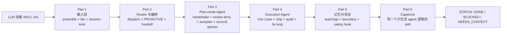

# gstack-book —— Agent 逻辑深度剖析

> **一句话：在 gstack 里，LLM 是怎么做决策的？**

本书只拆一件事——**agent 的决策逻辑**：LLM 拿到什么状态、按什么协议走 plan mode、遇到分歧怎么落 second opinion、修 bug 时被哪些 Iron Law 约束、发布时哪一步会被拦下。

## 本书**不**讲什么

主动划边界，避免读者踩空：

| 不讲 | 因为 |
|---|---|
| 三种交付通道（Claude Code 插件 / npm CLI / ClawHub） | 是分发问题，不是 agent 决策 |
| SKILL.md.tmpl 模板引擎 / host 适配器 | 是构建产物问题，agent 只看渲染结果 |
| browse Chromium daemon 的实现 | 是基础设施，agent 只是它的调用者 |
| `bin/gstack-paths` / `GSTACK_HOME` / 状态根 | 是路径解析问题，agent 只用 `$GSTACK_STATE_ROOT` |
| Bun compile / `build.sh` | 是打包问题 |
| free / paid evals / windows-safe 测试分级 | 是 CI 问题 |
| VERSION / CHANGELOG / 发布机制 | 是 release 问题 |

如果你想读这些，请去看仓库 `README.md` / `ARCHITECTURE.md` / `CLAUDE.md`。

## 主线：LLM 从"被加载"到"完成任务"

## 6 部分 + 附录概览

| 部分 | 章节数 | 一句话主题 |
|---|---|---|
| [第一部分 · 输入层](第一部分-输入层/01-preamble-作为-LLM-state-feed.md) | 3 章 | LLM 拿到的 state feed：preamble + tier + session-kind |
| [第二部分 · Router 与编排](第二部分-Router与编排/04-router-的路由决策.md) | 2 章 | dispatch 表、PROACTIVE gate、skill handoff 契约 |
| [第三部分 · Plan-mode Agent](第三部分-Plan-mode-Agent/06-plan-mode-handshake.md) | 4 章 | plan-mode handshake、review army、autoplan 6 决策原则、second opinion 三件套 |
| [第四部分 · Execution Agent](第四部分-Execution-Agent/10-iron-laws.md) | 4 章 | Iron Laws、ship 决策边界、plan completion audit、QA fix-loop |
| [第五部分 · 记忆与安全](第五部分-记忆与安全/14-learnings-loop-与-gbrain.md) | 2 章 | learnings loop、gbrain 变体、boundary + guard/careful/freeze |
| [第六部分 · Capstone](第六部分-Capstone/16-写一个只有-agent-逻辑的-skill.md) | 1 章 | 从零写一个只有 agent 逻辑的 skill |
| [附录](附录/A-preamble-KEY-字典.md) | 3 篇 | preamble KEY 字典、resolver 注入指令、agent 决策术语表 |

## 阅读路径

**路径 A · 3 小时通读（推荐首读）**

先看边界，再看两个最"能落地"的章节，最后看 Capstone 复盘：

`00 前言` → `01 Preamble state feed` → `08 Autoplan 6 决策原则` → `16 Capstone`

**路径 B · 深度阅读（按顺序读）**

`00` → `01 → 02 → 03` → `04 → 05` → `06 → 07 → 08 → 09` → `10 → 11 → 12 → 13` → `14 → 15` → `16` → `附录 A/B/C`

## 阅读约定

- **中文**为主，技术术语（SKILL.md、preamble、resolver、handoff、AskUserQuestion、Iron Law、tier、confidence）保留英文。
- 每个设计点带 `file_path:line_range` 指针，可 grep 验证。
- 代码块 ≤ 10 行，块上方注明来源。
- 章末带上一章 / 下一章链接。

## 开始阅读

前往 [00 · 前言](./00-前言.md)。

---

基于 [gstack](https://github.com/garrytan/gstack) v1.58.5.0（commit `11de390b`）源码分析，MIT License。本书 CC BY-NC-SA 4.0。
