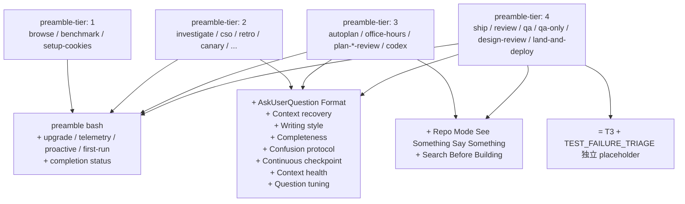

# 02 · Progressive disclosure：preamble-tier 决定上下文密度

> preamble 是 LLM 的输入，但不是所有 skill 都需要同一份输入。router 只做路由 → 只要状态；ship 要真发布 → 要方法学。tier 是密度旋钮：`preamble-tier: 1` 最轻、`4` 最重。本章拆 tier 4 段的组合逻辑与 4 档 skill 划分。

## 2.1 一个成本问题

一次 skill 加载，preamble 会占 LLM 数千 token 的 context 预算。全 49 个 skill 都用最重版 → 每次会话都被 preamble 挤占大量空间，用户对话预算不够用。

反过来，全用最轻版 → 复杂 skill（ship / review / qa）拿不到方法学骨架，行为质量掉。

gstack 的答案：**按 skill 的复杂度分 4 档 preamble**。

## 2.2 tier 的注册位置

每个 SKILL.md.tmpl 顶部 frontmatter 里显式声明 tier：

```yaml
# from SKILL.md.tmpl:3
preamble-tier: 1     # router
```

```yaml
# from ship/SKILL.md.tmpl:3
preamble-tier: 4     # ship
```

字段被 `scripts/gen-skill-docs.ts:729` 抽出来传进 `TemplateContext.preambleTier`。`generatePreamble` 用它决定组合哪些 section。

## 2.3 tier → section 组合表

`scripts/resolvers/preamble.ts:79-122` 是权威组合逻辑。摘核心段：

```ts
// from scripts/resolvers/preamble.ts:79-122
export function generatePreamble(ctx: TemplateContext): string {
  const tier = ctx.preambleTier ?? 4;
  if (tier < 1 || tier > 4) {
    throw new Error(`Invalid preamble-tier: ${tier} in ${ctx.tmplPath}. Must be 1-4.`);
  }
  const sections = [
    generatePreambleBash(ctx),
    ...(ctx.skillName === 'make-pdf' ? [generateMakePdfSetup(ctx)] : []),
    generatePlanModeInfo(ctx),
    generateUpgradeCheck(ctx),
    generateWritingStyleMigration(ctx),
    generateLakeIntro(),
    generateTelemetryPrompt(ctx),
    generateProactivePrompt(ctx),
    generateFirstRunGuidance(ctx),
    generateRoutingInjection(ctx),
    generateVendoringDeprecation(ctx),
    generateSpawnedSessionCheck(),
    generateBrainHealthInstruction(ctx),
    ...(tier >= 2 ? [generateAskUserFormat(ctx)] : []),
    generateBrainSyncBlock(ctx),
    generateModelOverlay(ctx),
    generateVoiceDirective(tier),
    ...(tier >= 2 ? [
      generateContextRecovery(ctx),
      generateWritingStyle(ctx),
      generateCompletenessSection(ctx),
      generateConfusionProtocol(ctx),
      generateContinuousCheckpoint(),
      generateContextHealth(ctx),
      generateQuestionTuning(ctx),
    ] : []),
    ...(tier >= 3 ? [generateRepoModeSection(), generateSearchBeforeBuildingSection(ctx)] : []),
    generateCompletionStatus(ctx),
  ];
  return sections.filter(s => s && s.trim().length > 0).join('\n\n');
}
```

翻译成表格：

| Section | tier 1 | tier 2 | tier 3 | tier 4 |
|---|---|---|---|---|
| **preamble bash**（21 KEY 输出） | ✅ | ✅ | ✅ | ✅ |
| Plan Mode Safe Ops + Skill Invocation | ✅ | ✅ | ✅ | ✅ |
| Upgrade check | ✅ | ✅ | ✅ | ✅ |
| Lake intro (Boil the Ocean) | ✅ | ✅ | ✅ | ✅ |
| Telemetry / Proactive prompt | ✅ | ✅ | ✅ | ✅ |
| First-run guidance | ✅ | ✅ | ✅ | ✅ |
| Routing injection | ✅ | ✅ | ✅ | ✅ |
| Vendoring deprecation warn | ✅ | ✅ | ✅ | ✅ |
| Spawned session check | ✅ | ✅ | ✅ | ✅ |
| Brain health instruction | ✅ | ✅ | ✅ | ✅ |
| Model overlay | ✅ | ✅ | ✅ | ✅ |
| Voice directive | ✅ | ✅ | ✅ | ✅ |
| Completion status protocol | ✅ | ✅ | ✅ | ✅ |
| **AskUserQuestion Format** | ❌ | ✅ | ✅ | ✅ |
| **Context recovery** | ❌ | ✅ | ✅ | ✅ |
| **Writing style** | ❌ | ✅ | ✅ | ✅ |
| **Completeness principle** | ❌ | ✅ | ✅ | ✅ |
| **Confusion protocol** | ❌ | ✅ | ✅ | ✅ |
| **Continuous checkpoint mode** | ❌ | ✅ | ✅ | ✅ |
| **Context health directive** | ❌ | ✅ | ✅ | ✅ |
| **Question tuning** | ❌ | ✅ | ✅ | ✅ |
| **Repo mode section** | ❌ | ❌ | ✅ | ✅ |
| **Search before building** | ❌ | ❌ | ✅ | ✅ |

组合规则：

- **tier 1** = 只保留状态 KEY 输出 + 基础 gate
- **tier 2** = tier 1 + 决策工具（AUQ 格式、confusion protocol、completeness、context health）
- **tier 3** = tier 2 + 认知框架（repo ownership、search-before-building）
- **tier 4** = tier 3（`scripts/resolvers/preamble.ts:74-78` 注释：TEST_FAILURE_TRIAGE 是独立 placeholder，不进 preamble）

## 2.4 skill 按 tier 分档

从 `scripts/resolvers/preamble.ts:74-78` 的注释：

```text
# from scripts/resolvers/preamble.ts:74-78
Skills by tier:
  T1: browse, setup-cookies, benchmark
  T2: investigate, cso, retro, doc-release, setup-deploy, canary, context-save, context-restore, health
  T3: autoplan, codex, design-consult, office-hours, ceo/design/eng-review
  T4: ship, review, qa, qa-only, design-review, land-deploy
```

按"agent 需要多少方法学"直觉排：

- **tier 1 skill 是"跑一条命令"**：browse open URL、setup cookies、benchmark 页面。不需要 AskUserQuestion 格式规范，因为它们不问用户什么
- **tier 2 skill 是"要在长时间任务中调用工具 + 记住状态"**：investigate 走 4 阶段、cso 走 OWASP checklist、context-save 要保存决策。需要 AUQ 格式 + writing style + completeness + context health
- **tier 3 skill 是"要做架构级决策"**：autoplan 编排 review army、office-hours 挑战 premise、plan-*-review 走批评框架。需要额外 repo ownership + search-before-building
- **tier 4 skill 是"会真动生产"**：ship 发 PR、review 找 prod bug、qa 改源码 + commit。tier 3 的一切 + TEST_FAILURE_TRIAGE 特权

## 2.5 三个 tier 2+ 决策工具的语义

tier 2+ 加入的 7 段每段都是"决策指令"。挑 3 段最重要的展开：

### 2.5.1 Confusion Protocol —— 高风险模糊时的强制 STOP

```text
# from scripts/resolvers/preamble/generate-confusion-protocol.ts:5-7
For high-stakes ambiguity (architecture, data model, destructive scope, missing context),
STOP. Name it in one sentence, present 2-3 options with tradeoffs, and ask.
Do not use for routine coding or obvious changes.
```

**架构 / 数据模型 / 破坏性 scope / 缺上下文** —— 这四种情况必须停下问，不能自己推。这是 tier 2+ agent 的默认防御姿态。

### 2.5.2 Completeness Principle —— Boil the Ocean

```text
# from scripts/resolvers/preamble/generate-completeness-section.ts:5-9
AI makes completeness cheap, so the complete thing is the goal. Recommend full coverage
(tests, edge cases, error paths) — boil the ocean one lake at a time. The only thing
out of scope is genuinely unrelated work (rewrites, multi-quarter migrations); flag
that as separate scope, never as an excuse for a shortcut.

When options differ in coverage, include `Completeness: X/10` (10 = all edge cases,
7 = happy path, 3 = shortcut).
```

这条把 gstack 的产品哲学（"Boil the Ocean"）注入到 agent 决策。**每个方案要打完整度分**：10 = 全边界、7 = happy path、3 = shortcut。用户选低完整度就明白代价。

### 2.5.3 Context Health —— 反 loop

```text
# from scripts/resolvers/preamble/generate-context-health.ts:5-9
During long-running skill sessions, periodically write a brief `[PROGRESS]` summary:
done, next, surprises.

If you are looping on the same diagnostic, same file, or failed fix variants, STOP
and reassess. Consider escalation or /context-save. Progress summaries must NEVER
mutate git state.
```

针对 LLM 常见的"卡在同一问题反复试" —— 显式指令：**同一诊断 / 同一文件 / 同一 fix 循环 → STOP + reassess**。这是 gstack 用 markdown 打的一个"loop breaker"。

## 2.6 tier 3+ 的两段特权

### 2.6.1 Repo Mode —— See Something, Say Something

```text
# from scripts/resolvers/preamble/generate-repo-mode-section.ts:3-11
`REPO_MODE` controls how to handle issues outside your branch:
- **`solo`** — You own everything. Investigate and offer to fix proactively.
- **`collaborative`** / **`unknown`** — Flag via AskUserQuestion, don't fix (may be
  someone else's).

Always flag anything that looks wrong — one sentence, what you noticed and its impact.
```

这段在 tier 1/2 skill 上不出现，因为它们不做架构改动。tier 3+ 会看到这段并按 `REPO_MODE` 分支：solo 主动修、collaborative 只报告。

### 2.6.2 Search Before Building

```text
# from scripts/resolvers/preamble/generate-search-before-building.ts:5-8
Before building anything unfamiliar, **search first.** See `${skillRoot}/ETHOS.md`.
- **Layer 1** (tried and true) — don't reinvent. **Layer 2** (new and popular) —
  scrutinize. **Layer 3** (first principles) — prize above all.
```

三层认知框架 —— 先看 tried-and-true、再看 new-and-popular、最后 first-principles。**"Eureka"** 时（一原理与常识矛盾时）要 log 到 `~/.gstack/analytics/eureka.jsonl`（`generate-search-before-building.ts:10-12`）。

## 2.7 一张图：tier 决定哪些 section 拼进最终 SKILL.md



## 2.8 用户 override：EXPLAIN_LEVEL

除了 build-time 的 tier，还有 runtime 的 `EXPLAIN_LEVEL: default | terse`（`bin/gstack-config get explain_level`）。它不改 tier 组合，但让 tier 2+ 里的 3 段（writing style / completeness / confusion / context health）**在 body 里检测到 terse 就整段 skip**。

看 `generate-writing-style.ts:17-19`：

```ts
// from scripts/resolvers/preamble/generate-writing-style.ts:17-19
if (ctx.explainLevel === 'terse') {
  return `## Writing Style\n\nTerse mode (build-time): skip jargon glossing, outcome-framing layer, and decision-impact closers. Lead with the answer.\n`;
}
```

`--explain-level=terse` 是 build 参数（[附录 A](../附录/A-preamble-KEY-字典.md) 有），会在生成时把整段 writing style 压成一行。

runtime 覆盖是另一路：body 里写 "skip entirely if EXPLAIN_LEVEL: terse appears in the preamble echo"（`generate-writing-style.ts:23`）。**bash 输出的 KEY 让 LLM 自己 skip 段** —— 又回到"写 markdown 决策 而不是写代码决策"这个模式。

## 2.9 章末导航

[← 01 preamble 作为 LLM state feed](01-preamble-作为-LLM-state-feed.md) | [下一章：03 · Session kind 与 First-run activation →](03-session-kind-与-first-run.md)
