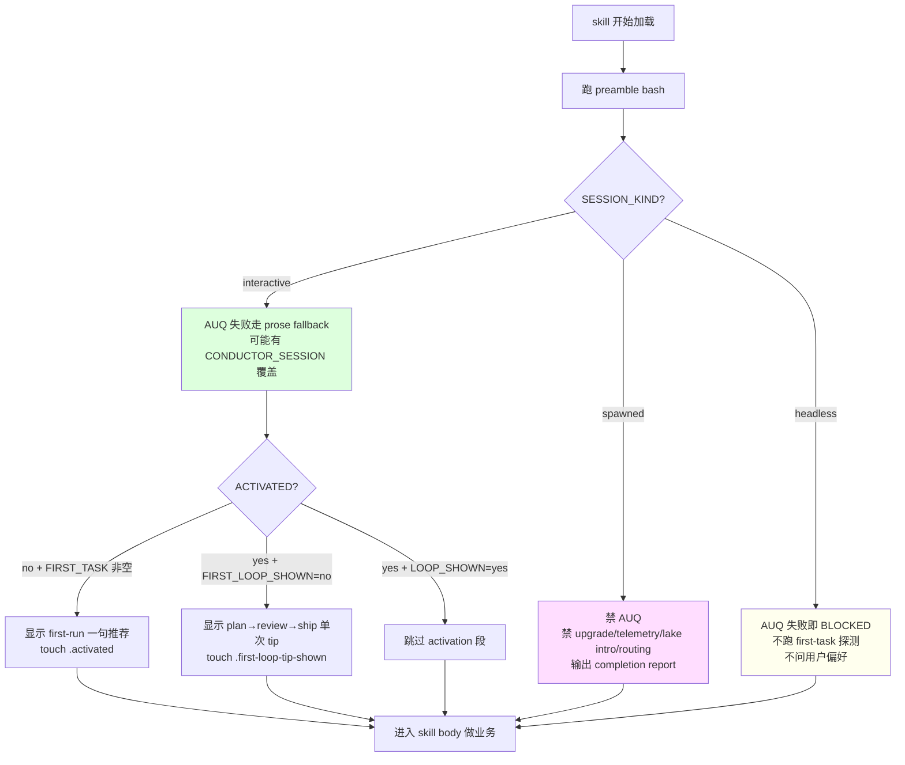

# 03 · Session kind + First-run activation：3 岔行为分支

> Preamble 里两个 KEY 不像其他状态 —— 它们直接改 agent 的行为形态。`SESSION_KIND` 决定能不能问用户，`ACTIVATED` + `FIRST_TASK` 决定要不要在冷启动时推入口 skill。这一章拆这两个"行为分岔器"。

## 3.1 一个真实场景

同一个 skill body，同一个 preamble bash，可能出现在 3 种截然不同的场景：

- **Interactive** —— 用户开着 Claude Code 一句一句和 skill 对话
- **Headless** —— CI 里 `claude -p` 一次性跑完 e2e eval，没人看输出
- **Spawned** —— OpenClaw orchestrator 起一个 Claude 子会话跑 gstack，"用户"其实是另一个 AI

如果一个 skill 无脑用 AskUserQuestion，headless 里等永远等不到答复，spawned 里询问 orchestrator 把它带偏。gstack 用 `SESSION_KIND` 这个 KEY 让 skill body 分岔。

## 3.2 SESSION_KIND 的 3 个值

`bin/gstack-session-kind` 的 5 步分类（`bin/gstack-session-kind:24-52`）：

```bash
# from bin/gstack-session-kind:26-52 (摘核心)
if [ -n "${OPENCLAW_SESSION:-}" ]; then
  echo "spawned"; exit 0
fi
if [ -n "${GSTACK_HEADLESS:-}" ]; then
  echo "headless"; exit 0
fi
if [ -n "${CONDUCTOR_WORKSPACE_PATH:-}" ] || [ -n "${CONDUCTOR_PORT:-}" ] || [ "${CLAUDE_CODE_ENTRYPOINT:-}" = "cli" ]; then
  echo "interactive"; exit 0
fi
if [ -n "${CI:-}" ] || [ -n "${GITHUB_ACTIONS:-}" ]; then
  echo "headless"; exit 0
fi
echo "interactive"
```

设计要点（脚本注释 `bin/gstack-session-kind:16-18` 明说）：

> Detection is best-effort. On ANY ambiguity it prints `interactive` — BLOCK only on
> a positive headless signal, since a stray prose message in an unmarked one-shot
> `-p` run just ends the turn (harmless), whereas wrongly BLOCKING a real human is not.

**保守策略**：识别不确定就默认 `interactive`。因为"错把人当 CI"的代价（一个无用的问题）远小于"错把 CI 当人"（永远卡住等答复）。

## 3.3 SESSION_KIND 分岔 3 段行为

### 3.3.1 Spawned session：不问、不装、不引导

`generateSpawnedSessionCheck`（`scripts/resolvers/preamble/generate-spawned-session-check.ts:3-10`）注入的指令：

```text
# from scripts/resolvers/preamble/generate-spawned-session-check.ts:3-10
If `SPAWNED_SESSION` is `"true"`, you are running inside a session spawned by an
AI orchestrator (e.g., OpenClaw). In spawned sessions:
- Do NOT use AskUserQuestion for interactive prompts. Auto-choose the recommended option.
- Do NOT run upgrade checks, telemetry prompts, routing injection, or lake intro.
- Focus on completing the task and reporting results via prose output.
- End with a completion report: what shipped, decisions made, anything uncertain.
```

Spawned 里 4 件事被禁：

1. AskUserQuestion（改成 auto-choose recommended）
2. Upgrade check（升级不该在被叫的子会话里发生）
3. Telemetry / lake intro / routing injection（一次性 onboarding，orchestrator 已经处理过）
4. 输出格式收敛到 "completion report"

### 3.3.2 Headless：AUQ 失败 → BLOCKED

`AskUserQuestion Format` 段（tier 2+ 才注入）里明写（`generate-ask-user-format.ts:23-25`）：

```text
# from scripts/resolvers/preamble/generate-ask-user-format.ts:23-25
- `spawned` → defer to the **Spawned session** block: auto-choose the recommended option. Never prose, never BLOCKED.
- `headless` → `BLOCKED — AskUserQuestion unavailable`; stop and wait (no human can answer).
- `interactive` → **prose fallback** (below).
```

Headless 里 AUQ 失败 → 立刻 STATUS=BLOCKED、给 escalation report。**不 prose、不猜、不 auto-choose**。

### 3.3.3 Interactive：AUQ 失败 → prose fallback

Interactive 里如果 AUQ 变体（native / MCP）都不可用，走 prose fallback（`generate-ask-user-format.ts:28-34`）—— 用 markdown 排版一份"决策 brief"，引导用户在下一条消息里回复字母。这是把 AUQ 的结构化能力降级成对话能力。

**不同 SESSION_KIND、不同的降级**：这是 gstack agent 逻辑用一个 KEY 分 3 岔的完整例子。

## 3.4 CONDUCTOR 的特殊处理

Conductor 是 Anthropic 出的多 workspace runtime。它 host Claude Code 但 **禁掉了 native AskUserQuestion**，只提供一个不太可靠的 MCP 变体。gstack 直接把它当"永远走 prose"处理：

```bash
# from scripts/resolvers/preamble/generate-preamble-bash.ts:43-45
if [ "$_SESSION_KIND" != "headless" ] && { [ -n "${CONDUCTOR_WORKSPACE_PATH:-}" ] || [ -n "${CONDUCTOR_PORT:-}" ]; }; then
  echo "CONDUCTOR_SESSION: true"
fi
```

body 里对应的规则（`generate-ask-user-format.ts:10`）：

```text
# from scripts/resolvers/preamble/generate-ask-user-format.ts:10 (核心句)
Conductor rule (read before the MCP rule): if `CONDUCTOR_SESSION: true` was echoed
by the preamble, do NOT call AskUserQuestion at all — neither native nor any
`mcp__*__AskUserQuestion` variant. Render EVERY decision brief as the **prose form**
below and STOP.
```

**主动降级、不等失败**。因为等 MCP 变体失败一次就浪费一轮 turn，直接不叫更省。

## 3.5 First-run activation：v1.58.5 引入的三层探测

第二个行为分岔器不是"能不能问"，是"要不要主动引导"。它由三个 KEY 联动：

```bash
# from scripts/resolvers/preamble/generate-preamble-bash.ts:46-56
_ACTIVATED=$([ -f ~/.gstack/.activated ] && echo "yes" || echo "no")
_FIRST_LOOP_SHOWN=$([ -f ~/.gstack/.first-loop-tip-shown ] && echo "yes" || echo "no")
echo "ACTIVATED: $_ACTIVATED"
echo "FIRST_LOOP_SHOWN: $_FIRST_LOOP_SHOWN"
_FIRST_TASK=""
if [ "$_ACTIVATED" = "no" ] && [ "$_SESSION_KIND" != "headless" ]; then
  _FIRST_TASK=$(${ctx.paths.binDir}/gstack-first-task-detect 2>/dev/null || true)
fi
echo "FIRST_TASK: $_FIRST_TASK"
```

三层的关系：

- `ACTIVATED` = 是否曾经跑过 gstack skill（文件标记）
- `FIRST_LOOP_SHOWN` = 首环路 tip 是否显过
- `FIRST_TASK` = 只在首次 + 非 headless 时才跑探测器（否则 hot path 每次跑）

## 3.6 gstack-first-task-detect —— 一枚枚举

`bin/gstack-first-task-detect` 输出恰好一个 whitelisted token（`bin/gstack-first-task-detect:15-19`）：

```text
# from bin/gstack-first-task-detect:15-19
Enum tokens (the ONLY strings this ever emits):
  greenfield | code_node | code_python | code_rust | code_go | code_ruby
  | code_ios | branch_ahead | dirty_default | clean_default | nongit
```

分类靠 5 步（`bin/gstack-first-task-detect:41-80`）：

1. 非 git → `nongit`
2. 无 commit → `greenfield`
3. 在 feature branch 且有未推 commit → `branch_ahead`
4. 在 default branch 且有未 commit 改动 → `dirty_default`
5. 干净 default 但有代码 → 按语言指纹（`Cargo.toml` / `package.json` / `requirements.txt` / `go.mod` / `Gemfile` / `.xcodeproj`）→ `code_<lang>` 或 `clean_default`

**只输出 token，不输出 prose**。原因（`bin/gstack-first-task-detect:5-9`）：

> The caller maps the token to human prose; no description text crosses the
> eval boundary.

保持 detect 层"纯枚举"，让 skill body 决定怎么把 token 映射到具体建议。这是 gstack "detect 与 present 分离"的另一次应用。

## 3.7 First-run guidance 段：token → 一句推荐

`generateFirstRunGuidance`（`generate-first-run-guidance.ts:20-24`）把 token 映射成 prose：

```text
# from scripts/resolvers/preamble/generate-first-run-guidance.ts:20-24
Map the token: `greenfield` → "Fresh repo — shape it first with `/spec` or `/office-hours`."
`code_node`/`code_python`/`code_rust`/`code_go`/`code_ruby`/`code_ios` → "There's code
here — `/qa` to see it work, or `/investigate` if something's off."
`branch_ahead` → "Unshipped work on this branch — `/review` then `/ship`."
`dirty_default` → "Uncommitted changes — `/review` before committing."
`clean_default` → "Pick one: `/spec`, `/investigate`, or `/qa`."
```

**LLM 是 mapping executor**：它读 preamble 的 `FIRST_TASK: greenfield`，去 body 里查表，输出对应句子。查表逻辑不在 bash、不在 TS —— 在 markdown 里。

## 3.8 activation 生命周期

```bash
# from scripts/resolvers/preamble/generate-first-run-guidance.ts:22-23
${ctx.paths.binDir}/gstack-telemetry-log --event-type first_task_scaffold_shown --skill "TASK_TOKEN" --outcome shown 2>/dev/null || true
touch ~/.gstack/.activated 2>/dev/null || true
```

首次显示后立即 touch `.activated` —— 之后 preamble 里 `ACTIVATED: yes`，跳过整个 first-run 段。**这是 gstack 用文件系统当"一次性 flag" 的 idiom**：`~/.gstack/.<name>-<state>` 文件路径本身就是"这件事发生过没"的答案，不用配置文件、不用数据库。

`~/.gstack/` 里这类 flag 文件（在 [附录 A](../附录/A-preamble-KEY-字典.md) 完整列出）：

- `.activated`
- `.first-loop-tip-shown`
- `.proactive-prompted`
- `.telemetry-prompted`
- `.completeness-intro-seen`
- `.vendoring-warned-<slug>`
- `.feature-prompted-continuous-checkpoint`
- `.feature-prompted-model-overlay`

## 3.9 一张 Mermaid：SESSION_KIND × ACTIVATED 的行为矩阵



## 3.10 章末导航

[← 02 preamble-tier 与上下文密度](02-preamble-tier-与上下文密度.md) | [下一章：04 · Router 的路由决策 →](../第二部分-Router与编排/04-router-的路由决策.md)
