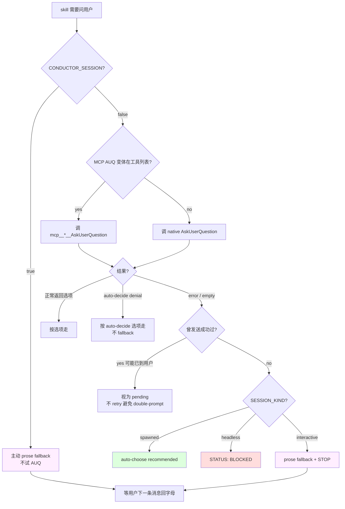

# 06 · Plan-mode handshake：AskUserQuestion 满足 end-of-turn

> Plan-mode 是 Claude Code 的一种"只读+规划"模式：agent 只能读、不能改文件（除了 plan file 本身）、每回合必须以某个"结束动作"收尾（AskUserQuestion 或 ExitPlanMode）。gstack 的 plan-mode skill 必须在这个约束下跑完批评方法学。本章拆两个 handshake：**AUQ 作为 end-of-turn**、**Conductor 下的 prose 降级**。

## 6.1 一个约束

Claude Code plan mode 的规则：

- Agent 每一 turn 结束时必须调**某个特定工具**（AskUserQuestion / ExitPlanMode / 少数几个白名单）—— 否则 turn 悬挂
- 除了 plan file 之外，任何写文件工具都被 host 拦掉

如果一个 review skill 想跑 4 个视角、每个视角问 3-4 个问题，它需要在 plan mode 里做很多轮 AUQ 循环。它们必须都合法。

## 6.2 gstack 的答案：AUQ ≡ end-of-turn

`Plan Mode Safe Operations` + `Skill Invocation During Plan Mode` 段（`generate-completion-status.ts:22-29`）注入到每个 skill 的 preamble 顶部：

```text
# from scripts/resolvers/preamble/generate-completion-status.ts:23-29
## Plan Mode Safe Operations

In plan mode, allowed because they inform the plan: `$B`, `$D`, `codex exec`/`codex review`, writes to `~/.gstack/`, writes to the plan file, and `open` for generated artifacts.

## Skill Invocation During Plan Mode

If the user invokes a skill in plan mode, the skill takes precedence over generic plan mode behavior. **Treat the skill file as executable instructions, not reference.** Follow it step by step starting from Step 0; the first AskUserQuestion is the workflow entering plan mode, not a violation of it. AskUserQuestion (any variant — `mcp__*__AskUserQuestion` or native; see "AskUserQuestion Format → Tool resolution") satisfies plan mode's end-of-turn requirement. If AskUserQuestion is unavailable or a call fails, follow the AskUserQuestion Format failure fallback: `headless` → BLOCKED; `interactive` → the prose fallback (also satisfies end-of-turn). At a STOP point, stop immediately. Do not continue the workflow or call ExitPlanMode there. Commands marked "PLAN MODE EXCEPTION — ALWAYS RUN" execute. Call ExitPlanMode only after the skill workflow completes, or if the user tells you to cancel the skill or leave plan mode.
```

关键 3 条：

1. **AUQ 满足 end-of-turn** —— 每次 AUQ 都合法，skill 可以不断 AUQ 循环推进
2. **skill body 里的每个 AUQ 是 plan mode 的合法动作**，不是"违规"
3. **STOP point 立刻 stop**，不要试图 ExitPlanMode 结束循环

第 3 条最反直觉：**skill 内部的 STOP 不是 exit plan mode**。ExitPlanMode 只在 skill 完全跑完时才调。跑到中间步骤 STOP，就是 STOP，不结束 plan mode。

## 6.3 为什么这样设计

**原文档并没有给 gstack 这条特权**——是 gstack 用 markdown 反复告诉 LLM "AUQ 在你调它时是合法的 end-of-turn"，LLM 才会按这个规则跑。这是 markdown-driven agent 逻辑的经典应用：**约束不来自 host 代码，来自 skill body 的 prompt**。

Claude Code 官方文档确实允许 AUQ 在 plan mode 结束 turn，但没有明确保证 "skill 内部的 AUQ 循环等价于 plan mode 循环"。gstack 把这一点写死：**只要在 skill 里、AUQ 就合法**。

## 6.4 三级 fallback

`AskUserQuestion Format` 段（tier 2+ 才有；`generate-ask-user-format.ts`）细化 AUQ 失败时的降级链。三个层次：

### 6.4.1 Tool resolution：MCP vs native

```text
# from scripts/resolvers/preamble/generate-ask-user-format.ts:8-12
"AskUserQuestion" can resolve to two tools at runtime: the **host MCP variant**
(e.g. `mcp__conductor__AskUserQuestion`) or the **native** Claude Code tool.

**Rule (non-Conductor):** if any `mcp__*__AskUserQuestion` variant is in your tool
list, prefer it. Hosts may disable native AUQ via `--disallowedTools AskUserQuestion`
(Conductor does, by default) and route through their MCP variant; calling native there
silently fails.
```

Host 分两种：native AUQ + MCP AUQ 都在（interactive Claude CLI），或 host 禁掉 native 只留 MCP（Conductor）。**skill 必须动态选**：优先用 MCP 变体（因为如果它在，说明 host 想用它），否则回落 native。

### 6.4.2 Auto-decide vs failure

```text
# from scripts/resolvers/preamble/generate-ask-user-format.ts:19-27
Tell three outcomes apart:

1. **Auto-decide denial (NOT a failure).** The result contains `[plan-tune auto-decide]
   <id> → <option>` — the preference hook working as designed. Proceed with that option.
2. **Genuine failure** — no variant in your tool list, OR the variant is present but
   the call returns an error / missing result (MCP transport error, empty result, host
   bug — e.g. Conductor's MCP AskUserQuestion is flaky and returns `[Tool result missing
   due to internal error]`).
3. Then branch on `SESSION_KIND`:
   - `spawned` → auto-choose recommended
   - `headless` → BLOCKED
   - `interactive` → prose fallback
```

`[plan-tune auto-decide]` 是用户通过 `plan-tune` skill 设置的"某个决策自动选 X"。它**不是失败**，是设计。skill 遇到这个结果直接按 X 走。

真失败才走 SESSION_KIND 分岔。

### 6.4.3 Prose fallback 的三段必备

Interactive 里 AUQ 全灭 → prose fallback。gstack 强制 prose 里保留 AUQ 的三个核心信息（`generate-ask-user-format.ts:28-34`）：

```text
# from scripts/resolvers/preamble/generate-ask-user-format.ts:28-34
Prose fallback — render the decision brief as a markdown message, not a tool call.
Same information as the tool format below, different structure. It MUST surface
this triad:

1. **A clear ELI10 of the issue itself** — plain English on what's being decided
   and why it matters, naming the stakes.
2. **Completeness scores per choice** — explicit `Completeness: X/10` on EACH choice.
3. **The recommendation and why** — a `Recommendation: <choice> because <reason>` line.
```

**降级不是简化**。Prose 必须保留 ELI10 + 完整度分 + Recommendation，否则用户拿到一份没结构的问题，做不出好决策。

Prose 还要求最后 STOP、等用户下一条消息里回字母（`generate-ask-user-format.ts:36`）：

```text
# from scripts/resolvers/preamble/generate-ask-user-format.ts:36
Continuation — mapping a typed reply back to a brief. Each brief carries a stable
label (`D<N>`, or `D<N>.k` in a split chain). The user references it (e.g. "3.2: B").
A bare letter maps to the single most-recent UNANSWERED brief; if more than one is
open (a split chain), do NOT guess — ask which `D<N>.k` it answers.
```

**每个 prose brief 有 D-number**。这是让"多个 brief 排队等答案"变可用 —— 用户可以 skip 中间某个先答后面的，只要 reference 对 D-number。

## 6.5 Conductor：主动降级

Conductor 是特殊 case：它的 native AUQ 被 host 禁掉，MCP AUQ 又 flaky。gstack 直接 **主动走 prose，不等失败**（`generate-ask-user-format.ts:10`）：

```text
# from scripts/resolvers/preamble/generate-ask-user-format.ts:10
Conductor rule (read before the MCP rule): if `CONDUCTOR_SESSION: true` was echoed
by the preamble, do NOT call AskUserQuestion at all — neither native nor any
`mcp__*__AskUserQuestion` variant. Render EVERY decision brief as the **prose form**
below and STOP.
```

节省一个失败 round-trip。这是 gstack 处理"已知不稳定 host"的 pattern：**测出坏行为一次，永久绕过**。

Conductor 里还有一个隐含挑战：prose 走的话，PostToolUse 的 auto-decide capture hook 不会 fire。gstack 让 skill 自己在 prose 时手动记：

```text
# from scripts/resolvers/preamble/generate-ask-user-format.ts:10 (末尾)
When you render a Conductor prose brief, also capture it with `bin/gstack-question-log`
(the PostToolUse capture hook never fires on a prose path, so `/plan-tune` history/learning
depends on this call).
```

**LLM 补 hook 空缺**。这又是 markdown-driven agent 逻辑：hook 缺失，让 LLM 显式补上等价 log。

## 6.6 结构化 AUQ 的自检

gstack 让 LLM 在 emit 每个 AUQ 前跑 self-check（`generate-ask-user-format.ts:113-127`）：

```text
# from scripts/resolvers/preamble/generate-ask-user-format.ts:113-127 (摘)
Before calling AskUserQuestion, verify:
- [ ] D<N> header present
- [ ] ELI10 paragraph present (stakes line too)
- [ ] Recommendation line present with concrete reason
- [ ] Completeness scored (coverage) OR kind-note present (kind)
- [ ] Every option has ≥2 ✅ and ≥1 ❌, each ≥40 chars (or hard-stop escape)
- [ ] (recommended) label on one option (even for neutral-posture)
- [ ] Dual-scale effort labels on effort-bearing options (human / CC)
- [ ] Net line closes the decision
- [ ] You are calling the tool, not writing prose (unless CONDUCTOR)
- [ ] Non-ASCII characters (CJK / accents) written directly, NOT \\u-escaped
- [ ] If you had 5+ options, you split (or batched into ≤4-groups) — did NOT drop any
- [ ] If you split, you checked dependencies between options before firing the chain
```

**12 个 checkbox**。这是 gstack 让 LLM 生成"高质量决策 brief"的方法：不是训练也不是 fine-tune，是 **每次 emit 前照 checklist 过一遍**。

有意思的是几条特别的：

- **≥40 字符每个 pro/con** —— 防止 LLM 偷懒写 "faster" 这种没信息的 pro
- **CJK 直接写不 \u-escape** —— 因为 escape 长 CJK 会 miscode
- **5+ options 必须 split** —— [Ch 05 · 5.4](../第二部分-Router与编排/05-skill-之间的编排契约.md) 提到过 AUQ ≤4 option cap；这里强化"never drop, never merge"

## 6.7 一张 Mermaid：AUQ 三级 fallback



## 6.8 章末导航

[← 05 skill 之间的编排契约](../第二部分-Router与编排/05-skill-之间的编排契约.md) | [下一章：07 · Review army 4 视角的决策框架 →](07-review-army-4-视角.md)
