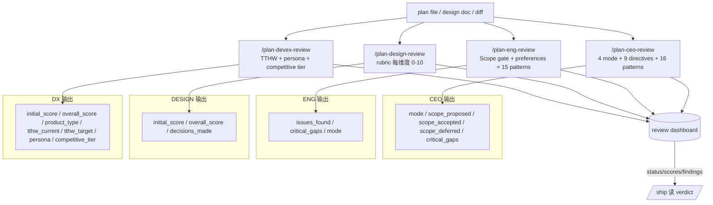

# 07 · Review army 4 视角的决策框架

> 一个方案的 review 不能只有一种视角。gstack 让 CEO / 工程师 / 设计师 / DX 4 个"心智模式"轮番上阵，每种模式在同一个 skill body 里注入完全不同的思考本能、批评角度和输出契约。本章拆这 4 个 mind's eye 的注入方式。

## 7.1 为什么是 4 视角

单一 LLM review 有几个盲区：

- 只看架构，不问"这个功能真值得存在吗"
- 只看代码质量，不问"用户第一眼能看懂吗"
- 只看当前 diff，不问"6 个月后这段代码会变噩梦吗"
- 只看正确性，不问"部署后一分钟崩了怎么回滚"

一个 LLM 一次跑一个视角能解决盲区。gstack 把 4 个视角做成 4 个独立 skill，autoplan 把它们串起来。

4 个 skill 都是 `preamble-tier: 3` + `interactive: true`，共享 [Ch 06 · plan-mode handshake](06-plan-mode-handshake.md) 的规则、[Ch 02](../第一部分-输入层/02-preamble-tier-与上下文密度.md) 里 tier 3 的所有决策工具。它们的差异**全在 body 的 mind's eye 段**。

## 7.2 视角 1 · CEO —— 4 mode + 16 cognitive patterns

`plan-ceo-review/SKILL.md.tmpl:60-115` 是 CEO 视角的核心。开头明说这不是普通 review：

```text
# from plan-ceo-review/SKILL.md.tmpl:60-61
## Philosophy
You are not here to rubber-stamp this plan. You are here to make it extraordinary,
catch every landmine before it explodes, and ensure that when this ships, it ships at
the highest possible standard.
```

### 7.2.1 4 种 scope mode

CEO review 一开始必须让用户选一个 mode（`plan-ceo-review/SKILL.md.tmpl:62-67`）：

- **SCOPE EXPANSION** —— "You are building a cathedral. Envision the platonic ideal. Push scope UP."
- **SELECTIVE EXPANSION** —— hold baseline，逐条 propose expansion，用户 cherry-pick
- **HOLD SCOPE** —— rigorous 但不扩不缩
- **SCOPE REDUCTION** —— surgeon mode，砍到 minimum viable

每种 mode 是**同一份 body、不同的 posture**。选定后 body 通过 mode 变量分岔展开。关键约束（`plan-ceo-review/SKILL.md.tmpl:68`）：

> Once the user selects a mode, COMMIT to it. Do not silently drift toward a different mode.

**mode 是一个承诺**。不能中途飘去别的 mode。

### 7.2.2 9 条 Prime Directives

每个 CEO review 都跑一遍这 9 条底线（`plan-ceo-review/SKILL.md.tmpl:71-80`）：

```text
# from plan-ceo-review/SKILL.md.tmpl:72-80
1. Zero silent failures. Every failure mode must be visible.
2. Every error has a name. ...  Catch-all error handling is a code smell.
3. Data flows have shadow paths. ... nil input, empty/zero-length input, and upstream error.
4. Interactions have edge cases. ... double-click, navigate-away-mid-action, ...
5. Observability is scope, not afterthought.
6. Diagrams are mandatory. No non-trivial flow goes undiagrammed.
7. Everything deferred must be written down. Vague intentions are lies. TODOS.md or it doesn't exist.
8. Optimize for the 6-month future, not just today.
9. You have permission to say "scrap it and do this instead."
```

**第 9 条最有意思**："scrap it" 是明确授权。CEO review 不只挑 bug、可以否定整个方案。

### 7.2.3 16 条 Cognitive Patterns

比 Prime Directives 更内化的一层（`plan-ceo-review/SKILL.md.tmpl:99-115`），16 条"CEO 直觉"，每条一位商业史人物 attribute：

```text
# from plan-ceo-review/SKILL.md.tmpl:99-115 (摘 5 条)
1. Classification instinct — one-way / two-way doors (Bezos)
2. Paranoid scanning — cultural drift, talent erosion, process-as-proxy (Grove)
3. Inversion reflex — "what would make us fail?" (Munger)
6. Speed calibration — 70% information is enough (Bezos)
9. Temporal depth — regret minimization (Bezos)
```

body 明说 **不要照搬 checklist**：

```text
# from plan-ceo-review/SKILL.md.tmpl:97
These are not checklist items. They are thinking instincts. ... Let them shape your
perspective throughout the review. Don't enumerate them; internalize them.
```

**gstack 用 markdown "训练" LLM 一种商业直觉**。它不是 fine-tune，是 in-context example loading —— 让 LLM 在 review 时"读到" Bezos / Grove / Munger 的思维方式。

## 7.3 视角 2 · 工程 —— Scope gate 硬停 + 15 条 pattern

Eng review 是唯一带 **Scope gate 硬停** 的 review（`plan-eng-review/SKILL.md.tmpl:40-46`）：

```text
# from plan-eng-review/SKILL.md.tmpl:40-46
## Scope gate (FIRST — overrides everything below). This is a hard STOP.

Before ANYTHING else in this skill — before the Design Doc Check, the office-hours
prerequisite offer, Step 0, and any `git` / `Read` / `Grep` / `Glob` / `Bash` call —
your VERY FIRST tool call MUST be AskUserQuestion, to confirm the review target.
Do not run the Design Doc Check bash or explore the repo before the user answers.
```

3 个 review target 选项（`plan-eng-review/SKILL.md.tmpl:48-52`）：

```text
What should I review?
A) The current branch diff — the work in progress on this branch.
B) A plan or design doc I'll paste or point you to.
C) A specific file, directory, or path.
```

**为什么要这么强的 hard stop**：eng review 探索仓库要做的事（读源码、跑 grep）代价大。如果 target 弄错了，工作全废。**先 lock target 再动**。

### 7.3.1 15 条 Eng Manager Cognitive Patterns

和 CEO 的 16 条并列结构，`plan-eng-review/SKILL.md.tmpl:70-84` 有 15 条：

```text
# from plan-eng-review/SKILL.md.tmpl:70-84 (摘 5 条)
1. State diagnosis — falling behind / treading water / repaying debt / innovating (Larson)
2. Blast radius instinct — worst case × affected systems
3. Boring by default — "3 innovation tokens per company" (McKinley)
4. Incremental over revolutionary — strangler fig, not big bang (Fowler)
10. Essential vs accidental complexity (Brooks)
```

比 CEO 更工程侧：**Larson / McKinley / Fowler / Brooks**。这些是 gstack 让 LLM 具体化"engineering manager 直觉"的 anchor。

### 7.3.2 与 CEO review 的 preferences overlap

有意思的是 CEO review 也有一段 **Engineering Preferences**（`plan-ceo-review/SKILL.md.tmpl:83-93`）—— 和 eng review 的完全一致：

- DRY
- 良好测试非可选
- "engineered enough"
- explicit over clever
- Right-sized diff
- observability + security 非可选

**同一份工程价值观注入两个视角**。CEO 用它评"这个方案在 6 个月后能维护吗"、eng 用它评"这个 diff 里有几处违反了"。共享底线，不同 lens。

## 7.4 视角 3 · Design —— 每维度 0-10 打分

Design review 的 body 结构不同 —— 它更像 rubric 表。核心逻辑：**每个 design dimension 打 0-10 分 + 说明"10 分长啥样"**（具体 dimension 集见 `plan-design-review/sections/review-sections.md.tmpl`）。

关键属性：

- **Score = 打分**，不是 pass/fail
- **配"10 分标准"** —— 让分数不空 —— 说 "6/10 typography" 时同时说 "10 分是 …"
- 读者看得到差距具体在哪

review dashboard entry 会包含 `initial_score` 和 `overall_score`（`scripts/resolvers/review.ts:96-97`）：

```text
# from scripts/resolvers/review.ts:96-97
- **plan-design-review**: `status`, `initial_score`, `overall_score`, ...
  → Findings: "score: {initial_score}/10 → {overall_score}/10, {decisions_made} decisions"
```

**分数是 review 的输出**，不只是意见。ship 读到 dashboard 时能看到 "design 从 4/10 提到 8/10"—— 有量化。

## 7.5 视角 4 · DX —— TTHW + persona + competitive tier

DX review 的产出（review dashboard entry）：

```text
# from scripts/resolvers/review.ts:98-101
- **plan-devex-review**: `status`, `initial_score`, `overall_score`, `product_type`,
  `tthw_current`, `tthw_target`, `mode`, `persona`, `competitive_tier`, ...
  → Findings: "score: {initial_score}/10 → {overall_score}/10, TTHW: {tthw_current} → {tthw_target}"
```

关键指标 —— **TTHW (Time To Hello World)**：一个新用户从零到看到"这东西真的动了"要多久。

DX review 还有 `persona`（"新手 open source contributor" / "internal SRE" / "external ops team"…）和 `competitive_tier`（"vs 已有工具的对标"）。这些是 CEO / eng review 都没有的 "product-shaped" 视角。

`devex-review`（`review dashboard entry` 里另一个）是"live 版本" —— 在 shipped 产品上跑 DX 审计（`scripts/resolvers/review.ts:100-101`），产出 `tthw_measured` 而不是 `tthw_target`。**plan-devex 提目标、devex 检验现实**。

## 7.6 4 视角的 orchestration

autoplan 用 `{{INVOKE_SKILL}}` 把 4 个 skill 串成一个 pipeline（[Ch 05 · 5.3](../第二部分-Router与编排/05-skill-之间的编排契约.md#53-编排模式-2--invoke_skillxxx内联加载)）。同一个 LLM 会话里 body 从"CEO 视角"切到"eng 视角"再切到"design 视角"再切到"DX 视角"—— 每次 body 加载完成 LLM 从上到下重读一遍指令、进入对应 posture、给出对应输出。

**这是"多轮批评"用 markdown 实现**：LLM 不需要 fine-tune 4 次，只需要"读四份 skill body"。每份 body 塑造一次 posture。

## 7.7 一张 Mermaid：4 视角的输入 / 输出契约



**4 个 skill 都写同一个 dashboard，但每个 skill 写不同 fields**。dashboard 是共享黑板，schema 由每 skill 自己定。这是一种"松耦合但可查询"的编排。

## 7.8 章末导航

[← 06 plan-mode handshake](06-plan-mode-handshake.md) | [下一章：08 · Autoplan：6 决策原则 + Mechanical vs Taste →](08-autoplan-6-决策原则.md)
