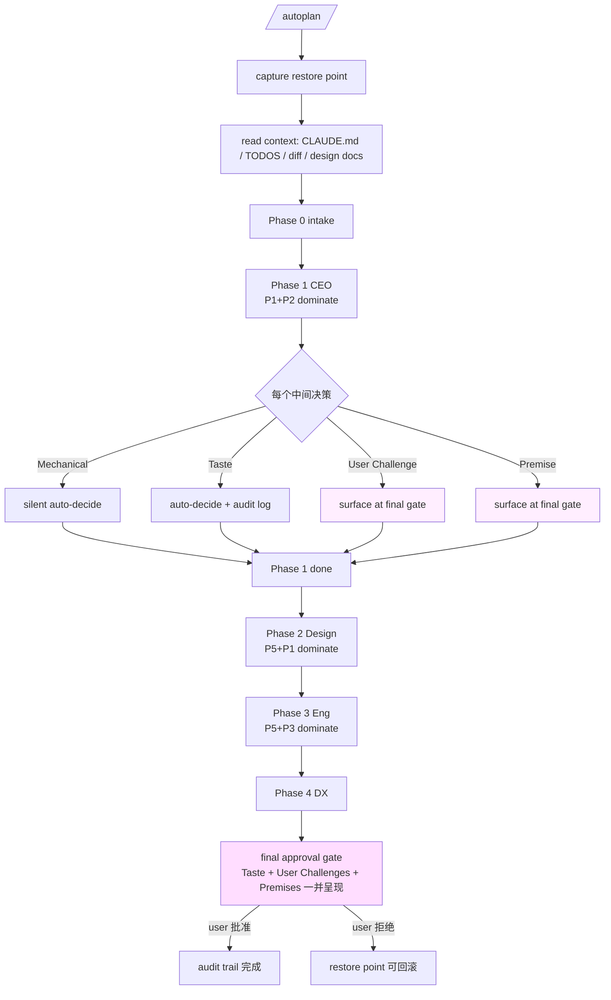

# 08 · Autoplan：6 决策原则 + Mechanical vs Taste

> Autoplan 是 gstack 里唯一的"orchestrator skill"。它读 4 个 review skill 的完整 body、按顺序跑一遍、期间遇到的每个中间决策**替用户拍板**。这一章拆它做替代决策的两个抓手：**6 条决策原则** 和 **Mechanical / Taste / User-Challenge 三分类**。

## 8.1 一个奇怪的 skill

普通 skill 用户只需要在最后一次 approval gate 决定。autoplan 反过来：一次运行会跑 4 个 review skill × 每个 15-30 个 AskUserQuestion，如果都问用户，用户要按 60-120 次按钮。

autoplan 的答案：**大部分中间决策由 autoplan 用 6 条原则自动决**，只有真需要用户"品味"的决策才最后一并批准。

`autoplan/SKILL.md.tmpl:41-47`：

```text
# from autoplan/SKILL.md.tmpl:41-47
/autoplan reads the full CEO, design, eng, and DX review skill files from disk and
follows them at full depth — same rigor, same sections, same methodology as running
each skill manually. The only difference: intermediate AskUserQuestion calls are
auto-decided using the 6 principles below. Taste decisions (where reasonable people
could disagree) are surfaced at a final approval gate.
```

**"same depth as running manually"** 是关键 —— autoplan 不省略分析，只省略问用户。深度和手动跑一样。

## 8.2 6 条决策原则

`autoplan/SKILL.md.tmpl:53-60`：

```text
# from autoplan/SKILL.md.tmpl:55-60
1. **Choose completeness** — Ship the whole thing. Pick the approach that covers more edge cases.
2. **Boil lakes** — Fix everything in the blast radius (files modified by this plan +
   direct importers). Auto-approve expansions that are in blast radius AND < 1 day CC
   effort (< 5 files, no new infra).
3. **Pragmatic** — If two options fix the same thing, pick the cleaner one. 5 seconds
   choosing, not 5 minutes.
4. **DRY** — Duplicates existing functionality? Reject. Reuse what exists.
5. **Explicit over clever** — 10-line obvious fix > 200-line abstraction. Pick what a
   new contributor reads in 30 seconds.
6. **Bias toward action** — Merge > review cycles > stale deliberation. Flag concerns
   but don't block.
```

每条原则都是一句"当遇到 X 情况时选 Y"。**这是给 LLM 的决策 API**：LLM 不需要自己发明标准，读一遍 6 条、遇到中间决策就按原则匹配。

有意思的是原则有内部冲突（P1 completeness 想扩、P3 pragmatic 想收）。所以 body 里给了 tie-breaker：

```text
# from autoplan/SKILL.md.tmpl:62-65
**Conflict resolution (context-dependent tiebreakers):**
- **CEO phase:** P1 (completeness) + P2 (boil lakes) dominate.
- **Eng phase:** P5 (explicit) + P3 (pragmatic) dominate.
- **Design phase:** P5 (explicit) + P1 (completeness) dominate.
```

**同一 6 条原则、按 phase 换主导权**。CEO 阶段偏扩张、eng 阶段偏简洁、design 阶段偏可读。这让"6 条原则"不是死规则，是**上下文感知**的决策系统。

## 8.3 Decision Classification：Mechanical / Taste / User-Challenge

有了原则，还需要"什么时候用原则决、什么时候留给用户"的分类。autoplan 分 3 类：

### 8.3.1 Mechanical —— 自动决、不打扰

`autoplan/SKILL.md.tmpl:73-74`：

```text
# from autoplan/SKILL.md.tmpl:73-74
**Mechanical** — one clearly right answer. Auto-decide silently.
Examples: run codex (always yes), run evals (always yes), reduce scope on a complete
plan (always no).
```

Mechanical = 有明显对错。autoplan 不问用户、不写 audit trail、不显示 decision brief —— 静默处理掉。

### 8.3.2 Taste —— 自动决、最终关口呈现

`autoplan/SKILL.md.tmpl:76-79`：

```text
# from autoplan/SKILL.md.tmpl:76-79
**Taste** — reasonable people could disagree. Auto-decide with recommendation, but
surface at the final gate. Three natural sources:
1. **Close approaches** — top two are both viable with different tradeoffs.
2. **Borderline scope** — in blast radius but 3-5 files, or ambiguous radius.
3. **Codex disagreements** — codex recommends differently and has a valid point.
```

Taste = 合理的人会分歧。autoplan 用 6 原则决一个方向，但**记录到 audit trail**，最终关口一并让用户批。

Taste 的 3 个来源：**接近的方案**、**边缘 scope**、**Codex 有理由的不同意见**。这三个都是"用户品味 > 一般原则"的场合。

### 8.3.3 User Challenge —— 从不自动决

`autoplan/SKILL.md.tmpl:81-96`：

```text
# from autoplan/SKILL.md.tmpl:81-96
**User Challenge** — both models agree the user's stated direction should change.
This is qualitatively different from taste decisions. When Claude and Codex both
recommend merging, splitting, adding, or removing features/skills/workflows that
the user specified, this is a User Challenge. It is NEVER auto-decided.

User Challenges go to the final approval gate with richer context than taste decisions:
- **What the user said:** (their original direction)
- **What both models recommend:** (the change)
- **Why:** (the models' reasoning)
- **What context we might be missing:** (explicit acknowledgment of blind spots)
- **If we're wrong, the cost is:** (what happens if the user's original direction
  was right and we changed it)

The user's original direction is the default. The models must make the case for
change, not the other way around.
```

User Challenge = 两个 model（Claude + Codex）都想推翻用户原方向。这**永远不 auto-decide**，因为用户有 model 看不到的 context。

**"用户方向是默认，model 要证明改的必要"** 是重要的默认价值观 —— 反直觉但正确：即使 2 个 model 一致想改，用户仍然默认对。

## 8.4 两个"不 auto-decide"的例外

除了 User Challenge，`autoplan/SKILL.md.tmpl:123-127` 明列 2 个 auto-decide 例外：

```text
# from autoplan/SKILL.md.tmpl:123-127
**Two exceptions — never auto-decided:**
1. Premises (Phase 1) — require human judgment about what problem to solve.
2. User Challenges — when both models agree the user's stated direction should change
   (merge, split, add, remove features/workflows). The user always has context models
   lack.
```

**Premise 不能 auto-decide**：因为 premise 是"我们真的要解决这个问题吗"—— 这个问题定义了整个 review 的空间，autoplan 不能替。

## 8.5 什么被 auto-decide 替代了

`autoplan/SKILL.md.tmpl:118-121` 明说 auto-decide 替换的是什么：

```text
# from autoplan/SKILL.md.tmpl:118-121
Auto-decide replaces the USER'S judgment with the 6 principles. It does NOT replace
the ANALYSIS. Every section in the loaded skill files must still be executed at the
same depth as the interactive version. The only thing that changes is who answers the
AskUserQuestion: you do, using the 6 principles, instead of the user.
```

**替代的是"回答 AUQ 的人"，不是"跑 AUQ 前的分析"**。autoplan 依然要读代码、跑 grep、生成 diagram，只是决策者从用户变成 6 条原则。

`autoplan/SKILL.md.tmpl:129-146` 强化"必须做的分析"清单：

```text
# from autoplan/SKILL.md.tmpl:129-146
**You MUST still:**
- READ the actual code, diffs, and files each section references
- PRODUCE every output the section requires (diagrams, tables, registries, artifacts)
- IDENTIFY every issue the section is designed to catch
- DECIDE each issue using the 6 principles (instead of asking the user)
- LOG each decision in the audit trail
- WRITE all required artifacts to disk

**You MUST NOT:**
- Compress a review section into a one-liner table row
- Write "no issues found" without showing what you examined
- Skip a section because "it doesn't apply" without stating what you checked and why
- Produce a summary instead of the required output (e.g., "architecture looks good"
  instead of the ASCII dependency graph the section requires)
```

**防止 LLM 用 autoplan 走偷懒捷径**。autoplan 是"减少用户按钮次数"，不是"减少分析深度"。这条被明写。

## 8.6 4-phase 严格串行

`autoplan/SKILL.md.tmpl:105-113`：

```text
# from autoplan/SKILL.md.tmpl:105-113
## Sequential Execution — MANDATORY

Phases MUST execute in strict order: CEO → Design → Eng → DX.
Each phase MUST complete fully before the next begins.
NEVER run phases in parallel — each builds on the previous.

Between each phase, emit a phase-transition summary and verify that all required
outputs from the prior phase are written before starting the next.
```

**为什么严格串行**：CEO phase 决定 scope，scope 会改变 eng phase 要 review 的范围。design phase 依赖 CEO phase 的产品视角。DX phase 需要前面 3 个 phase 的所有 artifact。

autoplan 不并行是因为 phase 之间是**信息依赖链**，不是独立任务。

## 8.7 一个 restore point 的设计

`autoplan/SKILL.md.tmpl:164-189` 是 autoplan 的 pre-flight —— **在改 plan file 之前先备份**：

```text
# from autoplan/SKILL.md.tmpl:164-189 (摘)
### Step 1: Capture restore point

Before doing anything, save the plan file's current state to an external file:

```bash
BRANCH=$(git rev-parse --abbrev-ref HEAD 2>/dev/null | tr '/' '-')
DATETIME=$(date +%Y%m%d-%H%M%S)
echo "RESTORE_PATH=$HOME/.gstack/projects/$SLUG/${BRANCH}-autoplan-restore-${DATETIME}.md"
```

Write the plan file's full contents to the restore path with this header:
...

Then prepend a one-line HTML comment to the plan file:
`<!-- /autoplan restore point: [RESTORE_PATH] -->`
```

**autoplan 会大量改 plan file**（4 个 review 都往里写）。如果用户后悔，能 restore。这是"授权 auto-decide"的对偶补偿：**你替我决策 → 你必须允许我 undo**。

## 8.8 一张 Mermaid：autoplan 的决策流



## 8.9 章末导航

[← 07 review army 4 视角](07-review-army-4-视角.md) | [下一章：09 · Second opinion 三件套 →](09-second-opinion-三件套.md)
