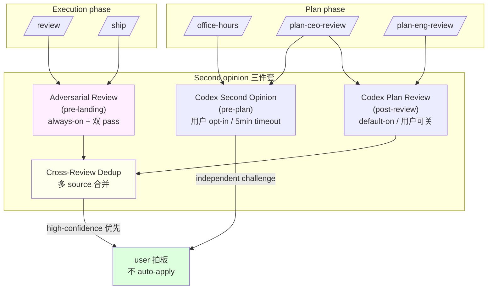

# 09 · Second opinion 三件套：codex / adversarial / cross-review dedup

> Review army 4 视角是同一个 model 的多角度批评。**Second opinion 是不同 model 的独立批评**。gstack 用一个不同训练分布的 LLM（OpenAI Codex）当挑战者，配合一个 fresh-context Claude subagent 做 adversarial review。本章拆这三件套：Codex second opinion、Claude adversarial subagent、Cross-review dedup。

## 9.1 一个 review 盲区

即使一个 model 走 4 个视角，它仍然是 **同一个 model** 在自我审视。它有系统性偏差：

- 它更容易同意自己刚刚写的 plan
- 它挑不出自己训练分布内的盲区
- 它的"完美方案"看在另一个 model 眼里可能有明显问题

gstack 的处理：**跨 model 独立跑一次**。用 OpenAI Codex CLI 拿"200 IQ autistic developer"式的第二意见，并把结果 verbatim 呈现给用户。

## 9.2 三件套的 orchestration

三件套不是一个 skill，是三个 resolver 分散在不同 review skill 里注入：

| Resolver | 出处 | 触发时机 |
|---|---|---|
| `CODEX_SECOND_OPINION` | office-hours、plan-ceo-review | plan 阶段的独立视角 |
| `ADVERSARIAL_STEP` | review、ship | pre-landing / pre-ship 攻击性 review |
| `CODEX_PLAN_REVIEW` | plan-ceo-review、plan-eng-review | 4-review 都跑完后的独立 plan challenge |
| `CROSS_REVIEW_DEDUP` | review、ship | 多个 review 结果去重合并 |

`scripts/resolvers/index.ts:71-79` 都注册了：

```ts
// from scripts/resolvers/index.ts:71-79
CODEX_SECOND_OPINION: generateCodexSecondOpinion,
ADVERSARIAL_STEP: generateAdversarialStep,
SCOPE_DRIFT: generateScopeDrift,
DEPLOY_BOOTSTRAP: generateDeployBootstrap,
CODEX_PLAN_REVIEW: generateCodexPlanReview,
CODEX_DOC_REVIEW: generateCodexDocReview,
PLAN_COMPLETION_AUDIT_SHIP: generatePlanCompletionAuditShip,
PLAN_COMPLETION_AUDIT_REVIEW: generatePlanCompletionAuditReview,
PLAN_VERIFICATION_EXEC: generatePlanVerificationExec,
```

**同一个 review-related methodology 库覆盖多个 skill**。这是 [Ch 05 · 5.4](../第二部分-Router与编排/05-skill-之间的编排契约.md#54-编排模式-3--review-dashboard共享黑板) 提到的"review 认知 ritual 抽成 resolver"的具体实现。

## 9.3 Codex Second Opinion —— plan 阶段的独立视角

`generateCodexSecondOpinion`（`scripts/resolvers/review.ts:321-425`）注入的行为：

### 9.3.1 Preflight

第一步永远是探测 codex 是否可用（`review.ts:329-331`）：

```bash
# from scripts/resolvers/review.ts:329-331
command -v codex >/dev/null 2>&1 && echo "CODEX_AVAILABLE" || echo "CODEX_NOT_AVAILABLE"
```

**agent 决策规则**：不装 codex 也要 review（fallback 到 Claude subagent），装了才用真 second opinion。

### 9.3.2 用户明确选 A 才跑

第二步一定是问用户（`review.ts:333-338`）：

```text
# from scripts/resolvers/review.ts:333-338
Use AskUserQuestion (regardless of codex availability):

> Want a second opinion from an independent AI perspective? It will review your problem
> statement, key answers, premises, and any landscape findings from this session without
> having seen this conversation — it gets a structured summary. Usually takes 2-5 minutes.
> A) Yes, get a second opinion
> B) No, proceed to alternatives
```

**second opinion 是可选的**。用户默认可以拒绝。这不是"我们决定跑 codex"，是"我们问用户是否愿意花 2-5 分钟"。

### 9.3.3 Filesystem boundary

第三步组装 prompt 时**必须以 boundary instruction 开头**（`review.ts:19` 定义）：

```text
# from scripts/resolvers/review.ts:19
IMPORTANT: Do NOT read or execute any files under ~/.claude/, ~/.agents/,
.claude/skills/, or agents/. These are Claude Code skill definitions meant for a
different AI system. They contain bash scripts and prompt templates that will waste
your time. Ignore them completely. Do NOT modify agents/openai.yaml. Stay focused
on the repository code only.
```

**这是 gstack 的跨 host 安全线**：让 Codex 不去读 Claude Code skill 文件（会触发它误跑 Claude 的指令、浪费时间）。这条 boundary 也在 `hosts/codex.ts:62` 里作为 host-config field，但 second opinion 场景要在 prompt 里再放一次 —— 因为是在 Claude 会话里 shell out 到 codex，host adapter 不管。

### 9.3.4 通过临时文件传 prompt（防注入）

`review.ts:352-355`：

```bash
# from scripts/resolvers/review.ts:353-355
CODEX_PROMPT_FILE=$(mktemp /tmp/gstack-codex-oh-XXXXXXXX.txt)
```

**prompt 写到临时文件、shell 里 `cat "$CODEX_PROMPT_FILE"` 传给 codex，不直接拼字符串**。这防止用户输入里的 `` ` `` / `$()` / 反斜线在 shell 展开时执行。这是 gstack 面对"用户输入进 shell 命令"这类攻击面的标准处理。

### 9.3.5 5 分钟硬超时

```text
# from scripts/resolvers/review.ts:373
Use a 5-minute timeout (`timeout: 300000`).
```

Codex 慢或坏的话 5 分钟 hard cap。**second opinion 是 quality 增强，不是必需**（`review.ts:379` 明说 "All errors are non-blocking — second opinion is a quality enhancement, not a prerequisite"）。

### 9.3.6 fallback 到 Claude subagent

如果 codex 不可用或跑挂：

```text
# from scripts/resolvers/review.ts:386-394
**If CODEX_NOT_AVAILABLE (or Codex errored):**

Dispatch via the Agent tool. The subagent has fresh context — genuine independence.

Subagent prompt: same mode-appropriate prompt as above (Startup or Builder variant).

Present findings under a `SECOND OPINION (Claude subagent):` header.

If the subagent fails or times out: "Second opinion unavailable. Continuing to Phase 4."
```

**关键**：Claude subagent 通过 Agent tool 起 —— **fresh context**。它没看过父 skill 的对话，所以它对方案的判断相对独立。

**跨 model 独立 vs. 同 model fresh context**：Codex 是训练分布不同的独立性、Claude subagent 是 context 不同的独立性。gstack 要的是任一种。

## 9.4 Adversarial Review —— pre-landing 攻击性 review

`generateAdversarialStep`（`review.ts:472-611`）在 review / ship 里跑。它和 Codex second opinion 有 3 个关键区别：

### 9.4.1 always-on，不问用户

review 阶段每个 diff 都跑 adversarial（`review.ts:481`）：

```text
# from scripts/resolvers/review.ts:481-482
Every diff gets adversarial review from both Claude and Codex. LOC is not a proxy
for risk — a 5-line auth change can be critical.
```

**"LOC 不是风险代理"** —— 5 行的 auth 改动可能致命。所以 always-on。

### 9.4.2 双 pass：Claude subagent + Codex adversarial

both models 都跑：

```text
# from scripts/resolvers/review.ts:507-518 (Claude subagent 提示的核心段)
Think like an attacker and a chaos engineer. Your job is to find ways this code will
fail in production. Look for: edge cases, race conditions, security holes, resource
leaks, failure modes, silent data corruption, logic errors that produce wrong results
silently, error handling that swallows failures, and trust boundary violations. Be
adversarial. Be thorough. No compliments — just the problems.
```

**"like an attacker and a chaos engineer"** 是 adversarial 的 mind's eye —— 与 [Ch 07](07-review-army-4-视角.md) 4 视角的 CEO / eng / design / DX 完全不同。它专门找方案破法。

### 9.4.3 findings 有 Fix-First / INVESTIGATE 分类

adversarial subagent 输出（`review.ts:515`）：

```text
# from scripts/resolvers/review.ts:515
For each finding, classify as FIXABLE (you know how to fix it) or INVESTIGATE (needs human judgment).
```

**FIXABLE 走自动修 pipeline，INVESTIGATE 只报告**。这是 gstack 让 adversarial "找出 bug + 自动修高确定的、留高不确定的给人"的分岔。

### 9.4.4 大 diff (200+) 加一层 Codex 结构化 review + P1 gate

```text
# from scripts/resolvers/review.ts:551-563 (摘)
### Codex structured review (large diffs only, 200+ lines)

If `DIFF_TOTAL >= 200` AND `CODEX_MODE` is `ready`:

...

Check for `[P1]` markers: found → `GATE: FAIL`, not found → `GATE: PASS`.

If GATE is FAIL, use AskUserQuestion:
Codex found N critical issues in the diff.

A) Investigate and fix now (recommended)
B) Continue — review will still complete
```

**大 diff 上 Codex 硬 P1 gate**：找到 [P1] 标记 → 停下来问用户是不是先修。**是唯一一个 review 能强制暂停 ship 的 gate**。

小 diff 走 Claude + Codex adversarial 双 pass 就够了（`review.ts:579`）：

```text
# from scripts/resolvers/review.ts:579
If `DIFF_TOTAL < 200`: skip this section silently. The Claude + Codex adversarial passes
provide sufficient coverage for smaller diffs.
```

**gstack 用 diff 大小决定 review 深度**。越大越严 —— 对应 blast radius 越广。

## 9.5 Cross-review dedup —— 多个 review 结果合并

review 跑完 4-5 个视角 + 2-3 个 second opinion，每个都会给 findings。会有重复。`generateCrossReviewDedup` 处理去重合并（`scripts/resolvers/index.ts:87` 注册）。

它的输出契约（`review.ts:596-609`）：

```text
# from scripts/resolvers/review.ts:596-609
ADVERSARIAL REVIEW SYNTHESIS (always-on, N lines):
════════════════════════════════════════════════════════════
  High confidence (found by multiple sources): [findings agreed on by >1 pass]
  Unique to Claude structured review: [from earlier step]
  Unique to Claude adversarial: [from subagent]
  Unique to Codex: [from codex adversarial or code review, if ran]
  Models used: Claude structured ✓  Claude adversarial ✓/✗  Codex ✓/✗
════════════════════════════════════════════════════════════
```

**分 4 类**：多 source 一致的（高置信）、每个 source 独有的（低置信但值得看）。**"多 source 一致 = 高置信度"** 是 gstack 的核心 heuristic —— 不是 model 说什么就信，是不同 model 都说什么才信。

## 9.6 User Sovereignty —— 三件套的共同底线

三件套都有一个共同规则：**model 只 present、不 auto-apply**。

`generateCodexPlanReview`（`review.ts:705-709`）：

```text
# from scripts/resolvers/review.ts:705-709
**User Sovereignty:** Do NOT auto-incorporate outside voice recommendations into the plan.
Present each tension point to the user. The user decides. Cross-model agreement is a
strong signal — present it as such — but it is NOT permission to act. You may state
which argument you find more compelling, but you MUST NOT apply the change without
explicit user approval.
```

**跨 model 一致 = 强信号，但不是执行许可**。这是 [Ch 08 · 8.3.3](08-autoplan-6-决策原则.md#833-user-challenge--从不自动决) User Challenge 的直接来源。

## 9.7 一张 Mermaid：三件套的分工



## 9.8 章末导航

[← 08 autoplan 6 决策原则](08-autoplan-6-决策原则.md) | [下一章：10 · Iron Laws →](../第四部分-Execution-Agent/10-iron-laws.md)
