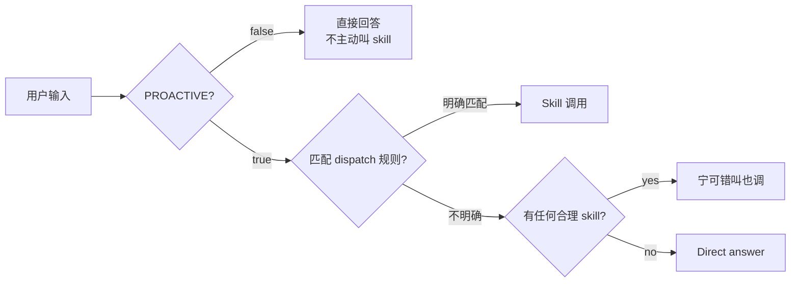
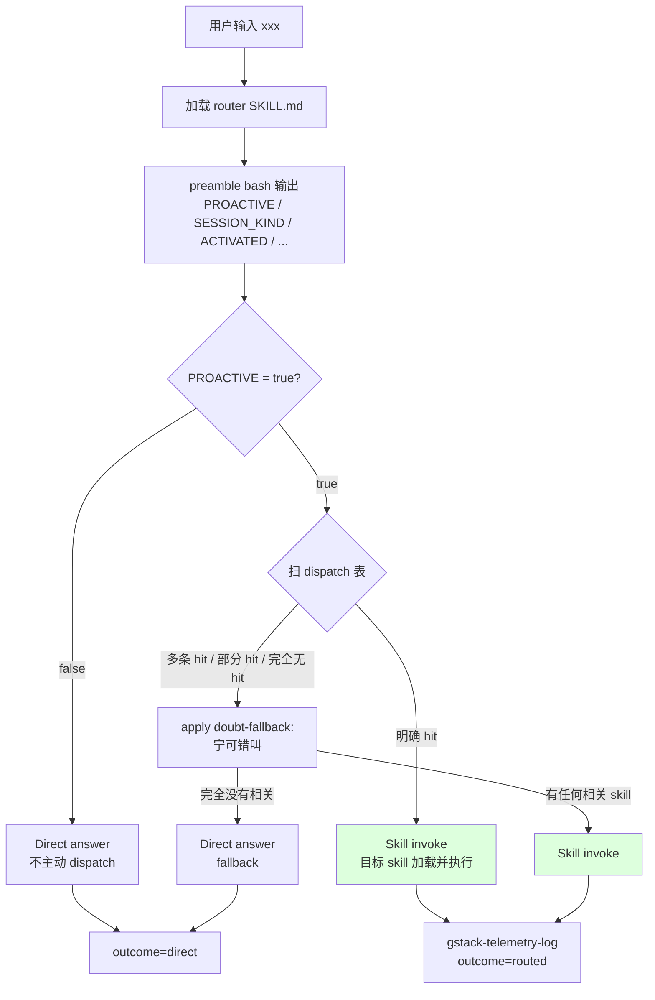

# 04 · Router 的路由决策：dispatch 表 + PROACTIVE gate

> Router 是 gstack agent 的入口。当用户输入 `gstack` 或某个未指定 skill 的自然语言请求，router 决定"这个请求交给哪个 skill"。本章拆它的三个决策阀：PROACTIVE gate、dispatch 表、"When in doubt, invoke the skill" 兜底。

## 4.1 Router 是一个决策器，不是执行器

Router 的 frontmatter（`SKILL.md.tmpl:1-18`）显式限制它的能力：

```yaml
# from SKILL.md.tmpl:1-18
---
name: gstack
preamble-tier: 1
version: 1.2.0
description: Router for the gstack skill suite. ...
allowed-tools:
  - Bash
  - Read
  - AskUserQuestion
triggers:
  - gstack
  - which gstack skill
  - route this with gstack
---
```

**注意 `allowed-tools` 里没有 Edit / Write / Agent**。Router 不改文件、不 spawn subagent。它只做一件事：读用户请求 → 决定 dispatch 哪个 skill → 把 Skill 工具调用过去。

body 开头（`SKILL.md.tmpl:23-25`）明说：

```text
# from SKILL.md.tmpl:23-25
## Route first

This is the gstack router. Its one job is to send the request to the right skill.
```

## 4.2 三个阀：PROACTIVE / dispatch 表 / doubt fallback

Router 的决策不是一步到位。它是三个阀依次过：



## 4.3 阀 1：PROACTIVE gate

`SKILL.md.tmpl:38-45`：

```text
# from SKILL.md.tmpl:38-45
If `PROACTIVE` is `false`: do NOT proactively invoke or suggest other gstack skills during
this session. Only run skills the user explicitly invokes. This preference persists across
sessions via `gstack-config`.

If `PROACTIVE` is `true` (default): **invoke the Skill tool** when the user's request
matches a skill's purpose. Do NOT answer directly when a skill exists for the task.
Use the Skill tool to invoke it. The skill has specialized workflows, checklists, and
quality gates that produce better results than answering inline.
```

`PROACTIVE` 的值来自 `bin/gstack-config get proactive`（[Ch 01 · 1.5](../第一部分-输入层/01-preamble-作为-LLM-state-feed.md#15-preamble-的-21-个-key-完整拉一遍) 表里）。用户可以运行 `gstack-config set proactive false` 关掉。

**这不是一个"允许 vs 禁止"开关，是一个"主动 vs 被动"开关**：`false` 时用户显式说 `/qa` 还是能跑；`true` 时用户说 "test my site" 也会被 dispatch。

用户第一次跑 skill 时（`SKILL.md:219-233`）router 会用 AskUserQuestion 询问偏好并写回 config。这是 gstack 的"opt-in with default-on"：默认主动、允许一键关闭、决策留在磁盘。

## 4.4 阀 2：Dispatch 表

阀 1 通过后进阀 2。dispatch 表在 `SKILL.md.tmpl:47-83`，有约 30 条规则。摘几条：

```text
# from SKILL.md.tmpl:47-58 (摘 12 条)
**Routing rules — when you see these patterns, INVOKE the skill via the Skill tool:**
- User describes a new idea, asks "is this worth building", brainstorms → invoke `/office-hours`
- User asks to spec something out, file an issue → invoke `/spec`
- User asks about strategy, scope, ambition, "think bigger" → invoke `/plan-ceo-review`
- User asks to review architecture, "does this design make sense" → invoke `/plan-eng-review`
- User asks about design system, brand, visual identity → invoke `/design-consultation`
- User asks to review design of a plan → invoke `/plan-design-review`
- User asks about developer experience of a plan → invoke `/plan-devex-review`
- User wants all reviews done automatically → invoke `/autoplan`
- User reports a bug, error, broken behavior, "why is this broken" → invoke `/investigate`
- User asks to test the site, find bugs, QA → invoke `/qa`
- User asks to just report bugs without fixing → invoke `/qa-only`
- User asks to review code, check the diff → invoke `/review`
```

规则形状统一：**一组自然语言模式 → 一个 skill**。每条不到 100 字符，LLM 一次能扫全 30 条。

设计要点：**规则是 markdown**。改路由行为不用 rebuild 也不用 hot-reload，只需要改 SKILL.md.tmpl 然后 `bun run gen:skill-docs`（本书不展开构建；这里只关心 agent 行为）。

## 4.5 阀 3：When in doubt, invoke

如果多条规则同时命中或都不命中，`SKILL.md.tmpl:84-88` 给出 **反直觉的兜底**：

```text
# from SKILL.md.tmpl:84-88
**When in doubt, invoke the skill.** A false positive (invoking a skill that wasn't
needed) is cheaper than a false negative (answering ad-hoc when a structured workflow
exists). The skill provides multi-step workflows, checklists, and quality gates that
always produce better results than an ad-hoc answer. If no skill matches, answer
directly as usual.
```

**gstack 假定 false-positive 便宜、false-negative 贵**。宁愿 dispatch 一个不完美命中的 skill（用户可以跳出来），也不要用 ad-hoc prose 替代结构化流程。

这是关键的 agent 决策哲学：**skill 是 quality floor**。哪怕它不完美，它跑完至少走过 checklist；ad-hoc 回答可能漏掉 review army、漏掉 plan-completion audit、漏掉 STATUS token。

## 4.6 三个阀依次过 —— 一张 Mermaid



## 4.7 一个副作用：路由 outcome telemetry

Router 不只是决策，它还记录自己的决策：

```text
# from SKILL.md.tmpl:31-36
Best-effort, record which way you routed (never block on it). Set `ROUTE_OUTCOME` to
`browse` (sent to /browse), `routed` (sent to another skill), or `direct` (answered
directly, no skill matched):
```bash
~/.claude/skills/gstack/bin/gstack-telemetry-log --event-type route --skill gstack --outcome ROUTE_OUTCOME --session-id "$_SESSION_ID" 2>/dev/null || true
```

三种 outcome —— `browse` / `routed` / `direct`—— 让 gstack 团队能事后分析"router 在实际使用中把请求分到哪里"。这是 v1.58.5 引入的 activation 数据来源之一（CHANGELOG v1.58.5.0 引用了这类 cohort）。

**agent 决策不是黑盒**：它把决策类型标签记在磁盘上，允许后续统计 / 优化 dispatch 表。

## 4.8 Router 与其他 skill 的一个不对称

Router 是唯一一个 `preamble-tier: 1` 的路由器。这意味着它 **看不到 tier 2+ 才有的 AskUserQuestion Format 段**（[Ch 02 · 2.3](../第一部分-输入层/02-preamble-tier-与上下文密度.md#23-tier--section-组合表)）。为什么这没问题？

因为 router 不问用户问题（除了首次 telemetry / proactive 偏好）。它做的每个决策都是"看规则匹配"，不是"打完整度分"。规则匹配的 LLM prompt 密度远低于批评 army、于是可以走 tier 1。

反过来 —— **要问用户的 skill 一定 tier 2+**。这是 gstack "输入密度按需分配"的另一次应用。

## 4.9 章末导航

[← 03 session kind 与 first-run](../第一部分-输入层/03-session-kind-与-first-run.md) | [下一章：05 · Skill 之间的编排契约 →](05-skill-之间的编排契约.md)
