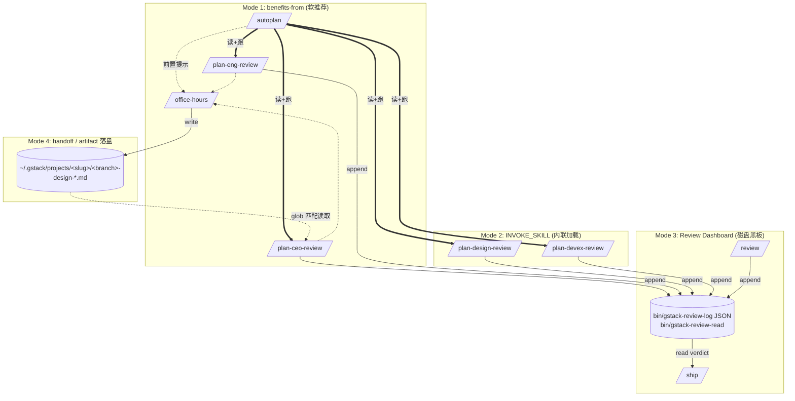

# 05 · Skill 之间的编排契约

> 一个 skill 很少独立完成任务。plan-ceo-review 建议先跑 office-hours、autoplan 依次调 4 个 review skill、review 在末尾把结果写回 plan file 让 ship 读到。这些 skill 之间的"接线"由几个 frontmatter 字段和 resolver 定义。本章拆 4 种编排模式：`benefits-from` 前置提示、`{{INVOKE_SKILL}}` 内联加载、review dashboard 作为共享黑板、`handoff` artifact 交接。

## 5.1 Skill 不是孤岛

一次典型的 gstack 使用轨迹：

```text
用户："我想加个 notifications 功能"
→ router dispatch /office-hours   （挑战 premise + 出 design doc）
→ /office-hours 建议接 /autoplan    （benefits-from 提示）
→ /autoplan 内联加载 4 个 review skill    （{{INVOKE_SKILL}} + review-army）
→ 4 个 review 各自 log 结果         （review dashboard）
→ 用户改代码
→ 用户跑 /review                   （读 dashboard 状态）
→ 用户跑 /ship                     （读 dashboard + audit plan completion）
→ /ship 生成 PR
→ 用户跑 /land-and-deploy          （读 PR、合并、部署）
```

从 skill 的角度，它们靠 4 种机制串在一起。

## 5.2 编排模式 1 —— `benefits-from`：前置提示

frontmatter 里的 `benefits-from: [<skill>]` 声明"如果先跑那个 skill，我的输入会更锋利"。看例子：

```yaml
# from plan-ceo-review/SKILL.md.tmpl:15
benefits-from: [office-hours]
```

```yaml
# from plan-eng-review/SKILL.md.tmpl:17
benefits-from: [office-hours]
```

```yaml
# from autoplan/SKILL.md.tmpl:17
benefits-from: [office-hours]
```

**它不是硬依赖**，是"更好但不必需"。字段被 `scripts/gen-skill-docs.ts:724-727` 抽出、传进 `TemplateContext.benefitsFrom`，然后由 `generateBenefitsFrom`（`scripts/resolvers/review.ts:272-319`）注入到 body。

看它注入什么（`scripts/resolvers/review.ts:281-291`）：

```text
# from scripts/resolvers/review.ts:281-291
## Prerequisite Skill Offer

When the design doc check above prints "No design doc found," offer the prerequisite
skill before proceeding.

Say to the user via AskUserQuestion:

> "No design doc found for this branch. `/office-hours` produces a structured problem
> statement, premise challenge, and explored alternatives — it gives this review much
> sharper input to work with. Takes about 10 minutes. The design doc is per-feature,
> not per-product — it captures the thinking behind this specific change."
```

**agent 决策**：先跑 disk 检测 → 没找到 design doc → AUQ 问用户是否内联跑 office-hours → 用户选 A 就用 `{{INVOKE_SKILL}}` 内联加载 office-hours、跑完再回来接 review。

关键：它不强迫。`benefits-from` 是"温和推荐"，让 skill 之间的编排是**可协商的**。

## 5.3 编排模式 2 —— `{{INVOKE_SKILL:xxx}}`：内联加载

`{{INVOKE_SKILL}}` 是让一个 skill 在自己的会话中读另一个 skill 并"按它写的做"。看 resolver（`scripts/resolvers/composition.ts:10-47`）：

```ts
// from scripts/resolvers/composition.ts:23-38
const DEFAULT_SKIPS = [
  'Preamble (run first)',
  'AskUserQuestion Format',
  'Completeness Principle — Boil the Ocean',
  'Search Before Building',
  'Contributor Mode',
  'Completion Status Protocol',
  'Telemetry (run last)',
  'Step 0: Detect platform and base branch',
  'Review Readiness Dashboard',
  'Plan File Review Report',
  'Prerequisite Skill Offer',
  'Plan Status Footer',
];

const allSkips = [...DEFAULT_SKIPS, ...extraSkips];
```

生成的 prose：

```text
# from scripts/resolvers/composition.ts:40-47
Read the `/${skillName}` skill file at `${ctx.paths.skillRoot}/${skillName}/SKILL.md`
using the Read tool.

**If unreadable:** Skip with "Could not load /${skillName} — skipping." and continue.

Follow its instructions from top to bottom, **skipping these sections** (already handled
by the parent skill):
${allSkips.map(s => `- ${s}`).join('\n')}

Execute every other section at full depth. When the loaded skill's instructions are
complete, continue with the next step below.
```

三个关键决策：

- **同一 LLM 会话跑另一个 skill**：不 spawn subagent、不 fork。父 skill 的 context 保留，被加载的 skill 继续用同一个 LLM
- **skip 12 个共享段**：因为父 skill 的 preamble 已经做过 telemetry / AUQ format / completion status。子 skill 再跑一遍就是重复
- **加载不了不阻断**：`If unreadable: Skip with ... and continue`。这是 gstack "编排容错"的普遍模式：**skill 之间是软链接，不是硬依赖**

autoplan 是重度使用者。它 `{{INVOKE_SKILL}}` 依次加载 4 个 review skill，让每个 review 走它自己的完整方法学，但共享一个 LLM 会话。这是"orchestrator 型 skill"的实现方式。

## 5.4 编排模式 3 —— Review Dashboard：共享黑板

各 review skill 跑完不返回值给父 skill —— 它们把结果**写到磁盘**，后续 skill 从磁盘读。这块磁盘就是 review dashboard。

写入端：每个 review skill 末尾 `bin/gstack-review-log '{...}'` 追加一行 JSON。

读取端：任何 skill 通过 `bin/gstack-review-read` 拿到最近的所有 review entries。

`generateReviewDashboard`（`scripts/resolvers/review.ts:21-71`）注入的 prose：

```text
# from scripts/resolvers/review.ts:22-31
## Review Readiness Dashboard

After completing the review, read the review log and config to display the dashboard.

```bash
~/.claude/skills/gstack/bin/gstack-review-read
```

Parse the output. Find the most recent entry for each skill (plan-ceo-review,
plan-eng-review, review, plan-design-review, design-review-lite, adversarial-review,
codex-review, codex-plan-review). Ignore entries with timestamps older than 7 days.
```

**7 天窗口** —— 任何超过 7 天的 review 视为过期，不再算数。这是 gstack 处理"review 陈旧"问题的方式：不删旧数据、只在读的时候 filter。

verdict 逻辑（`scripts/resolvers/review.ts:60-66`）：

```text
# from scripts/resolvers/review.ts:62-66
- **CLEARED**: Eng Review has >= 1 entry within 7 days from either `review` or
  `plan-eng-review` with status "clean" (or `skip_eng_review` is `true`)
- **NOT CLEARED**: Eng Review missing, stale (>7 days), or has open issues
- CEO, Design, and Codex reviews are shown for context but never block shipping
```

**只有 Eng Review 是硬门**（default required）。CEO / Design / Codex 是软推荐，能改变 verdict 的建议但不能拦 ship。这是 gstack 对"review 类型分级"的答案 —— 一硬多软。

## 5.5 编排模式 4 —— `handoff`：artifact 交接

`handoff` 是 plan-mode skill 用来指定"我的输出去哪个文件"的字段。看 deep-interview 的 frontmatter（本次任务用到过）：

```yaml
handoff-policy: approval-required
handoff: .omc/specs/deep-interview-{slug}.md
```

gstack 里用得少 —— 因为 gstack 主流是把 artifact 写到 `~/.gstack/projects/<slug>/*.md` 而非 skill frontmatter 声明。但 pattern 相同：**skill 完成后不返回值、把 artifact 落到已知路径**。

后续 skill 通过 slug + branch + 类型模式匹配（`~/.gstack/projects/<slug>/*-<branch>-design-*.md`）找到 artifact。这是 review dashboard 之外的另一种"通过磁盘编排"。

## 5.6 Skill 编排的关键属性：容错

三个模式（`benefits-from`、`{{INVOKE_SKILL}}`、review dashboard）都设计成 **不阻断 fallback**：

| 情境 | fallback |
|---|---|
| `benefits-from` 声明的前置 skill 用户拒绝 | 直接跑当前 skill，只是输入锋利度低 |
| `{{INVOKE_SKILL}}` 加载不了 | 跳过、继续父 skill |
| review dashboard 读到的 review 缺失或过期 | 只 verdict 变 "NOT CLEARED"，其他 review 照常报告 |

**软链接哲学**：skill 编排靠"如果那个 skill 跑过 / 没跑过就走不同分支"，不靠"必须先跑 X 才能跑 Y"。这让每个 skill 独立可用、又能因链路增强。

## 5.7 一张 Mermaid：4 种编排模式的物理图



## 5.8 章末导航

[← 04 router 的路由决策](04-router-的路由决策.md) | [下一章：06 · Plan-mode handshake →](../第三部分-Plan-mode-Agent/06-plan-mode-handshake.md)
