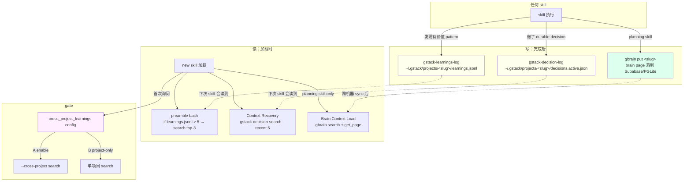

# 14 · Learnings loop 与 gbrain-aware skill 变体

> Agent 每次跑完一个 skill 都可能学到有价值的东西 —— 一个 pitfall、一个 debug 技巧、一个不该走的路径。gstack 用 `learnings.jsonl` 把这些 log 到磁盘，preamble 加载时 search top-3 喂给 LLM，形成"跨 session 记忆"。gbrain 是这个 loop 的多机同步版。本章拆 log / search / cross-project / gbrain 4 层。

## 14.1 一个记忆问题

LLM 每一次 skill invocation 都是**从头开始**：没有上次的记忆、没有前几次犯的错。同一个仓库调 `/investigate` 三次：第一次找到"这里的 SQLite 有个死锁 issue"、第二次遇到又要重新推、第三次还要再推。

gstack 的答案：**agent 自己 log 高价值发现到磁盘，preamble 帮下次的 agent 主动读**。这是 [Ch 01 · 1.7](../第一部分-输入层/01-preamble-作为-LLM-state-feed.md#17-一个具体例子learnings-触发主动搜) 提到的"把 RAG 塞进 stdout"的具体应用。

## 14.2 Layer 1：log —— 只记不能推的东西

`Completion Status Protocol` 段（`generate-completion-status.ts:43-51`）在每个 skill 结尾注入：

```text
# from scripts/resolvers/preamble/generate-completion-status.ts:43-51
## Operational Self-Improvement

Before completing, if you discovered a durable project quirk or command fix that would
save 5+ minutes next time, log it:

```bash
${ctx.paths.binDir}/gstack-learnings-log '{"skill":"SKILL_NAME","type":"operational",
"key":"SHORT_KEY","insight":"DESCRIPTION","confidence":N,"source":"observed"}'
```

Do not log obvious facts or one-time transient errors.
```

**"5+ 分钟能省下的 durable quirk"** 是过滤器：不记 trivial facts、不记一次性 error、不记文档里已有的东西。

具体字段：

- `skill` —— 哪个 skill 学到的
- `type` —— `operational` / `pitfall` / `pattern` / `heuristic` / …
- `key` —— 短 slug，用于去重
- `insight` —— 一句话描述
- `confidence` —— 1-10 分
- `source` —— `observed`（真跑过） / `hypothesized`（推测）

**"observed" vs "hypothesized" 的区别**：只有真观察到的才应该高 confidence。这防止 agent 编造 pattern。

## 14.3 Layer 2：search —— preamble 主动预取

Preamble bash 里（`generate-preamble-bash.ts:84-92`）：

```bash
# from scripts/resolvers/preamble/generate-preamble-bash.ts:84-92
_LEARN_FILE="${GSTACK_HOME:-$HOME/.gstack}/projects/${SLUG:-unknown}/learnings.jsonl"
if [ -f "$_LEARN_FILE" ]; then
  _LEARN_COUNT=$(wc -l < "$_LEARN_FILE" 2>/dev/null | tr -d ' ')
  echo "LEARNINGS: $_LEARN_COUNT entries loaded"
  if [ "$_LEARN_COUNT" -gt 5 ] 2>/dev/null; then
    ${ctx.paths.binDir}/gstack-learnings-search --limit 3 2>/dev/null || true
  fi
else
  echo "LEARNINGS: 0"
fi
```

**> 5 条自动 search + top-3 喂给 LLM**。<= 5 条不搜（数据量太少不值搜索）。**这个策略避免"新项目每次都跑无用 search"**。

top-3 stdout 直接进 LLM context，不需要 skill body 显式引用。这就是"RAG 塞进 stdout"—— **agent 无感知拿到相关记忆**。

## 14.4 Layer 3：per-topic search —— 具体 hypothesis 加载

除 preamble 主动预取，某些 skill body 会主动跑第二次 search，聚焦到具体 hypothesis。以 investigate 为例（`investigate/SKILL.md.tmpl:100-112`）：

```text
# from investigate/SKILL.md.tmpl:100-112 (摘)
### Refresh learnings for the hypothesis you just named

The top-of-skill learnings pull above is keyed to "debug investigation" broadly. Now
that you have a specific hypothesis, re-pull learnings keyed to that hypothesis so
prior fixes for the same problem-shape surface.

Pick ONE keyword from the hypothesis. The keyword should be a noun: the failing
component name, the basename of the file you suspect (without extension), or the bug
noun. The keyword MUST be alphanumeric or hyphen only — no quotes, slashes, dots,
colons, or whitespace.

Worked examples (investigate-specific): good keywords are `auth-cookie`, `session-expiry`,
`redirect-loop`. Bad: `auth.ts:47`, `fix the auth bug`, `<hypothesis-keyword>`.
```

**两次 search**：preamble 那次是 skill-broad（"debug investigation" 泛义），投假设后再 search 一次 hypothesis-specific（"auth-cookie" 具体）。

关键约束：**keyword 只能字母数字连字符**。这不是审美，是防注入 —— resolver 里 `QUERY_SAFE_RE = /^[A-Za-z0-9 _-]+$/`（`scripts/resolvers/learnings.ts:21`）：

```ts
// from scripts/resolvers/learnings.ts:16-22
// Whitelist for query= macro values. Allows alphanumeric, space, hyphen, underscore.
// Anything else (e.g. $, backticks, quotes, ;) is a shell-injection vector when the
// emitted bash interpolates the value into `--query "${queryArg}"`. Static template
// queries hand-written in gstack are safe, but the resolver API must defend against
// future contributors writing dangerous values.
const QUERY_SAFE_RE = /^[A-Za-z0-9 _-]+$/;
```

**"未来 skill 作者"是 threat model**。gstack 假定 skill body 未来可能写坏的 query，通过 resolver 静态白名单守住。

## 14.5 Layer 4：cross-project —— 用户 opt-in

默认 learnings 只在当前项目搜。用户第一次跑触发 opt-in（`scripts/resolvers/learnings.ts:65-77`）：

```text
# from scripts/resolvers/learnings.ts:65-77
If `CROSS_PROJECT` is `unset` (first time): Use AskUserQuestion:

> gstack can search learnings from your other projects on this machine to find
> patterns that might apply here. This stays local (no data leaves your machine).
> Recommended for solo developers. Skip if you work on multiple client codebases
> where cross-contamination would be a concern.

Options:
- A) Enable cross-project learnings (recommended)
- B) Keep learnings project-scoped only
```

**跨项目 opt-in 的两个真实使用场景**：

- 一个人写多个 side project → 想跨项目共享经验（如 "React hydration bug fix"）
- 咨询顾问在多个 client 项目切 → 不要跨污染（一个 client 的架构不该泄到另一个 client）

**gstack 让用户明确选**，一次决定持久化。这是 gstack 处理"边界性偏好"的普遍 pattern：**问一次、写磁盘、之后 preamble 读**。

## 14.6 Layer 5：gbrain —— 跨机同步

单机 learnings 已经解决"跨 session 记忆"，但不解决**跨机器**：家里 mac 学到的东西公司 desktop 拿不到。

gbrain 是一个独立仓库（github.com/garrytan/gbrain），gstack 通过 `hosts/gbrain.ts` + `scripts/resolvers/gbrain.ts` 让 skill 变成 "brain-aware"。

### 14.6.1 只有 5 个 planning skill 是 brain-aware

`scripts/resolvers/gbrain.ts:16-19`：

```text
# from scripts/resolvers/gbrain.ts:16-19
Brain-aware planning (T4 / v1.48 plan): adds three new resolvers powered by
the bin/gstack-brain-cache CLI and scripts/brain-cache-spec.ts. The new
resolvers fire only for the 5 planning skills registered in
SKILL_DIGEST_SUBSETS (office-hours, plan-ceo-review, plan-eng-review,
plan-design-review, plan-devex-review).
```

**只有 5 个**：4 个 plan review + office-hours。为什么不是全部？因为 planning 阶段决策最需要长期记忆（"我们上次为什么否掉这条路"），execution 阶段不需要（那是 diff 决定）。

### 14.6.2 GBrain Context Load

`generateGBrainContextLoad`（`scripts/resolvers/gbrain.ts:55-72`）注入：

```text
# from scripts/resolvers/gbrain.ts:56-66
## Brain Context Load

**Skip this entire section if `gbrain` is not on PATH.**

Extract 2-4 keywords from the user's request. Search the brain:
`gbrain search "<keywords>"`. Read the top 3 results with
`gbrain get_page "<slug>"`. Use that context to inform your analysis.

If `gbrain search` returns no results or any non-zero exit, proceed
without brain context. Full search/read protocol + examples:
see `docs/gbrain-write-surfaces.md` §Context Load.
```

**"skip if not on PATH"** —— gbrain 不装的用户完全不受影响。这是 gstack 让"可选 mod"不打扰主流程的方式。

装了 gbrain 的用户在 planning skill 开头会 auto-search brain → 拿最相关的 3 页 → LLM 有跨机记忆。

### 14.6.3 GBrain Save Results

`generateGBrainSaveResults`（`scripts/resolvers/gbrain.ts:75-*`）在 planning skill 结束后 save 关键 artifact 到 brain（如 CEO plan、design review、eng review）。

save 是 skill-specific 的，每个 skill 有 slug + tag（`gbrain.ts:42-53`）：

```ts
// from scripts/resolvers/gbrain.ts:42-53
const skillSaveMap: Record<string, SkillSaveMeta> = {
  'office-hours':         { slugPrefix: 'office-hours',    title: 'Office Hours',    tag: 'design-doc' },
  'investigate':          { slugPrefix: 'investigations',  title: 'Investigation',   tag: 'investigation' },
  'plan-ceo-review':      { slugPrefix: 'ceo-plans',       title: 'CEO Plan',        tag: 'ceo-plan' },
  'plan-eng-review':      { slugPrefix: 'eng-reviews',     title: 'Eng Review',      tag: 'eng-review' },
  'plan-design-review':   { slugPrefix: 'design-reviews',  title: 'Design Review',   tag: 'design-review' },
  'plan-devex-review':    { slugPrefix: 'devex-reviews',   title: 'Devex Review',    tag: 'devex-review' },
  'retro':                { slugPrefix: 'retros',          title: 'Retro',           tag: 'retro' },
  'ship':                 { slugPrefix: 'releases',        title: 'Release',         tag: 'release' },
  'cso':                  { slugPrefix: 'security-audits', title: 'Security Audit',  tag: 'security-audit' },
  'design-consultation':  { slugPrefix: 'design-systems',  title: 'Design System',   tag: 'design-system' },
};
```

**每个 skill 的产出有 gbrain 里的固定命名空间**。search "eng-review" tag 就能拿全所有 eng review 历史。这是 gstack 让 gbrain 有 schema 而不是自由文本 dump。

## 14.7 Layer 6：Decision search —— 显式决策记录

Learnings 是"我发现的东西"。**Decisions 是"我们决定了什么"**（`generate-context-recovery.ts:26-37`）：

```text
# from scripts/resolvers/preamble/generate-context-recovery.ts:37
**Cross-session decisions.** If `ACTIVE DECISIONS` are listed, treat them as prior
settled calls with their rationale — do not silently re-litigate them; if you're
about to reverse one, say so explicitly. Reach for `${binDir}/gstack-decision-search`
whenever a question touches a past decision ("what did we decide / why / did we try").
When you or the user make a DURABLE decision (architecture, scope, tool/vendor choice,
or a reversal) — NOT a turn-level or trivial choice — log it with `${binDir}/gstack-decision-log`
(`--supersede <id>` for a reversal). Reliable and local; gbrain not required.
```

**Decisions 与 learnings 的分工**：

- Learnings = 观察到的 pattern（"这里 SQLite 会死锁"）
- Decisions = 主动做的选择（"我们决定用 Postgres 不用 SQLite"）

**Decision 有 supersede 机制** —— reversal 时 `--supersede <id>` 明确标记"这条覆盖了那条"。这防止 decision 历史积累矛盾。

**agent 不能 silently re-litigate**：如果 decision 已存在，agent 要么遵循、要么明说"我在推翻它，因为 …"。这是 gstack 保护 durable choice 不被下一次 session 无意翻案的机制。

## 14.8 Cross-project vs cross-machine 的对偶

|  | 单项目 | 跨项目 | 跨机器 |
|---|---|---|---|
| **Learnings** | 默认 | opt-in via `cross_project_learnings` config | 靠 gbrain sync |
| **Decisions** | 默认 | 只本地 | 靠 gbrain sync |
| **Reviews** | review dashboard | 只本地 | 靠 gbrain sync |
| **Design docs** | `~/.gstack/projects/<slug>/*-design-*.md` | 只本地 | 靠 gbrain sync |

**只有"单项目 → 跨项目"是 config gate、"任何 → 跨机器"是 gbrain gate**。gstack 把两个隔离维度分开处理 —— 因为它们的 threat model 不一样（跨项目怕污染、跨机器怕数据外泄）。

## 14.9 一张 Mermaid：4 层记忆的 read/write



## 14.10 章末导航

[← 13 qa fix loop 与 confidence](../第四部分-Execution-Agent/13-qa-fix-loop-与-confidence.md) | [下一章：15 · Boundary instruction 与安全 hook →](15-safety-boundary-与-hook.md)
