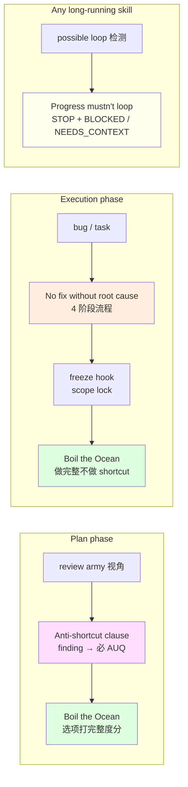

# 10 · Iron Laws：agent 的硬约束

> Plan 阶段结束，agent 开始动代码。这时候需要一组不可协商的规则来阻止 agent 走捷径 / 半交付 / 掩盖失败。gstack 用 3 条 **Iron Law** + 1 条 **anti-shortcut clause** 把 execution agent 钉在正道上。本章拆这 4 条硬约束，看它们各自防御的 anti-pattern。

## 10.1 什么是 Iron Law

普通 skill 里的规则是 "recommendation" —— agent 可以合理偏离。Iron Law 不同：

- 单方面 —— 不是"两个选项选一"
- 无豁免 —— body 里明写"NEVER"、"MUST"、"NO ... WITHOUT ..."
- 被反复重申 —— 同一条 law 在多个 skill 里以不同方式重复出现

它们是 gstack 应对 LLM"想偷懒"的具体反措施。

## 10.2 Iron Law 1 —— No Fixes Without Root Cause

出处：`investigate/SKILL.md.tmpl:66-72`：

```text
# from investigate/SKILL.md.tmpl:66-72
# Systematic Debugging

## Iron Law

**NO FIXES WITHOUT ROOT CAUSE INVESTIGATION FIRST.**

Fixing symptoms creates whack-a-mole debugging. Every fix that doesn't address root
cause makes the next bug harder to find. Find the root cause, then fix it.
```

它防的 anti-pattern：**看到 error 就打 patch**。LLM 特别容易掉进这个坑 —— 用户报"这里报错了"，LLM 直接改错误行让它不报错，但根因还在。下一个 bug 出来更难查。

### 10.2.1 4 阶段执行

Iron Law 靠 4 阶段流程强化（`investigate/SKILL.md.tmpl:78-98`）：

```text
# from investigate/SKILL.md.tmpl:78-98 (摘)
## Phase 1: Root Cause Investigation

Gather context before forming any hypothesis.

1. Collect symptoms: read error messages, stack traces, reproduction steps.
2. Read the code: trace symptom back to potential causes.
3. Check recent changes: git log --oneline -20 -- <affected-files>
4. Reproduce: can you trigger the bug deterministically?
5. Check investigation history: search prior learnings for investigations on the same files.

Output: **"Root cause hypothesis: ..."** — a specific, testable claim about what is
wrong and why.
```

**Output 是一句可测试假设**，不是修复方案。这一步不允许写代码。

后续 phase 才 hypothesize + implement。**"投假设 → 验假设 → 才修"** 的三段式禁止 shortcut。

### 10.2.2 Scope Lock

Investigate 还接了 [Ch 15 · 15.4](../第五部分-记忆与安全/15-safety-boundary-与-hook.md) 会讲的 freeze hook（`investigate/SKILL.md.tmpl:120-136`）：

```text
# from investigate/SKILL.md.tmpl:126-133
Identify the narrowest directory containing the affected files. Write it to the freeze state file:

```bash
eval "$(~/.claude/skills/gstack/bin/gstack-paths)"
STATE_DIR="$GSTACK_STATE_ROOT"
mkdir -p "$STATE_DIR"
echo "<detected-directory>/" > "$STATE_DIR/freeze-dir.txt"
echo "Debug scope locked to: <detected-directory>/"
```

Iron Law 需要 debug 专注 → 用 freeze 硬阻止 agent 编辑无关目录。**Iron Law 靠 hook 兜底**，不只靠 markdown。

## 10.3 Iron Law 2 —— Anti-Shortcut Clause（plan 阶段的对偶）

Iron Law 1 是 execution 阶段。Plan 阶段有个对偶 —— **"Anti-shortcut clause"**（`scripts/resolvers/review.ts:204-206`）：

```text
# from scripts/resolvers/review.ts:204-206
**Anti-shortcut clause:** The plan file is the OUTPUT of the interactive review, not
a substitute for it. Writing every finding into one plan write and calling ExitPlanMode
without firing AskUserQuestion is the precise failure mode of the May 2026 transcript
bug — the model explored, found issues, and dumped them into a deliverable rather
than walking the user through them. If you have ANY non-trivial finding in any review
section, the path from finding to ExitPlanMode goes THROUGH AskUserQuestion. Zero
findings in every section is the only path to ExitPlanMode that bypasses AskUserQuestion.
If you find yourself wanting to write a plan with findings before asking, stop and
call AskUserQuestion now — that's the bug, recognize it.
```

它防的 anti-pattern：**LLM 自己回答自己的 review 问题**。Review skill 里 body 说"这里应该用 AUQ 让用户拍板"，LLM 有时会直接把决定写进 plan file → 调 ExitPlanMode → 用户没参与。

anti-shortcut 逻辑 3 段：

1. plan file 是 review 的**输出**，不是**替代**
2. 有 finding → 一定要 AUQ；不能 AUQ → 一定 zero findings
3. 认得这个 pattern —— **你正想跳过 AUQ 直接 write plan 就是那个 bug**

**gstack 直接告诉 LLM 那个失败模式的名字**。这是 markdown-driven agent 逻辑的重要 pattern：**bug 复述本身就是 preventive prompt**。

## 10.4 Iron Law 3 —— Boil the Ocean（完整度默认高）

Boil the Ocean 是 gstack 产品哲学。它作为 preamble section 注入 tier 2+ skill（`generate-completeness-section.ts:5-9`，[Ch 02 · 2.5.2](../第一部分-输入层/02-preamble-tier-与上下文密度.md#252-completeness-principle--boil-the-ocean) 引用过）：

```text
# from scripts/resolvers/preamble/generate-completeness-section.ts:5-9
AI makes completeness cheap, so the complete thing is the goal. Recommend full coverage
(tests, edge cases, error paths) — boil the ocean one lake at a time. The only thing
out of scope is genuinely unrelated work (rewrites, multi-quarter migrations); flag
that as separate scope, never as an excuse for a shortcut.
```

它防的 anti-pattern：**"我先写 happy path，边界后面再补"**。这在传统人力工程里合理（人时贵），在 AI 编程不合理（compute 便宜）。**AI 让完整度 cheap → 做完整才是默认**。

### 10.4.1 Completeness score 是 AUQ 契约的一部分

Completeness 不只是价值观，是 AUQ Format 硬要求（[Ch 06 · 6.6](../第三部分-Plan-mode-Agent/06-plan-mode-handshake.md#66-结构化-auq-的自检) 引用过）：

```text
# from scripts/resolvers/preamble/generate-completeness-section.ts:9
When options differ in coverage, include `Completeness: X/10`
(10 = all edge cases, 7 = happy path, 3 = shortcut).
```

**每个 AUQ 的选项都要打完整度分**。用户看到"选 7/10 = happy path" 会知道自己在选 shortcut。这把"完整度"从抽象价值观降级成**每次决策的可视化标签**。

## 10.5 Iron Law 4 —— Progress mustn't loop

出自 Context Health 段（`generate-context-health.ts:5-9`，[Ch 02 · 2.5.3](../第一部分-输入层/02-preamble-tier-与上下文密度.md#253-context-health--反-loop) 引用过）：

```text
# from scripts/resolvers/preamble/generate-context-health.ts:5-9
During long-running skill sessions, periodically write a brief `[PROGRESS]` summary:
done, next, surprises.

If you are looping on the same diagnostic, same file, or failed fix variants, STOP
and reassess. Consider escalation or /context-save. Progress summaries must NEVER
mutate git state.
```

它防的 anti-pattern：**LLM 卡在同一 debug loop 越 dig 越深、context 用完了但没进展**。

**规则**：同一 diagnostic / 同一 file / 同一 failed fix variant → STOP。不是"再试一次可能就好了"，是"你已经在 loop 里，出去"。

### 10.5.1 Escalation is legit

关键：**stopping 不是失败**。Completion Status Protocol 里明确 4 种合法 status（`generate-completion-status.ts:35-39`）：

```text
# from scripts/resolvers/preamble/generate-completion-status.ts:35-39
When completing a skill workflow, report status using one of:
- **DONE** — completed with evidence.
- **DONE_WITH_CONCERNS** — completed, but list concerns.
- **BLOCKED** — cannot proceed; state blocker and what was tried.
- **NEEDS_CONTEXT** — missing info; state exactly what is needed.
```

**BLOCKED 是合法产出**。gstack 允许 agent 说"我搞不定"—— 它比"随便交付"好。这与 Iron Law 1（no fix without root cause）互补：搞不清根因就 BLOCKED，不要瞎 fix。

## 10.6 Iron Laws 之间的相互支撑

4 条 Iron Law 覆盖 4 种 anti-pattern：

| Law | 防的 anti-pattern | 场景 |
|---|---|---|
| No fix without root cause | 症状驱动改代码 | investigate |
| Anti-shortcut clause | LLM 自答自问跳过用户 | plan-mode review |
| Boil the Ocean | "先写 happy path" | 所有 execution |
| Progress mustn't loop | 卡 loop 消耗 context | 所有长任务 |

它们相互支撑：

- Loop 里 → Progress law 让你 stop → 但你不能 shortcut 交付（Boil the Ocean）→ 也不能 fix 症状（No root cause）→ 只剩 BLOCKED 或 NEEDS_CONTEXT
- Plan 里 finding → anti-shortcut 让你必须 AUQ → 但 AUQ 选项要打 completeness 分（Boil the Ocean）→ 用户能看清 shortcut 代价

Iron Laws 是 gstack agent 逻辑的**边界锁**。skill body 定义"做什么"，Iron Laws 定义"绝不做什么"。

## 10.7 Iron Law 与 markdown-driven prompt

值得注意 —— Iron Laws 全是 markdown。没有 host 代码在 enforce 它们，没有 hook 在拦。**它们靠 LLM 读到规则并遵守**。

这暴露了 gstack 的一个真实局限：**Iron Law 是 prompt-level defense，不是 hard-code defense**。LLM 完全可能因为 context 长、reward miscalibration、adversarial input 而违反 Iron Law。gstack 的对策：

1. **反复重申**：Boil the Ocean 出现在 Completeness section + AUQ Format + review skill body
2. **用具体 anti-pattern 名字**：Anti-shortcut clause 直接说"这就是 May 2026 那个 bug"
3. **靠 hook 补硬约束**：freeze hook 在 investigate 里做 scope lock（[Ch 15](../第五部分-记忆与安全/15-safety-boundary-与-hook.md)）

**层次防御** —— prompt-level 是第一层，hook + 磁盘副作用检查是补丁。

## 10.8 一张 Mermaid：4 条 Iron Law 的作用面



## 10.9 章末导航

[← 09 second opinion 三件套](../第三部分-Plan-mode-Agent/09-second-opinion-三件套.md) | [下一章：11 · Ship 决策边界 →](11-ship-决策边界.md)
