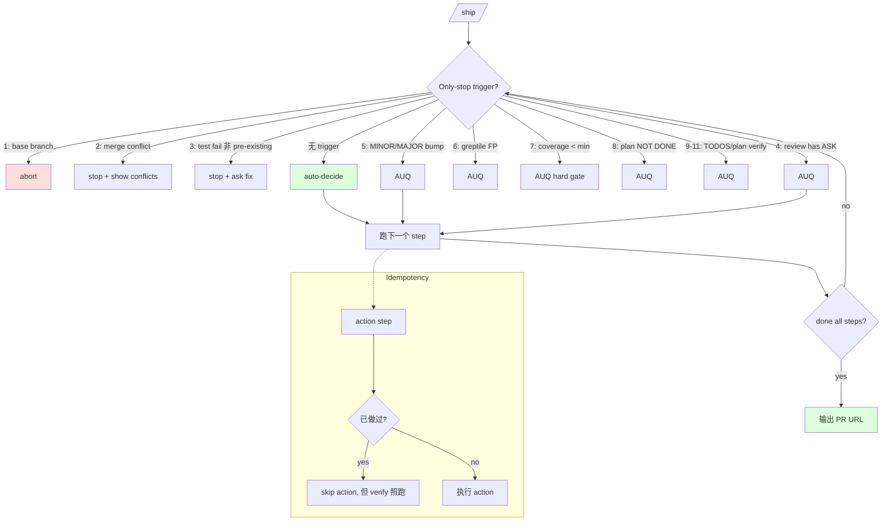

# 11 · Ship 决策边界：Only stop for / Never stop for / Idempotency

> Ship 是 gstack 里最 effect-bearing 的 skill —— 它 push 代码、开 PR、bump 版本。它必须尽量少打扰用户（不然发布慢），又不能悄悄跳过关键 gate（不然 prod 炸）。这一章拆 ship 用来平衡这两个诉求的三把刀：显式 **Only stop for** 清单、显式 **Never stop for** 清单、**verification / action 分离**的幂等模型。

## 11.1 一个关系问题

发布流程有两类步骤：

- **Verification**：跑测试、审 diff、查 plan completion —— 只读，可以 100% 自动
- **Action**：commit、push、bump VERSION、开 PR —— 有副作用，多做一次会重复

同一次 `/ship` 里两类步骤混在一起。如果重跑 `/ship`（因为中途失败），怎么保证 verification 跑一遍新的、action 不 double-fire？

这决定 ship 的整个决策模型。

## 11.2 显式默认：DO IT

`ship/SKILL.md.tmpl:37`：

```text
# from ship/SKILL.md.tmpl:37
You are running the `/ship` workflow. This is a **non-interactive, fully automated**
workflow. Do NOT ask for confirmation at any step. The user said `/ship` which means
DO IT. Run straight through and output the PR URL at the end.
```

**默认从头跑到 PR URL，不打断**。这是 ship 的 posture 声明 —— agent 不问"要不要 push"、不问"版本号对吗"、不问"changelog 写这个可以吗"。用户说 `/ship`，意思是"我信任你 → 你决定"。

## 11.3 Only stop for —— 11 项白名单

只有这 11 种情况才允许打断（`ship/SKILL.md.tmpl:39-50`）：

```text
# from ship/SKILL.md.tmpl:39-50
**Only stop for:**
- On the base branch (abort)
- Merge conflicts that can't be auto-resolved (stop, show conflicts)
- In-branch test failures (pre-existing failures are triaged, not auto-blocking)
- Pre-landing review finds ASK items that need user judgment
- MINOR or MAJOR version bump needed (ask — see Step 12)
- Greptile review comments that need user decision (complex fixes, false positives)
- AI-assessed coverage below minimum threshold (hard gate with user override — see Step 7)
- Plan items NOT DONE with no user override (see Step 8)
- Plan verification failures (see Step 8.1)
- TODOS.md missing and user wants to create one (ask — see Step 14)
- TODOS.md disorganized and user wants to reorganize (ask — see Step 14)
```

11 项分 3 类：

### 11.3.1 Blocker 类（3 项）

- 在 base branch → abort
- Merge 冲突 → stop
- 测试失败 → stop（除非是 pre-existing 已知失败）

**这 3 项都是 hard blocker**：agent 能力不够处理。

### 11.3.2 Judgment 类（5 项）

- Pre-landing review 有 ASK item
- Version bump 是 MINOR / MAJOR
- Greptile review 有 false positive 疑似
- AI 评的 coverage 低于阈值
- Plan items NOT DONE 且用户没预授权

**这 5 项都是"决策需要人品味"**。agent 能识别问题、能给推荐，但不能替。

### 11.3.3 Meta 类（3 项）

- Plan verification 失败
- TODOS.md 不存在但用户要建
- TODOS.md 太乱要重组

**这 3 项是"配套 artifact"**问题，不是发布本身，但 ship 允许附带处理。

## 11.4 Never stop for —— 8 项 auto-decide

反向，明确列出**不能因这些原因停下问用户**（`ship/SKILL.md.tmpl:52-60`）：

```text
# from ship/SKILL.md.tmpl:52-60
**Never stop for:**
- Uncommitted changes (always include them)
- Version bump choice (auto-pick MICRO or PATCH — see Step 12)
- CHANGELOG content (auto-generate from diff)
- Commit message approval (auto-commit)
- Multi-file changesets (auto-split into bisectable commits)
- TODOS.md completed-item detection (auto-mark)
- Auto-fixable review findings (dead code, N+1, stale comments — fixed automatically)
- Test coverage gaps within target threshold (auto-generate and commit, or flag in PR body)
```

**8 项 auto-decide** 都是 "有唯一合理答案" 的场景（[Ch 08 · 8.3.1](../第三部分-Plan-mode-Agent/08-autoplan-6-决策原则.md#831-mechanical--自动决不打扰) Mechanical 分类）。ship 不问"要 include uncommitted 吗"、"版本升 MICRO 还是 PATCH"、"CHANGELOG 用啥"—— 因为答案已经在规则里。

**Only-stop 与 Never-stop 是对偶的白名单 + 黑名单**。任何 ship step 遇到"要不要 stop"疑虑 → 查两个清单 → 一定命中一边。这是 gstack "决策边界必须显式列举"的极致应用。

## 11.5 Verification / Action 分离

`ship/SKILL.md.tmpl:62-70`：

```text
# from ship/SKILL.md.tmpl:62-70
**Re-run behavior (idempotency):**
Re-running `/ship` means "run the whole checklist again." Every verification step
(tests, coverage audit, plan completion, pre-landing review, adversarial review,
VERSION/CHANGELOG check, TODOS, document-release) runs on every invocation.
Only *actions* are idempotent:
- Step 12: If VERSION already bumped, skip the bump but still read the version
- Step 17: If already pushed, skip the push command
- Step 19: If PR exists, update the body instead of creating a new PR
Never skip a verification step because a prior `/ship` run already performed it.
```

**关键规则**：

- **Verification 每次跑**：tests / coverage / plan completion / review / VERSION 检查 / CHANGELOG 检查 —— 不 cache 结果
- **Action 幂等**：VERSION 已 bump 只 read；已 push 不 push；PR 已开只 update body

这解决了"重跑 /ship 会不会 double-fire"问题：verify 跑一遍新的（也许上次跑完之后代码又改了），action 只做尚未做的部分。

### 11.5.1 一个例子：Step 12 version bump

`ship/SKILL.md.tmpl:158-172`：

```text
# from ship/SKILL.md.tmpl:158-172 (摘)
## Step 12: Version bump (auto-decide)

1. Classify state — pure reader, never writes:
   ```bash
   bun run ~/.claude/skills/gstack/bin/gstack-version-bump classify --base <base>
   ```
   - **FRESH** → do the bump.
   - **ALREADY_BUMPED** → skip the bump, but run the queue-drift check.
     If queue moved, AskUserQuestion: rebump or keep current.
   - **DRIFT_STALE_PKG** → run `gstack-version-bump repair` (syncs package.json to VERSION).
   - **DRIFT_UNEXPECTED** → **STOP**. Manual edit bypassed /ship. Reconcile.
```

4 种 state 4 种应对：

- FRESH → 干（action 未做过）
- ALREADY_BUMPED → 跳（action 已做过）+ 检查队列是否漂移（verify 每次跑）
- DRIFT_STALE_PKG → repair（自动修）
- DRIFT_UNEXPECTED → STOP（人工干预）

**同一段代码里 verify + action 分离 + 4 种 state 4 种响应**。这是 idempotent skill 的具体范式。

## 11.6 Ship 与 Iron Laws 的合作

Ship 里 3 条 Iron Law 都在起作用：

| Iron Law | Ship 里的落点 |
|---|---|
| No fix without root cause | 测试失败时 → 触发 investigate 而不是 patch |
| Anti-shortcut clause | Plan completion NOT DONE → AUQ 而不是自动 skip |
| Boil the Ocean | 大 diff (200+) 触发 codex structured review + P1 gate |
| Progress mustn't loop | ship 若 loop → BLOCKED，不无限试 |

**ship 不违反 Iron Laws，它把 Iron Laws 转化成流程 gate**。这是 gstack agent 逻辑的自洽 —— execution skill 不是绕过 Iron Laws，是把 Iron Laws 编入自己的 checklist。

## 11.7 Ship 的一个副作用：sensitive frontmatter

Ship 是 gstack 里最少数几个 `sensitive: true` 的 skill：

```yaml
# from ship/SKILL.md.tmpl:21
sensitive: true
```

Factory host 看到 `sensitive: true` 会自动加 `disable-model-invocation: true`（`hosts/factory.ts:22-24`）—— agent 不能自己调用 ship，必须用户显式请求。

**effect-bearing 的 skill 有一层"防误 invoke" 保护**。这是从 host adapter 层面（不是 body prompt 层面）做的硬约束，agent 无法绕过。

## 11.8 一张 Mermaid：ship 的决策 gate



## 11.9 章末导航

[← 10 iron laws](10-iron-laws.md) | [下一章：12 · Plan completion audit →](12-plan-completion-audit.md)
